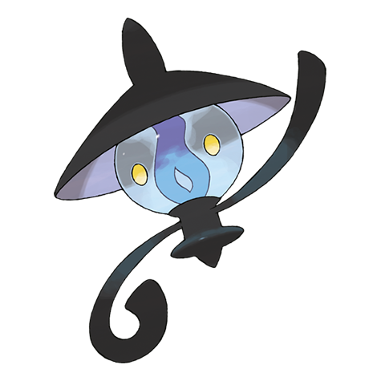
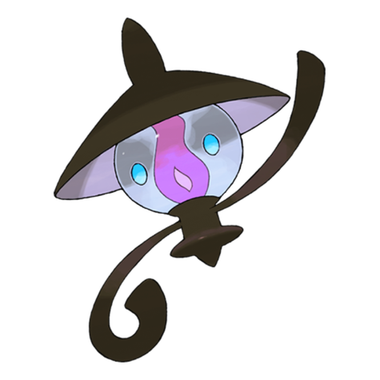
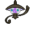

# #608 Lampent (Lamp Pokémon)

| Official Artwork | Shiny Artwork |
| --- | --- |
|  |  |

**Blaze Black:** This ominous Pokémon is feared. Through cities it wanders, searching for the spirits of the fallen.

**Volt White:** It arrives near the moment of death and steals spirit from the body.

---

## Media

### Default Sprites

| Front | Back | Front Shiny | Back Shiny |
| --- | --- | --- | --- |
|  |  |  |  |

### Cries

Latest (Gen VI+):

<audio controls>
<source src='../../assets/cries/lampent/latest.ogg' type='audio/ogg'>
  Your browser does not support the audio element.
</audio>

Legacy:

<audio controls>
<source src='../../assets/cries/lampent/legacy.ogg' type='audio/ogg'>
  Your browser does not support the audio element.
</audio>

---

## Pokédex Data

| National № | Type(s) | Height | Weight | Abilities | Local № |
|------------|---------|--------|--------|-----------|---------|
| #608 | {: width='48'} {: width='48'} | 0.6 m / 2.0 ft | 13.0 kg / 28.7 lbs | Levitate | #114 |

---

## Base Stats
|   | HP | Attack | Defense | Sp. Atk | Sp. Def | Speed |
|---|----|--------|---------|---------|---------|-------|
| **Base** | 60 | 40 | 60 | 95 | 60 | 55 |
| **Min** | 230 | 76 | 112 | 175 | 112 | 103 |
| **Max** | 324 | 196 | 240 | 317 | 240 | 229 |

The ranges shown above are for a level 100 Pokémon. Maximum values are based on a beneficial nature, 252 EVs, 31 IVs; minimum values are based on a hindering nature, 0 EVs, 0 IVs.

---

## Forms & Evolutions

!!! warning "WARNING"

    Information on evolutions may not be 100% accurate; differences between evolution methods across generations are not accounted for.

### Forms

Lampent has no alternate forms.

### Evolution Line

1. [Litwick](litwick.md/)
    1. Level Up: [Lampent](lampent.md/)
        1. Use Item: [Chandelure](chandelure.md/)

---

## Training

| EV Yield | Catch Rate | Base Friendship | Base Exp. | Growth Rate | Held Items |
|----------|------------|-----------------|-----------|-------------|------------|
| 2 Special Attack | 90 | 50 | 130 | Medium Slow | N/A |

---

## Breeding

| Egg Groups | Egg Cycles | Gender | Dimorphic | Color | Shape |
|------------|------------|--------|-----------|-------|-------|
| 1. Indeterminate | 20 | 50.0% Male 50.0% Female | False | Black | Arms |

---

## Moves

!!! warning "WARNING"

    Specific move information may be incorrect. However, the general movepool should be accurate; this includes changes made in Blaze Black and Volt White.

### Level Up Moves

| Lv. | Move | Type | Cat. | Power | Acc. | PP |
| --- | --- | --- | --- | --- | --- | --- |
| 1 | Astonish | {: width='48'} | {: width='36'} | 30 | 100 | 15 |
| 1 | Ember | {: width='48'} | {: width='36'} | 40 | 100 | 25 |
| 1 | Minimize | {: width='48'} | {: width='36'} | — | — | 10 |
| 1 | Smog | {: width='48'} | {: width='36'} | 30 | 70 | 20 |
| 3 | Minimize | {: width='48'} | {: width='36'} | — | — | 10 |
| 5 | Smog | {: width='48'} | {: width='36'} | 30 | 70 | 20 |
| 7 | Fire Spin | {: width='48'} | {: width='36'} | 35 | 85 | 15 |
| 10 | Confuse Ray | {: width='48'} | {: width='36'} | — | 100 | 10 |
| 13 | Night Shade | {: width='48'} | {: width='36'} | — | 100 | 15 |
| 16 | Will O Wisp | {: width='48'} | {: width='36'} | — | 85 | 15 |
| 20 | Flame Burst | {: width='48'} | {: width='36'} | 70 | 100 | 15 |
| 24 | Imprison | {: width='48'} | {: width='36'} | — | — | 10 |
| 28 | Hex | {: width='48'} | {: width='36'} | 65 | 100 | 10 |
| 33 | Memento | {: width='48'} | {: width='36'} | — | 100 | 10 |
| 34 | Heat Wave | {: width='48'} | {: width='36'} | 95 | 90 | 10 |
| 39 | Inferno | {: width='48'} | {: width='36'} | 100 | 50 | 5 |
| 45 | Curse | {: width='48'} | {: width='36'} | — | — | 10 |
| 53 | Shadow Ball | {: width='48'} | {: width='36'} | 90 | 100 | 15 |
| 61 | Pain Split | {: width='48'} | {: width='36'} | — | — | 20 |
| 69 | Overheat | {: width='48'} | {: width='36'} | 130 | 90 | 5 |

### TM Moves

| TM | Move | Type | Cat. | Power | Acc. | PP |
| --- | --- | --- | --- | --- | --- | --- |
| TM04 | Calm Mind | {: width='48'} | {: width='36'} | — | — | 20 |
| TM06 | Toxic | {: width='48'} | {: width='36'} | — | 90 | 10 |
| TM10 | Hidden Power | {: width='48'} | {: width='36'} | 60 | 100 | 15 |
| TM11 | Sunny Day | {: width='48'} | {: width='36'} | — | — | 5 |
| TM12 | Taunt | {: width='48'} | {: width='36'} | — | 100 | 20 |
| TM17 | Protect | {: width='48'} | {: width='36'} | — | — | 10 |
| TM19 | Telekinesis | {: width='48'} | {: width='36'} | — | — | 15 |
| TM20 | Safeguard | {: width='48'} | {: width='36'} | — | — | 25 |
| TM21 | Frustration | {: width='48'} | {: width='36'} | — | 100 | 20 |
| TM22 | Solar Beam | {: width='48'} | {: width='36'} | 120 | 100 | 10 |
| TM27 | Return | {: width='48'} | {: width='36'} | — | 100 | 20 |
| TM29 | Psychic | {: width='48'} | {: width='36'} | 90 | 100 | 10 |
| TM30 | Shadow Ball | {: width='48'} | {: width='36'} | 90 | 100 | 15 |
| TM32 | Double Team | {: width='48'} | {: width='36'} | — | — | 15 |
| TM35 | Flamethrower | {: width='48'} | {: width='36'} | 90 | 100 | 15 |
| TM38 | Fire Blast | {: width='48'} | {: width='36'} | 110 | 85 | 5 |
| TM42 | Facade | {: width='48'} | {: width='36'} | 70 | 100 | 20 |
| TM43 | Flame Charge | {: width='48'} | {: width='36'} | 50 | 100 | 20 |
| TM44 | Rest | {: width='48'} | {: width='36'} | — | — | 5 |
| TM45 | Attract | {: width='48'} | {: width='36'} | — | 100 | 15 |
| TM46 | Thief | {: width='48'} | {: width='36'} | 60 | 100 | 25 |
| TM48 | Round | {: width='48'} | {: width='36'} | 60 | 100 | 15 |
| TM50 | Overheat | {: width='48'} | {: width='36'} | 130 | 90 | 5 |
| TM53 | Energy Ball | {: width='48'} | {: width='36'} | 90 | 100 | 10 |
| TM59 | Incinerate | {: width='48'} | {: width='36'} | 50 | 100 | 15 |
| TM61 | Will O Wisp | {: width='48'} | {: width='36'} | — | 85 | 15 |
| TM63 | Embargo | {: width='48'} | {: width='36'} | — | 100 | 15 |
| TM66 | Payback | {: width='48'} | {: width='36'} | 50 | 100 | 10 |
| TM70 | Flash | {: width='48'} | {: width='36'} | — | 100 | 20 |
| TM77 | Psych Up | {: width='48'} | {: width='36'} | — | — | 10 |
| TM85 | Dream Eater | {: width='48'} | {: width='36'} | 100 | 100 | 15 |
| TM87 | Swagger | {: width='48'} | {: width='36'} | — | 85 | 15 |
| TM90 | Substitute | {: width='48'} | {: width='36'} | — | — | 10 |
| TM92 | Trick Room | {: width='48'} | {: width='36'} | — | — | 5 |

### Egg Moves

Lampent cannot learn any moves by breeding.
### Tutor Moves

Lampent cannot learn any moves from tutors.
