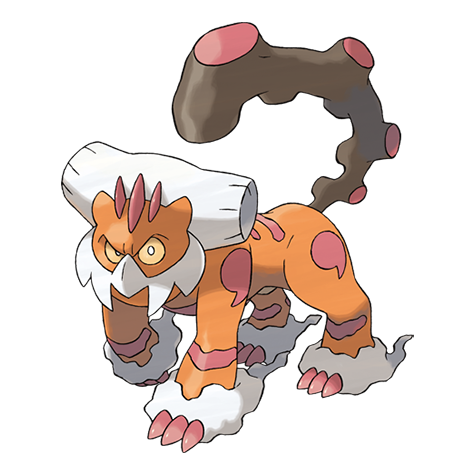

# #10021 Landorus Therian (Abundance Pokémon)

| Official Artwork | Shiny Artwork |
| --- | --- |
|  |  |

**Blaze Black:** Lands visited by Landorus grant such bountiful crops that it has been hailed as “The Guardian of the Fields.”

**Volt White:** The energy that comes pouring from its tail increases the nutrition in the soil, making crops grow to great size.

---

## Media

### Default Sprites

| Front | Back | Front Shiny | Back Shiny |
| --- | --- | --- | --- |
|  |  |  |  |

### Cries

Latest (Gen VI+):

<audio controls>
<source src='../../assets/cries/landorus-therian/latest.ogg' type='audio/ogg'>
  Your browser does not support the audio element.
</audio>

---

## Pokédex Data

| National № | Type(s) | Height | Weight | Abilities | Local № |
|------------|---------|--------|--------|-----------|---------|
| #10021 | {: width='48'} {: width='48'} | 1.3 m | 68.0 kg | 1. Intimidate | #151 |

---

## Base Stats
|   | HP | Attack | Defense | Sp. Atk | Sp. Def | Speed |
|---|----|--------|---------|---------|---------|-------|
| **Base** | 89 | 145 | 90 | 105 | 80 | 91 |
| **Min** | 288 | 265 | 166 | 193 | 148 | 168 |
| **Max** | 382 | 427 | 306 | 339 | 284 | 309 |

The ranges shown above are for a level 100 Pokémon. Maximum values are based on a beneficial nature, 252 EVs, 31 IVs; minimum values are based on a hindering nature, 0 EVs, 0 IVs.

---

## Forms & Evolutions

!!! warning "WARNING"

    Information on evolutions may not be 100% accurate; differences between evolution methods across generations are not accounted for.

### Forms

1. [Landorus Incarnate](landorus-incarnate.md/)

2. [Landorus Therian](landorus-therian.md/)

### Evolution Line

1. [Landorus Incarnate](landorus-incarnate.md/)

1. [Landorus Therian](landorus-therian.md/)

---

## Training

| EV Yield | Catch Rate | Base Friendship | Base Exp. | Growth Rate | Held Items |
|----------|------------|-----------------|-----------|-------------|------------|
| 3 Attack | 3 | 90 | 300 | Slow | N/A |

---

## Breeding

| Egg Groups | Egg Cycles | Gender | Dimorphic | Color | Shape |
|------------|------------|--------|-----------|-------|-------|
| 1. No-Eggs | 120 | 100.0% Male 0.0% Female | False | Brown | Arms |

---

## Moves

!!! warning "WARNING"

    Specific move information may be incorrect. However, the general movepool should be accurate; this includes changes made in Blaze Black and Volt White.

### Level Up Moves

| Lv. | Move | Type | Cat. | Power | Acc. | PP |
| --- | --- | --- | --- | --- | --- | --- |
| 1 | Block | {: width='48'} | {: width='36'} | — | — | 5 |
| 1 | Fissure | {: width='48'} | {: width='36'} | — | 30 | 5 |
| 1 | Hammer Arm | {: width='48'} | {: width='36'} | 100 | 90 | 10 |
| 1 | Imprison | {: width='48'} | {: width='36'} | — | — | 10 |
| 1 | Mud Shot | {: width='48'} | {: width='36'} | 55 | 95 | 15 |
| 1 | Outrage | {: width='48'} | {: width='36'} | 120 | 100 | 10 |
| 1 | Rock Tomb | {: width='48'} | {: width='36'} | 60 | 95 | 15 |
| 7 | Punishment | {: width='48'} | {: width='36'} | — | 100 | 5 |
| 13 | Bulldoze | {: width='48'} | {: width='36'} | 80 | 100 | 20 |
| 19 | Rock Throw | {: width='48'} | {: width='36'} | 50 | 90 | 15 |
| 25 | Extrasensory | {: width='48'} | {: width='36'} | 80 | 100 | 20 |
| 31 | Swords Dance | {: width='48'} | {: width='36'} | — | — | 20 |
| 37 | Earth Power | {: width='48'} | {: width='36'} | 90 | 100 | 10 |
| 43 | Rock Slide | {: width='48'} | {: width='36'} | 75 | 90 | 10 |
| 49 | Earthquake | {: width='48'} | {: width='36'} | 100 | 100 | 10 |
| 55 | Sandstorm | {: width='48'} | {: width='36'} | — | — | 10 |
| 61 | Fissure | {: width='48'} | {: width='36'} | — | 30 | 5 |
| 67 | Stone Edge | {: width='48'} | {: width='36'} | 100 | 80 | 5 |
| 73 | Hammer Arm | {: width='48'} | {: width='36'} | 100 | 90 | 10 |
| 79 | Outrage | {: width='48'} | {: width='36'} | 120 | 100 | 10 |

### TM Moves

| TM | Move | Type | Cat. | Power | Acc. | PP |
| --- | --- | --- | --- | --- | --- | --- |
| TM04 | Calm Mind | {: width='48'} | {: width='36'} | — | — | 20 |
| TM06 | Toxic | {: width='48'} | {: width='36'} | — | 90 | 10 |
| TM08 | Bulk Up | {: width='48'} | {: width='36'} | — | — | 20 |
| TM10 | Hidden Power | {: width='48'} | {: width='36'} | 60 | 100 | 15 |
| TM100 | Confide | {: width='48'} | {: width='36'} | — | — | 20 |
| TM15 | Hyper Beam | {: width='48'} | {: width='36'} | 150 | 90 | 5 |
| TM17 | Protect | {: width='48'} | {: width='36'} | — | — | 10 |
| TM21 | Frustration | {: width='48'} | {: width='36'} | — | 100 | 20 |
| TM23 | Smack Down | {: width='48'} | {: width='36'} | 50 | 100 | 15 |
| TM26 | Earthquake | {: width='48'} | {: width='36'} | 100 | 100 | 10 |
| TM27 | Return | {: width='48'} | {: width='36'} | — | 100 | 20 |
| TM29 | Psychic | {: width='48'} | {: width='36'} | 90 | 100 | 10 |
| TM31 | Brick Break | {: width='48'} | {: width='36'} | 75 | 100 | 15 |
| TM32 | Double Team | {: width='48'} | {: width='36'} | — | — | 15 |
| TM34 | Sludge Wave | {: width='48'} | {: width='36'} | 95 | 100 | 10 |
| TM36 | Sludge Bomb | {: width='48'} | {: width='36'} | 90 | 100 | 10 |
| TM37 | Sandstorm | {: width='48'} | {: width='36'} | — | — | 10 |
| TM39 | Rock Tomb | {: width='48'} | {: width='36'} | 60 | 95 | 15 |
| TM42 | Facade | {: width='48'} | {: width='36'} | 70 | 100 | 20 |
| TM44 | Rest | {: width='48'} | {: width='36'} | — | — | 5 |
| TM45 | Attract | {: width='48'} | {: width='36'} | — | 100 | 15 |
| TM48 | Round | {: width='48'} | {: width='36'} | 60 | 100 | 15 |
| TM52 | Focus Blast | {: width='48'} | {: width='36'} | 120 | 70 | 5 |
| TM56 | Fling | {: width='48'} | {: width='36'} | — | 100 | 10 |
| TM59 | Brutal Swing | {: width='48'} | {: width='36'} | 60 | 100 | 20 |
| TM64 | Explosion | {: width='48'} | {: width='36'} | 250 | 100 | 5 |
| TM66 | Payback | {: width='48'} | {: width='36'} | 50 | 100 | 10 |
| TM68 | Giga Impact | {: width='48'} | {: width='36'} | 150 | 90 | 5 |
| TM69 | Rock Polish | {: width='48'} | {: width='36'} | — | — | 20 |
| TM71 | Stone Edge | {: width='48'} | {: width='36'} | 100 | 80 | 5 |
| TM75 | Swords Dance | {: width='48'} | {: width='36'} | — | — | 20 |
| TM76 | Fly | {: width='48'} | {: width='36'} | 100 | 100% | 15 |
| TM78 | Bulldoze | {: width='48'} | {: width='36'} | 80 | 100 | 20 |
| TM80 | Rock Slide | {: width='48'} | {: width='36'} | 75 | 90 | 10 |
| TM86 | Grass Knot | {: width='48'} | {: width='36'} | — | 100 | 20 |
| TM87 | Swagger | {: width='48'} | {: width='36'} | — | 85 | 15 |
| TM88 | Sleep Talk | {: width='48'} | {: width='36'} | — | — | 10 |
| TM89 | U Turn | {: width='48'} | {: width='36'} | 70 | 100 | 20 |
| TM90 | Substitute | {: width='48'} | {: width='36'} | — | — | 10 |

### Egg Moves

Landorus Therian cannot learn any moves by breeding.
### Tutor Moves

| Move | Type | Cat. | Power | Acc. | PP |
| --- | --- | --- | --- | --- | --- |
| Snore | {: width='48'} | {: width='36'} | 50 | 100 | 15 |
| Outrage | {: width='48'} | {: width='36'} | 120 | 100 | 10 |
| Iron Tail | {: width='48'} | {: width='36'} | 100 | 75 | 15 |
| Role Play | {: width='48'} | {: width='36'} | — | — | 10 |
| Superpower | {: width='48'} | {: width='36'} | 120 | 100 | 5 |
| Knock Off | {: width='48'} | {: width='36'} | 65 | 100 | 20 |
| Block | {: width='48'} | {: width='36'} | — | — | 5 |
| Gravity | {: width='48'} | {: width='36'} | — | — | 5 |
| Earth Power | {: width='48'} | {: width='36'} | 90 | 100 | 10 |
| Defog | {: width='48'} | {: width='36'} | — | — | 15 |
| Stealth Rock | {: width='48'} | {: width='36'} | — | — | 20 |

