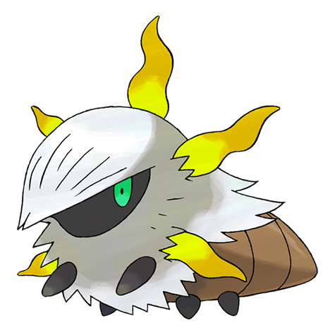

# #636 Larvesta (Torch Pokémon)

| Official Artwork | Shiny Artwork |
| --- | --- |
|  |  |

**Blaze Black:** This Pokémon was believed to have been born from the sun. When it evolves, its entire body is engulfed in flames.

**Volt White:** The base of volcanoes is where they make their homes. They shoot fire from their five horns to repel attacking enemies.

---

## Media

### Sprites

| Front | Back | Front Shiny | Back Shiny |
| --- | --- | --- | --- |
|  |  |  |  |

### Cries

Latest (Gen VI+):
<p><audio controls>
  <source src='../assets/cries/larvesta/latest.ogg' type='audio/ogg'>
  Your browser does not support the audio element.
</audio></p>

Legacy:
<p><audio controls>
  <source src='../assets/cries/larvesta/legacy.ogg' type='audio/ogg'>
  Your browser does not support the audio element.
</audio></p>

---

## Pokédex Data

| National № | Type(s) | Height | Weight | Abilities | Local № |
|------------|---------|--------|--------|-----------|---------|
| #636 | {: width='48'} {: width='48'} | 1.1 m | 28.8 kg | 1. Flame-Body<br>2. Swarm | #142 |

---

## Base Stats
---

## Base Stats
|   | HP | Attack | Defense | Sp. Atk | Sp. Def | Speed |
|---|----|--------|---------|---------|---------|-------|
| **Base** | 55 | 85 | 55 | 50 | 55 | 60 |
| **Min** | 220 | 157 | 103 | 94 | 103 | 112 |
| **Max** | 314 | 295 | 229 | 218 | 229 | 240 |

The ranges shown above are for a level 100 Pokémon. Maximum values are based on a beneficial nature, 252 EVs, 31 IVs; minimum values are based on a hindering nature, 0 EVs, 0 IVs.

---

## Forms & Evolutions

!!! warning "WARNING"

    Some forms may not be available in Blaze Black/Volt White. Also information on evolutions may not be 100% accurate; it is currently quite complex to track generational evolution data.

### Forms

Larvesta has no alternate forms.

### Evolution Line

1. [Larvesta](larvesta.md/)
1. Level Up: [Volcarona](volcarona.md/)

```
Level 45
```

---

## Training

| EV Yield | Catch Rate | Base Friendship | Base Exp. | Growth Rate | Held Items |
|----------|------------|-----------------|-----------|-------------|------------|
| 1 Attack | 45 | 50 | 72 | Slow | N/A |

---

## Breeding

| Egg Groups | Egg Cycles | Gender | Dimorphic | Color | Shape |
|------------|------------|--------|-----------|-------|-------|
| 1. Bug | 40 | 50.0% Male<br>50.0% Female | False | White | Armor |

---

## Moves

!!! warning "WARNING"

    Specific move information may be incorrect. However, the general movepool should be accurate (including changes to learnset).

### Level Up Moves

Lv. | Move | Type | Cat. | Power | Acc. | PP
--- | --- | --- | --- | --- | --- | ---
| 1 | Ember | {: width='48'} | {: width='36'} | 40 | 100 | 25 |
| 1 | String Shot | {: width='48'} | {: width='36'} | — | 95 | 40 |
| 10 | Leech Life | {: width='48'} | {: width='36'} | 80 | 100 | 10 |
| 20 | Take Down | {: width='48'} | {: width='36'} | 90 | 85 | 20 |
| 30 | Flame Charge | {: width='48'} | {: width='36'} | 50 | 100 | 20 |
| 40 | Bug Bite | {: width='48'} | {: width='36'} | 60 | 100 | 20 |
| 50 | Double Edge | {: width='48'} | {: width='36'} | 120 | 100 | 15 |
| 60 | Flame Wheel | {: width='48'} | {: width='36'} | 75 | 100 | 25 |
| 70 | Bug Buzz | {: width='48'} | {: width='36'} | 90 | 100 | 10 |
| 80 | Amnesia | {: width='48'} | {: width='36'} | — | — | 20 |
| 90 | Thrash | {: width='48'} | {: width='36'} | 120 | 100 | 10 |
| 100 | Flare Blitz | {: width='48'} | {: width='36'} | 120 | 100 | 15 |

### TM Moves

TM | Move | Type | Cat. | Power | Acc. | PP
--- | --- | --- | --- | --- | --- | ---
| TM04 | Calm Mind | {: width='48'} | {: width='36'} | — | — | 20 |
| TM06 | Toxic | {: width='48'} | {: width='36'} | — | 90 | 10 |
| TM10 | Hidden Power | {: width='48'} | {: width='36'} | 60 | 100 | 15 |
| TM11 | Sunny Day | {: width='48'} | {: width='36'} | — | — | 5 |
| TM16 | Light Screen | {: width='48'} | {: width='36'} | — | — | 30 |
| TM17 | Protect | {: width='48'} | {: width='36'} | — | — | 10 |
| TM20 | Safeguard | {: width='48'} | {: width='36'} | — | — | 25 |
| TM21 | Frustration | {: width='48'} | {: width='36'} | — | 100 | 20 |
| TM22 | Solar Beam | {: width='48'} | {: width='36'} | 120 | 100 | 10 |
| TM27 | Return | {: width='48'} | {: width='36'} | — | 100 | 20 |
| TM29 | Psychic | {: width='48'} | {: width='36'} | 90 | 100 | 10 |
| TM32 | Double Team | {: width='48'} | {: width='36'} | — | — | 15 |
| TM35 | Flamethrower | {: width='48'} | {: width='36'} | 90 | 100 | 15 |
| TM38 | Fire Blast | {: width='48'} | {: width='36'} | 110 | 85 | 5 |
| TM42 | Facade | {: width='48'} | {: width='36'} | 70 | 100 | 20 |
| TM43 | Flame Charge | {: width='48'} | {: width='36'} | 50 | 100 | 20 |
| TM44 | Rest | {: width='48'} | {: width='36'} | — | — | 5 |
| TM48 | Round | {: width='48'} | {: width='36'} | 60 | 100 | 15 |
| TM50 | Overheat | {: width='48'} | {: width='36'} | 130 | 90 | 5 |
| TM59 | Incinerate | {: width='48'} | {: width='36'} | 50 | 100 | 15 |
| TM61 | Will O Wisp | {: width='48'} | {: width='36'} | — | 85 | 15 |
| TM62 | Acrobatics | {: width='48'} | {: width='36'} | 55 | 100 | 15 |
| TM76 | Struggle Bug | {: width='48'} | {: width='36'} | 50 | 100 | 20 |
| TM87 | Swagger | {: width='48'} | {: width='36'} | — | 85 | 15 |
| TM89 | U Turn | {: width='48'} | {: width='36'} | 70 | 100 | 20 |
| TM90 | Substitute | {: width='48'} | {: width='36'} | — | — | 10 |
| TM93 | Wild Charge | {: width='48'} | {: width='36'} | 90 | 100 | 15 |

### Egg Moves

Move | Type | Cat. | Power | Acc. | PP
--- | --- | --- | --- | --- | ---
| String Shot | {: width='48'} | {: width='36'} | — | 95 | 40 |
| Harden | {: width='48'} | {: width='36'} | — | — | 30 |
| Foresight | {: width='48'} | {: width='36'} | — | — | 40 |
| Endure | {: width='48'} | {: width='36'} | — | — | 10 |
| Morning Sun | {: width='48'} | {: width='36'} | — | — | 5 |
| Magnet Rise | {: width='48'} | {: width='36'} | — | — | 10 |
| Zen Headbutt | {: width='48'} | {: width='36'} | 80 | 90 | 15 |

### Tutor Moves

Larvesta cannot learn any moves from tutors.
