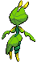
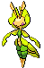
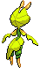

# #542 Leavanny (Nurturing Pokémon)

| Official Artwork | Shiny Artwork |
| --- | --- |
|  |  |

**Blaze Black:** Upon finding a small Pokémon, it weaves clothing for it from leaves, using the cutters on its arms and sticky silk.

**Volt White:** It keeps its eggs warm with heat from fermenting leaves. It also uses leaves to make warm wrappings for Sewaddle.

---

## Media

### Default Sprites

| Front | Back | Front Shiny | Back Shiny |
| --- | --- | --- | --- |
|  |  |  |  |

### Cries

Latest (Gen VI+):

<audio controls>
<source src='../../assets/cries/leavanny/latest.ogg' type='audio/ogg'>
  Your browser does not support the audio element.
</audio>

Legacy:

<audio controls>
<source src='../../assets/cries/leavanny/legacy.ogg' type='audio/ogg'>
  Your browser does not support the audio element.
</audio>

---

## Pokédex Data

| National № | Type(s) | Height | Weight | Abilities | Local № |
|------------|---------|--------|--------|-----------|---------|
| #542 | {: width="48"} {: width="48"} | 1.2 m / 3.9 ft | 20.5 kg / 45.2 lbs | Swarm Chlorophyll | #48 |

---

## Base Stats
|   | HP | Attack | Defense | Sp. Atk | Sp. Def | Speed |
|---|----|--------|---------|---------|---------|-------|
| **Base** | 75 | 103 | 80 | 70 | 80 | 92 |
| **Min** | 260 | 189 | 148 | 130 | 148 | 170 |
| **Max** | 354 | 335 | 284 | 262 | 284 | 311 |

The ranges shown above are for a level 100 Pokémon. Maximum values are based on a beneficial nature, 252 EVs, 31 IVs; minimum values are based on a hindering nature, 0 EVs, 0 IVs.

---

## Forms & Evolutions

!!! warning "WARNING"

    Information on evolutions may not be 100% accurate; differences between evolution methods across generations are not accounted for.

### Forms

Leavanny has no alternate forms.

### Evolution Line

1. [Sewaddle](sewaddle.md/)
    1. Level Up: [Swadloon](swadloon.md/)
        1. Level Up: [Leavanny](leavanny.md/)

---

## Training

| EV Yield | Catch Rate | Base Friendship | Base Exp. | Growth Rate | Held Items |
|----------|------------|-----------------|-----------|-------------|------------|
| 3 Attack | 45 | 180 | 225 | Medium Slow | Mental Herb (5%) |

---

## Breeding

| Egg Groups | Egg Cycles | Gender | Dimorphic | Color | Shape |
|------------|------------|--------|-----------|-------|-------|
| 1. Bug | 15 | 50.0% Male 50.0% Female | False | Yellow | Humanoid |

---

## Moves

!!! warning "WARNING"

    Specific move information may be incorrect. However, the general movepool should be accurate; this includes changes made in Blaze Black and Volt White.

### Level Up Moves

| Lv. | Move | Type | Cat. | Power | Acc. | PP |
| --- | --- | --- | --- | --- | --- | --- |
| 1 | Bug Bite | {: width="48"} | {: width="36"} | 60 | 100 | 20 |
| 1 | False Swipe | {: width="48"} | {: width="36"} | 40 | 100 | 40 |
| 1 | Razor Leaf | {: width="48"} | {: width="36"} | 55 | 95 | 25 |
| 1 | String Shot | {: width="48"} | {: width="36"} | — | 95 | 40 |
| 1 | Tackle | {: width="48"} | {: width="36"} | 40 | 100 | 35 |
| 8 | Bug Bite | {: width="48"} | {: width="36"} | 60 | 100 | 20 |
| 15 | Razor Leaf | {: width="48"} | {: width="36"} | 55 | 95 | 25 |
| 22 | Struggle Bug | {: width="48"} | {: width="36"} | 50 | 100 | 20 |
| 25 | Screech | {: width="48"} | {: width="36"} | — | 85 | 40 |
| 29 | Slash | {: width="48"} | {: width="36"} | 70 | 100 | 20 |
| 32 | Helping Hand | {: width="48"} | {: width="36"} | — | — | 20 |
| 36 | Leaf Blade | {: width="48"} | {: width="36"} | 90 | 100 | 15 |
| 39 | X Scissor | {: width="48"} | {: width="36"} | 80 | 100 | 15 |
| 43 | Entrainment | {: width="48"} | {: width="36"} | — | 100 | 15 |
| 46 | Swords Dance | {: width="48"} | {: width="36"} | — | — | 20 |
| 50 | Leaf Storm | {: width="48"} | {: width="36"} | 130 | 90 | 5 |
| 54 | Me First | {: width="48"} | {: width="36"} | — | — | 20 |
| 58 | Agility | {: width="48"} | {: width="36"} | — | — | 30 |

### TM Moves

| TM | Move | Type | Cat. | Power | Acc. | PP |
| --- | --- | --- | --- | --- | --- | --- |
| HM01 | Cut | {: width="48"} | {: width="36"} | 60 | 100% | 25 |
| TM01 | Hone Claws | {: width="48"} | {: width="36"} | — | — | 15 |
| TM04 | Calm Mind | {: width="48"} | {: width="36"} | — | — | 20 |
| TM06 | Toxic | {: width="48"} | {: width="36"} | — | 90 | 10 |
| TM10 | Hidden Power | {: width="48"} | {: width="36"} | 60 | 100 | 15 |
| TM11 | Sunny Day | {: width="48"} | {: width="36"} | — | — | 5 |
| TM15 | Hyper Beam | {: width="48"} | {: width="36"} | 150 | 90 | 5 |
| TM16 | Light Screen | {: width="48"} | {: width="36"} | — | — | 30 |
| TM17 | Protect | {: width="48"} | {: width="36"} | — | — | 10 |
| TM20 | Safeguard | {: width="48"} | {: width="36"} | — | — | 25 |
| TM21 | Frustration | {: width="48"} | {: width="36"} | — | 100 | 20 |
| TM22 | Solar Beam | {: width="48"} | {: width="36"} | 120 | 100 | 10 |
| TM27 | Return | {: width="48"} | {: width="36"} | — | 100 | 20 |
| TM32 | Double Team | {: width="48"} | {: width="36"} | — | — | 15 |
| TM33 | Reflect | {: width="48"} | {: width="36"} | — | — | 20 |
| TM40 | Aerial Ace | {: width="48"} | {: width="36"} | 60 | — | 20 |
| TM42 | Facade | {: width="48"} | {: width="36"} | 70 | 100 | 20 |
| TM44 | Rest | {: width="48"} | {: width="36"} | — | — | 5 |
| TM45 | Attract | {: width="48"} | {: width="36"} | — | 100 | 15 |
| TM48 | Round | {: width="48"} | {: width="36"} | 60 | 100 | 15 |
| TM53 | Energy Ball | {: width="48"} | {: width="36"} | 90 | 100 | 10 |
| TM54 | False Swipe | {: width="48"} | {: width="36"} | 40 | 100 | 40 |
| TM65 | Shadow Claw | {: width="48"} | {: width="36"} | 80 | 100 | 15 |
| TM66 | Payback | {: width="48"} | {: width="36"} | 50 | 100 | 10 |
| TM67 | Retaliate | {: width="48"} | {: width="36"} | 70 | 100 | 5 |
| TM68 | Giga Impact | {: width="48"} | {: width="36"} | 150 | 90 | 5 |
| TM70 | Flash | {: width="48"} | {: width="36"} | — | 100 | 20 |
| TM75 | Swords Dance | {: width="48"} | {: width="36"} | — | — | 20 |
| TM76 | Struggle Bug | {: width="48"} | {: width="36"} | 50 | 100 | 20 |
| TM81 | X Scissor | {: width="48"} | {: width="36"} | 80 | 100 | 15 |
| TM84 | Poison Jab | {: width="48"} | {: width="36"} | 80 | 100 | 20 |
| TM85 | Dream Eater | {: width="48"} | {: width="36"} | 100 | 100 | 15 |
| TM86 | Grass Knot | {: width="48"} | {: width="36"} | — | 100 | 20 |
| TM87 | Swagger | {: width="48"} | {: width="36"} | — | 85 | 15 |
| TM90 | Substitute | {: width="48"} | {: width="36"} | — | — | 10 |

### Egg Moves

Leavanny cannot learn any moves by breeding.
### Tutor Moves

Leavanny cannot learn any moves from tutors.
