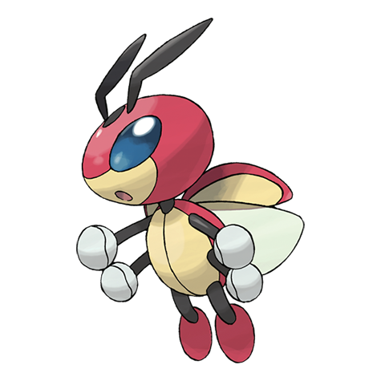
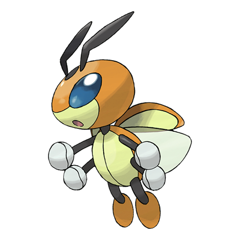
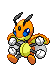
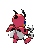
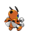
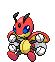
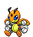
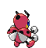
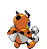

# #166 Ledian (Five Star Pokémon)

| Official Artwork | Shiny Artwork |
|------------------|---------------|
|  |  |

It uses starlight as energy. When more stars appear at night, the patterns on its back grow larger.

---

## Media

### Default Sprites

| Front | Shiny | Back | Shiny |
|-------|-------|------|-------|
|  |  |  |  |

### Female Sprites

| Front | Shiny | Back | Shiny |
|-------|-------|------|-------|
|  |  |  |  |

### Cries

Latest (Gen VI+):

<audio controls>
<source src='../../assets/cries/ledian/latest.ogg' type='audio/ogg'>
  Your browser does not support the audio element.
</audio>

Legacy:

<audio controls>
<source src='../../assets/cries/ledian/legacy.ogg' type='audio/ogg'>
  Your browser does not support the audio element.
</audio>

---

## Pokédex Data

| National № | Type(s) | Height | Weight | Abilities | Local № |
|------------|---------|--------|--------|-----------|---------|
| #166 | {: width="48"} {: width="48"} | 1.4 m / 4.6 ft | 35.6 kg / 78.5 lbs | 1. Iron Fist 2. Early Bird | N/A |

---

## Base Stats
|   | HP | Attack | Defense | Sp. Atk | Sp. Def | Speed |
|---|----|--------|---------|---------|---------|-------|
| **Base** | 55 | 95 | 50 | 35 | 110 | 85 |
| **Min** | 220 | 175 | 94 | 67 | 202 | 157 |
| **Max** | 314 | 317 | 218 | 185 | 350 | 295 |

The ranges shown above are for a level 100 Pokémon. Maximum values are based on a beneficial nature, 252 EVs, 31 IVs; minimum values are based on a hindering nature, 0 EVs, 0 IVs.

---

## Forms & Evolutions

!!! warning "WARNING"

    Information on evolutions may not be 100% accurate; differences between evolution methods across generations are not accounted for.

### Forms

Ledian has no alternate forms.

### Evolution Line

1. [Ledyba](ledyba.md/)
    1. Level Up: [Ledian](ledian.md/)

---

## Training

| EV Yield | Catch Rate | Base Friendship | Base Exp. | Growth Rate | Held Items |
|----------|------------|-----------------|-----------|-------------|------------|
| 2 Sp. Def | 90 | 70 | 137 | Fast | N/A |

---

## Breeding

| Egg Groups | Egg Cycles | Gender | Dimorphic | Color | Shape |
|------------|------------|--------|-----------|-------|-------|
| 1. Bug | 15 | 50.0% Male 50.0% Female | True | Red | Wings |

---

## Moves

!!! warning "WARNING"

    Specific move information may be incorrect. However, the general movepool should be accurate; this includes changes made in Blaze Black and Volt White.

### Level Up Moves

| Lv. | Move | Type | Cat. | Power | Acc. | PP |
| --- | --- | --- | --- | --- | --- | --- |
| 1 | Comet Punch | {: width="48"} | {: width="36"} | 25 | 85 | 15 |
| 1 | Supersonic | {: width="48"} | {: width="36"} | — | 55 | 20 |
| 1 | Tackle | {: width="48"} | {: width="36"} | 40 | 100 | 35 |
| 6 | Supersonic | {: width="48"} | {: width="36"} | — | 55 | 20 |
| 9 | Comet Punch | {: width="48"} | {: width="36"} | 25 | 85 | 15 |
| 14 | Light Screen | {: width="48"} | {: width="36"} | — | — | 30 |
| 14 | Reflect | {: width="48"} | {: width="36"} | — | — | 20 |
| 14 | Safeguard | {: width="48"} | {: width="36"} | — | — | 25 |
| 17 | Mach Punch | {: width="48"} | {: width="36"} | 40 | 100 | 30 |
| 18 | Dizzy Punch | {: width="48"} | {: width="36"} | 70 | 100 | 10 |
| 18 | Drain Punch | {: width="48"} | {: width="36"} | 75 | 100 | 10 |
| 18 | Fire Punch | {: width="48"} | {: width="36"} | 80 | 100 | 15 |
| 18 | Ice Punch | {: width="48"} | {: width="36"} | 80 | 100 | 15 |
| 18 | Thunder Punch | {: width="48"} | {: width="36"} | 80 | 100 | 15 |
| 24 | Baton Pass | {: width="48"} | {: width="36"} | — | — | 40 |
| 29 | Silver Wind | {: width="48"} | {: width="36"} | 60 | 100 | 5 |
| 36 | Agility | {: width="48"} | {: width="36"} | — | — | 30 |
| 41 | Swift | {: width="48"} | {: width="36"} | 60 | — | 20 |
| 48 | Double Edge | {: width="48"} | {: width="36"} | 120 | 100 | 15 |
| 53 | Bug Buzz | {: width="48"} | {: width="36"} | 90 | 100 | 10 |

### TM Moves

| TM | Move | Type | Cat. | Power | Acc. | PP |
| --- | --- | --- | --- | --- | --- | --- |
| HM04 | Strength | {: width="48"} | {: width="36"} | 100 | 100 | 15 |
| TM06 | Toxic | {: width="48"} | {: width="36"} | — | 90 | 10 |
| TM10 | Hidden Power | {: width="48"} | {: width="36"} | 60 | 100 | 15 |
| TM11 | Sunny Day | {: width="48"} | {: width="36"} | — | — | 5 |
| TM15 | Hyper Beam | {: width="48"} | {: width="36"} | 150 | 90 | 5 |
| TM16 | Light Screen | {: width="48"} | {: width="36"} | — | — | 30 |
| TM17 | Protect | {: width="48"} | {: width="36"} | — | — | 10 |
| TM20 | Safeguard | {: width="48"} | {: width="36"} | — | — | 25 |
| TM21 | Frustration | {: width="48"} | {: width="36"} | — | 100 | 20 |
| TM22 | Solar Beam | {: width="48"} | {: width="36"} | 120 | 100 | 10 |
| TM27 | Return | {: width="48"} | {: width="36"} | — | 100 | 20 |
| TM28 | Dig | {: width="48"} | {: width="36"} | 100 | 100 | 10 |
| TM31 | Brick Break | {: width="48"} | {: width="36"} | 75 | 100 | 15 |
| TM32 | Double Team | {: width="48"} | {: width="36"} | — | — | 15 |
| TM33 | Reflect | {: width="48"} | {: width="36"} | — | — | 20 |
| TM40 | Aerial Ace | {: width="48"} | {: width="36"} | 60 | — | 20 |
| TM42 | Facade | {: width="48"} | {: width="36"} | 70 | 100 | 20 |
| TM44 | Rest | {: width="48"} | {: width="36"} | — | — | 5 |
| TM45 | Attract | {: width="48"} | {: width="36"} | — | 100 | 15 |
| TM46 | Thief | {: width="48"} | {: width="36"} | 60 | 100 | 25 |
| TM48 | Round | {: width="48"} | {: width="36"} | 60 | 100 | 15 |
| TM52 | Focus Blast | {: width="48"} | {: width="36"} | 120 | 70 | 5 |
| TM56 | Fling | {: width="48"} | {: width="36"} | — | 100 | 10 |
| TM62 | Acrobatics | {: width="48"} | {: width="36"} | 55 | 100 | 15 |
| TM68 | Giga Impact | {: width="48"} | {: width="36"} | 150 | 90 | 5 |
| TM70 | Flash | {: width="48"} | {: width="36"} | — | 100 | 20 |
| TM75 | Swords Dance | {: width="48"} | {: width="36"} | — | — | 20 |
| TM76 | Struggle Bug | {: width="48"} | {: width="36"} | 50 | 100 | 20 |
| TM87 | Swagger | {: width="48"} | {: width="36"} | — | 85 | 15 |
| TM89 | U Turn | {: width="48"} | {: width="36"} | 70 | 100 | 20 |
| TM90 | Substitute | {: width="48"} | {: width="36"} | — | — | 10 |
| TM94 | Rock Smash | {: width="48"} | {: width="36"} | 60 | 100 | 15 |

### Egg Moves

Ledian cannot learn any moves by breeding.
### Tutor Moves

Ledian cannot learn any moves from tutors.
