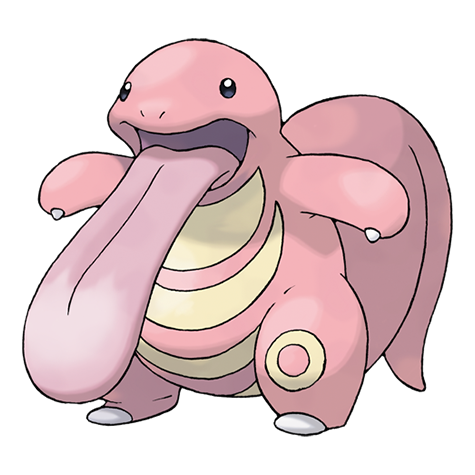
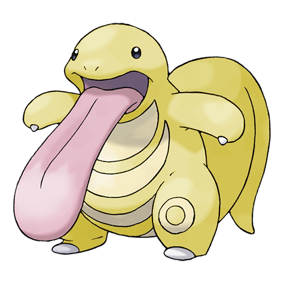
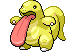
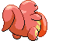
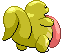

# #108 Lickitung (Licking Pokémon)

| Official Artwork | Shiny Artwork |
|------------------|---------------|
|  |  |

When it extends its over-six-foot- long tongue, its tail quivers. There is a possibility they are connected.

---

## Media

### Default Sprites

| Front | Shiny | Back | Shiny |
|-------|-------|------|-------|
|  |  |  |  |

### Cries

Latest (Gen VI+):

<audio controls>
<source src='../../assets/cries/lickitung/latest.ogg' type='audio/ogg'>
  Your browser does not support the audio element.
</audio>

Legacy:

<audio controls>
<source src='../../assets/cries/lickitung/legacy.ogg' type='audio/ogg'>
  Your browser does not support the audio element.
</audio>

---

## Pokédex Data

| National № | Type(s) | Height | Weight | Abilities | Local № |
|------------|---------|--------|--------|-----------|---------|
| #108 | {: width="48"} | 1.2 m / 3.9 ft | 65.5 kg / 144.4 lbs | 1. Cloud Nine 2. Gluttony | N/A |

---

## Base Stats
|   | HP | Attack | Defense | Sp. Atk | Sp. Def | Speed |
|---|----|--------|---------|---------|---------|-------|
| **Base** | 90 | 55 | 75 | 60 | 75 | 30 |
| **Min** | 290 | 103 | 139 | 112 | 139 | 58 |
| **Max** | 384 | 229 | 273 | 240 | 273 | 174 |

The ranges shown above are for a level 100 Pokémon. Maximum values are based on a beneficial nature, 252 EVs, 31 IVs; minimum values are based on a hindering nature, 0 EVs, 0 IVs.

---

## Forms & Evolutions

!!! warning "WARNING"

    Information on evolutions may not be 100% accurate; differences between evolution methods across generations are not accounted for.

### Forms

Lickitung has no alternate forms.

### Evolution Line

1. [Lickitung](lickitung.md/)
    1. Level Up: [Lickilicky](lickilicky.md/)

---

## Training

| EV Yield | Catch Rate | Base Friendship | Base Exp. | Growth Rate | Held Items |
|----------|------------|-----------------|-----------|-------------|------------|
| 2 HP | 45 | 50 | 77 | Medium | Lagging Tail (5%) |

---

## Breeding

| Egg Groups | Egg Cycles | Gender | Dimorphic | Color | Shape |
|------------|------------|--------|-----------|-------|-------|
| 1. Monster | 20 | 50.0% Male 50.0% Female | False | Pink | Upright |

---

## Moves

!!! warning "WARNING"

    Specific move information may be incorrect. However, the general movepool should be accurate; this includes changes made in Blaze Black and Volt White.

### Level Up Moves

| Lv. | Move | Type | Cat. | Power | Acc. | PP |
| --- | --- | --- | --- | --- | --- | --- |
| 1 | Lick | {: width="48"} | {: width="36"} | 30 | 100 | 30 |
| 5 | Supersonic | {: width="48"} | {: width="36"} | — | 55 | 20 |
| 9 | Defense Curl | {: width="48"} | {: width="36"} | — | — | 40 |
| 13 | Knock Off | {: width="48"} | {: width="36"} | 65 | 100 | 20 |
| 17 | Wrap | {: width="48"} | {: width="36"} | 15 | 90 | 20 |
| 21 | Stomp | {: width="48"} | {: width="36"} | 65 | 100 | 20 |
| 25 | Disable | {: width="48"} | {: width="36"} | — | 100 | 20 |
| 29 | Slam | {: width="48"} | {: width="36"} | 80 | 75 | 20 |
| 33 | Rollout | {: width="48"} | {: width="36"} | 30 | 90 | 20 |
| 37 | Chip Away | {: width="48"} | {: width="36"} | 70 | 100 | 20 |
| 41 | Me First | {: width="48"} | {: width="36"} | — | — | 20 |
| 45 | Refresh | {: width="48"} | {: width="36"} | — | — | 20 |
| 49 | Screech | {: width="48"} | {: width="36"} | — | 85 | 40 |
| 53 | Power Whip | {: width="48"} | {: width="36"} | 120 | 85 | 10 |
| 57 | Wring Out | {: width="48"} | {: width="36"} | — | 100 | 5 |
| 61 | Belly Drum | {: width="48"} | {: width="36"} | — | — | 10 |
| 65 | Hammer Arm | {: width="48"} | {: width="36"} | 100 | 90 | 10 |

### TM Moves

| TM | Move | Type | Cat. | Power | Acc. | PP |
| --- | --- | --- | --- | --- | --- | --- |
| HM01 | Cut | {: width="48"} | {: width="36"} | 60 | 100% | 25 |
| HM03 | Surf | {: width="48"} | {: width="36"} | 90 | 100 | 15 |
| HM04 | Strength | {: width="48"} | {: width="36"} | 100 | 100 | 15 |
| TM06 | Toxic | {: width="48"} | {: width="36"} | — | 90 | 10 |
| TM10 | Hidden Power | {: width="48"} | {: width="36"} | 60 | 100 | 15 |
| TM11 | Sunny Day | {: width="48"} | {: width="36"} | — | — | 5 |
| TM13 | Ice Beam | {: width="48"} | {: width="36"} | 90 | 100 | 10 |
| TM14 | Blizzard | {: width="48"} | {: width="36"} | 110 | 70 | 5 |
| TM15 | Hyper Beam | {: width="48"} | {: width="36"} | 150 | 90 | 5 |
| TM17 | Protect | {: width="48"} | {: width="36"} | — | — | 10 |
| TM18 | Rain Dance | {: width="48"} | {: width="36"} | — | — | 5 |
| TM21 | Frustration | {: width="48"} | {: width="36"} | — | 100 | 20 |
| TM22 | Solar Beam | {: width="48"} | {: width="36"} | 120 | 100 | 10 |
| TM24 | Thunderbolt | {: width="48"} | {: width="36"} | 90 | 100 | 15 |
| TM25 | Thunder | {: width="48"} | {: width="36"} | 110 | 70 | 10 |
| TM26 | Earthquake | {: width="48"} | {: width="36"} | 100 | 100 | 10 |
| TM27 | Return | {: width="48"} | {: width="36"} | — | 100 | 20 |
| TM28 | Dig | {: width="48"} | {: width="36"} | 100 | 100 | 10 |
| TM30 | Shadow Ball | {: width="48"} | {: width="36"} | 90 | 100 | 15 |
| TM31 | Brick Break | {: width="48"} | {: width="36"} | 75 | 100 | 15 |
| TM32 | Double Team | {: width="48"} | {: width="36"} | — | — | 15 |
| TM35 | Flamethrower | {: width="48"} | {: width="36"} | 90 | 100 | 15 |
| TM37 | Sandstorm | {: width="48"} | {: width="36"} | — | — | 10 |
| TM38 | Fire Blast | {: width="48"} | {: width="36"} | 110 | 85 | 5 |
| TM39 | Rock Tomb | {: width="48"} | {: width="36"} | 60 | 95 | 15 |
| TM42 | Facade | {: width="48"} | {: width="36"} | 70 | 100 | 20 |
| TM44 | Rest | {: width="48"} | {: width="36"} | — | — | 5 |
| TM45 | Attract | {: width="48"} | {: width="36"} | — | 100 | 15 |
| TM46 | Thief | {: width="48"} | {: width="36"} | 60 | 100 | 25 |
| TM48 | Round | {: width="48"} | {: width="36"} | 60 | 100 | 15 |
| TM56 | Fling | {: width="48"} | {: width="36"} | — | 100 | 10 |
| TM59 | Incinerate | {: width="48"} | {: width="36"} | 50 | 100 | 15 |
| TM67 | Retaliate | {: width="48"} | {: width="36"} | 70 | 100 | 5 |
| TM68 | Giga Impact | {: width="48"} | {: width="36"} | 150 | 90 | 5 |
| TM75 | Swords Dance | {: width="48"} | {: width="36"} | — | — | 20 |
| TM77 | Psych Up | {: width="48"} | {: width="36"} | — | — | 10 |
| TM78 | Bulldoze | {: width="48"} | {: width="36"} | 80 | 100 | 20 |
| TM80 | Rock Slide | {: width="48"} | {: width="36"} | 75 | 90 | 10 |
| TM82 | Dragon Tail | {: width="48"} | {: width="36"} | 60 | 90 | 10 |
| TM83 | Work Up | {: width="48"} | {: width="36"} | — | — | 30 |
| TM85 | Dream Eater | {: width="48"} | {: width="36"} | 100 | 100 | 15 |
| TM87 | Swagger | {: width="48"} | {: width="36"} | — | 85 | 15 |
| TM90 | Substitute | {: width="48"} | {: width="36"} | — | — | 10 |
| TM94 | Rock Smash | {: width="48"} | {: width="36"} | 60 | 100 | 15 |

### Egg Moves

| Move | Type | Cat. | Power | Acc. | PP |
| --- | --- | --- | --- | --- | --- |
| Body Slam | {: width="48"} | {: width="36"} | 85 | 100 | 15 |
| Amnesia | {: width="48"} | {: width="36"} | — | — | 20 |
| Snore | {: width="48"} | {: width="36"} | 50 | 100 | 15 |
| Curse | {: width="48"} | {: width="36"} | — | — | 10 |
| Belly Drum | {: width="48"} | {: width="36"} | — | — | 10 |
| Sleep Talk | {: width="48"} | {: width="36"} | — | — | 10 |
| Magnitude | {: width="48"} | {: width="36"} | — | 100 | 30 |
| Smelling Salts | {: width="48"} | {: width="36"} | 70 | 100 | 10 |
| Muddy Water | {: width="48"} | {: width="36"} | 90 | 85 | 10 |
| Hammer Arm | {: width="48"} | {: width="36"} | 100 | 90 | 10 |
| Zen Headbutt | {: width="48"} | {: width="36"} | 80 | 90 | 15 |

### Tutor Moves

Lickitung cannot learn any moves from tutors.
