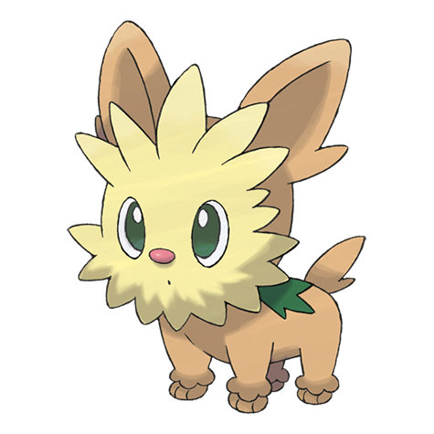
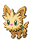
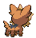
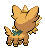

# #506 Lillipup (Puppy Pokémon)

| Official Artwork | Shiny Artwork |
|------------------|---------------|
|  |  |

**Blaze Black:** It faces strong opponents with great courage. But, when at a disadvantage in a fight, this intelligent Pokémon flees.

**Volt White:** The long hair around its face provides an amazing radar that lets it sense subtle changes in its surroundings.

---

## Media

### Default Sprites

| Front | Shiny | Back | Shiny |
|-------|-------|------|-------|
|  |  |  |  |

### Cries

Latest (Gen VI+):

<audio controls>
<source src='../../assets/cries/lillipup/latest.ogg' type='audio/ogg'>
  Your browser does not support the audio element.
</audio>

Legacy:

<audio controls>
<source src='../../assets/cries/lillipup/legacy.ogg' type='audio/ogg'>
  Your browser does not support the audio element.
</audio>

---

## Pokédex Data

| National № | Type(s) | Height | Weight | Abilities | Local № |
|------------|---------|--------|--------|-----------|---------|
| #506 | {: width="48"} | 0.4 m / 1.3 ft | 4.1 kg / 9.0 lbs | 1. Vital Spirit 2. Pickup | N/A |

---

## Base Stats
|   | HP | Attack | Defense | Sp. Atk | Sp. Def | Speed |
|---|----|--------|---------|---------|---------|-------|
| **Base** | 45 | 60 | 45 | 25 | 45 | 55 |
| **Min** | 200 | 112 | 85 | 49 | 85 | 103 |
| **Max** | 294 | 240 | 207 | 163 | 207 | 229 |

The ranges shown above are for a level 100 Pokémon. Maximum values are based on a beneficial nature, 252 EVs, 31 IVs; minimum values are based on a hindering nature, 0 EVs, 0 IVs.

---

## Forms & Evolutions

!!! warning "WARNING"

    Information on evolutions may not be 100% accurate; differences between evolution methods across generations are not accounted for.

### Forms

Lillipup has no alternate forms.

### Evolution Line

1. [Lillipup](lillipup.md/)
    1. Level Up: [Herdier](herdier.md/)
        1. Level Up: [Stoutland](stoutland.md/)

---

## Training

| EV Yield | Catch Rate | Base Friendship | Base Exp. | Growth Rate | Held Items |
|----------|------------|-----------------|-----------|-------------|------------|
| 1 Atk | 255 | 50 | 55 | Medium Slow | N/A |

---

## Breeding

| Egg Groups | Egg Cycles | Gender | Dimorphic | Color | Shape |
|------------|------------|--------|-----------|-------|-------|
| 1. Ground | 15 | 50.0% Male 50.0% Female | False | Brown | Quadruped |

---

## Moves

!!! warning "WARNING"

    Specific move information may be incorrect. However, the general movepool should be accurate; this includes changes made in Blaze Black and Volt White.

### Level Up Moves

| Lv. | Move | Type | Cat. | Power | Acc. | PP |
| --- | --- | --- | --- | --- | --- | --- |
| 1 | Leer | {: width="48"} | {: width="36"} | — | 100 | 30 |
| 1 | Tackle | {: width="48"} | {: width="36"} | 40 | 100 | 35 |
| 5 | Odor Sleuth | {: width="48"} | {: width="36"} | — | — | 40 |
| 8 | Bite | {: width="48"} | {: width="36"} | 60 | 100 | 25 |
| 12 | Helping Hand | {: width="48"} | {: width="36"} | — | — | 20 |
| 15 | Take Down | {: width="48"} | {: width="36"} | 90 | 85 | 20 |
| 19 | Work Up | {: width="48"} | {: width="36"} | — | — | 30 |
| 22 | Crunch | {: width="48"} | {: width="36"} | 80 | 100 | 15 |
| 26 | Roar | {: width="48"} | {: width="36"} | — | — | 20 |
| 29 | Retaliate | {: width="48"} | {: width="36"} | 70 | 100 | 5 |
| 33 | Reversal | {: width="48"} | {: width="36"} | — | 100 | 15 |
| 36 | Last Resort | {: width="48"} | {: width="36"} | 140 | 100 | 5 |
| 40 | Giga Impact | {: width="48"} | {: width="36"} | 150 | 90 | 5 |

### TM Moves

| TM | Move | Type | Cat. | Power | Acc. | PP |
| --- | --- | --- | --- | --- | --- | --- |
| TM05 | Roar | {: width="48"} | {: width="36"} | — | — | 20 |
| TM06 | Toxic | {: width="48"} | {: width="36"} | — | 90 | 10 |
| TM10 | Hidden Power | {: width="48"} | {: width="36"} | 60 | 100 | 15 |
| TM11 | Sunny Day | {: width="48"} | {: width="36"} | — | — | 5 |
| TM17 | Protect | {: width="48"} | {: width="36"} | — | — | 10 |
| TM18 | Rain Dance | {: width="48"} | {: width="36"} | — | — | 5 |
| TM21 | Frustration | {: width="48"} | {: width="36"} | — | 100 | 20 |
| TM24 | Thunderbolt | {: width="48"} | {: width="36"} | 90 | 100 | 15 |
| TM27 | Return | {: width="48"} | {: width="36"} | — | 100 | 20 |
| TM28 | Dig | {: width="48"} | {: width="36"} | 100 | 100 | 10 |
| TM30 | Shadow Ball | {: width="48"} | {: width="36"} | 90 | 100 | 15 |
| TM32 | Double Team | {: width="48"} | {: width="36"} | — | — | 15 |
| TM39 | Rock Tomb | {: width="48"} | {: width="36"} | 60 | 95 | 15 |
| TM40 | Aerial Ace | {: width="48"} | {: width="36"} | 60 | — | 20 |
| TM42 | Facade | {: width="48"} | {: width="36"} | 70 | 100 | 20 |
| TM44 | Rest | {: width="48"} | {: width="36"} | — | — | 5 |
| TM45 | Attract | {: width="48"} | {: width="36"} | — | 100 | 15 |
| TM48 | Round | {: width="48"} | {: width="36"} | 60 | 100 | 15 |
| TM67 | Retaliate | {: width="48"} | {: width="36"} | 70 | 100 | 5 |
| TM68 | Giga Impact | {: width="48"} | {: width="36"} | 150 | 90 | 5 |
| TM73 | Thunder Wave | {: width="48"} | {: width="36"} | — | 90 | 20 |
| TM83 | Work Up | {: width="48"} | {: width="36"} | — | — | 30 |
| TM87 | Swagger | {: width="48"} | {: width="36"} | — | 85 | 15 |
| TM90 | Substitute | {: width="48"} | {: width="36"} | — | — | 10 |
| TM93 | Wild Charge | {: width="48"} | {: width="36"} | 90 | 100 | 15 |
| TM94 | Rock Smash | {: width="48"} | {: width="36"} | 60 | 100 | 15 |
| TM95 | Snarl | {: width="48"} | {: width="36"} | 60 | 95 | 15 |

### Egg Moves

| Move | Type | Cat. | Power | Acc. | PP |
| --- | --- | --- | --- | --- | --- |
| Sand Attack | {: width="48"} | {: width="36"} | — | 100 | 15 |
| Lick | {: width="48"} | {: width="36"} | 30 | 100 | 30 |
| Mud Slap | {: width="48"} | {: width="36"} | 20 | 100 | 10 |
| Endure | {: width="48"} | {: width="36"} | — | — | 10 |
| Charm | {: width="48"} | {: width="36"} | — | 100 | 20 |
| Pursuit | {: width="48"} | {: width="36"} | 40 | 100 | 20 |
| Yawn | {: width="48"} | {: width="36"} | — | — | 10 |
| Howl | {: width="48"} | {: width="36"} | — | — | 40 |
| Thunder Fang | {: width="48"} | {: width="36"} | 75 | 95 | 15 |
| Ice Fang | {: width="48"} | {: width="36"} | 75 | 95 | 15 |
| Fire Fang | {: width="48"} | {: width="36"} | 75 | 95 | 15 |

### Tutor Moves

Lillipup cannot learn any moves from tutors.
