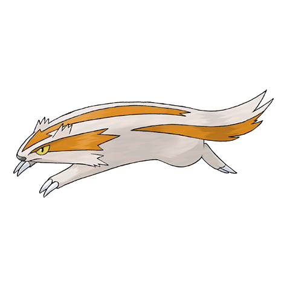
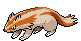
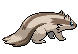
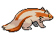

# #264 Linoone (Rushing Pokémon)

| Official Artwork | Shiny Artwork |
|------------------|---------------|
|  |  |

It charges prey at speeds over 60 mph. However, because it can only run straight, it often fails.

---

## Media

### Default Sprites

| Front | Shiny | Back | Shiny |
|-------|-------|------|-------|
|  |  |  |  |

### Cries

Latest (Gen VI+):

<audio controls>
<source src='../../assets/cries/linoone/latest.ogg' type='audio/ogg'>
  Your browser does not support the audio element.
</audio>

Legacy:

<audio controls>
<source src='../../assets/cries/linoone/legacy.ogg' type='audio/ogg'>
  Your browser does not support the audio element.
</audio>

---

## Pokédex Data

| National № | Type(s) | Height | Weight | Abilities | Local № |
|------------|---------|--------|--------|-----------|---------|
| #264 | {: width="48"} | 0.5 m / 1.6 ft | 32.5 kg / 71.7 lbs | 1. Pickup 2. Quick Feet | N/A |

---

## Base Stats
|   | HP | Attack | Defense | Sp. Atk | Sp. Def | Speed |
|---|----|--------|---------|---------|---------|-------|
| **Base** | 78 | 85 | 61 | 50 | 61 | 100 |
| **Min** | 266 | 157 | 114 | 94 | 114 | 184 |
| **Max** | 360 | 295 | 243 | 218 | 243 | 328 |

The ranges shown above are for a level 100 Pokémon. Maximum values are based on a beneficial nature, 252 EVs, 31 IVs; minimum values are based on a hindering nature, 0 EVs, 0 IVs.

---

## Forms & Evolutions

!!! warning "WARNING"

    Information on evolutions may not be 100% accurate; differences between evolution methods across generations are not accounted for.

### Forms

Linoone has no alternate forms.

### Evolution Line

1. [Zigzagoon](zigzagoon.md/)
    1. Level Up: [Linoone](linoone.md/)

---

## Training

| EV Yield | Catch Rate | Base Friendship | Base Exp. | Growth Rate | Held Items |
|----------|------------|-----------------|-----------|-------------|------------|
| 2 Spd | 90 | 50 | 147 | Medium | Oran Berry (50%) Sitrus Berry (5%) |

---

## Breeding

| Egg Groups | Egg Cycles | Gender | Dimorphic | Color | Shape |
|------------|------------|--------|-----------|-------|-------|
| 1. Ground | 15 | 50.0% Male 50.0% Female | False | White | Quadruped |

---

## Moves

!!! warning "WARNING"

    Specific move information may be incorrect. However, the general movepool should be accurate; this includes changes made in Blaze Black and Volt White.

### Level Up Moves

| Lv. | Move | Type | Cat. | Power | Acc. | PP |
| --- | --- | --- | --- | --- | --- | --- |
| 1 | Growl | {: width="48"} | {: width="36"} | — | 100 | 40 |
| 1 | Headbutt | {: width="48"} | {: width="36"} | 70 | 100 | 15 |
| 1 | Rock Climb | {: width="48"} | {: width="36"} | 80 | 95% | 10 |
| 1 | Super Fang | {: width="48"} | {: width="36"} | — | 90 | 10 |
| 1 | Switcheroo | {: width="48"} | {: width="36"} | — | 100 | 10 |
| 1 | Tackle | {: width="48"} | {: width="36"} | 40 | 100 | 35 |
| 1 | Tail Whip | {: width="48"} | {: width="36"} | — | 100 | 30 |
| 5 | Tail Whip | {: width="48"} | {: width="36"} | — | 100 | 30 |
| 9 | Headbutt | {: width="48"} | {: width="36"} | 70 | 100 | 15 |
| 13 | Sand Attack | {: width="48"} | {: width="36"} | — | 100 | 15 |
| 17 | Odor Sleuth | {: width="48"} | {: width="36"} | — | — | 40 |
| 20 | Extreme Speed | {: width="48"} | {: width="36"} | 80 | 100 | 5 |
| 23 | Mud Sport | {: width="48"} | {: width="36"} | — | — | 15 |
| 29 | Fury Swipes | {: width="48"} | {: width="36"} | 18 | 80 | 15 |
| 35 | Covet | {: width="48"} | {: width="36"} | 60 | 100 | 25 |
| 41 | Bestow | {: width="48"} | {: width="36"} | — | — | 15 |
| 47 | Slash | {: width="48"} | {: width="36"} | 70 | 100 | 20 |
| 53 | Rest | {: width="48"} | {: width="36"} | — | — | 5 |
| 59 | Belly Drum | {: width="48"} | {: width="36"} | — | — | 10 |
| 65 | Fling | {: width="48"} | {: width="36"} | — | 100 | 10 |

### TM Moves

| TM | Move | Type | Cat. | Power | Acc. | PP |
| --- | --- | --- | --- | --- | --- | --- |
| HM01 | Cut | {: width="48"} | {: width="36"} | 60 | 100% | 25 |
| HM03 | Surf | {: width="48"} | {: width="36"} | 90 | 100 | 15 |
| HM04 | Strength | {: width="48"} | {: width="36"} | 100 | 100 | 15 |
| TM01 | Hone Claws | {: width="48"} | {: width="36"} | — | — | 15 |
| TM05 | Roar | {: width="48"} | {: width="36"} | — | — | 20 |
| TM06 | Toxic | {: width="48"} | {: width="36"} | — | 90 | 10 |
| TM10 | Hidden Power | {: width="48"} | {: width="36"} | 60 | 100 | 15 |
| TM11 | Sunny Day | {: width="48"} | {: width="36"} | — | — | 5 |
| TM13 | Ice Beam | {: width="48"} | {: width="36"} | 90 | 100 | 10 |
| TM14 | Blizzard | {: width="48"} | {: width="36"} | 110 | 70 | 5 |
| TM15 | Hyper Beam | {: width="48"} | {: width="36"} | 150 | 90 | 5 |
| TM17 | Protect | {: width="48"} | {: width="36"} | — | — | 10 |
| TM18 | Rain Dance | {: width="48"} | {: width="36"} | — | — | 5 |
| TM21 | Frustration | {: width="48"} | {: width="36"} | — | 100 | 20 |
| TM24 | Thunderbolt | {: width="48"} | {: width="36"} | 90 | 100 | 15 |
| TM25 | Thunder | {: width="48"} | {: width="36"} | 110 | 70 | 10 |
| TM27 | Return | {: width="48"} | {: width="36"} | — | 100 | 20 |
| TM28 | Dig | {: width="48"} | {: width="36"} | 100 | 100 | 10 |
| TM30 | Shadow Ball | {: width="48"} | {: width="36"} | 90 | 100 | 15 |
| TM32 | Double Team | {: width="48"} | {: width="36"} | — | — | 15 |
| TM42 | Facade | {: width="48"} | {: width="36"} | 70 | 100 | 20 |
| TM44 | Rest | {: width="48"} | {: width="36"} | — | — | 5 |
| TM45 | Attract | {: width="48"} | {: width="36"} | — | 100 | 15 |
| TM46 | Thief | {: width="48"} | {: width="36"} | 60 | 100 | 25 |
| TM48 | Round | {: width="48"} | {: width="36"} | 60 | 100 | 15 |
| TM49 | Echoed Voice | {: width="48"} | {: width="36"} | 40 | 100 | 15 |
| TM56 | Fling | {: width="48"} | {: width="36"} | — | 100 | 10 |
| TM57 | Charge Beam | {: width="48"} | {: width="36"} | 50 | 90 | 10 |
| TM65 | Shadow Claw | {: width="48"} | {: width="36"} | 80 | 100 | 15 |
| TM67 | Retaliate | {: width="48"} | {: width="36"} | 70 | 100 | 5 |
| TM68 | Giga Impact | {: width="48"} | {: width="36"} | 150 | 90 | 5 |
| TM73 | Thunder Wave | {: width="48"} | {: width="36"} | — | 90 | 20 |
| TM83 | Work Up | {: width="48"} | {: width="36"} | — | — | 30 |
| TM86 | Grass Knot | {: width="48"} | {: width="36"} | — | 100 | 20 |
| TM87 | Swagger | {: width="48"} | {: width="36"} | — | 85 | 15 |
| TM90 | Substitute | {: width="48"} | {: width="36"} | — | — | 10 |
| TM94 | Rock Smash | {: width="48"} | {: width="36"} | 60 | 100 | 15 |

### Egg Moves

Linoone cannot learn any moves by breeding.
### Tutor Moves

Linoone cannot learn any moves from tutors.
