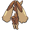
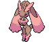
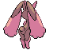

# Lopunny (Rabbit Pokémon)

| Official Artwork | Shiny Artwork |
| --- | --- |
|  |  |

The ears appear to be delicate. If they are touched roughly, it kicks with its graceful legs.

---

## Media

### Default Sprites

| Front | Back | Front Shiny | Back Shiny |
| --- | --- | --- | --- |
|  |  |  |  |

### Cries

Latest (Gen VI+):

<audio controls>
<source src='../../assets/cries/lopunny/latest.ogg' type='audio/ogg'>
  Your browser does not support the audio element.
</audio>

Legacy:

<audio controls>
<source src='../../assets/cries/lopunny/legacy.ogg' type='audio/ogg'>
  Your browser does not support the audio element.
</audio>

---

## Pokédex Data

| National № | Type(s) | Height | Weight | Abilities | Local № |
|------------|---------|--------|--------|-----------|---------|
| #428 | {: width='48'} {: width='48'} | 1.2 m | 33.3 kg | 1. Cute-Charm 2. Limber | N/A |

---

## Base Stats
|   | HP | Attack | Defense | Sp. Atk | Sp. Def | Speed |
|---|----|--------|---------|---------|---------|-------|
| **Base** | 65 | 106 | 84 | 44 | 96 | 105 |
| **Min** | 240 | 195 | 155 | 83 | 177 | 193 |
| **Max** | 334 | 342 | 293 | 205 | 320 | 339 |

The ranges shown above are for a level 100 Pokémon. Maximum values are based on a beneficial nature, 252 EVs, 31 IVs; minimum values are based on a hindering nature, 0 EVs, 0 IVs.

---

## Forms & Evolutions

!!! warning "WARNING"

    Information on evolutions may not be 100% accurate; differences between evolution methods across generations are not accounted for.

### Forms

Lopunny has no alternate forms.

### Evolution Line

1. [Buneary](buneary.md/)
    1. Level Up: [Lopunny](lopunny.md/)

---

## Training

| EV Yield | Catch Rate | Base Friendship | Base Exp. | Growth Rate | Held Items |
|----------|------------|-----------------|-----------|-------------|------------|
| 2 Speed | 60 | 140 | 168 | Medium | chople-berry (5%) |

---

## Breeding

| Egg Groups | Egg Cycles | Gender | Dimorphic | Color | Shape |
|------------|------------|--------|-----------|-------|-------|
| 1. Ground 2. Humanshape | 20 | 50.0% Male 50.0% Female | False | Brown | Upright |

---

## Moves

!!! warning "WARNING"

    Specific move information may be incorrect. However, the general movepool should be accurate; this includes changes made in Blaze Black and Volt White.

### Level Up Moves

| Lv. | Move | Type | Cat. | Power | Acc. | PP |
| --- | --- | --- | --- | --- | --- | --- |
| 1 | Defense Curl | {: width='48'} | {: width='36'} | — | — | 40 |
| 1 | Foresight | {: width='48'} | {: width='36'} | — | — | 40 |
| 1 | Magic Coat | {: width='48'} | {: width='36'} | — | — | 15 |
| 1 | Mirror Coat | {: width='48'} | {: width='36'} | — | 100 | 20 |
| 1 | Pound | {: width='48'} | {: width='36'} | 40 | 100 | 35 |
| 1 | Splash | {: width='48'} | {: width='36'} | — | — | 40 |
| 6 | Endure | {: width='48'} | {: width='36'} | — | — | 10 |
| 13 | Return | {: width='48'} | {: width='36'} | — | 100 | 20 |
| 16 | Quick Attack | {: width='48'} | {: width='36'} | 40 | 100 | 30 |
| 19 | Fake Out | {: width='48'} | {: width='36'} | 40 | 100 | 10 |
| 23 | Jump Kick | {: width='48'} | {: width='36'} | 100 | 95 | 10 |
| 26 | Baton Pass | {: width='48'} | {: width='36'} | — | — | 40 |
| 29 | Sky Uppercut | {: width='48'} | {: width='36'} | 85 | 90 | 15 |
| 33 | Agility | {: width='48'} | {: width='36'} | — | — | 30 |
| 36 | Dizzy Punch | {: width='48'} | {: width='36'} | 70 | 100 | 10 |
| 39 | Heal Bell | {: width='48'} | {: width='36'} | — | — | 5 |
| 43 | After You | {: width='48'} | {: width='36'} | — | — | 15 |
| 46 | Charm | {: width='48'} | {: width='36'} | — | 100 | 20 |
| 53 | Entrainment | {: width='48'} | {: width='36'} | — | 100 | 15 |
| 56 | Bounce | {: width='48'} | {: width='36'} | 85 | 85 | 5 |
| 63 | Healing Wish | {: width='48'} | {: width='36'} | — | — | 10 |

### TM Moves

| TM | Move | Type | Cat. | Power | Acc. | PP |
| --- | --- | --- | --- | --- | --- | --- |
| HM01 | Cut | {: width='48'} | {: width='36'} | 60 | 100% | 25 |
| HM04 | Strength | {: width='48'} | {: width='36'} | 100 | 100 | 15 |
| TM06 | Toxic | {: width='48'} | {: width='36'} | — | 90 | 10 |
| TM10 | Hidden Power | {: width='48'} | {: width='36'} | 60 | 100 | 15 |
| TM11 | Sunny Day | {: width='48'} | {: width='36'} | — | — | 5 |
| TM13 | Ice Beam | {: width='48'} | {: width='36'} | 90 | 100 | 10 |
| TM14 | Blizzard | {: width='48'} | {: width='36'} | 110 | 70 | 5 |
| TM15 | Hyper Beam | {: width='48'} | {: width='36'} | 150 | 90 | 5 |
| TM17 | Protect | {: width='48'} | {: width='36'} | — | — | 10 |
| TM18 | Rain Dance | {: width='48'} | {: width='36'} | — | — | 5 |
| TM21 | Frustration | {: width='48'} | {: width='36'} | — | 100 | 20 |
| TM22 | Solar Beam | {: width='48'} | {: width='36'} | 120 | 100 | 10 |
| TM24 | Thunderbolt | {: width='48'} | {: width='36'} | 90 | 100 | 15 |
| TM25 | Thunder | {: width='48'} | {: width='36'} | 110 | 70 | 10 |
| TM27 | Return | {: width='48'} | {: width='36'} | — | 100 | 20 |
| TM28 | Dig | {: width='48'} | {: width='36'} | 100 | 100 | 10 |
| TM30 | Shadow Ball | {: width='48'} | {: width='36'} | 90 | 100 | 15 |
| TM32 | Double Team | {: width='48'} | {: width='36'} | — | — | 15 |
| TM42 | Facade | {: width='48'} | {: width='36'} | 70 | 100 | 20 |
| TM44 | Rest | {: width='48'} | {: width='36'} | — | — | 5 |
| TM45 | Attract | {: width='48'} | {: width='36'} | — | 100 | 15 |
| TM47 | Low Sweep | {: width='48'} | {: width='36'} | 65 | 100 | 20 |
| TM48 | Round | {: width='48'} | {: width='36'} | 60 | 100 | 15 |
| TM52 | Focus Blast | {: width='48'} | {: width='36'} | 120 | 70 | 5 |
| TM56 | Fling | {: width='48'} | {: width='36'} | — | 100 | 10 |
| TM57 | Charge Beam | {: width='48'} | {: width='36'} | 50 | 90 | 10 |
| TM67 | Retaliate | {: width='48'} | {: width='36'} | 70 | 100 | 5 |
| TM68 | Giga Impact | {: width='48'} | {: width='36'} | 150 | 90 | 5 |
| TM73 | Thunder Wave | {: width='48'} | {: width='36'} | — | 90 | 20 |
| TM83 | Work Up | {: width='48'} | {: width='36'} | — | — | 30 |
| TM86 | Grass Knot | {: width='48'} | {: width='36'} | — | 100 | 20 |
| TM87 | Swagger | {: width='48'} | {: width='36'} | — | 85 | 15 |
| TM90 | Substitute | {: width='48'} | {: width='36'} | — | — | 10 |
| TM94 | Rock Smash | {: width='48'} | {: width='36'} | 60 | 100 | 15 |

### Egg Moves

Lopunny cannot learn any moves by breeding.
### Tutor Moves

Lopunny cannot learn any moves from tutors.
