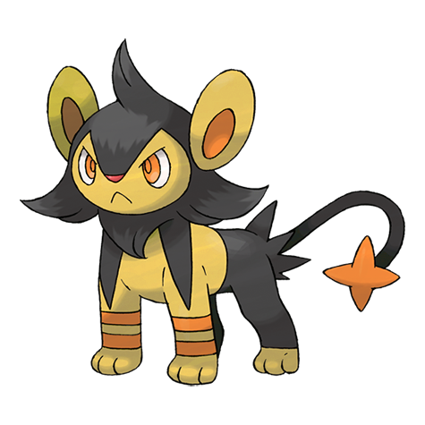
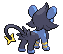
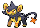
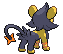
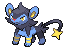
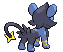
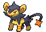
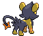

# #404 Luxio (Spark Pokémon)

| Official Artwork | Shiny Artwork |
| --- | --- |
|  |  |

Strong electricity courses through the tips of its sharp claws. A light scratch causes fainting in foes.

---

## Media

### Sprites

| Front | Back | Front Shiny | Back Shiny |
| --- | --- | --- | --- |
|  |  |  |  |

### Female Sprites

| Front | Back | Front Shiny | Back Shiny |
| --- | --- | --- | --- |
|  |  |  |  |

### Cries

Latest (Gen VI+):

<audio controls>
  <source src='../assets/cries/luxio/latest.ogg' type='audio/ogg'>
  Your browser does not support the audio element.
</audio>

Legacy:

<audio controls>
  <source src='../assets/cries/luxio/legacy.ogg' type='audio/ogg'>
  Your browser does not support the audio element.
</audio>

---

## Pokédex Data

| National № | Type(s) | Height | Weight | Abilities | Local № |
|------------|---------|--------|--------|-----------|---------|
| #404 | {: width='48'} {: width='48'} | 0.9 m | 30.5 kg | 1. Guts 2. Intimidate | #N/A |

---

## Base Stats
---

## Base Stats
|   | HP | Attack | Defense | Sp. Atk | Sp. Def | Speed |
|---|----|--------|---------|---------|---------|-------|
| **Base** | 60 | 85 | 49 | 60 | 49 | 60 |
| **Min** | 230 | 157 | 92 | 112 | 92 | 112 |
| **Max** | 324 | 295 | 216 | 240 | 216 | 240 |

The ranges shown above are for a level 100 Pokémon. Maximum values are based on a beneficial nature, 252 EVs, 31 IVs; minimum values are based on a hindering nature, 0 EVs, 0 IVs.

---

## Forms & Evolutions

!!! warning "WARNING"

    Some forms may not be available in Blaze Black/Volt White. Also information on evolutions may not be 100% accurate; it is currently quite complex to track generational evolution data.

### Forms

Luxio has no alternate forms.

### Evolution Line

1. [Shinx](shinx.md/)
1. Level Up: [Luxio](luxio.md/)
1. Level Up: [Luxray](luxray.md/)

---

## Training

| EV Yield | Catch Rate | Base Friendship | Base Exp. | Growth Rate | Held Items |
|----------|------------|-----------------|-----------|-------------|------------|
| 2 Attack | 120 | 100 | 127 | Medium-Slow | N/A |

---

## Breeding

| Egg Groups | Egg Cycles | Gender | Dimorphic | Color | Shape |
|------------|------------|--------|-----------|-------|-------|
| 1. Ground | 20 | 50.0% Male 50.0% Female | True | Blue | Quadruped |

---

## Moves

!!! warning "WARNING"

    Specific move information may be incorrect. However, the general movepool should be accurate (including changes to learnset).

### Level Up Moves

Lv. | Move | Type | Cat. | Power | Acc. | PP
--- | --- | --- | --- | --- | --- | ---
| 1 | Bite | {: width='48'} | {: width='36'} | 60 | 100 | 25 |
| 1 | Leer | {: width='48'} | {: width='36'} | — | 100 | 30 |
| 1 | Tackle | {: width='48'} | {: width='36'} | 40 | 100 | 35 |
| 5 | Leer | {: width='48'} | {: width='36'} | — | 100 | 30 |
| 9 | Charge | {: width='48'} | {: width='36'} | — | — | 20 |
| 13 | Spark | {: width='48'} | {: width='36'} | 65 | 100 | 20 |
| 15 | Double Kick | {: width='48'} | {: width='36'} | 30 | 100 | 30 |
| 18 | Night Slash | {: width='48'} | {: width='36'} | 70 | 100 | 15 |
| 23 | Roar | {: width='48'} | {: width='36'} | — | — | 20 |
| 28 | Swagger | {: width='48'} | {: width='36'} | — | 85 | 15 |
| 33 | Thunder Fang | {: width='48'} | {: width='36'} | 75 | 95 | 15 |
| 38 | Crunch | {: width='48'} | {: width='36'} | 80 | 100 | 15 |
| 43 | Scary Face | {: width='48'} | {: width='36'} | — | 100 | 10 |
| 48 | Discharge | {: width='48'} | {: width='36'} | 80 | 100 | 15 |
| 53 | Wild Charge | {: width='48'} | {: width='36'} | 90 | 100 | 15 |

### TM Moves

TM | Move | Type | Cat. | Power | Acc. | PP
--- | --- | --- | --- | --- | --- | ---
| HM04 | Strength | {: width='48'} | {: width='36'} | 85 | 100 | 15 |
| TM05 | Roar | {: width='48'} | {: width='36'} | — | — | 20 |
| TM06 | Toxic | {: width='48'} | {: width='36'} | — | 90 | 10 |
| TM10 | Hidden Power | {: width='48'} | {: width='36'} | 60 | 100 | 15 |
| TM16 | Light Screen | {: width='48'} | {: width='36'} | — | — | 30 |
| TM17 | Protect | {: width='48'} | {: width='36'} | — | — | 10 |
| TM18 | Rain Dance | {: width='48'} | {: width='36'} | — | — | 5 |
| TM21 | Frustration | {: width='48'} | {: width='36'} | — | 100 | 20 |
| TM24 | Thunderbolt | {: width='48'} | {: width='36'} | 90 | 100 | 15 |
| TM25 | Thunder | {: width='48'} | {: width='36'} | 110 | 70 | 10 |
| TM27 | Return | {: width='48'} | {: width='36'} | — | 100 | 20 |
| TM32 | Double Team | {: width='48'} | {: width='36'} | — | — | 15 |
| TM42 | Facade | {: width='48'} | {: width='36'} | 70 | 100 | 20 |
| TM44 | Rest | {: width='48'} | {: width='36'} | — | — | 5 |
| TM45 | Attract | {: width='48'} | {: width='36'} | — | 100 | 15 |
| TM46 | Thief | {: width='48'} | {: width='36'} | 60 | 100 | 25 |
| TM48 | Round | {: width='48'} | {: width='36'} | 60 | 100 | 15 |
| TM57 | Charge Beam | {: width='48'} | {: width='36'} | 50 | 90 | 10 |
| TM70 | Flash | {: width='48'} | {: width='36'} | — | 100 | 20 |
| TM72 | Volt Switch | {: width='48'} | {: width='36'} | 70 | 100 | 20 |
| TM73 | Thunder Wave | {: width='48'} | {: width='36'} | — | 90 | 20 |
| TM87 | Swagger | {: width='48'} | {: width='36'} | — | 85 | 15 |
| TM90 | Substitute | {: width='48'} | {: width='36'} | — | — | 10 |
| TM93 | Wild Charge | {: width='48'} | {: width='36'} | 90 | 100 | 15 |
| TM95 | Snarl | {: width='48'} | {: width='36'} | 60 | 95 | 15 |

### Egg Moves

Luxio cannot learn any moves by breeding.
### Tutor Moves

Luxio cannot learn any moves from tutors.
