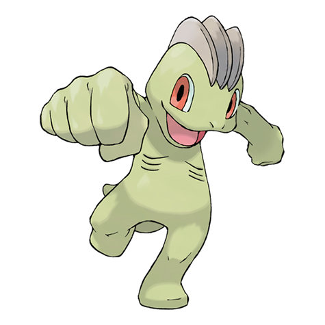
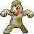
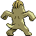

# #066 Machop (Superpower Pokémon)

| Official Artwork | Shiny Artwork |
|------------------|---------------|
|  |  |

Though small in stature, it is powerful enough to easily heft and throw a number of Geodude at once.

---

## Media

### Default Sprites

| Front | Shiny | Back | Shiny |
|-------|-------|------|-------|
|  |  |  |  |

### Cries

Latest (Gen VI+):

<audio controls>
<source src='../../assets/cries/machop/latest.ogg' type='audio/ogg'>
  Your browser does not support the audio element.
</audio>

Legacy:

<audio controls>
<source src='../../assets/cries/machop/legacy.ogg' type='audio/ogg'>
  Your browser does not support the audio element.
</audio>

---

## Pokédex Data

| National № | Type(s) | Height | Weight | Abilities | Local № |
|------------|---------|--------|--------|-----------|---------|
| #66 | {: width="48"} | 0.8 m / 2.6 ft | 19.5 kg / 43.0 lbs | 1. Guts 2. No Guard | #40 |

---

## Base Stats
|   | HP | Attack | Defense | Sp. Atk | Sp. Def | Speed |
|---|----|--------|---------|---------|---------|-------|
| **Base** | 70 | 80 | 50 | 35 | 35 | 35 |
| **Min** | 250 | 148 | 94 | 67 | 67 | 67 |
| **Max** | 344 | 284 | 218 | 185 | 185 | 185 |

The ranges shown above are for a level 100 Pokémon. Maximum values are based on a beneficial nature, 252 EVs, 31 IVs; minimum values are based on a hindering nature, 0 EVs, 0 IVs.

---

## Forms & Evolutions

!!! warning "WARNING"

    Information on evolutions may not be 100% accurate; differences between evolution methods across generations are not accounted for.

### Forms

Machop has no alternate forms.

### Evolution Line

1. [Machop](machop.md/)
    1. Level Up: [Machoke](machoke.md/)
        1. Trade: [Machamp](machamp.md/)

---

## Training

| EV Yield | Catch Rate | Base Friendship | Base Exp. | Growth Rate | Held Items |
|----------|------------|-----------------|-----------|-------------|------------|
| 1 Atk | 180 | 50 | 61 | Medium Slo |

---

## Breeding

| Egg Groups | Egg Cycles | Gender | Dimorphic | Color | Shape |
|------------|------------|--------|-----------|-------|-------|
| 1. Humanshape | 20 | 75.0% Male 25.0% Female | False | Gray | Upright |

---

## Moves

!!! warning "WARNING"

    Specific move information may be incorrect. However, the general movepool should be accurate; this includes changes made in Blaze Black and Volt White.

### Level Up Moves

| Lv. | Move | Type | Cat. | Power | Acc. | PP |
| --- | --- | --- | --- | --- | --- | --- |
| 1 | Leer | {: width="48"} | {: width="36"} | — | 100 | 30 |
| 1 | Low Kick | {: width="48"} | {: width="36"} | — | 100 | 20 |
| 1 | Thrash | {: width="48"} | {: width="36"} | 120 | 100 | 10 |
| 7 | Focus Energy | {: width="48"} | {: width="36"} | — | — | 30 |
| 10 | Karate Chop | {: width="48"} | {: width="36"} | 50 | 100 | 25 |
| 13 | Low Sweep | {: width="48"} | {: width="36"} | 65 | 100 | 20 |
| 16 | Metronome | {: width="48"} | {: width="36"} | — | — | 10 |
| 19 | Foresight | {: width="48"} | {: width="36"} | — | — | 40 |
| 22 | Seismic Toss | {: width="48"} | {: width="36"} | — | 100 | 20 |
| 25 | Revenge | {: width="48"} | {: width="36"} | 60 | 100 | 10 |
| 31 | Vital Throw | {: width="48"} | {: width="36"} | 70 | — | 10 |
| 34 | Play Rough | {: width="48"} | {: width="36"} | 90 | 90 | 10 |
| 37 | Wake Up Slap | {: width="48"} | {: width="36"} | 70 | 100 | 10 |
| 43 | Cross Chop | {: width="48"} | {: width="36"} | 100 | 80 | 5 |
| 46 | Scary Face | {: width="48"} | {: width="36"} | — | 100 | 10 |
| 49 | Dynamic Punch | {: width="48"} | {: width="36"} | 100 | 50 | 5 |
| 52 | Close Combat | {: width="48"} | {: width="36"} | 120 | 100 | 5 |

### TM Moves

| TM | Move | Type | Cat. | Power | Acc. | PP |
| --- | --- | --- | --- | --- | --- | --- |
| HM04 | Strength | {: width="48"} | {: width="36"} | 100 | 100 | 15 |
| TM06 | Toxic | {: width="48"} | {: width="36"} | — | 90 | 10 |
| TM08 | Bulk Up | {: width="48"} | {: width="36"} | — | — | 20 |
| TM10 | Hidden Power | {: width="48"} | {: width="36"} | 60 | 100 | 15 |
| TM11 | Sunny Day | {: width="48"} | {: width="36"} | — | — | 5 |
| TM16 | Light Screen | {: width="48"} | {: width="36"} | — | — | 30 |
| TM17 | Protect | {: width="48"} | {: width="36"} | — | — | 10 |
| TM18 | Rain Dance | {: width="48"} | {: width="36"} | — | — | 5 |
| TM21 | Frustration | {: width="48"} | {: width="36"} | — | 100 | 20 |
| TM23 | Smack Down | {: width="48"} | {: width="36"} | 50 | 100 | 15 |
| TM26 | Earthquake | {: width="48"} | {: width="36"} | 100 | 100 | 10 |
| TM27 | Return | {: width="48"} | {: width="36"} | — | 100 | 20 |
| TM28 | Dig | {: width="48"} | {: width="36"} | 100 | 100 | 10 |
| TM31 | Brick Break | {: width="48"} | {: width="36"} | 75 | 100 | 15 |
| TM32 | Double Team | {: width="48"} | {: width="36"} | — | — | 15 |
| TM35 | Flamethrower | {: width="48"} | {: width="36"} | 90 | 100 | 15 |
| TM38 | Fire Blast | {: width="48"} | {: width="36"} | 110 | 85 | 5 |
| TM39 | Rock Tomb | {: width="48"} | {: width="36"} | 60 | 95 | 15 |
| TM42 | Facade | {: width="48"} | {: width="36"} | 70 | 100 | 20 |
| TM44 | Rest | {: width="48"} | {: width="36"} | — | — | 5 |
| TM45 | Attract | {: width="48"} | {: width="36"} | — | 100 | 15 |
| TM46 | Thief | {: width="48"} | {: width="36"} | 60 | 100 | 25 |
| TM47 | Low Sweep | {: width="48"} | {: width="36"} | 65 | 100 | 20 |
| TM48 | Round | {: width="48"} | {: width="36"} | 60 | 100 | 15 |
| TM52 | Focus Blast | {: width="48"} | {: width="36"} | 120 | 70 | 5 |
| TM56 | Fling | {: width="48"} | {: width="36"} | — | 100 | 10 |
| TM59 | Incinerate | {: width="48"} | {: width="36"} | 50 | 100 | 15 |
| TM66 | Payback | {: width="48"} | {: width="36"} | 50 | 100 | 10 |
| TM67 | Retaliate | {: width="48"} | {: width="36"} | 70 | 100 | 5 |
| TM78 | Bulldoze | {: width="48"} | {: width="36"} | 80 | 100 | 20 |
| TM80 | Rock Slide | {: width="48"} | {: width="36"} | 75 | 90 | 10 |
| TM83 | Work Up | {: width="48"} | {: width="36"} | — | — | 30 |
| TM84 | Poison Jab | {: width="48"} | {: width="36"} | 80 | 100 | 20 |
| TM87 | Swagger | {: width="48"} | {: width="36"} | — | 85 | 15 |
| TM90 | Substitute | {: width="48"} | {: width="36"} | — | — | 10 |
| TM94 | Rock Smash | {: width="48"} | {: width="36"} | 60 | 100 | 15 |

### Egg Moves

| Move | Type | Cat. | Power | Acc. | PP |
| --- | --- | --- | --- | --- | --- |
| Fire Punch | {: width="48"} | {: width="36"} | 80 | 100 | 15 |
| Ice Punch | {: width="48"} | {: width="36"} | 80 | 100 | 15 |
| Thunder Punch | {: width="48"} | {: width="36"} | 80 | 100 | 15 |
| Rolling Kick | {: width="48"} | {: width="36"} | 60 | 85 | 15 |
| Counter | {: width="48"} | {: width="36"} | — | 100 | 20 |
| Meditate | {: width="48"} | {: width="36"} | — | — | 40 |
| Encore | {: width="48"} | {: width="36"} | — | 100 | 5 |
| Smelling Salts | {: width="48"} | {: width="36"} | 70 | 100 | 10 |
| Knock Off | {: width="48"} | {: width="36"} | 65 | 100 | 20 |
| Tickle | {: width="48"} | {: width="36"} | — | 100 | 20 |
| Close Combat | {: width="48"} | {: width="36"} | 120 | 100 | 5 |
| Power Trick | {: width="48"} | {: width="36"} | — | — | 10 |
| Bullet Punch | {: width="48"} | {: width="36"} | 40 | 100 | 30 |
| Heavy Slam | {: width="48"} | {: width="36"} | — | 100 | 10 |

### Tutor Moves

Machop cannot learn any moves from tutors.
