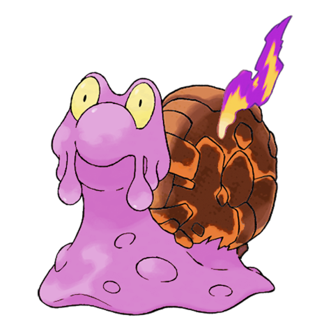

# #219 Magcargo (Lava Pokémon)

| Official Artwork | Shiny Artwork |
|------------------|---------------|
|  |  |

Its body temperature is roughly 18,000 degrees F. Flames spout from gaps in its hardened shell.

---

## Media

### Default Sprites

| Front | Shiny | Back | Shiny |
|-------|-------|------|-------|
|  |  |  |  |

### Cries

Latest (Gen VI+):

<audio controls>
<source src='../../assets/cries/magcargo/latest.ogg' type='audio/ogg'>
  Your browser does not support the audio element.
</audio>

Legacy:

<audio controls>
<source src='../../assets/cries/magcargo/legacy.ogg' type='audio/ogg'>
  Your browser does not support the audio element.
</audio>

---

## Pokédex Data

| National № | Type(s) | Height | Weight | Abilities | Local № |
|------------|---------|--------|--------|-----------|---------|
| #219 | {: width="48"} {: width="48"} | 0.8 m / 2.6 ft | 55.0 kg / 121.3 lbs | 1. Solid Rock 2. Flame Body | N/A |

---

## Base Stats
|   | HP | Attack | Defense | Sp. Atk | Sp. Def | Speed |
|---|----|--------|---------|---------|---------|-------|
| **Base** | 60 | 50 | 135 | 115 | 115 | 30 |
| **Min** | 230 | 94 | 247 | 211 | 211 | 58 |
| **Max** | 324 | 218 | 405 | 361 | 361 | 174 |

The ranges shown above are for a level 100 Pokémon. Maximum values are based on a beneficial nature, 252 EVs, 31 IVs; minimum values are based on a hindering nature, 0 EVs, 0 IVs.

---

## Forms & Evolutions

!!! warning "WARNING"

    Information on evolutions may not be 100% accurate; differences between evolution methods across generations are not accounted for.

### Forms

Magcargo has no alternate forms.

### Evolution Line

1. [Slugma](slugma.md/)
    1. Level Up: [Magcargo](magcargo.md/)

---

## Training

| EV Yield | Catch Rate | Base Friendship | Base Exp. | Growth Rate | Held Items |
|----------|------------|-----------------|-----------|-------------|------------|
| 2 Def | 75 | 70 | 151 | Medium | Flame Orb (50%) |

---

## Breeding

| Egg Groups | Egg Cycles | Gender | Dimorphic | Color | Shape |
|------------|------------|--------|-----------|-------|-------|
| 1. Indeterminate | 20 | 50.0% Male 50.0% Female | False | Red | Squiggle |

---

## Moves

!!! warning "WARNING"

    Specific move information may be incorrect. However, the general movepool should be accurate; this includes changes made in Blaze Black and Volt White.

### Level Up Moves

| Lv. | Move | Type | Cat. | Power | Acc. | PP |
| --- | --- | --- | --- | --- | --- | --- |
| 1 | Ember | {: width="48"} | {: width="36"} | 40 | 100 | 25 |
| 1 | Rock Throw | {: width="48"} | {: width="36"} | 50 | 90 | 15 |
| 1 | Smog | {: width="48"} | {: width="36"} | 30 | 70 | 20 |
| 1 | Yawn | {: width="48"} | {: width="36"} | — | — | 10 |
| 5 | Ember | {: width="48"} | {: width="36"} | 40 | 100 | 25 |
| 10 | Rock Throw | {: width="48"} | {: width="36"} | 50 | 90 | 15 |
| 14 | Harden | {: width="48"} | {: width="36"} | — | — | 30 |
| 19 | Recover | {: width="48"} | {: width="36"} | — | — | 5 |
| 23 | Flame Burst | {: width="48"} | {: width="36"} | 70 | 100 | 15 |
| 28 | Ancient Power | {: width="48"} | {: width="36"} | 60 | 100 | 5 |
| 32 | Amnesia | {: width="48"} | {: width="36"} | — | — | 20 |
| 37 | Lava Plume | {: width="48"} | {: width="36"} | 80 | 100 | 15 |
| 38 | Shell Smash | {: width="48"} | {: width="36"} | — | — | 15 |
| 44 | Rock Slide | {: width="48"} | {: width="36"} | 75 | 90 | 10 |
| 52 | Body Slam | {: width="48"} | {: width="36"} | 85 | 100 | 15 |
| 59 | Flamethrower | {: width="48"} | {: width="36"} | 90 | 100 | 15 |
| 67 | Earth Power | {: width="48"} | {: width="36"} | 90 | 100 | 10 |
| 74 | Power Gem | {: width="48"} | {: width="36"} | 90 | 100 | 20 |

### TM Moves

| TM | Move | Type | Cat. | Power | Acc. | PP |
| --- | --- | --- | --- | --- | --- | --- |
| HM04 | Strength | {: width="48"} | {: width="36"} | 100 | 100 | 15 |
| TM06 | Toxic | {: width="48"} | {: width="36"} | — | 90 | 10 |
| TM10 | Hidden Power | {: width="48"} | {: width="36"} | 60 | 100 | 15 |
| TM11 | Sunny Day | {: width="48"} | {: width="36"} | — | — | 5 |
| TM15 | Hyper Beam | {: width="48"} | {: width="36"} | 150 | 90 | 5 |
| TM16 | Light Screen | {: width="48"} | {: width="36"} | — | — | 30 |
| TM17 | Protect | {: width="48"} | {: width="36"} | — | — | 10 |
| TM21 | Frustration | {: width="48"} | {: width="36"} | — | 100 | 20 |
| TM22 | Solar Beam | {: width="48"} | {: width="36"} | 120 | 100 | 10 |
| TM23 | Smack Down | {: width="48"} | {: width="36"} | 50 | 100 | 15 |
| TM26 | Earthquake | {: width="48"} | {: width="36"} | 100 | 100 | 10 |
| TM27 | Return | {: width="48"} | {: width="36"} | — | 100 | 20 |
| TM32 | Double Team | {: width="48"} | {: width="36"} | — | — | 15 |
| TM33 | Reflect | {: width="48"} | {: width="36"} | — | — | 20 |
| TM35 | Flamethrower | {: width="48"} | {: width="36"} | 90 | 100 | 15 |
| TM37 | Sandstorm | {: width="48"} | {: width="36"} | — | — | 10 |
| TM38 | Fire Blast | {: width="48"} | {: width="36"} | 110 | 85 | 5 |
| TM39 | Rock Tomb | {: width="48"} | {: width="36"} | 60 | 95 | 15 |
| TM42 | Facade | {: width="48"} | {: width="36"} | 70 | 100 | 20 |
| TM43 | Flame Charge | {: width="48"} | {: width="36"} | 50 | 100 | 20 |
| TM44 | Rest | {: width="48"} | {: width="36"} | — | — | 5 |
| TM45 | Attract | {: width="48"} | {: width="36"} | — | 100 | 15 |
| TM48 | Round | {: width="48"} | {: width="36"} | 60 | 100 | 15 |
| TM50 | Overheat | {: width="48"} | {: width="36"} | 130 | 90 | 5 |
| TM59 | Incinerate | {: width="48"} | {: width="36"} | 50 | 100 | 15 |
| TM61 | Will O Wisp | {: width="48"} | {: width="36"} | — | 85 | 15 |
| TM64 | Explosion | {: width="48"} | {: width="36"} | 250 | 100 | 5 |
| TM68 | Giga Impact | {: width="48"} | {: width="36"} | 150 | 90 | 5 |
| TM69 | Rock Polish | {: width="48"} | {: width="36"} | — | — | 20 |
| TM71 | Stone Edge | {: width="48"} | {: width="36"} | 100 | 80 | 5 |
| TM74 | Gyro Ball | {: width="48"} | {: width="36"} | — | 100 | 5 |
| TM78 | Bulldoze | {: width="48"} | {: width="36"} | 80 | 100 | 20 |
| TM80 | Rock Slide | {: width="48"} | {: width="36"} | 75 | 90 | 10 |
| TM87 | Swagger | {: width="48"} | {: width="36"} | — | 85 | 15 |
| TM90 | Substitute | {: width="48"} | {: width="36"} | — | — | 10 |
| TM94 | Rock Smash | {: width="48"} | {: width="36"} | 60 | 100 | 15 |

### Egg Moves

Magcargo cannot learn any moves by breeding.
### Tutor Moves

Magcargo cannot learn any moves from tutors.
