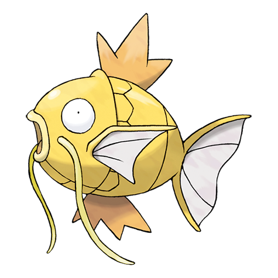

# #129 Magikarp (Fish Pokémon)

| Official Artwork | Shiny Artwork |
|------------------|---------------|
|  |  |

A Magikarp living for many years can leap a mountain using Splash. The move remains useless, though.

---

## Media

### Default Sprites

| Front | Shiny | Back | Shiny |
|-------|-------|------|-------|
|  |  |  |  |

### Female Sprites

| Front | Shiny | Back | Shiny |
|-------|-------|------|-------|
|  |  |  |  |

### Cries

Latest (Gen VI+):

<audio controls>
<source src='../../assets/cries/magikarp/latest.ogg' type='audio/ogg'>
  Your browser does not support the audio element.
</audio>

Legacy:

<audio controls>
<source src='../../assets/cries/magikarp/legacy.ogg' type='audio/ogg'>
  Your browser does not support the audio element.
</audio>

---

## Pokédex Data

| National № | Type(s) | Height | Weight | Abilities | Local № |
|------------|---------|--------|--------|-----------|---------|
| #129 | {: width="48"} | 0.9 m / 3.0 ft | 10.0 kg / 22.0 lbs | 1. Swift Swim 2. Rattled | #23 |

---

## Base Stats
|   | HP | Attack | Defense | Sp. Atk | Sp. Def | Speed |
|---|----|--------|---------|---------|---------|-------|
| **Base** | 20 | 10 | 55 | 15 | 20 | 80 |
| **Min** | 150 | 22 | 103 | 31 | 40 | 148 |
| **Max** | 244 | 130 | 229 | 141 | 152 | 284 |

The ranges shown above are for a level 100 Pokémon. Maximum values are based on a beneficial nature, 252 EVs, 31 IVs; minimum values are based on a hindering nature, 0 EVs, 0 IVs.

---

## Forms & Evolutions

!!! warning "WARNING"

    Information on evolutions may not be 100% accurate; differences between evolution methods across generations are not accounted for.

### Forms

Magikarp has no alternate forms.

### Evolution Line

1. [Magikarp](magikarp.md/)
    1. Level Up: [Gyarados](gyarados.md/)

---

## Training

| EV Yield | Catch Rate | Base Friendship | Base Exp. | Growth Rate | Held Items |
|----------|------------|-----------------|-----------|-------------|------------|
| 1 Spd | 255 | 50 | 40 | Slow | N/A |

---

## Breeding

| Egg Groups | Egg Cycles | Gender | Dimorphic | Color | Shape |
|------------|------------|--------|-----------|-------|-------|
| 1. Water2 2. Dragon | 5 | 50.0% Male 50.0% Female | True | Red | Fish |

---

## Moves

!!! warning "WARNING"

    Specific move information may be incorrect. However, the general movepool should be accurate; this includes changes made in Blaze Black and Volt White.

### Level Up Moves

| Lv. | Move | Type | Cat. | Power | Acc. | PP |
| --- | --- | --- | --- | --- | --- | --- |
| 1 | Bounce | {: width="48"} | {: width="36"} | 85 | 85 | 5 |
| 1 | Bubble | {: width="48"} | {: width="36"} | 40 | 100 | 30 |
| 1 | Reversal | {: width="48"} | {: width="36"} | — | 100 | 15 |
| 1 | Splash | {: width="48"} | {: width="36"} | — | — | 40 |
| 15 | Tackle | {: width="48"} | {: width="36"} | 40 | 100 | 35 |
| 30 | Flail | {: width="48"} | {: width="36"} | — | 100 | 15 |

### TM Moves

Magikarp cannot learn any TM moves.
### Egg Moves

Magikarp cannot learn any moves by breeding.
### Tutor Moves

Magikarp cannot learn any moves from tutors.
