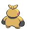
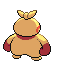

# #296 Makuhita (Guts Pokémon)

| Official Artwork | Shiny Artwork |
|------------------|---------------|
|  |  |

It toughens its body by slamming into thick trees. Many snapped trees can be found near its nest.

---

## Media

### Default Sprites

| Front | Shiny | Back | Shiny |
|-------|-------|------|-------|
|  |  |  |  |

### Cries

Latest (Gen VI+):

<audio controls>
<source src='../../assets/cries/makuhita/latest.ogg' type='audio/ogg'>
  Your browser does not support the audio element.
</audio>

Legacy:

<audio controls>
<source src='../../assets/cries/makuhita/legacy.ogg' type='audio/ogg'>
  Your browser does not support the audio element.
</audio>

---

## Pokédex Data

| National № | Type(s) | Height | Weight | Abilities | Local № |
|------------|---------|--------|--------|-----------|---------|
| #296 | {: width="48"} | 1.0 m / 3.3 ft | 86.4 kg / 190.5 lbs | 1. Thick Fat 2. Sheer Force | N/A |

---

## Base Stats
|   | HP | Attack | Defense | Sp. Atk | Sp. Def | Speed |
|---|----|--------|---------|---------|---------|-------|
| **Base** | 72 | 60 | 30 | 20 | 30 | 25 |
| **Min** | 254 | 112 | 58 | 40 | 58 | 49 |
| **Max** | 348 | 240 | 174 | 152 | 174 | 163 |

The ranges shown above are for a level 100 Pokémon. Maximum values are based on a beneficial nature, 252 EVs, 31 IVs; minimum values are based on a hindering nature, 0 EVs, 0 IVs.

---

## Forms & Evolutions

!!! warning "WARNING"

    Information on evolutions may not be 100% accurate; differences between evolution methods across generations are not accounted for.

### Forms

Makuhita has no alternate forms.

### Evolution Line

1. [Makuhita](makuhita.md/)
    1. Level Up: [Hariyama](hariyama.md/)

---

## Training

| EV Yield | Catch Rate | Base Friendship | Base Exp. | Growth Rate | Held Items |
|----------|------------|-----------------|-----------|-------------|------------|
| 1 HP | 180 | 70 | 47 | Fast Then Very Slo |

---

## Breeding

| Egg Groups | Egg Cycles | Gender | Dimorphic | Color | Shape |
|------------|------------|--------|-----------|-------|-------|
| 1. Humanshape | 20 | 75.0% Male 25.0% Female | False | Yellow | Humanoid |

---

## Moves

!!! warning "WARNING"

    Specific move information may be incorrect. However, the general movepool should be accurate; this includes changes made in Blaze Black and Volt White.

### Level Up Moves

| Lv. | Move | Type | Cat. | Power | Acc. | PP |
| --- | --- | --- | --- | --- | --- | --- |
| 1 | Focus Energy | {: width="48"} | {: width="36"} | — | — | 30 |
| 1 | Tackle | {: width="48"} | {: width="36"} | 40 | 100 | 35 |
| 4 | Sand Attack | {: width="48"} | {: width="36"} | — | 100 | 15 |
| 7 | Arm Thrust | {: width="48"} | {: width="36"} | 25 | 100 | 20 |
| 10 | Vital Throw | {: width="48"} | {: width="36"} | 70 | — | 10 |
| 13 | Fake Out | {: width="48"} | {: width="36"} | 40 | 100 | 10 |
| 16 | Whirlwind | {: width="48"} | {: width="36"} | — | — | 20 |
| 19 | Knock Off | {: width="48"} | {: width="36"} | 65 | 100 | 20 |
| 22 | Smelling Salts | {: width="48"} | {: width="36"} | 70 | 100 | 10 |
| 25 | Belly Drum | {: width="48"} | {: width="36"} | — | — | 10 |
| 28 | Force Palm | {: width="48"} | {: width="36"} | 60 | 100 | 10 |
| 31 | Seismic Toss | {: width="48"} | {: width="36"} | — | 100 | 20 |
| 34 | Wake Up Slap | {: width="48"} | {: width="36"} | 70 | 100 | 10 |
| 37 | Endure | {: width="48"} | {: width="36"} | — | — | 10 |
| 40 | Close Combat | {: width="48"} | {: width="36"} | 120 | 100 | 5 |
| 43 | Reversal | {: width="48"} | {: width="36"} | — | 100 | 15 |
| 46 | Heavy Slam | {: width="48"} | {: width="36"} | — | 100 | 10 |
| 49 | Cross Chop | {: width="48"} | {: width="36"} | 100 | 80 | 5 |

### TM Moves

| TM | Move | Type | Cat. | Power | Acc. | PP |
| --- | --- | --- | --- | --- | --- | --- |
| HM03 | Surf | {: width="48"} | {: width="36"} | 90 | 100 | 15 |
| HM04 | Strength | {: width="48"} | {: width="36"} | 100 | 100 | 15 |
| TM06 | Toxic | {: width="48"} | {: width="36"} | — | 90 | 10 |
| TM08 | Bulk Up | {: width="48"} | {: width="36"} | — | — | 20 |
| TM10 | Hidden Power | {: width="48"} | {: width="36"} | 60 | 100 | 15 |
| TM11 | Sunny Day | {: width="48"} | {: width="36"} | — | — | 5 |
| TM17 | Protect | {: width="48"} | {: width="36"} | — | — | 10 |
| TM18 | Rain Dance | {: width="48"} | {: width="36"} | — | — | 5 |
| TM21 | Frustration | {: width="48"} | {: width="36"} | — | 100 | 20 |
| TM23 | Smack Down | {: width="48"} | {: width="36"} | 50 | 100 | 15 |
| TM26 | Earthquake | {: width="48"} | {: width="36"} | 100 | 100 | 10 |
| TM27 | Return | {: width="48"} | {: width="36"} | — | 100 | 20 |
| TM28 | Dig | {: width="48"} | {: width="36"} | 100 | 100 | 10 |
| TM31 | Brick Break | {: width="48"} | {: width="36"} | 75 | 100 | 15 |
| TM32 | Double Team | {: width="48"} | {: width="36"} | — | — | 15 |
| TM39 | Rock Tomb | {: width="48"} | {: width="36"} | 60 | 95 | 15 |
| TM42 | Facade | {: width="48"} | {: width="36"} | 70 | 100 | 20 |
| TM44 | Rest | {: width="48"} | {: width="36"} | — | — | 5 |
| TM45 | Attract | {: width="48"} | {: width="36"} | — | 100 | 15 |
| TM47 | Low Sweep | {: width="48"} | {: width="36"} | 65 | 100 | 20 |
| TM48 | Round | {: width="48"} | {: width="36"} | 60 | 100 | 15 |
| TM52 | Focus Blast | {: width="48"} | {: width="36"} | 120 | 70 | 5 |
| TM56 | Fling | {: width="48"} | {: width="36"} | — | 100 | 10 |
| TM67 | Retaliate | {: width="48"} | {: width="36"} | 70 | 100 | 5 |
| TM78 | Bulldoze | {: width="48"} | {: width="36"} | 80 | 100 | 20 |
| TM80 | Rock Slide | {: width="48"} | {: width="36"} | 75 | 90 | 10 |
| TM83 | Work Up | {: width="48"} | {: width="36"} | — | — | 30 |
| TM84 | Poison Jab | {: width="48"} | {: width="36"} | 80 | 100 | 20 |
| TM87 | Swagger | {: width="48"} | {: width="36"} | — | 85 | 15 |
| TM90 | Substitute | {: width="48"} | {: width="36"} | — | — | 10 |
| TM94 | Rock Smash | {: width="48"} | {: width="36"} | 60 | 100 | 15 |

### Egg Moves

| Move | Type | Cat. | Power | Acc. | PP |
| --- | --- | --- | --- | --- | --- |
| Counter | {: width="48"} | {: width="36"} | — | 100 | 20 |
| Feint Attack | {: width="48"} | {: width="36"} | 60 | — | 20 |
| Foresight | {: width="48"} | {: width="36"} | — | — | 40 |
| Detect | {: width="48"} | {: width="36"} | — | — | 5 |
| Dynamic Punch | {: width="48"} | {: width="36"} | 100 | 50 | 5 |
| Cross Chop | {: width="48"} | {: width="36"} | 100 | 80 | 5 |
| Focus Punch | {: width="48"} | {: width="36"} | 150 | 100 | 20 |
| Helping Hand | {: width="48"} | {: width="36"} | — | — | 20 |
| Revenge | {: width="48"} | {: width="36"} | 60 | 100 | 10 |
| Wake Up Slap | {: width="48"} | {: width="36"} | 70 | 100 | 10 |
| Feint | {: width="48"} | {: width="36"} | 30 | 100 | 10 |
| Bullet Punch | {: width="48"} | {: width="36"} | 40 | 100 | 30 |
| Wide Guard | {: width="48"} | {: width="36"} | — | — | 10 |
| Chip Away | {: width="48"} | {: width="36"} | 70 | 100 | 20 |

### Tutor Moves

Makuhita cannot learn any moves from tutors.
