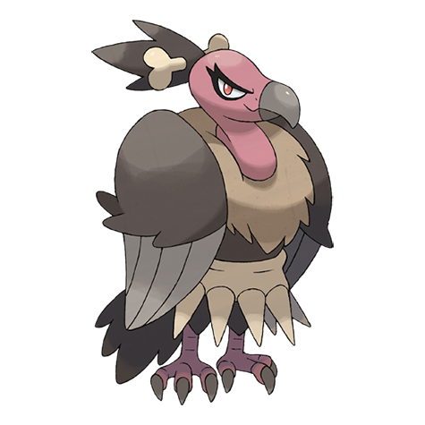
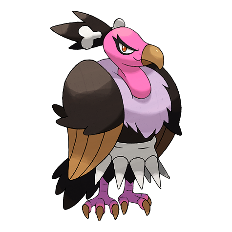
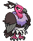
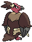
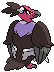

# #630 Mandibuzz (Bone Vulture Pokémon)

| Official Artwork | Shiny Artwork |
|------------------|---------------|
|  |  |

**Blaze Black:** It makes a nest out of bones it finds. It grabs weakened prey in its talons and hauls it to its nest of bones.

**Volt White:** Watching from the sky, they swoop to strike weakened Pokémon on the ground. They decorate themselves with bones.

---

## Media

### Default Sprites

| Front | Shiny | Back | Shiny |
|-------|-------|------|-------|
|  |  |  |  |

### Cries

Latest (Gen VI+):

<audio controls>
<source src='../../assets/cries/mandibuzz/latest.ogg' type='audio/ogg'>
  Your browser does not support the audio element.
</audio>

Legacy:

<audio controls>
<source src='../../assets/cries/mandibuzz/legacy.ogg' type='audio/ogg'>
  Your browser does not support the audio element.
</audio>

---

## Pokédex Data

| National № | Type(s) | Height | Weight | Abilities | Local № |
|------------|---------|--------|--------|-----------|---------|
| #630 | {: width="48"} {: width="48"} | 1.2 m / 3.9 ft | 39.5 kg / 87.1 lbs | 1. Big Pecks 2. Overcoat | N/A |

---

## Base Stats
|   | HP | Attack | Defense | Sp. Atk | Sp. Def | Speed |
|---|----|--------|---------|---------|---------|-------|
| **Base** | 110 | 65 | 105 | 55 | 95 | 80 |
| **Min** | 330 | 121 | 193 | 103 | 175 | 148 |
| **Max** | 424 | 251 | 339 | 229 | 317 | 284 |

The ranges shown above are for a level 100 Pokémon. Maximum values are based on a beneficial nature, 252 EVs, 31 IVs; minimum values are based on a hindering nature, 0 EVs, 0 IVs.

---

## Forms & Evolutions

!!! warning "WARNING"

    Information on evolutions may not be 100% accurate; differences between evolution methods across generations are not accounted for.

### Forms

Mandibuzz has no alternate forms.

### Evolution Line

1. [Vullaby](vullaby.md/)
    1. Level Up: [Mandibuzz](mandibuzz.md/)

### Evolution Changes

1. Level 39 [Vullaby]

---

## Training

| EV Yield | Catch Rate | Base Friendship | Base Exp. | Growth Rate | Held Items |
|----------|------------|-----------------|-----------|-------------|------------|
| 2 Sp. Atk | 60 | 35 | 179 | Slow | N/A |

---

## Breeding

| Egg Groups | Egg Cycles | Gender | Dimorphic | Color | Shape |
|------------|------------|--------|-----------|-------|-------|
| 1. Flying | 20 | 0.0% Male 100.0% Female | False | Brown | Wings |

---

## Moves

!!! warning "WARNING"

    Specific move information may be incorrect. However, the general movepool should be accurate; this includes changes made in Blaze Black and Volt White.

### Level Up Moves

| Lv. | Move | Type | Cat. | Power | Acc. | PP |
| --- | --- | --- | --- | --- | --- | --- |
| 1 | Fury Attack | {: width="48"} | {: width="36"} | 15 | 85 | 20 |
| 1 | Gust | {: width="48"} | {: width="36"} | 40 | 100 | 35 |
| 1 | Heat Wave | {: width="48"} | {: width="36"} | 95 | 90 | 10 |
| 1 | Leer | {: width="48"} | {: width="36"} | — | 100 | 30 |
| 1 | Pluck | {: width="48"} | {: width="36"} | 60 | 100 | 20 |
| 1 | Roost | {: width="48"} | {: width="36"} | — | — | 5 |
| 5 | Fury Attack | {: width="48"} | {: width="36"} | 15 | 85 | 20 |
| 10 | Pluck | {: width="48"} | {: width="36"} | 60 | 100 | 20 |
| 14 | Nasty Plot | {: width="48"} | {: width="36"} | — | — | 20 |
| 19 | Flatter | {: width="48"} | {: width="36"} | — | 100 | 15 |
| 23 | Feint Attack | {: width="48"} | {: width="36"} | 60 | — | 20 |
| 28 | Punishment | {: width="48"} | {: width="36"} | — | 100 | 5 |
| 32 | Defog | {: width="48"} | {: width="36"} | — | — | 15 |
| 37 | Tailwind | {: width="48"} | {: width="36"} | — | — | 15 |
| 44 | Air Slash | {: width="48"} | {: width="36"} | 75 | 95 | 15 |
| 48 | Dark Pulse | {: width="48"} | {: width="36"} | 90 | 100 | 15 |
| 52 | Embargo | {: width="48"} | {: width="36"} | — | 100 | 15 |
| 55 | Bone Rush | {: width="48"} | {: width="36"} | 25 | 90 | 10 |
| 57 | Whirlwind | {: width="48"} | {: width="36"} | — | — | 20 |
| 63 | Brave Bird | {: width="48"} | {: width="36"} | 120 | 100 | 15 |
| 70 | Mirror Move | {: width="48"} | {: width="36"} | — | — | 20 |

### TM Moves

| TM | Move | Type | Cat. | Power | Acc. | PP |
| --- | --- | --- | --- | --- | --- | --- |
| HM01 | Cut | {: width="48"} | {: width="36"} | 60 | 100% | 25 |
| HM02 | Fly | {: width="48"} | {: width="36"} | 100 | 100% | 15 |
| TM06 | Toxic | {: width="48"} | {: width="36"} | — | 90 | 10 |
| TM10 | Hidden Power | {: width="48"} | {: width="36"} | 60 | 100 | 15 |
| TM11 | Sunny Day | {: width="48"} | {: width="36"} | — | — | 5 |
| TM12 | Taunt | {: width="48"} | {: width="36"} | — | 100 | 20 |
| TM15 | Hyper Beam | {: width="48"} | {: width="36"} | 150 | 90 | 5 |
| TM17 | Protect | {: width="48"} | {: width="36"} | — | — | 10 |
| TM18 | Rain Dance | {: width="48"} | {: width="36"} | — | — | 5 |
| TM21 | Frustration | {: width="48"} | {: width="36"} | — | 100 | 20 |
| TM27 | Return | {: width="48"} | {: width="36"} | — | 100 | 20 |
| TM30 | Shadow Ball | {: width="48"} | {: width="36"} | 90 | 100 | 15 |
| TM32 | Double Team | {: width="48"} | {: width="36"} | — | — | 15 |
| TM39 | Rock Tomb | {: width="48"} | {: width="36"} | 60 | 95 | 15 |
| TM40 | Aerial Ace | {: width="48"} | {: width="36"} | 60 | — | 20 |
| TM41 | Torment | {: width="48"} | {: width="36"} | — | 100 | 15 |
| TM42 | Facade | {: width="48"} | {: width="36"} | 70 | 100 | 20 |
| TM44 | Rest | {: width="48"} | {: width="36"} | — | — | 5 |
| TM45 | Attract | {: width="48"} | {: width="36"} | — | 100 | 15 |
| TM46 | Thief | {: width="48"} | {: width="36"} | 60 | 100 | 25 |
| TM48 | Round | {: width="48"} | {: width="36"} | 60 | 100 | 15 |
| TM59 | Incinerate | {: width="48"} | {: width="36"} | 50 | 100 | 15 |
| TM63 | Embargo | {: width="48"} | {: width="36"} | — | 100 | 15 |
| TM66 | Payback | {: width="48"} | {: width="36"} | 50 | 100 | 10 |
| TM67 | Retaliate | {: width="48"} | {: width="36"} | 70 | 100 | 5 |
| TM68 | Giga Impact | {: width="48"} | {: width="36"} | 150 | 90 | 5 |
| TM77 | Psych Up | {: width="48"} | {: width="36"} | — | — | 10 |
| TM87 | Swagger | {: width="48"} | {: width="36"} | — | 85 | 15 |
| TM88 | Pluck | {: width="48"} | {: width="36"} | 60 | 100 | 20 |
| TM89 | U Turn | {: width="48"} | {: width="36"} | 70 | 100 | 20 |
| TM90 | Substitute | {: width="48"} | {: width="36"} | — | — | 10 |
| TM94 | Rock Smash | {: width="48"} | {: width="36"} | 60 | 100 | 15 |
| TM95 | Snarl | {: width="48"} | {: width="36"} | 60 | 95 | 15 |

### Egg Moves

Mandibuzz cannot learn any moves by breeding.
### Tutor Moves

Mandibuzz cannot learn any moves from tutors.
