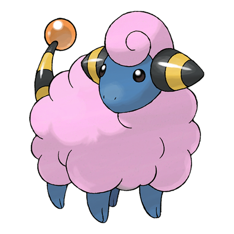
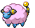
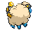
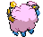

# #179 Mareep (Wool Pokémon)

| Official Artwork | Shiny Artwork |
|------------------|---------------|
|  |  |

Its fluffy coat swells to double when static electricity builds up. Touching it can be shocking.

---

## Media

### Default Sprites

| Front | Shiny | Back | Shiny |
|-------|-------|------|-------|
|  |  |  |  |

### Cries

Latest (Gen VI+):

<audio controls>
<source src='../../assets/cries/mareep/latest.ogg' type='audio/ogg'>
  Your browser does not support the audio element.
</audio>

Legacy:

<audio controls>
<source src='../../assets/cries/mareep/legacy.ogg' type='audio/ogg'>
  Your browser does not support the audio element.
</audio>

---

## Pokédex Data

| National № | Type(s) | Height | Weight | Abilities | Local № |
|------------|---------|--------|--------|-----------|---------|
| #179 | {: width="48"} | 0.6 m / 2.0 ft | 7.8 kg / 17.2 lbs | 1. Static 2. Overcoat | N/A |

---

## Base Stats
|   | HP | Attack | Defense | Sp. Atk | Sp. Def | Speed |
|---|----|--------|---------|---------|---------|-------|
| **Base** | 55 | 40 | 40 | 65 | 45 | 35 |
| **Min** | 220 | 76 | 76 | 121 | 85 | 67 |
| **Max** | 314 | 196 | 196 | 251 | 207 | 185 |

The ranges shown above are for a level 100 Pokémon. Maximum values are based on a beneficial nature, 252 EVs, 31 IVs; minimum values are based on a hindering nature, 0 EVs, 0 IVs.

---

## Forms & Evolutions

!!! warning "WARNING"

    Information on evolutions may not be 100% accurate; differences between evolution methods across generations are not accounted for.

### Forms

Mareep has no alternate forms.

### Evolution Line

1. [Mareep](mareep.md/)
    1. Level Up: [Flaaffy](flaaffy.md/)
        1. Level Up: [Ampharos](ampharos.md/)

---

## Training

| EV Yield | Catch Rate | Base Friendship | Base Exp. | Growth Rate | Held Items |
|----------|------------|-----------------|-----------|-------------|------------|
| 1 Sp. Atk | 235 | 70 | 56 | Medium Slow | N/A |

---

## Breeding

| Egg Groups | Egg Cycles | Gender | Dimorphic | Color | Shape |
|------------|------------|--------|-----------|-------|-------|
| 1. Monster 2. Ground | 20 | 50.0% Male 50.0% Female | False | White | Quadruped |

---

## Moves

!!! warning "WARNING"

    Specific move information may be incorrect. However, the general movepool should be accurate; this includes changes made in Blaze Black and Volt White.

### Level Up Moves

| Lv. | Move | Type | Cat. | Power | Acc. | PP |
| --- | --- | --- | --- | --- | --- | --- |
| 1 | Charge | {: width="48"} | {: width="36"} | — | — | 20 |
| 1 | Tackle | {: width="48"} | {: width="36"} | 40 | 100 | 35 |
| 5 | Growl | {: width="48"} | {: width="36"} | — | 100 | 40 |
| 10 | Thunder Shock | {: width="48"} | {: width="36"} | 40 | 100 | 30 |
| 14 | Thunder Wave | {: width="48"} | {: width="36"} | — | 90 | 20 |
| 16 | Shock Wave | {: width="48"} | {: width="36"} | 70 | — | 20 |
| 19 | Cotton Spore | {: width="48"} | {: width="36"} | — | 100 | 40 |
| 28 | Electro Ball | {: width="48"} | {: width="36"} | — | 100 | 10 |
| 32 | Cotton Guard | {: width="48"} | {: width="36"} | — | — | 10 |
| 37 | Discharge | {: width="48"} | {: width="36"} | 80 | 100 | 15 |
| 41 | Signal Beam | {: width="48"} | {: width="36"} | 75 | 100 | 15 |
| 46 | Light Screen | {: width="48"} | {: width="36"} | — | — | 30 |
| 50 | Power Gem | {: width="48"} | {: width="36"} | 90 | 100 | 20 |
| 55 | Thunder | {: width="48"} | {: width="36"} | 110 | 70 | 10 |
| 60 | Zap Cannon | {: width="48"} | {: width="36"} | 120 | 50 | 5 |

### TM Moves

| TM | Move | Type | Cat. | Power | Acc. | PP |
| --- | --- | --- | --- | --- | --- | --- |
| TM06 | Toxic | {: width="48"} | {: width="36"} | — | 90 | 10 |
| TM10 | Hidden Power | {: width="48"} | {: width="36"} | 60 | 100 | 15 |
| TM16 | Light Screen | {: width="48"} | {: width="36"} | — | — | 30 |
| TM17 | Protect | {: width="48"} | {: width="36"} | — | — | 10 |
| TM18 | Rain Dance | {: width="48"} | {: width="36"} | — | — | 5 |
| TM20 | Safeguard | {: width="48"} | {: width="36"} | — | — | 25 |
| TM21 | Frustration | {: width="48"} | {: width="36"} | — | 100 | 20 |
| TM24 | Thunderbolt | {: width="48"} | {: width="36"} | 90 | 100 | 15 |
| TM25 | Thunder | {: width="48"} | {: width="36"} | 110 | 70 | 10 |
| TM27 | Return | {: width="48"} | {: width="36"} | — | 100 | 20 |
| TM32 | Double Team | {: width="48"} | {: width="36"} | — | — | 15 |
| TM42 | Facade | {: width="48"} | {: width="36"} | 70 | 100 | 20 |
| TM44 | Rest | {: width="48"} | {: width="36"} | — | — | 5 |
| TM45 | Attract | {: width="48"} | {: width="36"} | — | 100 | 15 |
| TM48 | Round | {: width="48"} | {: width="36"} | 60 | 100 | 15 |
| TM49 | Echoed Voice | {: width="48"} | {: width="36"} | 40 | 100 | 15 |
| TM57 | Charge Beam | {: width="48"} | {: width="36"} | 50 | 90 | 10 |
| TM70 | Flash | {: width="48"} | {: width="36"} | — | 100 | 20 |
| TM73 | Thunder Wave | {: width="48"} | {: width="36"} | — | 90 | 20 |
| TM87 | Swagger | {: width="48"} | {: width="36"} | — | 85 | 15 |
| TM90 | Substitute | {: width="48"} | {: width="36"} | — | — | 10 |
| TM93 | Wild Charge | {: width="48"} | {: width="36"} | 90 | 100 | 15 |

### Egg Moves

| Move | Type | Cat. | Power | Acc. | PP |
| --- | --- | --- | --- | --- | --- |
| Sand Attack | {: width="48"} | {: width="36"} | — | 100 | 15 |
| Body Slam | {: width="48"} | {: width="36"} | 85 | 100 | 15 |
| Take Down | {: width="48"} | {: width="36"} | 90 | 85 | 20 |
| Agility | {: width="48"} | {: width="36"} | — | — | 30 |
| Screech | {: width="48"} | {: width="36"} | — | 85 | 40 |
| Iron Tail | {: width="48"} | {: width="36"} | 100 | 75 | 15 |
| Flatter | {: width="48"} | {: width="36"} | — | 100 | 15 |
| Charge | {: width="48"} | {: width="36"} | — | — | 20 |
| Odor Sleuth | {: width="48"} | {: width="36"} | — | — | 40 |
| After You | {: width="48"} | {: width="36"} | — | — | 15 |

### Tutor Moves

Mareep cannot learn any moves from tutors.
