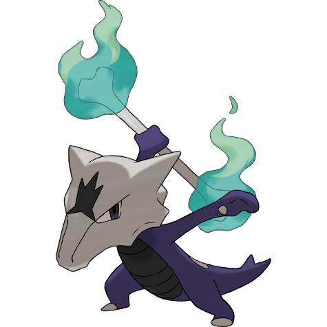
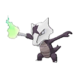
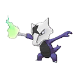

# #10149 Marowak Totem (Bone Keeper Pokémon)

| Official Artwork | Shiny Artwork |
| --- | --- |
|  |  |

From its birth, this savage Pokémon constantly holds bones. It is skilled in using them as weapons.

---

## Media

### Sprites

| Front | Front Shiny |
| --- | --- |
|  |  |

### Cries

Latest (Gen VI+):

<audio controls>
  <source src='../assets/cries/marowak-totem/latest.ogg' type='audio/ogg'>
  Your browser does not support the audio element.
</audio>

---

## Pokédex Data

| National № | Type(s) | Height | Weight | Abilities | Local № |
|------------|---------|--------|--------|-----------|---------|
| #10149 | {: width='48'} {: width='48'} | 1.7 m | 98.0 kg | 1. Cursed-Body 2. Lightning-Rod 3. Rock-Head | #N/A |

---

## Base Stats
---

## Base Stats
|   | HP | Attack | Defense | Sp. Atk | Sp. Def | Speed |
|---|----|--------|---------|---------|---------|-------|
| **Base** | 60 | 80 | 110 | 50 | 80 | 45 |
| **Min** | 230 | 148 | 202 | 94 | 148 | 85 |
| **Max** | 324 | 284 | 350 | 218 | 284 | 207 |

The ranges shown above are for a level 100 Pokémon. Maximum values are based on a beneficial nature, 252 EVs, 31 IVs; minimum values are based on a hindering nature, 0 EVs, 0 IVs.

---

## Forms & Evolutions

!!! warning "WARNING"

    Some forms may not be available in Blaze Black/Volt White. Also information on evolutions may not be 100% accurate; it is currently quite complex to track generational evolution data.

### Forms

1. [Marowak](marowak.md/)
2. [Marowak-Alola](marowak-alola.md/)
3. [Marowak-Totem](marowak-totem.md/)

### Evolution Line

1. [Cubone](cubone.md/)
1. Level Up: [Marowak](marowak.md/)

---

## Training

| EV Yield | Catch Rate | Base Friendship | Base Exp. | Growth Rate | Held Items |
|----------|------------|-----------------|-----------|-------------|------------|
| 2 Defense | 75 | 50 | 149 | Medium |  |

---

## Breeding

| Egg Groups | Egg Cycles | Gender | Dimorphic | Color | Shape |
|------------|------------|--------|-----------|-------|-------|
| 1. Monster | 20 | 50.0% Male 50.0% Female | False | Brown | Upright |

---

## Moves

!!! warning "WARNING"

    Specific move information may be incorrect. However, the general movepool should be accurate (including changes to learnset).

### Level Up Moves

Lv. | Move | Type | Cat. | Power | Acc. | PP
--- | --- | --- | --- | --- | --- | ---
| 1 | Bone Club | {: width='48'} | {: width='36'} | 65 | 85 | 20 |
| 1 | Flame Wheel | {: width='48'} | {: width='36'} | 75 | 100 | 25 |
| 1 | Growl | {: width='48'} | {: width='36'} | — | 100 | 40 |
| 1 | Tail Whip | {: width='48'} | {: width='36'} | — | 100 | 30 |
| 3 | Tail Whip | {: width='48'} | {: width='36'} | — | 100 | 30 |
| 7 | Bone Club | {: width='48'} | {: width='36'} | 65 | 85 | 20 |
| 11 | Flame Wheel | {: width='48'} | {: width='36'} | 75 | 100 | 25 |
| 13 | Leer | {: width='48'} | {: width='36'} | — | 100 | 30 |
| 17 | Hex | {: width='48'} | {: width='36'} | 65 | 100 | 10 |
| 21 | Bonemerang | {: width='48'} | {: width='36'} | 50 | 90 | 10 |
| 23 | Will O Wisp | {: width='48'} | {: width='36'} | — | 85 | 15 |
| 27 | Shadow Bone | {: width='48'} | {: width='36'} | 85 | 100 | 10 |
| 33 | Thrash | {: width='48'} | {: width='36'} | 120 | 100 | 10 |
| 37 | Fling | {: width='48'} | {: width='36'} | — | 100 | 10 |
| 43 | Stomping Tantrum | {: width='48'} | {: width='36'} | 75 | 100 | 10 |
| 49 | Endeavor | {: width='48'} | {: width='36'} | — | 100 | 5 |
| 53 | Flare Blitz | {: width='48'} | {: width='36'} | 120 | 100 | 15 |
| 59 | Retaliate | {: width='48'} | {: width='36'} | 70 | 100 | 5 |
| 65 | Bone Rush | {: width='48'} | {: width='36'} | 25 | 90 | 10 |

### TM Moves

TM | Move | Type | Cat. | Power | Acc. | PP
--- | --- | --- | --- | --- | --- | ---
| TM06 | Toxic | {: width='48'} | {: width='36'} | — | 90 | 10 |
| TM10 | Hidden Power | {: width='48'} | {: width='36'} | 60 | 100 | 15 |
| TM100 | Confide | {: width='48'} | {: width='36'} | — | — | 20 |
| TM11 | Sunny Day | {: width='48'} | {: width='36'} | — | — | 5 |
| TM13 | Ice Beam | {: width='48'} | {: width='36'} | 90 | 100 | 10 |
| TM14 | Blizzard | {: width='48'} | {: width='36'} | 110 | 70 | 5 |
| TM15 | Hyper Beam | {: width='48'} | {: width='36'} | 150 | 90 | 5 |
| TM17 | Protect | {: width='48'} | {: width='36'} | — | — | 10 |
| TM18 | Rain Dance | {: width='48'} | {: width='36'} | — | — | 5 |
| TM21 | Frustration | {: width='48'} | {: width='36'} | — | 100 | 20 |
| TM23 | Smack Down | {: width='48'} | {: width='36'} | 50 | 100 | 15 |
| TM24 | Thunderbolt | {: width='48'} | {: width='36'} | 90 | 100 | 15 |
| TM25 | Thunder | {: width='48'} | {: width='36'} | 110 | 70 | 10 |
| TM26 | Earthquake | {: width='48'} | {: width='36'} | 100 | 100 | 10 |
| TM27 | Return | {: width='48'} | {: width='36'} | — | 100 | 20 |
| TM30 | Shadow Ball | {: width='48'} | {: width='36'} | 90 | 100 | 15 |
| TM31 | Brick Break | {: width='48'} | {: width='36'} | 75 | 100 | 15 |
| TM32 | Double Team | {: width='48'} | {: width='36'} | — | — | 15 |
| TM35 | Flamethrower | {: width='48'} | {: width='36'} | 90 | 100 | 15 |
| TM37 | Sandstorm | {: width='48'} | {: width='36'} | — | — | 10 |
| TM38 | Fire Blast | {: width='48'} | {: width='36'} | 110 | 85 | 5 |
| TM39 | Rock Tomb | {: width='48'} | {: width='36'} | 60 | 95 | 15 |
| TM40 | Aerial Ace | {: width='48'} | {: width='36'} | 60 | — | 20 |
| TM42 | Facade | {: width='48'} | {: width='36'} | 70 | 100 | 20 |
| TM43 | Flame Charge | {: width='48'} | {: width='36'} | 50 | 100 | 20 |
| TM44 | Rest | {: width='48'} | {: width='36'} | — | — | 5 |
| TM45 | Attract | {: width='48'} | {: width='36'} | — | 100 | 15 |
| TM46 | Thief | {: width='48'} | {: width='36'} | 60 | 100 | 25 |
| TM48 | Round | {: width='48'} | {: width='36'} | 60 | 100 | 15 |
| TM49 | Echoed Voice | {: width='48'} | {: width='36'} | 40 | 100 | 15 |
| TM52 | Focus Blast | {: width='48'} | {: width='36'} | 120 | 70 | 5 |
| TM54 | False Swipe | {: width='48'} | {: width='36'} | 40 | 100 | 40 |
| TM56 | Fling | {: width='48'} | {: width='36'} | — | 100 | 10 |
| TM59 | Brutal Swing | {: width='48'} | {: width='36'} | 60 | 100 | 20 |
| TM61 | Will O Wisp | {: width='48'} | {: width='36'} | — | 85 | 15 |
| TM68 | Giga Impact | {: width='48'} | {: width='36'} | 150 | 90 | 5 |
| TM71 | Stone Edge | {: width='48'} | {: width='36'} | 100 | 80 | 5 |
| TM75 | Swords Dance | {: width='48'} | {: width='36'} | — | — | 20 |
| TM78 | Bulldoze | {: width='48'} | {: width='36'} | 80 | 100 | 20 |
| TM80 | Rock Slide | {: width='48'} | {: width='36'} | 80 | 95 | 10 |
| TM85 | Dream Eater | {: width='48'} | {: width='36'} | 100 | 100 | 15 |
| TM87 | Swagger | {: width='48'} | {: width='36'} | — | 85 | 15 |
| TM88 | Sleep Talk | {: width='48'} | {: width='36'} | — | — | 10 |
| TM90 | Substitute | {: width='48'} | {: width='36'} | — | — | 10 |
| TM97 | Dark Pulse | {: width='48'} | {: width='36'} | 90 | 100 | 15 |

### Egg Moves

Marowak Totem cannot learn any moves by breeding.
### Tutor Moves

Move | Type | Cat. | Power | Acc. | PP
--- | --- | --- | --- | --- | ---
| Fire Punch | {: width='48'} | {: width='36'} | 80 | 100 | 15 |
| Thunder Punch | {: width='48'} | {: width='36'} | 80 | 100 | 15 |
| Low Kick | {: width='48'} | {: width='36'} | — | 100 | 20 |
| Snore | {: width='48'} | {: width='36'} | 50 | 100 | 15 |
| Spite | {: width='48'} | {: width='36'} | — | 100 | 10 |
| Icy Wind | {: width='48'} | {: width='36'} | 55 | 95 | 15 |
| Outrage | {: width='48'} | {: width='36'} | 120 | 100 | 10 |
| Pain Split | {: width='48'} | {: width='36'} | — | — | 20 |
| Iron Tail | {: width='48'} | {: width='36'} | 100 | 75 | 15 |
| Uproar | {: width='48'} | {: width='36'} | 90 | 100 | 10 |
| Heat Wave | {: width='48'} | {: width='36'} | 95 | 90 | 10 |
| Focus Punch | {: width='48'} | {: width='36'} | 150 | 100 | 20 |
| Knock Off | {: width='48'} | {: width='36'} | 65 | 100 | 20 |
| Endeavor | {: width='48'} | {: width='36'} | — | 100 | 5 |
| Iron Defense | {: width='48'} | {: width='36'} | — | — | 15 |
| Earth Power | {: width='48'} | {: width='36'} | 90 | 100 | 10 |
| Iron Head | {: width='48'} | {: width='36'} | 80 | 100 | 15 |
| Stealth Rock | {: width='48'} | {: width='36'} | — | — | 20 |
| Ally Switch | {: width='48'} | {: width='36'} | — | — | 15 |
| Laser Focus | {: width='48'} | {: width='36'} | — | — | 30 |
| Throat Chop | {: width='48'} | {: width='36'} | 80 | 100 | 15 |
| Stomping Tantrum | {: width='48'} | {: width='36'} | 75 | 100 | 10 |

