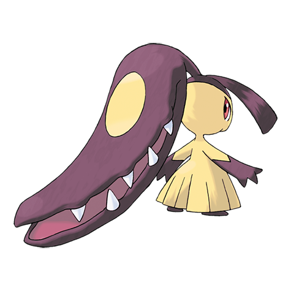

# Mawile (Deceiver Pokémon)

| Official Artwork | Shiny Artwork |
| --- | --- |
|  |  |

Attached to its head is a huge set of jaws formed by horns. It can chew through iron beams.

---

## Media

### Default Sprites

| Front | Back | Front Shiny | Back Shiny |
| --- | --- | --- | --- |
|  |  |  |  |

### Cries

Latest (Gen VI+):

<audio controls>
<source src='../../assets/cries/mawile/latest.ogg' type='audio/ogg'>
  Your browser does not support the audio element.
</audio>

Legacy:

<audio controls>
<source src='../../assets/cries/mawile/legacy.ogg' type='audio/ogg'>
  Your browser does not support the audio element.
</audio>

---

## Pokédex Data

| National № | Type(s) | Height | Weight | Abilities | Local № |
|------------|---------|--------|--------|-----------|---------|
| #303 | {: width='48'} {: width='48'} | 0.6 m | 11.5 kg | 1. Sheer-Force 2. Intimidate | N/A |

---

## Base Stats
|   | HP | Attack | Defense | Sp. Atk | Sp. Def | Speed |
|---|----|--------|---------|---------|---------|-------|
| **Base** | 70 | 105 | 90 | 55 | 90 | 50 |
| **Min** | 250 | 193 | 166 | 103 | 166 | 94 |
| **Max** | 344 | 339 | 306 | 229 | 306 | 218 |

The ranges shown above are for a level 100 Pokémon. Maximum values are based on a beneficial nature, 252 EVs, 31 IVs; minimum values are based on a hindering nature, 0 EVs, 0 IVs.

---

## Forms & Evolutions

!!! warning "WARNING"

    Information on evolutions may not be 100% accurate; differences between evolution methods across generations are not accounted for.

### Forms

Mawile has no alternate forms.

### Evolution Line

1. [Mawile](mawile.md/)

---

## Training

| EV Yield | Catch Rate | Base Friendship | Base Exp. | Growth Rate | Held Items |
|----------|------------|-----------------|-----------|-------------|------------|
| 1 Attack 1 Defense | 45 | 50 | 133 | Fast | occa-berry (5%) |

---

## Breeding

| Egg Groups | Egg Cycles | Gender | Dimorphic | Color | Shape |
|------------|------------|--------|-----------|-------|-------|
| 1. Ground 2. Fairy | 20 | 50.0% Male 50.0% Female | False | Black | Humanoid |

---

## Moves

!!! warning "WARNING"

    Specific move information may be incorrect. However, the general movepool should be accurate; this includes changes made in Blaze Black and Volt White.

### Level Up Moves

| Lv. | Move | Type | Cat. | Power | Acc. | PP |
| --- | --- | --- | --- | --- | --- | --- |
| 1 | Astonish | {: width='48'} | {: width='36'} | 30 | 100 | 15 |
| 1 | Fire Fang | {: width='48'} | {: width='36'} | 75 | 95 | 15 |
| 1 | Ice Fang | {: width='48'} | {: width='36'} | 75 | 95 | 15 |
| 1 | Metal Claw | {: width='48'} | {: width='36'} | 50 | 95 | 35 |
| 1 | Thunder Fang | {: width='48'} | {: width='36'} | 75 | 95 | 15 |
| 6 | Fake Tears | {: width='48'} | {: width='36'} | — | 100 | 20 |
| 11 | Bite | {: width='48'} | {: width='36'} | 60 | 100 | 25 |
| 16 | Sweet Scent | {: width='48'} | {: width='36'} | — | 100 | 20 |
| 21 | Ice Punch | {: width='48'} | {: width='36'} | 80 | 100 | 15 |
| 21 | Thunder Punch | {: width='48'} | {: width='36'} | 80 | 100 | 15 |
| 21 | Vice Grip | {: width='48'} | {: width='36'} | 55 | 100 | 30 |
| 26 | Feint Attack | {: width='48'} | {: width='36'} | 60 | — | 20 |
| 31 | Baton Pass | {: width='48'} | {: width='36'} | — | — | 40 |
| 36 | Crunch | {: width='48'} | {: width='36'} | 80 | 100 | 15 |
| 41 | Iron Defense | {: width='48'} | {: width='36'} | — | — | 15 |
| 46 | Sucker Punch | {: width='48'} | {: width='36'} | 70 | 100 | 5 |
| 51 | Spit Up | {: width='48'} | {: width='36'} | — | 100 | 10 |
| 51 | Stockpile | {: width='48'} | {: width='36'} | — | — | 20 |
| 51 | Swallow | {: width='48'} | {: width='36'} | — | — | 10 |
| 56 | Iron Head | {: width='48'} | {: width='36'} | 80 | 100 | 15 |
| 61 | Metal Burst | {: width='48'} | {: width='36'} | — | 100 | 10 |

### TM Moves

| TM | Move | Type | Cat. | Power | Acc. | PP |
| --- | --- | --- | --- | --- | --- | --- |
| HM04 | Strength | {: width='48'} | {: width='36'} | 80 | 100 | 15 |
| TM06 | Toxic | {: width='48'} | {: width='36'} | — | 90 | 10 |
| TM10 | Hidden Power | {: width='48'} | {: width='36'} | 60 | 100 | 15 |
| TM11 | Sunny Day | {: width='48'} | {: width='36'} | — | — | 5 |
| TM12 | Taunt | {: width='48'} | {: width='36'} | — | 100 | 20 |
| TM13 | Ice Beam | {: width='48'} | {: width='36'} | 90 | 100 | 10 |
| TM15 | Hyper Beam | {: width='48'} | {: width='36'} | 150 | 90 | 5 |
| TM17 | Protect | {: width='48'} | {: width='36'} | — | — | 10 |
| TM18 | Rain Dance | {: width='48'} | {: width='36'} | — | — | 5 |
| TM21 | Frustration | {: width='48'} | {: width='36'} | — | 100 | 20 |
| TM22 | Solar Beam | {: width='48'} | {: width='36'} | 120 | 100 | 10 |
| TM27 | Return | {: width='48'} | {: width='36'} | — | 100 | 20 |
| TM30 | Shadow Ball | {: width='48'} | {: width='36'} | 90 | 100 | 15 |
| TM31 | Brick Break | {: width='48'} | {: width='36'} | 75 | 100 | 15 |
| TM32 | Double Team | {: width='48'} | {: width='36'} | — | — | 15 |
| TM35 | Flamethrower | {: width='48'} | {: width='36'} | 90 | 100 | 15 |
| TM36 | Sludge Bomb | {: width='48'} | {: width='36'} | 90 | 100 | 10 |
| TM37 | Sandstorm | {: width='48'} | {: width='36'} | — | — | 10 |
| TM38 | Fire Blast | {: width='48'} | {: width='36'} | 110 | 85 | 5 |
| TM39 | Rock Tomb | {: width='48'} | {: width='36'} | 60 | 95 | 15 |
| TM41 | Torment | {: width='48'} | {: width='36'} | — | 100 | 15 |
| TM42 | Facade | {: width='48'} | {: width='36'} | 70 | 100 | 20 |
| TM44 | Rest | {: width='48'} | {: width='36'} | — | — | 5 |
| TM45 | Attract | {: width='48'} | {: width='36'} | — | 100 | 15 |
| TM48 | Round | {: width='48'} | {: width='36'} | 60 | 100 | 15 |
| TM52 | Focus Blast | {: width='48'} | {: width='36'} | 120 | 70 | 5 |
| TM54 | False Swipe | {: width='48'} | {: width='36'} | 40 | 100 | 40 |
| TM56 | Fling | {: width='48'} | {: width='36'} | — | 100 | 10 |
| TM57 | Charge Beam | {: width='48'} | {: width='36'} | 50 | 90 | 10 |
| TM59 | Incinerate | {: width='48'} | {: width='36'} | 50 | 100 | 15 |
| TM63 | Embargo | {: width='48'} | {: width='36'} | — | 100 | 15 |
| TM66 | Payback | {: width='48'} | {: width='36'} | 50 | 100 | 10 |
| TM68 | Giga Impact | {: width='48'} | {: width='36'} | 150 | 90 | 5 |
| TM71 | Stone Edge | {: width='48'} | {: width='36'} | 100 | 80 | 5 |
| TM75 | Swords Dance | {: width='48'} | {: width='36'} | — | — | 20 |
| TM77 | Psych Up | {: width='48'} | {: width='36'} | — | — | 10 |
| TM80 | Rock Slide | {: width='48'} | {: width='36'} | 75 | 90 | 10 |
| TM86 | Grass Knot | {: width='48'} | {: width='36'} | — | 100 | 20 |
| TM87 | Swagger | {: width='48'} | {: width='36'} | — | 85 | 15 |
| TM90 | Substitute | {: width='48'} | {: width='36'} | — | — | 10 |
| TM91 | Flash Cannon | {: width='48'} | {: width='36'} | 80 | 100 | 10 |
| TM94 | Rock Smash | {: width='48'} | {: width='36'} | 40 | 100 | 15 |

### Egg Moves

| Move | Type | Cat. | Power | Acc. | PP |
| --- | --- | --- | --- | --- | --- |
| Slam | {: width='48'} | {: width='36'} | 80 | 75 | 20 |
| Ancient Power | {: width='48'} | {: width='36'} | 60 | 100 | 5 |
| Poison Fang | {: width='48'} | {: width='36'} | 50 | 100 | 15 |
| Tickle | {: width='48'} | {: width='36'} | — | 100 | 20 |
| Metal Burst | {: width='48'} | {: width='36'} | — | 100 | 10 |
| Guard Swap | {: width='48'} | {: width='36'} | — | — | 10 |
| Punishment | {: width='48'} | {: width='36'} | — | 100 | 5 |
| Sucker Punch | {: width='48'} | {: width='36'} | 70 | 100 | 5 |
| Thunder Fang | {: width='48'} | {: width='36'} | 75 | 95 | 15 |
| Ice Fang | {: width='48'} | {: width='36'} | 75 | 95 | 15 |
| Fire Fang | {: width='48'} | {: width='36'} | 75 | 95 | 15 |
| Captivate | {: width='48'} | {: width='36'} | — | 100 | 20 |

### Tutor Moves

Mawile cannot learn any moves from tutors.
