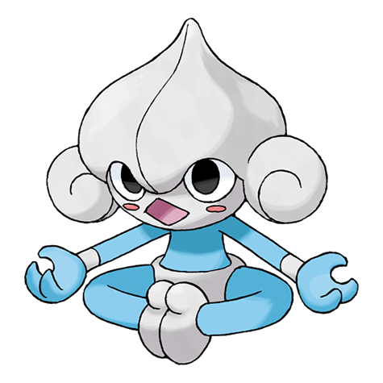
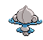
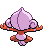

# #307 Meditite (Meditate Pokémon)

| Official Artwork | Shiny Artwork |
| --- | --- |
|  |  |

It always trains deep in mountains. It levitates when it heightens its spiritual power through meditation.

---

## Media

### Sprites

| Front | Back | Front Shiny | Back Shiny |
| --- | --- | --- | --- |
|  |  |  |  |

### Female Sprites

| Front | Back | Front Shiny | Back Shiny |
| --- | --- | --- | --- |
|  |  |  |  |

### Cries

Latest (Gen VI+):

<audio controls>
<source src='../../assets/cries/meditite/latest.ogg' type='audio/ogg'>
  Your browser does not support the audio element.
</audio>

Legacy:

<audio controls>
<source src='../../assets/cries/meditite/legacy.ogg' type='audio/ogg'>
  Your browser does not support the audio element.
</audio>

---

## Pokédex Data

| National № | Type(s) | Height | Weight | Abilities | Local № |
|------------|---------|--------|--------|-----------|---------|
| #307 | {: width='48'} {: width='48'} | 0.6 m | 11.2 kg | 1. Pure-Power 2. Telepathy | N/A |

---

## Base Stats
|   | HP | Attack | Defense | Sp. Atk | Sp. Def | Speed |
|---|----|--------|---------|---------|---------|-------|
| **Base** | 30 | 40 | 55 | 40 | 55 | 60 |
| **Min** | 170 | 76 | 103 | 76 | 103 | 112 |
| **Max** | 264 | 196 | 229 | 196 | 229 | 240 |

The ranges shown above are for a level 100 Pokémon. Maximum values are based on a beneficial nature, 252 EVs, 31 IVs; minimum values are based on a hindering nature, 0 EVs, 0 IVs.

---

## Forms & Evolutions

!!! warning "WARNING"

    Information on evolutions may not be 100% accurate; differences between evolution methods across generations are not accounted for.

### Forms

Meditite has no alternate forms.

### Evolution Line

1. [Meditite](meditite.md/)
    1. Level Up: [Medicham](medicham.md/)

### Evolution Changes

---

## Training

| EV Yield | Catch Rate | Base Friendship | Base Exp. | Growth Rate | Held Items |
|----------|------------|-----------------|-----------|-------------|------------|
| 1 Speed | 180 | 70 | 56 | Medium | N/A |

---

## Breeding

| Egg Groups | Egg Cycles | Gender | Dimorphic | Color | Shape |
|------------|------------|--------|-----------|-------|-------|
| 1. Humanshape | 20 | 50.0% Male 50.0% Female | True | Blue | Humanoid |

---

## Moves

!!! warning "WARNING"

    Specific move information may be incorrect. However, the general movepool should be accurate; this includes changes made in Blaze Black and Volt White.

### Level Up Moves

| Lv. | Move | Type | Cat. | Power | Acc. | PP |
| --- | --- | --- | --- | --- | --- | --- |
| 1 | Bide | {: width='48'} | {: width='36'} | — | — | 10 |
| 4 | Meditate | {: width='48'} | {: width='36'} | — | — | 40 |
| 8 | Confusion | {: width='48'} | {: width='36'} | 50 | 100 | 25 |
| 11 | Detect | {: width='48'} | {: width='36'} | — | — | 5 |
| 15 | Hidden Power | {: width='48'} | {: width='36'} | 60 | 100 | 15 |
| 18 | Mind Reader | {: width='48'} | {: width='36'} | — | — | 5 |
| 20 | Force Palm | {: width='48'} | {: width='36'} | 60 | 100 | 10 |
| 22 | Feint | {: width='48'} | {: width='36'} | 30 | 100 | 10 |
| 25 | Calm Mind | {: width='48'} | {: width='36'} | — | — | 20 |
| 28 | Psycho Cut | {: width='48'} | {: width='36'} | 70 | 100 | 20 |
| 32 | High Jump Kick | {: width='48'} | {: width='36'} | 130 | 90 | 10 |
| 36 | Psych Up | {: width='48'} | {: width='36'} | — | — | 10 |
| 39 | Acupressure | {: width='48'} | {: width='36'} | — | — | 30 |
| 43 | Power Trick | {: width='48'} | {: width='36'} | — | — | 10 |
| 46 | Reversal | {: width='48'} | {: width='36'} | — | 100 | 15 |
| 50 | Recover | {: width='48'} | {: width='36'} | — | — | 5 |

### TM Moves

| TM | Move | Type | Cat. | Power | Acc. | PP |
| --- | --- | --- | --- | --- | --- | --- |
| HM04 | Strength | {: width='48'} | {: width='36'} | 85 | 100 | 15 |
| TM03 | Psyshock | {: width='48'} | {: width='36'} | 80 | 100 | 10 |
| TM04 | Calm Mind | {: width='48'} | {: width='36'} | — | — | 20 |
| TM06 | Toxic | {: width='48'} | {: width='36'} | — | 90 | 10 |
| TM08 | Bulk Up | {: width='48'} | {: width='36'} | — | — | 20 |
| TM10 | Hidden Power | {: width='48'} | {: width='36'} | 60 | 100 | 15 |
| TM11 | Sunny Day | {: width='48'} | {: width='36'} | — | — | 5 |
| TM16 | Light Screen | {: width='48'} | {: width='36'} | — | — | 30 |
| TM17 | Protect | {: width='48'} | {: width='36'} | — | — | 10 |
| TM18 | Rain Dance | {: width='48'} | {: width='36'} | — | — | 5 |
| TM19 | Telekinesis | {: width='48'} | {: width='36'} | — | — | 15 |
| TM21 | Frustration | {: width='48'} | {: width='36'} | — | 100 | 20 |
| TM27 | Return | {: width='48'} | {: width='36'} | — | 100 | 20 |
| TM29 | Psychic | {: width='48'} | {: width='36'} | 90 | 100 | 10 |
| TM30 | Shadow Ball | {: width='48'} | {: width='36'} | 90 | 100 | 15 |
| TM31 | Brick Break | {: width='48'} | {: width='36'} | 75 | 100 | 15 |
| TM32 | Double Team | {: width='48'} | {: width='36'} | — | — | 15 |
| TM33 | Reflect | {: width='48'} | {: width='36'} | — | — | 20 |
| TM39 | Rock Tomb | {: width='48'} | {: width='36'} | 60 | 95 | 15 |
| TM42 | Facade | {: width='48'} | {: width='36'} | 70 | 100 | 20 |
| TM44 | Rest | {: width='48'} | {: width='36'} | — | — | 5 |
| TM45 | Attract | {: width='48'} | {: width='36'} | — | 100 | 15 |
| TM47 | Low Sweep | {: width='48'} | {: width='36'} | 65 | 100 | 20 |
| TM48 | Round | {: width='48'} | {: width='36'} | 60 | 100 | 15 |
| TM52 | Focus Blast | {: width='48'} | {: width='36'} | 120 | 70 | 5 |
| TM56 | Fling | {: width='48'} | {: width='36'} | — | 100 | 10 |
| TM67 | Retaliate | {: width='48'} | {: width='36'} | 70 | 100 | 5 |
| TM70 | Flash | {: width='48'} | {: width='36'} | — | 100 | 20 |
| TM77 | Psych Up | {: width='48'} | {: width='36'} | — | — | 10 |
| TM80 | Rock Slide | {: width='48'} | {: width='36'} | 80 | 95 | 10 |
| TM83 | Work Up | {: width='48'} | {: width='36'} | — | — | 30 |
| TM84 | Poison Jab | {: width='48'} | {: width='36'} | 80 | 100 | 20 |
| TM85 | Dream Eater | {: width='48'} | {: width='36'} | 100 | 100 | 15 |
| TM86 | Grass Knot | {: width='48'} | {: width='36'} | — | 100 | 20 |
| TM87 | Swagger | {: width='48'} | {: width='36'} | — | 85 | 15 |
| TM90 | Substitute | {: width='48'} | {: width='36'} | — | — | 10 |
| TM94 | Rock Smash | {: width='48'} | {: width='36'} | 40 | 100 | 15 |

### Egg Moves

| Move | Type | Cat. | Power | Acc. | PP |
| --- | --- | --- | --- | --- | --- |
| Fire Punch | {: width='48'} | {: width='36'} | 80 | 100 | 15 |
| Ice Punch | {: width='48'} | {: width='36'} | 80 | 100 | 15 |
| Thunder Punch | {: width='48'} | {: width='36'} | 80 | 100 | 15 |
| Foresight | {: width='48'} | {: width='36'} | — | — | 40 |
| Dynamic Punch | {: width='48'} | {: width='36'} | 100 | 50 | 5 |
| Baton Pass | {: width='48'} | {: width='36'} | — | — | 40 |
| Fake Out | {: width='48'} | {: width='36'} | 40 | 100 | 10 |
| Secret Power | {: width='48'} | {: width='36'} | 70 | 100 | 20 |
| Power Swap | {: width='48'} | {: width='36'} | — | — | 10 |
| Guard Swap | {: width='48'} | {: width='36'} | — | — | 10 |
| Drain Punch | {: width='48'} | {: width='36'} | 75 | 100 | 10 |
| Bullet Punch | {: width='48'} | {: width='36'} | 40 | 100 | 30 |
| Psycho Cut | {: width='48'} | {: width='36'} | 70 | 100 | 20 |

### Tutor Moves

Meditite cannot learn any moves from tutors.
