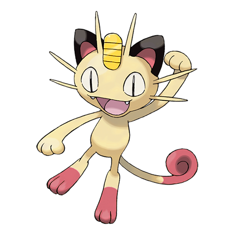

# #052 Meowth (Scratch Cat Pokémon)

| Official Artwork | Shiny Artwork |
|------------------|---------------|
|  |  |

It is nocturnal in nature. If it spots something shiny, its eyes glitter brightly.

---

## Media

### Default Sprites

| Front | Shiny | Back | Shiny |
|-------|-------|------|-------|
|  |  |  |  |

### Cries

Latest (Gen VI+):

<audio controls>
<source src='../../assets/cries/meowth/latest.ogg' type='audio/ogg'>
  Your browser does not support the audio element.
</audio>

Legacy:

<audio controls>
<source src='../../assets/cries/meowth/legacy.ogg' type='audio/ogg'>
  Your browser does not support the audio element.
</audio>

---

## Pokédex Data

| National № | Type(s) | Height | Weight | Abilities | Local № |
|------------|---------|--------|--------|-----------|---------|
| #52 | {: width="48"} | 0.4 m / 1.3 ft | 4.2 kg / 9.3 lbs | 1. Pickup 2. Technician | N/A |

---

## Base Stats
|   | HP | Attack | Defense | Sp. Atk | Sp. Def | Speed |
|---|----|--------|---------|---------|---------|-------|
| **Base** | 40 | 45 | 35 | 40 | 40 | 90 |
| **Min** | 190 | 85 | 67 | 76 | 76 | 166 |
| **Max** | 284 | 207 | 185 | 196 | 196 | 306 |

The ranges shown above are for a level 100 Pokémon. Maximum values are based on a beneficial nature, 252 EVs, 31 IVs; minimum values are based on a hindering nature, 0 EVs, 0 IVs.

---

## Forms & Evolutions

!!! warning "WARNING"

    Information on evolutions may not be 100% accurate; differences between evolution methods across generations are not accounted for.

### Forms

Meowth has no alternate forms.

### Evolution Line

1. [Meowth](meowth.md/)
    1. Level Up: [Persian](persian.md/)

---

## Training

| EV Yield | Catch Rate | Base Friendship | Base Exp. | Growth Rate | Held Items |
|----------|------------|-----------------|-----------|-------------|------------|
| 1 Spd | 255 | 50 | 58 | Medium | Quick Claw (5%) |

---

## Breeding

| Egg Groups | Egg Cycles | Gender | Dimorphic | Color | Shape |
|------------|------------|--------|-----------|-------|-------|
| 1. Ground | 20 | 50.0% Male 50.0% Female | False | Yellow | Quadruped |

---

## Moves

!!! warning "WARNING"

    Specific move information may be incorrect. However, the general movepool should be accurate; this includes changes made in Blaze Black and Volt White.

### Level Up Moves

| Lv. | Move | Type | Cat. | Power | Acc. | PP |
| --- | --- | --- | --- | --- | --- | --- |
| 1 | Growl | {: width="48"} | {: width="36"} | — | 100 | 40 |
| 1 | Scratch | {: width="48"} | {: width="36"} | 40 | 100 | 35 |
| 6 | Bite | {: width="48"} | {: width="36"} | 60 | 100 | 25 |
| 9 | Fake Out | {: width="48"} | {: width="36"} | 40 | 100 | 10 |
| 12 | Hypnosis | {: width="48"} | {: width="36"} | — | 60 | 20 |
| 14 | Fury Swipes | {: width="48"} | {: width="36"} | 18 | 80 | 15 |
| 17 | Screech | {: width="48"} | {: width="36"} | — | 85 | 40 |
| 20 | Secret Power | {: width="48"} | {: width="36"} | 70 | 100 | 20 |
| 22 | Feint Attack | {: width="48"} | {: width="36"} | 60 | — | 20 |
| 25 | Taunt | {: width="48"} | {: width="36"} | — | 100 | 20 |
| 28 | Foul Play | {: width="48"} | {: width="36"} | 95 | 100 | 15 |
| 30 | Pay Day | {: width="48"} | {: width="36"} | 40 | 100 | 20 |
| 33 | Slash | {: width="48"} | {: width="36"} | 70 | 100 | 20 |
| 38 | Nasty Plot | {: width="48"} | {: width="36"} | — | — | 20 |
| 41 | Assurance | {: width="48"} | {: width="36"} | 60 | 100 | 10 |
| 46 | Captivate | {: width="48"} | {: width="36"} | — | 100 | 20 |
| 49 | Night Slash | {: width="48"} | {: width="36"} | 70 | 100 | 15 |
| 54 | Feint | {: width="48"} | {: width="36"} | 30 | 100 | 10 |

### TM Moves

| TM | Move | Type | Cat. | Power | Acc. | PP |
| --- | --- | --- | --- | --- | --- | --- |
| HM01 | Cut | {: width="48"} | {: width="36"} | 60 | 100% | 25 |
| TM01 | Hone Claws | {: width="48"} | {: width="36"} | — | — | 15 |
| TM06 | Toxic | {: width="48"} | {: width="36"} | — | 90 | 10 |
| TM10 | Hidden Power | {: width="48"} | {: width="36"} | 60 | 100 | 15 |
| TM11 | Sunny Day | {: width="48"} | {: width="36"} | — | — | 5 |
| TM12 | Taunt | {: width="48"} | {: width="36"} | — | 100 | 20 |
| TM17 | Protect | {: width="48"} | {: width="36"} | — | — | 10 |
| TM18 | Rain Dance | {: width="48"} | {: width="36"} | — | — | 5 |
| TM21 | Frustration | {: width="48"} | {: width="36"} | — | 100 | 20 |
| TM24 | Thunderbolt | {: width="48"} | {: width="36"} | 90 | 100 | 15 |
| TM25 | Thunder | {: width="48"} | {: width="36"} | 110 | 70 | 10 |
| TM27 | Return | {: width="48"} | {: width="36"} | — | 100 | 20 |
| TM28 | Dig | {: width="48"} | {: width="36"} | 100 | 100 | 10 |
| TM30 | Shadow Ball | {: width="48"} | {: width="36"} | 90 | 100 | 15 |
| TM32 | Double Team | {: width="48"} | {: width="36"} | — | — | 15 |
| TM40 | Aerial Ace | {: width="48"} | {: width="36"} | 60 | — | 20 |
| TM41 | Torment | {: width="48"} | {: width="36"} | — | 100 | 15 |
| TM42 | Facade | {: width="48"} | {: width="36"} | 70 | 100 | 20 |
| TM44 | Rest | {: width="48"} | {: width="36"} | — | — | 5 |
| TM45 | Attract | {: width="48"} | {: width="36"} | — | 100 | 15 |
| TM46 | Thief | {: width="48"} | {: width="36"} | 60 | 100 | 25 |
| TM48 | Round | {: width="48"} | {: width="36"} | 60 | 100 | 15 |
| TM49 | Echoed Voice | {: width="48"} | {: width="36"} | 40 | 100 | 15 |
| TM65 | Shadow Claw | {: width="48"} | {: width="36"} | 80 | 100 | 15 |
| TM66 | Payback | {: width="48"} | {: width="36"} | 50 | 100 | 10 |
| TM67 | Retaliate | {: width="48"} | {: width="36"} | 70 | 100 | 5 |
| TM70 | Flash | {: width="48"} | {: width="36"} | — | 100 | 20 |
| TM77 | Psych Up | {: width="48"} | {: width="36"} | — | — | 10 |
| TM83 | Work Up | {: width="48"} | {: width="36"} | — | — | 30 |
| TM85 | Dream Eater | {: width="48"} | {: width="36"} | 100 | 100 | 15 |
| TM87 | Swagger | {: width="48"} | {: width="36"} | — | 85 | 15 |
| TM89 | U Turn | {: width="48"} | {: width="36"} | 70 | 100 | 20 |
| TM90 | Substitute | {: width="48"} | {: width="36"} | — | — | 10 |

### Egg Moves

| Move | Type | Cat. | Power | Acc. | PP |
| --- | --- | --- | --- | --- | --- |
| Tail Whip | {: width="48"} | {: width="36"} | — | 100 | 30 |
| Hypnosis | {: width="48"} | {: width="36"} | — | 60 | 20 |
| Amnesia | {: width="48"} | {: width="36"} | — | — | 20 |
| Flail | {: width="48"} | {: width="36"} | — | 100 | 15 |
| Spite | {: width="48"} | {: width="36"} | — | 100 | 10 |
| Charm | {: width="48"} | {: width="36"} | — | 100 | 20 |
| Iron Tail | {: width="48"} | {: width="36"} | 100 | 75 | 15 |
| Assist | {: width="48"} | {: width="36"} | — | — | 20 |
| Snatch | {: width="48"} | {: width="36"} | — | — | 10 |
| Odor Sleuth | {: width="48"} | {: width="36"} | — | — | 40 |
| Punishment | {: width="48"} | {: width="36"} | — | 100 | 5 |
| Last Resort | {: width="48"} | {: width="36"} | 140 | 100 | 5 |
| Foul Play | {: width="48"} | {: width="36"} | 95 | 100 | 15 |

### Tutor Moves

Meowth cannot learn any moves from tutors.
