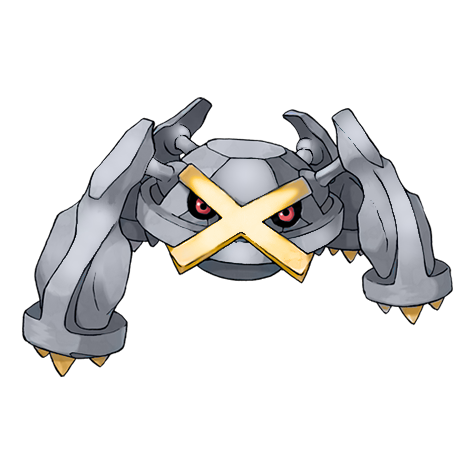

# #376 Metagross (Iron Leg Pokémon)

| Official Artwork | Shiny Artwork |
| --- | --- |
|  |  |

Metang combined to form it. With four brains, it has the intelligence of a supercomputer.

---

## Media

### Sprites

| Front | Back | Front Shiny | Back Shiny |
| --- | --- | --- | --- |
|  |  |  |  |

### Cries

Latest (Gen VI+):

<audio controls>
  <source src='../assets/cries/metagross/latest.ogg' type='audio/ogg'>
  Your browser does not support the audio element.
</audio>

Legacy:

<audio controls>
  <source src='../assets/cries/metagross/legacy.ogg' type='audio/ogg'>
  Your browser does not support the audio element.
</audio>

---

## Pokédex Data

| National № | Type(s) | Height | Weight | Abilities | Local № |
|------------|---------|--------|--------|-----------|---------|
| #376 | {: width='48'} {: width='48'} | 1.6 m | 550.0 kg | 1. Iron-Fist 2. Analytic | #N/A |

---

## Base Stats
---

## Base Stats
|   | HP | Attack | Defense | Sp. Atk | Sp. Def | Speed |
|---|----|--------|---------|---------|---------|-------|
| **Base** | 80 | 135 | 130 | 95 | 90 | 70 |
| **Min** | 270 | 247 | 238 | 175 | 166 | 130 |
| **Max** | 364 | 405 | 394 | 317 | 306 | 262 |

The ranges shown above are for a level 100 Pokémon. Maximum values are based on a beneficial nature, 252 EVs, 31 IVs; minimum values are based on a hindering nature, 0 EVs, 0 IVs.

---

## Forms & Evolutions

!!! warning "WARNING"

    Some forms may not be available in Blaze Black/Volt White. Also information on evolutions may not be 100% accurate; it is currently quite complex to track generational evolution data.

### Forms

1. [Metagross](metagross.md/)
2. [Metagross-Mega](metagross-mega.md/)

### Evolution Line

1. [Beldum](beldum.md/)
1. Level Up: [Metang](metang.md/)
1. Level Up: [Metagross](metagross.md/)

---

## Training

| EV Yield | Catch Rate | Base Friendship | Base Exp. | Growth Rate | Held Items |
|----------|------------|-----------------|-----------|-------------|------------|
| 3 Defense | 3 | 35 | 300 | Slow | Metal Coat (5%) |

---

## Breeding

| Egg Groups | Egg Cycles | Gender | Dimorphic | Color | Shape |
|------------|------------|--------|-----------|-------|-------|
| 1. Mineral | 40 | Genderless | False | Blue | Heads |

---

## Moves

!!! warning "WARNING"

    Specific move information may be incorrect. However, the general movepool should be accurate (including changes to learnset).

### Level Up Moves

Lv. | Move | Type | Cat. | Power | Acc. | PP
--- | --- | --- | --- | --- | --- | ---
| 1 | Confusion | {: width='48'} | {: width='36'} | 50 | 100 | 25 |
| 1 | Ice Punch | {: width='48'} | {: width='36'} | 80 | 100 | 15 |
| 1 | Magnet Rise | {: width='48'} | {: width='36'} | — | — | 10 |
| 1 | Metal Claw | {: width='48'} | {: width='36'} | 50 | 95 | 35 |
| 1 | Take Down | {: width='48'} | {: width='36'} | 90 | 85 | 20 |
| 1 | Thunder Punch | {: width='48'} | {: width='36'} | 80 | 100 | 15 |
| 20 | Confusion | {: width='48'} | {: width='36'} | 50 | 100 | 25 |
| 20 | Metal Claw | {: width='48'} | {: width='36'} | 50 | 95 | 35 |
| 24 | Scary Face | {: width='48'} | {: width='36'} | — | 100 | 10 |
| 28 | Pursuit | {: width='48'} | {: width='36'} | 40 | 100 | 20 |
| 32 | Bullet Punch | {: width='48'} | {: width='36'} | 40 | 100 | 30 |
| 36 | Psychic | {: width='48'} | {: width='36'} | 90 | 100 | 10 |
| 40 | Iron Defense | {: width='48'} | {: width='36'} | — | — | 15 |
| 44 | Agility | {: width='48'} | {: width='36'} | — | — | 30 |
| 45 | Hammer Arm | {: width='48'} | {: width='36'} | 100 | 90 | 10 |
| 53 | Meteor Mash | {: width='48'} | {: width='36'} | 90 | 90 | 10 |
| 62 | Zen Headbutt | {: width='48'} | {: width='36'} | 80 | 90 | 15 |
| 71 | Hyper Beam | {: width='48'} | {: width='36'} | 150 | 90 | 5 |

### TM Moves

TM | Move | Type | Cat. | Power | Acc. | PP
--- | --- | --- | --- | --- | --- | ---
| HM01 | Cut | {: width='48'} | {: width='36'} | 60 | 100 | 20 |
| HM02 | Fly | {: width='48'} | {: width='36'} | 100 | 100 | 15 |
| HM02 | Fly | {: width='48'} | {: width='36'} | 100 | 100 | 15 |
| HM02 | Fly | {: width='48'} | {: width='36'} | 100 | 100 | 15 |
| HM02 | Fly | {: width='48'} | {: width='36'} | 100 | 100 | 15 |
| HM02 | Fly | {: width='48'} | {: width='36'} | 100 | 100 | 15 |
| HM02 | Fly | {: width='48'} | {: width='36'} | 100 | 100 | 15 |
| HM02 | Fly | {: width='48'} | {: width='36'} | 100 | 100 | 15 |
| HM02 | Fly | {: width='48'} | {: width='36'} | 100 | 100 | 15 |
| HM02 | Fly | {: width='48'} | {: width='36'} | 100 | 100 | 15 |
| HM02 | Fly | {: width='48'} | {: width='36'} | 100 | 100 | 15 |
| HM02 | Fly | {: width='48'} | {: width='36'} | 100 | 100 | 15 |
| HM04 | Strength | {: width='48'} | {: width='36'} | 85 | 100 | 15 |
| TM01 | Hone Claws | {: width='48'} | {: width='36'} | — | — | 15 |
| TM03 | Psyshock | {: width='48'} | {: width='36'} | 80 | 100 | 10 |
| TM06 | Toxic | {: width='48'} | {: width='36'} | — | 90 | 10 |
| TM10 | Hidden Power | {: width='48'} | {: width='36'} | 60 | 100 | 15 |
| TM11 | Sunny Day | {: width='48'} | {: width='36'} | — | — | 5 |
| TM15 | Hyper Beam | {: width='48'} | {: width='36'} | 150 | 90 | 5 |
| TM16 | Light Screen | {: width='48'} | {: width='36'} | — | — | 30 |
| TM17 | Protect | {: width='48'} | {: width='36'} | — | — | 10 |
| TM18 | Rain Dance | {: width='48'} | {: width='36'} | — | — | 5 |
| TM19 | Telekinesis | {: width='48'} | {: width='36'} | — | — | 15 |
| TM21 | Frustration | {: width='48'} | {: width='36'} | — | 100 | 20 |
| TM26 | Earthquake | {: width='48'} | {: width='36'} | 100 | 100 | 10 |
| TM27 | Return | {: width='48'} | {: width='36'} | — | 100 | 20 |
| TM29 | Psychic | {: width='48'} | {: width='36'} | 90 | 100 | 10 |
| TM30 | Shadow Ball | {: width='48'} | {: width='36'} | 90 | 100 | 15 |
| TM31 | Brick Break | {: width='48'} | {: width='36'} | 75 | 100 | 15 |
| TM32 | Double Team | {: width='48'} | {: width='36'} | — | — | 15 |
| TM33 | Reflect | {: width='48'} | {: width='36'} | — | — | 20 |
| TM36 | Sludge Bomb | {: width='48'} | {: width='36'} | 90 | 100 | 10 |
| TM37 | Sandstorm | {: width='48'} | {: width='36'} | — | — | 10 |
| TM39 | Rock Tomb | {: width='48'} | {: width='36'} | 60 | 95 | 15 |
| TM40 | Aerial Ace | {: width='48'} | {: width='36'} | 60 | — | 20 |
| TM42 | Facade | {: width='48'} | {: width='36'} | 70 | 100 | 20 |
| TM44 | Rest | {: width='48'} | {: width='36'} | — | — | 5 |
| TM48 | Round | {: width='48'} | {: width='36'} | 60 | 100 | 15 |
| TM64 | Explosion | {: width='48'} | {: width='36'} | 250 | 100 | 5 |
| TM68 | Giga Impact | {: width='48'} | {: width='36'} | 150 | 90 | 5 |
| TM69 | Rock Polish | {: width='48'} | {: width='36'} | — | — | 20 |
| TM70 | Flash | {: width='48'} | {: width='36'} | — | 100 | 20 |
| TM74 | Gyro Ball | {: width='48'} | {: width='36'} | — | 100 | 5 |
| TM77 | Psych Up | {: width='48'} | {: width='36'} | — | — | 10 |
| TM78 | Bulldoze | {: width='48'} | {: width='36'} | 80 | 100 | 20 |
| TM80 | Rock Slide | {: width='48'} | {: width='36'} | 80 | 95 | 10 |
| TM86 | Grass Knot | {: width='48'} | {: width='36'} | — | 100 | 20 |
| TM87 | Swagger | {: width='48'} | {: width='36'} | — | 85 | 15 |
| TM90 | Substitute | {: width='48'} | {: width='36'} | — | — | 10 |
| TM91 | Flash Cannon | {: width='48'} | {: width='36'} | 80 | 100 | 10 |
| TM94 | Rock Smash | {: width='48'} | {: width='36'} | 40 | 100 | 15 |

### Egg Moves

Metagross cannot learn any moves by breeding.
### Tutor Moves

Metagross cannot learn any moves from tutors.
