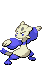
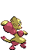
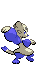

# #619 Mienfoo (Martial Arts Pokémon)

| Official Artwork | Shiny Artwork |
|------------------|---------------|
|  |  |

**Blaze Black:** In fights, they dominate with onslaughts of flowing, continuous attacks. With their sharp claws, they cut enemies.

**Volt White:** They have mastered elegant combos. As they concentrate, their battle moves become swifter and more precise.

---

## Media

### Default Sprites

| Front | Shiny | Back | Shiny |
|-------|-------|------|-------|
|  |  |  |  |

### Cries

Latest (Gen VI+):

<audio controls>
<source src='../../assets/cries/mienfoo/latest.ogg' type='audio/ogg'>
  Your browser does not support the audio element.
</audio>

Legacy:

<audio controls>
<source src='../../assets/cries/mienfoo/legacy.ogg' type='audio/ogg'>
  Your browser does not support the audio element.
</audio>

---

## Pokédex Data

| National № | Type(s) | Height | Weight | Abilities | Local № |
|------------|---------|--------|--------|-----------|---------|
| #619 | {: width="48"} | 0.9 m / 3.0 ft | 20.0 kg / 44.1 lbs | 1. Reckless 2. Regenerator | N/A |

---

## Base Stats
|   | HP | Attack | Defense | Sp. Atk | Sp. Def | Speed |
|---|----|--------|---------|---------|---------|-------|
| **Base** | 45 | 85 | 50 | 55 | 50 | 65 |
| **Min** | 200 | 157 | 94 | 103 | 94 | 121 |
| **Max** | 294 | 295 | 218 | 229 | 218 | 251 |

The ranges shown above are for a level 100 Pokémon. Maximum values are based on a beneficial nature, 252 EVs, 31 IVs; minimum values are based on a hindering nature, 0 EVs, 0 IVs.

---

## Forms & Evolutions

!!! warning "WARNING"

    Information on evolutions may not be 100% accurate; differences between evolution methods across generations are not accounted for.

### Forms

Mienfoo has no alternate forms.

### Evolution Line

1. [Mienfoo](mienfoo.md/)
    1. Level Up: [Mienshao](mienshao.md/)

### Evolution Changes

1. Level 39

---

## Training

| EV Yield | Catch Rate | Base Friendship | Base Exp. | Growth Rate | Held Items |
|----------|------------|-----------------|-----------|-------------|------------|
| 1 Atk | 180 | 50 | 70 | Medium Slow | N/A |

---

## Breeding

| Egg Groups | Egg Cycles | Gender | Dimorphic | Color | Shape |
|------------|------------|--------|-----------|-------|-------|
| 1. Ground 2. Humanshape | 25 | 50.0% Male 50.0% Female | False | Yellow | Upright |

---

## Moves

!!! warning "WARNING"

    Specific move information may be incorrect. However, the general movepool should be accurate; this includes changes made in Blaze Black and Volt White.

### Level Up Moves

| Lv. | Move | Type | Cat. | Power | Acc. | PP |
| --- | --- | --- | --- | --- | --- | --- |
| 1 | Pound | {: width="48"} | {: width="36"} | 40 | 100 | 35 |
| 5 | Meditate | {: width="48"} | {: width="36"} | — | — | 40 |
| 9 | Detect | {: width="48"} | {: width="36"} | — | — | 5 |
| 13 | Fake Out | {: width="48"} | {: width="36"} | 40 | 100 | 10 |
| 17 | Double Slap | {: width="48"} | {: width="36"} | 15 | 85 | 10 |
| 21 | Swift | {: width="48"} | {: width="36"} | 60 | — | 20 |
| 25 | Calm Mind | {: width="48"} | {: width="36"} | — | — | 20 |
| 29 | Force Palm | {: width="48"} | {: width="36"} | 60 | 100 | 10 |
| 33 | Drain Punch | {: width="48"} | {: width="36"} | 75 | 100 | 10 |
| 37 | Jump Kick | {: width="48"} | {: width="36"} | 100 | 95 | 10 |
| 41 | U Turn | {: width="48"} | {: width="36"} | 70 | 100 | 20 |
| 45 | Quick Guard | {: width="48"} | {: width="36"} | — | — | 15 |
| 49 | Bounce | {: width="48"} | {: width="36"} | 85 | 85 | 5 |
| 53 | High Jump Kick | {: width="48"} | {: width="36"} | 130 | 90 | 10 |
| 57 | Reversal | {: width="48"} | {: width="36"} | — | 100 | 15 |
| 61 | Aura Sphere | {: width="48"} | {: width="36"} | 80 | — | 20 |

### TM Moves

| TM | Move | Type | Cat. | Power | Acc. | PP |
| --- | --- | --- | --- | --- | --- | --- |
| HM04 | Strength | {: width="48"} | {: width="36"} | 100 | 100 | 15 |
| TM04 | Calm Mind | {: width="48"} | {: width="36"} | — | — | 20 |
| TM06 | Toxic | {: width="48"} | {: width="36"} | — | 90 | 10 |
| TM08 | Bulk Up | {: width="48"} | {: width="36"} | — | — | 20 |
| TM10 | Hidden Power | {: width="48"} | {: width="36"} | 60 | 100 | 15 |
| TM11 | Sunny Day | {: width="48"} | {: width="36"} | — | — | 5 |
| TM12 | Taunt | {: width="48"} | {: width="36"} | — | 100 | 20 |
| TM17 | Protect | {: width="48"} | {: width="36"} | — | — | 10 |
| TM18 | Rain Dance | {: width="48"} | {: width="36"} | — | — | 5 |
| TM21 | Frustration | {: width="48"} | {: width="36"} | — | 100 | 20 |
| TM27 | Return | {: width="48"} | {: width="36"} | — | 100 | 20 |
| TM28 | Dig | {: width="48"} | {: width="36"} | 100 | 100 | 10 |
| TM31 | Brick Break | {: width="48"} | {: width="36"} | 75 | 100 | 15 |
| TM32 | Double Team | {: width="48"} | {: width="36"} | — | — | 15 |
| TM33 | Reflect | {: width="48"} | {: width="36"} | — | — | 20 |
| TM39 | Rock Tomb | {: width="48"} | {: width="36"} | 60 | 95 | 15 |
| TM40 | Aerial Ace | {: width="48"} | {: width="36"} | 60 | — | 20 |
| TM42 | Facade | {: width="48"} | {: width="36"} | 70 | 100 | 20 |
| TM44 | Rest | {: width="48"} | {: width="36"} | — | — | 5 |
| TM45 | Attract | {: width="48"} | {: width="36"} | — | 100 | 15 |
| TM47 | Low Sweep | {: width="48"} | {: width="36"} | 65 | 100 | 20 |
| TM48 | Round | {: width="48"} | {: width="36"} | 60 | 100 | 15 |
| TM52 | Focus Blast | {: width="48"} | {: width="36"} | 120 | 70 | 5 |
| TM56 | Fling | {: width="48"} | {: width="36"} | — | 100 | 10 |
| TM62 | Acrobatics | {: width="48"} | {: width="36"} | 55 | 100 | 15 |
| TM66 | Payback | {: width="48"} | {: width="36"} | 50 | 100 | 10 |
| TM67 | Retaliate | {: width="48"} | {: width="36"} | 70 | 100 | 5 |
| TM71 | Stone Edge | {: width="48"} | {: width="36"} | 100 | 80 | 5 |
| TM75 | Swords Dance | {: width="48"} | {: width="36"} | — | — | 20 |
| TM77 | Psych Up | {: width="48"} | {: width="36"} | — | — | 10 |
| TM80 | Rock Slide | {: width="48"} | {: width="36"} | 75 | 90 | 10 |
| TM83 | Work Up | {: width="48"} | {: width="36"} | — | — | 30 |
| TM84 | Poison Jab | {: width="48"} | {: width="36"} | 80 | 100 | 20 |
| TM86 | Grass Knot | {: width="48"} | {: width="36"} | — | 100 | 20 |
| TM87 | Swagger | {: width="48"} | {: width="36"} | — | 85 | 15 |
| TM89 | U Turn | {: width="48"} | {: width="36"} | 70 | 100 | 20 |
| TM90 | Substitute | {: width="48"} | {: width="36"} | — | — | 10 |
| TM94 | Rock Smash | {: width="48"} | {: width="36"} | 60 | 100 | 15 |

### Egg Moves

| Move | Type | Cat. | Power | Acc. | PP |
| --- | --- | --- | --- | --- | --- |
| Low Kick | {: width="48"} | {: width="36"} | — | 100 | 20 |
| Endure | {: width="48"} | {: width="36"} | — | — | 10 |
| Baton Pass | {: width="48"} | {: width="36"} | — | — | 40 |
| Vital Throw | {: width="48"} | {: width="36"} | 70 | — | 10 |
| Smelling Salts | {: width="48"} | {: width="36"} | 70 | 100 | 10 |
| Knock Off | {: width="48"} | {: width="36"} | 65 | 100 | 20 |
| Feint | {: width="48"} | {: width="36"} | 30 | 100 | 10 |
| Me First | {: width="48"} | {: width="36"} | — | — | 20 |

### Tutor Moves

Mienfoo cannot learn any moves from tutors.
