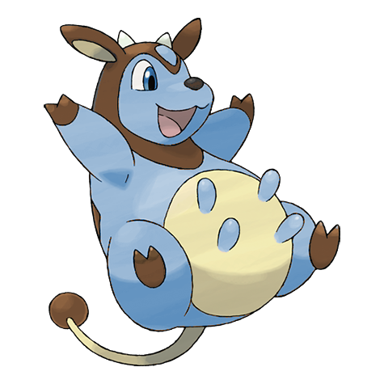

# Miltank (Milk Cow Pokémon)

| Official Artwork | Shiny Artwork |
| --- | --- |
|  |  |

It is said that kids who drink Miltank’s milk grow up to become hearty, healthy adults.

---

## Media

### Default Sprites

| Front | Back | Front Shiny | Back Shiny |
| --- | --- | --- | --- |
|  |  |  |  |

### Cries

Latest (Gen VI+):

<audio controls>
<source src='../../assets/cries/miltank/latest.ogg' type='audio/ogg'>
  Your browser does not support the audio element.
</audio>

Legacy:

<audio controls>
<source src='../../assets/cries/miltank/legacy.ogg' type='audio/ogg'>
  Your browser does not support the audio element.
</audio>

---

## Pokédex Data

| National № | Type(s) | Height | Weight | Abilities | Local № |
|------------|---------|--------|--------|-----------|---------|
| #241 | {: width='48'} | 1.2 m | 75.5 kg | 1. Thick-Fat 2. Scrappy | N/A |

---

## Base Stats
|   | HP | Attack | Defense | Sp. Atk | Sp. Def | Speed |
|---|----|--------|---------|---------|---------|-------|
| **Base** | 95 | 90 | 105 | 40 | 70 | 100 |
| **Min** | 300 | 166 | 193 | 76 | 130 | 184 |
| **Max** | 394 | 306 | 339 | 196 | 262 | 328 |

The ranges shown above are for a level 100 Pokémon. Maximum values are based on a beneficial nature, 252 EVs, 31 IVs; minimum values are based on a hindering nature, 0 EVs, 0 IVs.

---

## Forms & Evolutions

!!! warning "WARNING"

    Information on evolutions may not be 100% accurate; differences between evolution methods across generations are not accounted for.

### Forms

Miltank has no alternate forms.

### Evolution Line

1. [Miltank](miltank.md/)

---

## Training

| EV Yield | Catch Rate | Base Friendship | Base Exp. | Growth Rate | Held Items |
|----------|------------|-----------------|-----------|-------------|------------|
| 2 Defense | 45 | 50 | 172 | Slow | moomoo-milk (100%) |

---

## Breeding

| Egg Groups | Egg Cycles | Gender | Dimorphic | Color | Shape |
|------------|------------|--------|-----------|-------|-------|
| 1. Ground | 20 | 0.0% Male 100.0% Female | False | Pink | Upright |

---

## Moves

!!! warning "WARNING"

    Specific move information may be incorrect. However, the general movepool should be accurate; this includes changes made in Blaze Black and Volt White.

### Level Up Moves

| Lv. | Move | Type | Cat. | Power | Acc. | PP |
| --- | --- | --- | --- | --- | --- | --- |
| 1 | Mega Kick | {: width='48'} | {: width='36'} | 120 | 75 | 5 |
| 1 | Tackle | {: width='48'} | {: width='36'} | 40 | 100 | 35 |
| 3 | Growl | {: width='48'} | {: width='36'} | — | 100 | 40 |
| 5 | Defense Curl | {: width='48'} | {: width='36'} | — | — | 40 |
| 8 | Stomp | {: width='48'} | {: width='36'} | 65 | 100 | 20 |
| 11 | Milk Drink | {: width='48'} | {: width='36'} | — | — | 5 |
| 15 | Bide | {: width='48'} | {: width='36'} | — | — | 10 |
| 19 | Rollout | {: width='48'} | {: width='36'} | 30 | 90 | 20 |
| 24 | Body Slam | {: width='48'} | {: width='36'} | 85 | 100 | 15 |
| 29 | Zen Headbutt | {: width='48'} | {: width='36'} | 80 | 90 | 15 |
| 35 | Captivate | {: width='48'} | {: width='36'} | — | 100 | 20 |
| 41 | Gyro Ball | {: width='48'} | {: width='36'} | — | 100 | 5 |
| 48 | Heal Bell | {: width='48'} | {: width='36'} | — | — | 5 |
| 55 | Wake Up Slap | {: width='48'} | {: width='36'} | 70 | 100 | 10 |
| 61 | Hammer Arm | {: width='48'} | {: width='36'} | 100 | 90 | 10 |
| 67 | Double Edge | {: width='48'} | {: width='36'} | 120 | 100 | 15 |

### TM Moves

| TM | Move | Type | Cat. | Power | Acc. | PP |
| --- | --- | --- | --- | --- | --- | --- |
| HM03 | Surf | {: width='48'} | {: width='36'} | 90 | 100 | 15 |
| HM04 | Strength | {: width='48'} | {: width='36'} | 80 | 100 | 15 |
| TM06 | Toxic | {: width='48'} | {: width='36'} | — | 90 | 10 |
| TM10 | Hidden Power | {: width='48'} | {: width='36'} | 60 | 100 | 15 |
| TM11 | Sunny Day | {: width='48'} | {: width='36'} | — | — | 5 |
| TM13 | Ice Beam | {: width='48'} | {: width='36'} | 90 | 100 | 10 |
| TM14 | Blizzard | {: width='48'} | {: width='36'} | 110 | 70 | 5 |
| TM15 | Hyper Beam | {: width='48'} | {: width='36'} | 150 | 90 | 5 |
| TM17 | Protect | {: width='48'} | {: width='36'} | — | — | 10 |
| TM18 | Rain Dance | {: width='48'} | {: width='36'} | — | — | 5 |
| TM21 | Frustration | {: width='48'} | {: width='36'} | — | 100 | 20 |
| TM22 | Solar Beam | {: width='48'} | {: width='36'} | 120 | 100 | 10 |
| TM24 | Thunderbolt | {: width='48'} | {: width='36'} | 90 | 100 | 15 |
| TM25 | Thunder | {: width='48'} | {: width='36'} | 110 | 70 | 10 |
| TM26 | Earthquake | {: width='48'} | {: width='36'} | 100 | 100 | 10 |
| TM27 | Return | {: width='48'} | {: width='36'} | — | 100 | 20 |
| TM30 | Shadow Ball | {: width='48'} | {: width='36'} | 90 | 100 | 15 |
| TM31 | Brick Break | {: width='48'} | {: width='36'} | 75 | 100 | 15 |
| TM32 | Double Team | {: width='48'} | {: width='36'} | — | — | 15 |
| TM37 | Sandstorm | {: width='48'} | {: width='36'} | — | — | 10 |
| TM39 | Rock Tomb | {: width='48'} | {: width='36'} | 60 | 95 | 15 |
| TM42 | Facade | {: width='48'} | {: width='36'} | 70 | 100 | 20 |
| TM44 | Rest | {: width='48'} | {: width='36'} | — | — | 5 |
| TM45 | Attract | {: width='48'} | {: width='36'} | — | 100 | 15 |
| TM48 | Round | {: width='48'} | {: width='36'} | 60 | 100 | 15 |
| TM49 | Echoed Voice | {: width='48'} | {: width='36'} | 40 | 100 | 15 |
| TM52 | Focus Blast | {: width='48'} | {: width='36'} | 120 | 70 | 5 |
| TM56 | Fling | {: width='48'} | {: width='36'} | — | 100 | 10 |
| TM67 | Retaliate | {: width='48'} | {: width='36'} | 70 | 100 | 5 |
| TM68 | Giga Impact | {: width='48'} | {: width='36'} | 150 | 90 | 5 |
| TM73 | Thunder Wave | {: width='48'} | {: width='36'} | — | 90 | 20 |
| TM74 | Gyro Ball | {: width='48'} | {: width='36'} | — | 100 | 5 |
| TM77 | Psych Up | {: width='48'} | {: width='36'} | — | — | 10 |
| TM78 | Bulldoze | {: width='48'} | {: width='36'} | 80 | 100 | 20 |
| TM80 | Rock Slide | {: width='48'} | {: width='36'} | 75 | 90 | 10 |
| TM83 | Work Up | {: width='48'} | {: width='36'} | — | — | 30 |
| TM87 | Swagger | {: width='48'} | {: width='36'} | — | 85 | 15 |
| TM90 | Substitute | {: width='48'} | {: width='36'} | — | — | 10 |
| TM94 | Rock Smash | {: width='48'} | {: width='36'} | 40 | 100 | 15 |

### Egg Moves

| Move | Type | Cat. | Power | Acc. | PP |
| --- | --- | --- | --- | --- | --- |
| Double Edge | {: width='48'} | {: width='36'} | 120 | 100 | 15 |
| Seismic Toss | {: width='48'} | {: width='36'} | — | 100 | 20 |
| Dizzy Punch | {: width='48'} | {: width='36'} | 70 | 100 | 10 |
| Curse | {: width='48'} | {: width='36'} | — | — | 10 |
| Reversal | {: width='48'} | {: width='36'} | — | 100 | 15 |
| Endure | {: width='48'} | {: width='36'} | — | — | 10 |
| Sleep Talk | {: width='48'} | {: width='36'} | — | — | 10 |
| Present | {: width='48'} | {: width='36'} | — | 90 | 15 |
| Helping Hand | {: width='48'} | {: width='36'} | — | — | 20 |
| Hammer Arm | {: width='48'} | {: width='36'} | 100 | 90 | 10 |
| Natural Gift | {: width='48'} | {: width='36'} | — | 100 | 15 |
| Punishment | {: width='48'} | {: width='36'} | — | 100 | 5 |
| Heart Stamp | {: width='48'} | {: width='36'} | 60 | 100 | 25 |

### Tutor Moves

Miltank cannot learn any moves from tutors.
