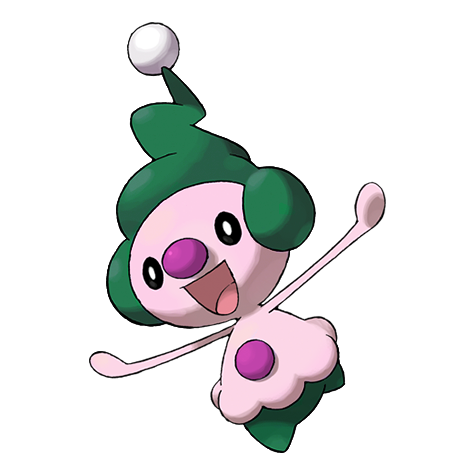

# #439 Mime Jr (Mime Pokémon)

| Official Artwork | Shiny Artwork |
| --- | --- |
|  |  |

It mimics the expressions and motions of those it sees to understand the feelings of others.

---

## Media

### Default Sprites

| Front | Back | Front Shiny | Back Shiny |
| --- | --- | --- | --- |
|  |  |  |  |

### Cries

Latest (Gen VI+):

<audio controls>
<source src='../../assets/cries/mime-jr/latest.ogg' type='audio/ogg'>
  Your browser does not support the audio element.
</audio>

Legacy:

<audio controls>
<source src='../../assets/cries/mime-jr/legacy.ogg' type='audio/ogg'>
  Your browser does not support the audio element.
</audio>

---

## Pokédex Data

| National № | Type(s) | Height | Weight | Abilities | Local № |
|------------|---------|--------|--------|-----------|---------|
| #439 | {: width='48'} {: width='48'} | 0.6 m | 13.0 kg | 1. Technician 2. Filter | N/A |

---

## Base Stats
|   | HP | Attack | Defense | Sp. Atk | Sp. Def | Speed |
|---|----|--------|---------|---------|---------|-------|
| **Base** | 20 | 15 | 45 | 80 | 90 | 65 |
| **Min** | 150 | 31 | 85 | 148 | 166 | 121 |
| **Max** | 244 | 141 | 207 | 284 | 306 | 251 |

The ranges shown above are for a level 100 Pokémon. Maximum values are based on a beneficial nature, 252 EVs, 31 IVs; minimum values are based on a hindering nature, 0 EVs, 0 IVs.

---

## Forms & Evolutions

!!! warning "WARNING"

    Information on evolutions may not be 100% accurate; differences between evolution methods across generations are not accounted for.

### Forms

Mime Jr has no alternate forms.

### Evolution Line

1. [Mime Jr](mime-jr.md/)
    1. Level Up: [Mr Mime](mr-mime.md/)

---

## Training

| EV Yield | Catch Rate | Base Friendship | Base Exp. | Growth Rate | Held Items |
|----------|------------|-----------------|-----------|-------------|------------|
| 1 Special Defense | 145 | 50 | 62 | Medium | leppa-berry (5%) |

---

## Breeding

| Egg Groups | Egg Cycles | Gender | Dimorphic | Color | Shape |
|------------|------------|--------|-----------|-------|-------|
| 1. No-Eggs | 25 | 50.0% Male 50.0% Female | False | Pink | Humanoid |

---

## Moves

!!! warning "WARNING"

    Specific move information may be incorrect. However, the general movepool should be accurate; this includes changes made in Blaze Black and Volt White.

### Level Up Moves

| Lv. | Move | Type | Cat. | Power | Acc. | PP |
| --- | --- | --- | --- | --- | --- | --- |
| 1 | Barrier | {: width='48'} | {: width='36'} | — | — | 20 |
| 1 | Confusion | {: width='48'} | {: width='36'} | 50 | 100 | 25 |
| 1 | Tickle | {: width='48'} | {: width='36'} | — | 100 | 20 |
| 4 | Copycat | {: width='48'} | {: width='36'} | — | — | 20 |
| 8 | Meditate | {: width='48'} | {: width='36'} | — | — | 40 |
| 11 | Encore | {: width='48'} | {: width='36'} | — | 100 | 5 |
| 13 | Hypnosis | {: width='48'} | {: width='36'} | — | 60 | 20 |
| 15 | Double Slap | {: width='48'} | {: width='36'} | 15 | 85 | 10 |
| 18 | Mimic | {: width='48'} | {: width='36'} | — | — | 10 |
| 22 | Light Screen | {: width='48'} | {: width='36'} | — | — | 30 |
| 22 | Reflect | {: width='48'} | {: width='36'} | — | — | 20 |
| 25 | Psybeam | {: width='48'} | {: width='36'} | 65 | 100 | 20 |
| 27 | Nasty Plot | {: width='48'} | {: width='36'} | — | — | 20 |
| 29 | Substitute | {: width='48'} | {: width='36'} | — | — | 10 |
| 32 | Recycle | {: width='48'} | {: width='36'} | — | — | 10 |
| 36 | Trick | {: width='48'} | {: width='36'} | — | 100 | 10 |
| 39 | Psychic | {: width='48'} | {: width='36'} | 90 | 100 | 10 |
| 43 | Role Play | {: width='48'} | {: width='36'} | — | — | 10 |
| 46 | Baton Pass | {: width='48'} | {: width='36'} | — | — | 40 |
| 50 | Safeguard | {: width='48'} | {: width='36'} | — | — | 25 |

### TM Moves

| TM | Move | Type | Cat. | Power | Acc. | PP |
| --- | --- | --- | --- | --- | --- | --- |
| TM03 | Psyshock | {: width='48'} | {: width='36'} | 80 | 100 | 10 |
| TM04 | Calm Mind | {: width='48'} | {: width='36'} | — | — | 20 |
| TM06 | Toxic | {: width='48'} | {: width='36'} | — | 90 | 10 |
| TM10 | Hidden Power | {: width='48'} | {: width='36'} | 60 | 100 | 15 |
| TM11 | Sunny Day | {: width='48'} | {: width='36'} | — | — | 5 |
| TM12 | Taunt | {: width='48'} | {: width='36'} | — | 100 | 20 |
| TM16 | Light Screen | {: width='48'} | {: width='36'} | — | — | 30 |
| TM17 | Protect | {: width='48'} | {: width='36'} | — | — | 10 |
| TM18 | Rain Dance | {: width='48'} | {: width='36'} | — | — | 5 |
| TM19 | Telekinesis | {: width='48'} | {: width='36'} | — | — | 15 |
| TM20 | Safeguard | {: width='48'} | {: width='36'} | — | — | 25 |
| TM21 | Frustration | {: width='48'} | {: width='36'} | — | 100 | 20 |
| TM22 | Solar Beam | {: width='48'} | {: width='36'} | 120 | 100 | 10 |
| TM24 | Thunderbolt | {: width='48'} | {: width='36'} | 90 | 100 | 15 |
| TM25 | Thunder | {: width='48'} | {: width='36'} | 110 | 70 | 10 |
| TM27 | Return | {: width='48'} | {: width='36'} | — | 100 | 20 |
| TM29 | Psychic | {: width='48'} | {: width='36'} | 90 | 100 | 10 |
| TM30 | Shadow Ball | {: width='48'} | {: width='36'} | 90 | 100 | 15 |
| TM31 | Brick Break | {: width='48'} | {: width='36'} | 75 | 100 | 15 |
| TM32 | Double Team | {: width='48'} | {: width='36'} | — | — | 15 |
| TM33 | Reflect | {: width='48'} | {: width='36'} | — | — | 20 |
| TM41 | Torment | {: width='48'} | {: width='36'} | — | 100 | 15 |
| TM42 | Facade | {: width='48'} | {: width='36'} | 70 | 100 | 20 |
| TM44 | Rest | {: width='48'} | {: width='36'} | — | — | 5 |
| TM45 | Attract | {: width='48'} | {: width='36'} | — | 100 | 15 |
| TM46 | Thief | {: width='48'} | {: width='36'} | 60 | 100 | 25 |
| TM48 | Round | {: width='48'} | {: width='36'} | 60 | 100 | 15 |
| TM56 | Fling | {: width='48'} | {: width='36'} | — | 100 | 10 |
| TM57 | Charge Beam | {: width='48'} | {: width='36'} | 50 | 90 | 10 |
| TM70 | Flash | {: width='48'} | {: width='36'} | — | 100 | 20 |
| TM73 | Thunder Wave | {: width='48'} | {: width='36'} | — | 90 | 20 |
| TM77 | Psych Up | {: width='48'} | {: width='36'} | — | — | 10 |
| TM85 | Dream Eater | {: width='48'} | {: width='36'} | 100 | 100 | 15 |
| TM86 | Grass Knot | {: width='48'} | {: width='36'} | — | 100 | 20 |
| TM87 | Swagger | {: width='48'} | {: width='36'} | — | 85 | 15 |
| TM90 | Substitute | {: width='48'} | {: width='36'} | — | — | 10 |
| TM92 | Trick Room | {: width='48'} | {: width='36'} | — | — | 5 |

### Egg Moves

| Move | Type | Cat. | Power | Acc. | PP |
| --- | --- | --- | --- | --- | --- |
| Hypnosis | {: width='48'} | {: width='36'} | — | 60 | 20 |
| Mimic | {: width='48'} | {: width='36'} | — | — | 10 |
| Confuse Ray | {: width='48'} | {: width='36'} | — | 100 | 10 |
| Icy Wind | {: width='48'} | {: width='36'} | 55 | 95 | 15 |
| Charm | {: width='48'} | {: width='36'} | — | 100 | 20 |
| Future Sight | {: width='48'} | {: width='36'} | 120 | 100 | 10 |
| Fake Out | {: width='48'} | {: width='36'} | 40 | 100 | 10 |
| Trick | {: width='48'} | {: width='36'} | — | 100 | 10 |
| Teeter Dance | {: width='48'} | {: width='36'} | — | 100 | 20 |
| Wake Up Slap | {: width='48'} | {: width='36'} | 70 | 100 | 10 |
| Healing Wish | {: width='48'} | {: width='36'} | — | — | 10 |
| Nasty Plot | {: width='48'} | {: width='36'} | — | — | 20 |
| Power Split | {: width='48'} | {: width='36'} | — | — | 10 |
| Magic Room | {: width='48'} | {: width='36'} | — | — | 10 |

### Tutor Moves

Mime Jr cannot learn any moves from tutors.
