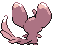

# #572 Minccino (Chinchilla Pokémon)

| Official Artwork | Shiny Artwork |
|------------------|---------------|
|  |  |

**Blaze Black:** They greet one another by rubbing each other with their tails, which are always kept well groomed and clean.

**Volt White:** These Pokémon prefer a tidy habitat. They are always sweeping and dusting, using their tails as brooms.

---

## Media

### Default Sprites

| Front | Shiny | Back | Shiny |
|-------|-------|------|-------|
|  |  |  |  |

### Cries

Latest (Gen VI+):

<audio controls>
<source src='../../assets/cries/minccino/latest.ogg' type='audio/ogg'>
  Your browser does not support the audio element.
</audio>

Legacy:

<audio controls>
<source src='../../assets/cries/minccino/legacy.ogg' type='audio/ogg'>
  Your browser does not support the audio element.
</audio>

---

## Pokédex Data

| National № | Type(s) | Height | Weight | Abilities | Local № |
|------------|---------|--------|--------|-----------|---------|
| #572 | {: width="48"} | 0.4 m / 1.3 ft | 5.8 kg / 12.8 lbs | 1. Skill Link 2. Technician | N/A |

---

## Base Stats
|   | HP | Attack | Defense | Sp. Atk | Sp. Def | Speed |
|---|----|--------|---------|---------|---------|-------|
| **Base** | 55 | 50 | 40 | 40 | 40 | 75 |
| **Min** | 220 | 94 | 76 | 76 | 76 | 139 |
| **Max** | 314 | 218 | 196 | 196 | 196 | 273 |

The ranges shown above are for a level 100 Pokémon. Maximum values are based on a beneficial nature, 252 EVs, 31 IVs; minimum values are based on a hindering nature, 0 EVs, 0 IVs.

---

## Forms & Evolutions

!!! warning "WARNING"

    Information on evolutions may not be 100% accurate; differences between evolution methods across generations are not accounted for.

### Forms

Minccino has no alternate forms.

### Evolution Line

1. [Minccino](minccino.md/)
    1. Use Item: [Cinccino](cinccino.md/)

---

## Training

| EV Yield | Catch Rate | Base Friendship | Base Exp. | Growth Rate | Held Items |
|----------|------------|-----------------|-----------|-------------|------------|
| 1 Spd | 255 | 50 | 60 | Fast | Chesto Berry (50%) |

---

## Breeding

| Egg Groups | Egg Cycles | Gender | Dimorphic | Color | Shape |
|------------|------------|--------|-----------|-------|-------|
| 1. Ground | 15 | 25.0% Male 75.0% Female | False | Gray | Quadruped |

---

## Moves

!!! warning "WARNING"

    Specific move information may be incorrect. However, the general movepool should be accurate; this includes changes made in Blaze Black and Volt White.

### Level Up Moves

| Lv. | Move | Type | Cat. | Power | Acc. | PP |
| --- | --- | --- | --- | --- | --- | --- |
| 1 | Pound | {: width="48"} | {: width="36"} | 40 | 100 | 35 |
| 3 | Growl | {: width="48"} | {: width="36"} | — | 100 | 40 |
| 7 | Helping Hand | {: width="48"} | {: width="36"} | — | — | 20 |
| 9 | Tickle | {: width="48"} | {: width="36"} | — | 100 | 20 |
| 13 | Double Slap | {: width="48"} | {: width="36"} | 15 | 85 | 10 |
| 15 | Encore | {: width="48"} | {: width="36"} | — | 100 | 5 |
| 19 | Swift | {: width="48"} | {: width="36"} | 60 | — | 20 |
| 21 | Sing | {: width="48"} | {: width="36"} | — | 55 | 15 |
| 23 | Iron Tail | {: width="48"} | {: width="36"} | 100 | 75 | 15 |
| 25 | Tail Slap | {: width="48"} | {: width="36"} | 25 | 85 | 10 |
| 27 | Charm | {: width="48"} | {: width="36"} | — | 100 | 20 |
| 29 | Aqua Tail | {: width="48"} | {: width="36"} | 90 | 90 | 10 |
| 31 | Wake Up Slap | {: width="48"} | {: width="36"} | 70 | 100 | 10 |
| 33 | Echoed Voice | {: width="48"} | {: width="36"} | 40 | 100 | 15 |
| 37 | Slam | {: width="48"} | {: width="36"} | 80 | 75 | 20 |
| 39 | Captivate | {: width="48"} | {: width="36"} | — | 100 | 20 |
| 43 | Hyper Voice | {: width="48"} | {: width="36"} | 90 | 100 | 10 |
| 45 | Last Resort | {: width="48"} | {: width="36"} | 140 | 100 | 5 |
| 49 | After You | {: width="48"} | {: width="36"} | — | — | 15 |

### TM Moves

| TM | Move | Type | Cat. | Power | Acc. | PP |
| --- | --- | --- | --- | --- | --- | --- |
| TM04 | Calm Mind | {: width="48"} | {: width="36"} | — | — | 20 |
| TM06 | Toxic | {: width="48"} | {: width="36"} | — | 90 | 10 |
| TM10 | Hidden Power | {: width="48"} | {: width="36"} | 60 | 100 | 15 |
| TM11 | Sunny Day | {: width="48"} | {: width="36"} | — | — | 5 |
| TM17 | Protect | {: width="48"} | {: width="36"} | — | — | 10 |
| TM18 | Rain Dance | {: width="48"} | {: width="36"} | — | — | 5 |
| TM20 | Safeguard | {: width="48"} | {: width="36"} | — | — | 25 |
| TM21 | Frustration | {: width="48"} | {: width="36"} | — | 100 | 20 |
| TM24 | Thunderbolt | {: width="48"} | {: width="36"} | 90 | 100 | 15 |
| TM27 | Return | {: width="48"} | {: width="36"} | — | 100 | 20 |
| TM28 | Dig | {: width="48"} | {: width="36"} | 100 | 100 | 10 |
| TM32 | Double Team | {: width="48"} | {: width="36"} | — | — | 15 |
| TM42 | Facade | {: width="48"} | {: width="36"} | 70 | 100 | 20 |
| TM44 | Rest | {: width="48"} | {: width="36"} | — | — | 5 |
| TM45 | Attract | {: width="48"} | {: width="36"} | — | 100 | 15 |
| TM46 | Thief | {: width="48"} | {: width="36"} | 60 | 100 | 25 |
| TM48 | Round | {: width="48"} | {: width="36"} | 60 | 100 | 15 |
| TM49 | Echoed Voice | {: width="48"} | {: width="36"} | 40 | 100 | 15 |
| TM56 | Fling | {: width="48"} | {: width="36"} | — | 100 | 10 |
| TM67 | Retaliate | {: width="48"} | {: width="36"} | 70 | 100 | 5 |
| TM73 | Thunder Wave | {: width="48"} | {: width="36"} | — | 90 | 20 |
| TM83 | Work Up | {: width="48"} | {: width="36"} | — | — | 30 |
| TM86 | Grass Knot | {: width="48"} | {: width="36"} | — | 100 | 20 |
| TM87 | Swagger | {: width="48"} | {: width="36"} | — | 85 | 15 |
| TM89 | U Turn | {: width="48"} | {: width="36"} | 70 | 100 | 20 |
| TM90 | Substitute | {: width="48"} | {: width="36"} | — | — | 10 |

### Egg Moves

| Move | Type | Cat. | Power | Acc. | PP |
| --- | --- | --- | --- | --- | --- |
| Tail Whip | {: width="48"} | {: width="36"} | — | 100 | 30 |
| Flail | {: width="48"} | {: width="36"} | — | 100 | 15 |
| Mud Slap | {: width="48"} | {: width="36"} | 20 | 100 | 10 |
| Endure | {: width="48"} | {: width="36"} | — | — | 10 |
| Sleep Talk | {: width="48"} | {: width="36"} | — | — | 10 |
| Iron Tail | {: width="48"} | {: width="36"} | 100 | 75 | 15 |
| Knock Off | {: width="48"} | {: width="36"} | 65 | 100 | 20 |
| Fake Tears | {: width="48"} | {: width="36"} | — | 100 | 20 |
| Aqua Tail | {: width="48"} | {: width="36"} | 90 | 90 | 10 |

### Tutor Moves

Minccino cannot learn any moves from tutors.
