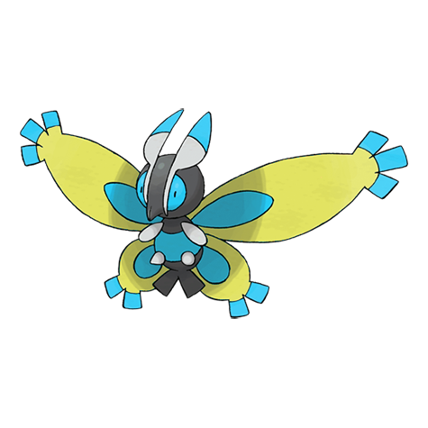
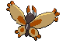
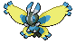
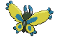

# #414 Mothim (Moth Pokémon)

| Official Artwork | Shiny Artwork |
| --- | --- |
|  |  |

While it loves floral honey, it won’t gather any itself. Instead, it plots to steal some from Combee.

---

## Media

### Sprites

| Front | Back | Front Shiny | Back Shiny |
| --- | --- | --- | --- |
|  |  |  |  |

### Cries

Latest (Gen VI+):

<audio controls>
<source src='../../assets/cries/mothim/latest.ogg' type='audio/ogg'>
  Your browser does not support the audio element.
</audio>

Legacy:

<audio controls>
<source src='../../assets/cries/mothim/legacy.ogg' type='audio/ogg'>
  Your browser does not support the audio element.
</audio>

---

## Pokédex Data

| National № | Type(s) | Height | Weight | Abilities | Local № |
|------------|---------|--------|--------|-----------|---------|
| #414 | {: width='48'} {: width='48'} | 0.9 m | 23.3 kg | 1. Swarm 2. Tinted-Lens | N/A |

---

## Base Stats
|   | HP | Attack | Defense | Sp. Atk | Sp. Def | Speed |
|---|----|--------|---------|---------|---------|-------|
| **Base** | 70 | 94 | 50 | 104 | 96 | 66 |
| **Min** | 250 | 173 | 94 | 191 | 177 | 123 |
| **Max** | 344 | 315 | 218 | 337 | 320 | 254 |

The ranges shown above are for a level 100 Pokémon. Maximum values are based on a beneficial nature, 252 EVs, 31 IVs; minimum values are based on a hindering nature, 0 EVs, 0 IVs.

---

## Forms & Evolutions

!!! warning "WARNING"

    Information on evolutions may not be 100% accurate; differences between evolution methods across generations are not accounted for.

### Forms

Mothim has no alternate forms.

### Evolution Line

1. [Burmy](burmy.md/)
    1. Level Up: [Wormadam-Plant](wormadam-plant.md/)

    1. Level Up: [Wormadam-Sandy](wormadam-sandy.md/)

    1. Level Up: [Wormadam-Trash](wormadam-trash.md/)

    2. Level Up: [Mothim](mothim.md/)

### Evolution Changes

---

## Training

| EV Yield | Catch Rate | Base Friendship | Base Exp. | Growth Rate | Held Items |
|----------|------------|-----------------|-----------|-------------|------------|
| 1 Attack 1 Special Attack | 45 | 70 | 148 | Medium | Silver Powder (5%) |

---

## Breeding

| Egg Groups | Egg Cycles | Gender | Dimorphic | Color | Shape |
|------------|------------|--------|-----------|-------|-------|
| 1. Bug | 15 | 100.0% Male 0.0% Female | False | Yellow | Bug-Wings |

---

## Moves

!!! warning "WARNING"

    Specific move information may be incorrect. However, the general movepool should be accurate; this includes changes made in Blaze Black and Volt White.

### Level Up Moves

| Lv. | Move | Type | Cat. | Power | Acc. | PP |
| --- | --- | --- | --- | --- | --- | --- |
| 1 | Giga Drain | {: width='48'} | {: width='36'} | 75 | 100 | 10 |
| 1 | Tackle | {: width='48'} | {: width='36'} | 40 | 100 | 35 |
| 10 | Protect | {: width='48'} | {: width='36'} | — | — | 10 |
| 15 | Bug Bite | {: width='48'} | {: width='36'} | 60 | 100 | 20 |
| 20 | Air Cutter | {: width='48'} | {: width='36'} | 60 | 95 | 25 |
| 20 | Hidden Power | {: width='48'} | {: width='36'} | 60 | 100 | 15 |
| 23 | Confusion | {: width='48'} | {: width='36'} | 50 | 100 | 25 |
| 26 | Gust | {: width='48'} | {: width='36'} | 40 | 100 | 35 |
| 29 | Poison Powder | {: width='48'} | {: width='36'} | — | 75 | 35 |
| 32 | Psybeam | {: width='48'} | {: width='36'} | 65 | 100 | 20 |
| 35 | Camouflage | {: width='48'} | {: width='36'} | — | — | 20 |
| 38 | Silver Wind | {: width='48'} | {: width='36'} | 60 | 100 | 5 |
| 41 | Air Slash | {: width='48'} | {: width='36'} | 75 | 95 | 15 |
| 44 | Psychic | {: width='48'} | {: width='36'} | 90 | 100 | 10 |
| 47 | Bug Buzz | {: width='48'} | {: width='36'} | 90 | 100 | 10 |
| 50 | Quiver Dance | {: width='48'} | {: width='36'} | — | — | 20 |
| 53 | Hurricane | {: width='48'} | {: width='36'} | 110 | 70 | 10 |

### TM Moves

| TM | Move | Type | Cat. | Power | Acc. | PP |
| --- | --- | --- | --- | --- | --- | --- |
| TM06 | Toxic | {: width='48'} | {: width='36'} | — | 90 | 10 |
| TM09 | Venoshock | {: width='48'} | {: width='36'} | 65 | 100 | 10 |
| TM10 | Hidden Power | {: width='48'} | {: width='36'} | 60 | 100 | 15 |
| TM11 | Sunny Day | {: width='48'} | {: width='36'} | — | — | 5 |
| TM15 | Hyper Beam | {: width='48'} | {: width='36'} | 150 | 90 | 5 |
| TM17 | Protect | {: width='48'} | {: width='36'} | — | — | 10 |
| TM18 | Rain Dance | {: width='48'} | {: width='36'} | — | — | 5 |
| TM20 | Safeguard | {: width='48'} | {: width='36'} | — | — | 25 |
| TM21 | Frustration | {: width='48'} | {: width='36'} | — | 100 | 20 |
| TM22 | Solar Beam | {: width='48'} | {: width='36'} | 120 | 100 | 10 |
| TM27 | Return | {: width='48'} | {: width='36'} | — | 100 | 20 |
| TM29 | Psychic | {: width='48'} | {: width='36'} | 90 | 100 | 10 |
| TM30 | Shadow Ball | {: width='48'} | {: width='36'} | 90 | 100 | 15 |
| TM32 | Double Team | {: width='48'} | {: width='36'} | — | — | 15 |
| TM40 | Aerial Ace | {: width='48'} | {: width='36'} | 60 | — | 20 |
| TM42 | Facade | {: width='48'} | {: width='36'} | 70 | 100 | 20 |
| TM44 | Rest | {: width='48'} | {: width='36'} | — | — | 5 |
| TM45 | Attract | {: width='48'} | {: width='36'} | — | 100 | 15 |
| TM46 | Thief | {: width='48'} | {: width='36'} | 60 | 100 | 25 |
| TM48 | Round | {: width='48'} | {: width='36'} | 60 | 100 | 15 |
| TM53 | Energy Ball | {: width='48'} | {: width='36'} | 90 | 100 | 10 |
| TM62 | Acrobatics | {: width='48'} | {: width='36'} | 55 | 100 | 15 |
| TM68 | Giga Impact | {: width='48'} | {: width='36'} | 150 | 90 | 5 |
| TM70 | Flash | {: width='48'} | {: width='36'} | — | 100 | 20 |
| TM76 | Struggle Bug | {: width='48'} | {: width='36'} | 50 | 100 | 20 |
| TM77 | Psych Up | {: width='48'} | {: width='36'} | — | — | 10 |
| TM85 | Dream Eater | {: width='48'} | {: width='36'} | 100 | 100 | 15 |
| TM87 | Swagger | {: width='48'} | {: width='36'} | — | 85 | 15 |
| TM89 | U Turn | {: width='48'} | {: width='36'} | 70 | 100 | 20 |
| TM90 | Substitute | {: width='48'} | {: width='36'} | — | — | 10 |

### Egg Moves

Mothim cannot learn any moves by breeding.
### Tutor Moves

Mothim cannot learn any moves from tutors.
