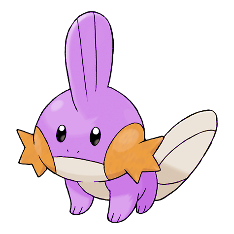
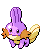
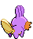

# #258 Mudkip (Mud Fish Pokémon)

| Official Artwork | Shiny Artwork |
|------------------|---------------|
|  |  |

To alert it, the fin on its head senses the flow of water. It has the strength to heft boulders.

---

## Media

### Default Sprites

| Front | Shiny | Back | Shiny |
|-------|-------|------|-------|
|  |  |  |  |

### Cries

Latest (Gen VI+):

<audio controls>
<source src='../../assets/cries/mudkip/latest.ogg' type='audio/ogg'>
  Your browser does not support the audio element.
</audio>

Legacy:

<audio controls>
<source src='../../assets/cries/mudkip/legacy.ogg' type='audio/ogg'>
  Your browser does not support the audio element.
</audio>

---

## Pokédex Data

| National № | Type(s) | Height | Weight | Abilities | Local № |
|------------|---------|--------|--------|-----------|---------|
| #258 | {: width="48"} | 0.4 m / 1.3 ft | 7.6 kg / 16.8 lbs | 1. Torrent 2. Mold Breaker | N/A |

---

## Base Stats
|   | HP | Attack | Defense | Sp. Atk | Sp. Def | Speed |
|---|----|--------|---------|---------|---------|-------|
| **Base** | 50 | 70 | 50 | 50 | 50 | 40 |
| **Min** | 210 | 130 | 94 | 94 | 94 | 76 |
| **Max** | 304 | 262 | 218 | 218 | 218 | 196 |

The ranges shown above are for a level 100 Pokémon. Maximum values are based on a beneficial nature, 252 EVs, 31 IVs; minimum values are based on a hindering nature, 0 EVs, 0 IVs.

---

## Forms & Evolutions

!!! warning "WARNING"

    Information on evolutions may not be 100% accurate; differences between evolution methods across generations are not accounted for.

### Forms

Mudkip has no alternate forms.

### Evolution Line

1. [Mudkip](mudkip.md/)
    1. Level Up: [Marshtomp](marshtomp.md/)
        1. Level Up: [Swampert](swampert.md/)

---

## Training

| EV Yield | Catch Rate | Base Friendship | Base Exp. | Growth Rate | Held Items |
|----------|------------|-----------------|-----------|-------------|------------|
| 1 Atk | 45 | 50 | 62 | Medium Slow | Mystic Water (50%) |

---

## Breeding

| Egg Groups | Egg Cycles | Gender | Dimorphic | Color | Shape |
|------------|------------|--------|-----------|-------|-------|
| 1. Monster 2. Water1 | 20 | 87.5% Male 12.5% Female | False | Blue | Quadruped |

---

## Moves

!!! warning "WARNING"

    Specific move information may be incorrect. However, the general movepool should be accurate; this includes changes made in Blaze Black and Volt White.

### Level Up Moves

| Lv. | Move | Type | Cat. | Power | Acc. | PP |
| --- | --- | --- | --- | --- | --- | --- |
| 1 | Growl | {: width="48"} | {: width="36"} | — | 100 | 40 |
| 1 | Tackle | {: width="48"} | {: width="36"} | 40 | 100 | 35 |
| 1 | Yawn | {: width="48"} | {: width="36"} | — | — | 10 |
| 6 | Mud Slap | {: width="48"} | {: width="36"} | 20 | 100 | 10 |
| 10 | Water Gun | {: width="48"} | {: width="36"} | 40 | 100 | 25 |
| 15 | Bide | {: width="48"} | {: width="36"} | — | — | 10 |
| 19 | Foresight | {: width="48"} | {: width="36"} | — | — | 40 |
| 21 | Ice Ball | {: width="48"} | {: width="36"} | 30 | 90 | 20 |
| 24 | Mud Sport | {: width="48"} | {: width="36"} | — | — | 15 |
| 28 | Take Down | {: width="48"} | {: width="36"} | 90 | 85 | 20 |
| 33 | Whirlpool | {: width="48"} | {: width="36"} | 35 | 85 | 15 |
| 37 | Protect | {: width="48"} | {: width="36"} | — | — | 10 |
| 42 | Hydro Pump | {: width="48"} | {: width="36"} | 110 | 80 | 5 |
| 46 | Endeavor | {: width="48"} | {: width="36"} | — | 100 | 5 |

### TM Moves

| TM | Move | Type | Cat. | Power | Acc. | PP |
| --- | --- | --- | --- | --- | --- | --- |
| HM03 | Surf | {: width="48"} | {: width="36"} | 90 | 100 | 15 |
| HM04 | Strength | {: width="48"} | {: width="36"} | 100 | 100 | 15 |
| HM05 | Waterfall | {: width="48"} | {: width="36"} | 85 | 100 | 15 |
| HM06 | Dive | {: width="48"} | {: width="36"} | 80 | 100 | 10 |
| TM06 | Toxic | {: width="48"} | {: width="36"} | — | 90 | 10 |
| TM07 | Hail | {: width="48"} | {: width="36"} | — | — | 10 |
| TM10 | Hidden Power | {: width="48"} | {: width="36"} | 60 | 100 | 15 |
| TM13 | Ice Beam | {: width="48"} | {: width="36"} | 90 | 100 | 10 |
| TM14 | Blizzard | {: width="48"} | {: width="36"} | 110 | 70 | 5 |
| TM17 | Protect | {: width="48"} | {: width="36"} | — | — | 10 |
| TM18 | Rain Dance | {: width="48"} | {: width="36"} | — | — | 5 |
| TM21 | Frustration | {: width="48"} | {: width="36"} | — | 100 | 20 |
| TM27 | Return | {: width="48"} | {: width="36"} | — | 100 | 20 |
| TM28 | Dig | {: width="48"} | {: width="36"} | 100 | 100 | 10 |
| TM32 | Double Team | {: width="48"} | {: width="36"} | — | — | 15 |
| TM34 | Sludge Wave | {: width="48"} | {: width="36"} | 95 | 100 | 10 |
| TM39 | Rock Tomb | {: width="48"} | {: width="36"} | 60 | 95 | 15 |
| TM42 | Facade | {: width="48"} | {: width="36"} | 70 | 100 | 20 |
| TM44 | Rest | {: width="48"} | {: width="36"} | — | — | 5 |
| TM45 | Attract | {: width="48"} | {: width="36"} | — | 100 | 15 |
| TM48 | Round | {: width="48"} | {: width="36"} | 60 | 100 | 15 |
| TM49 | Echoed Voice | {: width="48"} | {: width="36"} | 40 | 100 | 15 |
| TM55 | Scald | {: width="48"} | {: width="36"} | 80 | 100 | 15 |
| TM80 | Rock Slide | {: width="48"} | {: width="36"} | 75 | 90 | 10 |
| TM87 | Swagger | {: width="48"} | {: width="36"} | — | 85 | 15 |
| TM90 | Substitute | {: width="48"} | {: width="36"} | — | — | 10 |
| TM94 | Rock Smash | {: width="48"} | {: width="36"} | 60 | 100 | 15 |

### Egg Moves

| Move | Type | Cat. | Power | Acc. | PP |
| --- | --- | --- | --- | --- | --- |
| Stomp | {: width="48"} | {: width="36"} | 65 | 100 | 20 |
| Double Edge | {: width="48"} | {: width="36"} | 120 | 100 | 15 |
| Bite | {: width="48"} | {: width="36"} | 60 | 100 | 25 |
| Counter | {: width="48"} | {: width="36"} | — | 100 | 20 |
| Sludge | {: width="48"} | {: width="36"} | 75 | 100 | 15 |
| Curse | {: width="48"} | {: width="36"} | — | — | 10 |
| Mirror Coat | {: width="48"} | {: width="36"} | — | 100 | 20 |
| Ancient Power | {: width="48"} | {: width="36"} | 60 | 100 | 5 |
| Whirlpool | {: width="48"} | {: width="36"} | 35 | 85 | 15 |
| Uproar | {: width="48"} | {: width="36"} | 90 | 100 | 10 |
| Yawn | {: width="48"} | {: width="36"} | — | — | 10 |
| Refresh | {: width="48"} | {: width="36"} | — | — | 20 |
| Ice Ball | {: width="48"} | {: width="36"} | 30 | 90 | 20 |
| Avalanche | {: width="48"} | {: width="36"} | 60 | 100 | 10 |
| Mud Bomb | {: width="48"} | {: width="36"} | 65 | 85 | 10 |
| Wide Guard | {: width="48"} | {: width="36"} | — | — | 10 |

### Tutor Moves

| Move | Type | Cat. | Power | Acc. | PP |
| --- | --- | --- | --- | --- | --- |
| Water Pledge | {: width="48"} | {: width="36"} | 80 | 100 | 10 |

