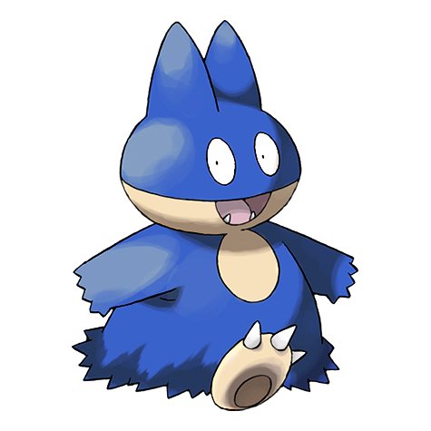
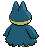

# #446 Munchlax (Big Eater Pokémon)

| Official Artwork | Shiny Artwork |
| --- | --- |
|  |  |

In its desperation to gulp down food, it forgets about the food it has hidden under its fur.

---

## Media

### Sprites

| Front | Back | Front Shiny | Back Shiny |
| --- | --- | --- | --- |
|  |  |  |  |

### Cries

Latest (Gen VI+):

<audio controls>
  <source src='../assets/cries/munchlax/latest.ogg' type='audio/ogg'>
  Your browser does not support the audio element.
</audio>

Legacy:

<audio controls>
  <source src='../assets/cries/munchlax/legacy.ogg' type='audio/ogg'>
  Your browser does not support the audio element.
</audio>

---

## Pokédex Data

| National № | Type(s) | Height | Weight | Abilities | Local № |
|------------|---------|--------|--------|-----------|---------|
| #446 | {: width='48'} | 0.6 m | 105.0 kg | 1. Gluttony 2. Thick-Fat | #N/A |

---

## Base Stats
---

## Base Stats
|   | HP | Attack | Defense | Sp. Atk | Sp. Def | Speed |
|---|----|--------|---------|---------|---------|-------|
| **Base** | 135 | 85 | 40 | 40 | 85 | 5 |
| **Min** | 380 | 157 | 76 | 76 | 157 | 13 |
| **Max** | 474 | 295 | 196 | 196 | 295 | 119 |

The ranges shown above are for a level 100 Pokémon. Maximum values are based on a beneficial nature, 252 EVs, 31 IVs; minimum values are based on a hindering nature, 0 EVs, 0 IVs.

---

## Forms & Evolutions

!!! warning "WARNING"

    Some forms may not be available in Blaze Black/Volt White. Also information on evolutions may not be 100% accurate; it is currently quite complex to track generational evolution data.

### Forms

Munchlax has no alternate forms.

### Evolution Line

1. [Munchlax](munchlax.md/)
1. Level Up: [Snorlax](snorlax.md/)

---

## Training

| EV Yield | Catch Rate | Base Friendship | Base Exp. | Growth Rate | Held Items |
|----------|------------|-----------------|-----------|-------------|------------|
| 1 Hp | 50 | 180 | 78 | Slow | Leftovers (100%) |

---

## Breeding

| Egg Groups | Egg Cycles | Gender | Dimorphic | Color | Shape |
|------------|------------|--------|-----------|-------|-------|
| 1. No-Eggs | 40 | 87.5% Male 12.5% Female | False | Black | Humanoid |

---

## Moves

!!! warning "WARNING"

    Specific move information may be incorrect. However, the general movepool should be accurate (including changes to learnset).

### Level Up Moves

Lv. | Move | Type | Cat. | Power | Acc. | PP
--- | --- | --- | --- | --- | --- | ---
| 1 | Lovely Kiss | {: width='48'} | {: width='36'} | — | 75 | 10 |
| 1 | Metronome | {: width='48'} | {: width='36'} | — | — | 10 |
| 1 | Odor Sleuth | {: width='48'} | {: width='36'} | — | — | 40 |
| 1 | Sweet Kiss | {: width='48'} | {: width='36'} | — | 75 | 10 |
| 1 | Tackle | {: width='48'} | {: width='36'} | 40 | 100 | 35 |
| 4 | Defense Curl | {: width='48'} | {: width='36'} | — | — | 40 |
| 9 | Amnesia | {: width='48'} | {: width='36'} | — | — | 20 |
| 12 | Lick | {: width='48'} | {: width='36'} | 30 | 100 | 30 |
| 17 | Recycle | {: width='48'} | {: width='36'} | — | — | 10 |
| 20 | Screech | {: width='48'} | {: width='36'} | — | 85 | 40 |
| 25 | Chip Away | {: width='48'} | {: width='36'} | 70 | 100 | 20 |
| 28 | Stockpile | {: width='48'} | {: width='36'} | — | — | 20 |
| 33 | Swallow | {: width='48'} | {: width='36'} | — | — | 10 |
| 36 | Body Slam | {: width='48'} | {: width='36'} | 85 | 100 | 15 |
| 41 | Fling | {: width='48'} | {: width='36'} | — | 100 | 10 |
| 44 | Rollout | {: width='48'} | {: width='36'} | 30 | 90 | 20 |
| 49 | Natural Gift | {: width='48'} | {: width='36'} | — | 100 | 15 |
| 52 | Snatch | {: width='48'} | {: width='36'} | — | — | 10 |
| 57 | Last Resort | {: width='48'} | {: width='36'} | 140 | 100 | 5 |
| 62 | Slack Off | {: width='48'} | {: width='36'} | — | — | 5 |
| 67 | Double Edge | {: width='48'} | {: width='36'} | 120 | 100 | 15 |
| 72 | Self Destruct | {: width='48'} | {: width='36'} | 200 | 100 | 5 |
| 72 | Self Destruct | {: width='48'} | {: width='36'} | 200 | 100 | 5 |

### TM Moves

TM | Move | Type | Cat. | Power | Acc. | PP
--- | --- | --- | --- | --- | --- | ---
| HM03 | Surf | {: width='48'} | {: width='36'} | 90 | 100 | 15 |
| HM04 | Strength | {: width='48'} | {: width='36'} | 85 | 100 | 15 |
| TM06 | Toxic | {: width='48'} | {: width='36'} | — | 90 | 10 |
| TM10 | Hidden Power | {: width='48'} | {: width='36'} | 60 | 100 | 15 |
| TM11 | Sunny Day | {: width='48'} | {: width='36'} | — | — | 5 |
| TM13 | Ice Beam | {: width='48'} | {: width='36'} | 90 | 100 | 10 |
| TM14 | Blizzard | {: width='48'} | {: width='36'} | 110 | 70 | 5 |
| TM17 | Protect | {: width='48'} | {: width='36'} | — | — | 10 |
| TM18 | Rain Dance | {: width='48'} | {: width='36'} | — | — | 5 |
| TM21 | Frustration | {: width='48'} | {: width='36'} | — | 100 | 20 |
| TM22 | Solar Beam | {: width='48'} | {: width='36'} | 120 | 100 | 10 |
| TM24 | Thunderbolt | {: width='48'} | {: width='36'} | 90 | 100 | 15 |
| TM25 | Thunder | {: width='48'} | {: width='36'} | 110 | 70 | 10 |
| TM26 | Earthquake | {: width='48'} | {: width='36'} | 100 | 100 | 10 |
| TM27 | Return | {: width='48'} | {: width='36'} | — | 100 | 20 |
| TM29 | Psychic | {: width='48'} | {: width='36'} | 90 | 100 | 10 |
| TM30 | Shadow Ball | {: width='48'} | {: width='36'} | 90 | 100 | 15 |
| TM31 | Brick Break | {: width='48'} | {: width='36'} | 75 | 100 | 15 |
| TM32 | Double Team | {: width='48'} | {: width='36'} | — | — | 15 |
| TM35 | Flamethrower | {: width='48'} | {: width='36'} | 90 | 100 | 15 |
| TM37 | Sandstorm | {: width='48'} | {: width='36'} | — | — | 10 |
| TM38 | Fire Blast | {: width='48'} | {: width='36'} | 110 | 85 | 5 |
| TM39 | Rock Tomb | {: width='48'} | {: width='36'} | 60 | 95 | 15 |
| TM42 | Facade | {: width='48'} | {: width='36'} | 70 | 100 | 20 |
| TM44 | Rest | {: width='48'} | {: width='36'} | — | — | 5 |
| TM45 | Attract | {: width='48'} | {: width='36'} | — | 100 | 15 |
| TM48 | Round | {: width='48'} | {: width='36'} | 60 | 100 | 15 |
| TM56 | Fling | {: width='48'} | {: width='36'} | — | 100 | 10 |
| TM59 | Incinerate | {: width='48'} | {: width='36'} | 50 | 100 | 15 |
| TM67 | Retaliate | {: width='48'} | {: width='36'} | 70 | 100 | 5 |
| TM78 | Bulldoze | {: width='48'} | {: width='36'} | 80 | 100 | 20 |
| TM80 | Rock Slide | {: width='48'} | {: width='36'} | 80 | 95 | 10 |
| TM83 | Work Up | {: width='48'} | {: width='36'} | — | — | 30 |
| TM87 | Swagger | {: width='48'} | {: width='36'} | — | 85 | 15 |
| TM90 | Substitute | {: width='48'} | {: width='36'} | — | — | 10 |
| TM94 | Rock Smash | {: width='48'} | {: width='36'} | 40 | 100 | 15 |

### Egg Moves

Move | Type | Cat. | Power | Acc. | PP
--- | --- | --- | --- | --- | ---
| Whirlwind | {: width='48'} | {: width='36'} | — | — | 20 |
| Counter | {: width='48'} | {: width='36'} | — | 100 | 20 |
| Lick | {: width='48'} | {: width='36'} | 30 | 100 | 30 |
| Curse | {: width='48'} | {: width='36'} | — | — | 10 |
| Charm | {: width='48'} | {: width='36'} | — | 100 | 20 |
| Pursuit | {: width='48'} | {: width='36'} | 40 | 100 | 20 |
| Natural Gift | {: width='48'} | {: width='36'} | — | 100 | 15 |
| Zen Headbutt | {: width='48'} | {: width='36'} | 80 | 90 | 15 |
| After You | {: width='48'} | {: width='36'} | — | — | 15 |

### Tutor Moves

Munchlax cannot learn any moves from tutors.
