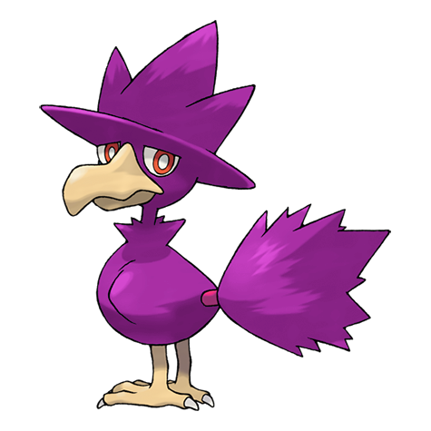

# #198 Murkrow (Darkness Pokémon)

| Official Artwork | Shiny Artwork |
| --- | --- |
|  |  |

If spotted, it will lure an unwary person into chasing it, then lose the pursuer on mountain trails.

---

## Media

### Sprites

| Front | Back | Front Shiny | Back Shiny |
| --- | --- | --- | --- |
|  |  |  |  |

### Female Sprites

| Front | Back | Front Shiny | Back Shiny |
| --- | --- | --- | --- |
|  |  |  |  |

### Cries

Latest (Gen VI+):

<audio controls>
  <source src='../assets/cries/198/latest.ogg' type='audio/ogg'>
  Your browser does not support the audio element.
</audio>

Legacy:

<audio controls>
  <source src='../assets/cries/198/legacy.ogg' type='audio/ogg'>
  Your browser does not support the audio element.
</audio>

---

## Pokédex Data

| National № | Type(s) | Height | Weight | Abilities | Local № |
|------------|---------|--------|--------|-----------|---------|
| #198 | {: width='48'} {: width='48'} | 0.5 m | 2.1 kg | 1. Prankster 2. Super-Luck | #N/A |

---

## Base Stats
---

## Base Stats
|   | HP | Attack | Defense | Sp. Atk | Sp. Def | Speed |
|---|----|--------|---------|---------|---------|-------|
| **Base** | 60 | 85 | 42 | 85 | 42 | 91 |
| **Min** | 230 | 157 | 80 | 157 | 80 | 168 |
| **Max** | 324 | 295 | 201 | 295 | 201 | 309 |

The ranges shown above are for a level 100 Pokémon. Maximum values are based on a beneficial nature, 252 EVs, 31 IVs; minimum values are based on a hindering nature, 0 EVs, 0 IVs.

---

## Forms & Evolutions

!!! warning "WARNING"

    Some forms may not be available in Blaze Black/Volt White. Also information on evolutions may not be 100% accurate; it is currently quite complex to track generational evolution data.

### Forms

Murkrow has no alternate forms.

### Evolution Line

1. [Murkrow](murkrow.md/)
1. Use Item: [Honchkrow](honchkrow.md/)

---

## Training

| EV Yield | Catch Rate | Base Friendship | Base Exp. | Growth Rate | Held Items |
|----------|------------|-----------------|-----------|-------------|------------|
| 1 Speed | 30 | 35 | 81 | Medium-Slow | N/A |

---

## Breeding

| Egg Groups | Egg Cycles | Gender | Dimorphic | Color | Shape |
|------------|------------|--------|-----------|-------|-------|
| 1. Flying | 20 | 50.0% Male 50.0% Female | True | Black | Wings |

---

## Moves

!!! warning "WARNING"

    Specific move information may be incorrect. However, the general movepool should be accurate (including changes to learnset).

### Level Up Moves

Lv. | Move | Type | Cat. | Power | Acc. | PP
--- | --- | --- | --- | --- | --- | ---
| 1 | Astonish | {: width='48'} | {: width='36'} | 30 | 100 | 15 |
| 1 | Beat Up | {: width='48'} | {: width='36'} | — | 100 | 10 |
| 1 | Peck | {: width='48'} | {: width='36'} | 35 | 100 | 35 |
| 5 | Pursuit | {: width='48'} | {: width='36'} | 40 | 100 | 20 |
| 11 | Haze | {: width='48'} | {: width='36'} | — | — | 30 |
| 15 | Wing Attack | {: width='48'} | {: width='36'} | 75 | 100 | 35 |
| 21 | Night Shade | {: width='48'} | {: width='36'} | — | 100 | 15 |
| 25 | Assurance | {: width='48'} | {: width='36'} | 60 | 100 | 10 |
| 31 | Taunt | {: width='48'} | {: width='36'} | — | 100 | 20 |
| 35 | Drill Peck | {: width='48'} | {: width='36'} | 80 | 100 | 20 |
| 35 | Feint Attack | {: width='48'} | {: width='36'} | 60 | — | 20 |
| 41 | Mean Look | {: width='48'} | {: width='36'} | — | — | 5 |
| 45 | Foul Play | {: width='48'} | {: width='36'} | 95 | 100 | 15 |
| 51 | Tailwind | {: width='48'} | {: width='36'} | — | — | 15 |
| 55 | Sucker Punch | {: width='48'} | {: width='36'} | 70 | 100 | 5 |
| 61 | Torment | {: width='48'} | {: width='36'} | — | 100 | 15 |
| 65 | Quash | {: width='48'} | {: width='36'} | — | 100 | 15 |
| 71 | Brave Bird | {: width='48'} | {: width='36'} | 120 | 100 | 15 |

### TM Moves

TM | Move | Type | Cat. | Power | Acc. | PP
--- | --- | --- | --- | --- | --- | ---
| HM02 | Fly | {: width='48'} | {: width='36'} | 100 | 100 | 15 |
| TM04 | Calm Mind | {: width='48'} | {: width='36'} | — | — | 20 |
| TM06 | Toxic | {: width='48'} | {: width='36'} | — | 90 | 10 |
| TM10 | Hidden Power | {: width='48'} | {: width='36'} | 60 | 100 | 15 |
| TM11 | Sunny Day | {: width='48'} | {: width='36'} | — | — | 5 |
| TM12 | Taunt | {: width='48'} | {: width='36'} | — | 100 | 20 |
| TM17 | Protect | {: width='48'} | {: width='36'} | — | — | 10 |
| TM18 | Rain Dance | {: width='48'} | {: width='36'} | — | — | 5 |
| TM21 | Frustration | {: width='48'} | {: width='36'} | — | 100 | 20 |
| TM27 | Return | {: width='48'} | {: width='36'} | — | 100 | 20 |
| TM29 | Psychic | {: width='48'} | {: width='36'} | 90 | 100 | 10 |
| TM30 | Shadow Ball | {: width='48'} | {: width='36'} | 90 | 100 | 15 |
| TM32 | Double Team | {: width='48'} | {: width='36'} | — | — | 15 |
| TM40 | Aerial Ace | {: width='48'} | {: width='36'} | 60 | — | 20 |
| TM41 | Torment | {: width='48'} | {: width='36'} | — | 100 | 15 |
| TM42 | Facade | {: width='48'} | {: width='36'} | 70 | 100 | 20 |
| TM44 | Rest | {: width='48'} | {: width='36'} | — | — | 5 |
| TM45 | Attract | {: width='48'} | {: width='36'} | — | 100 | 15 |
| TM46 | Thief | {: width='48'} | {: width='36'} | 60 | 100 | 25 |
| TM48 | Round | {: width='48'} | {: width='36'} | 60 | 100 | 15 |
| TM60 | Quash | {: width='48'} | {: width='36'} | — | 100 | 15 |
| TM63 | Embargo | {: width='48'} | {: width='36'} | — | 100 | 15 |
| TM66 | Payback | {: width='48'} | {: width='36'} | 50 | 100 | 10 |
| TM67 | Retaliate | {: width='48'} | {: width='36'} | 70 | 100 | 5 |
| TM73 | Thunder Wave | {: width='48'} | {: width='36'} | — | 90 | 20 |
| TM77 | Psych Up | {: width='48'} | {: width='36'} | — | — | 10 |
| TM85 | Dream Eater | {: width='48'} | {: width='36'} | 100 | 100 | 15 |
| TM87 | Swagger | {: width='48'} | {: width='36'} | — | 85 | 15 |
| TM88 | Pluck | {: width='48'} | {: width='36'} | 60 | 100 | 20 |
| TM90 | Substitute | {: width='48'} | {: width='36'} | — | — | 10 |
| TM95 | Snarl | {: width='48'} | {: width='36'} | 60 | 95 | 15 |

### Egg Moves

Move | Type | Cat. | Power | Acc. | PP
--- | --- | --- | --- | --- | ---
| Wing Attack | {: width='48'} | {: width='36'} | 75 | 100 | 35 |
| Whirlwind | {: width='48'} | {: width='36'} | — | — | 20 |
| Screech | {: width='48'} | {: width='36'} | — | 85 | 40 |
| Confuse Ray | {: width='48'} | {: width='36'} | — | 100 | 10 |
| Mirror Move | {: width='48'} | {: width='36'} | — | — | 20 |
| Sky Attack | {: width='48'} | {: width='36'} | 140 | 90 | 5 |
| Feint Attack | {: width='48'} | {: width='36'} | 60 | — | 20 |
| Perish Song | {: width='48'} | {: width='36'} | — | — | 5 |
| Feather Dance | {: width='48'} | {: width='36'} | — | 100 | 15 |
| Roost | {: width='48'} | {: width='36'} | — | — | 5 |
| Assurance | {: width='48'} | {: width='36'} | 60 | 100 | 10 |
| Psycho Shift | {: width='48'} | {: width='36'} | — | 100 | 10 |

### Tutor Moves

Murkrow cannot learn any moves from tutors.
