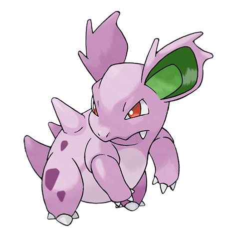
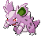
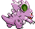

# Nidorina (Poison Pin Pokémon)

| Official Artwork | Shiny Artwork |
| --- | --- |
|  |  |

When it senses danger, it raises all the barbs on its body. These barbs grow slower than Nidorino’s.

---

## Media

### Default Sprites

| Front | Back | Front Shiny | Back Shiny |
| --- | --- | --- | --- |
|  |  |  |  |

### Cries

Latest (Gen VI+):

<audio controls>
<source src='../../assets/cries/nidorina/latest.ogg' type='audio/ogg'>
  Your browser does not support the audio element.
</audio>

Legacy:

<audio controls>
<source src='../../assets/cries/nidorina/legacy.ogg' type='audio/ogg'>
  Your browser does not support the audio element.
</audio>

---

## Pokédex Data

| National № | Type(s) | Height | Weight | Abilities | Local № |
|------------|---------|--------|--------|-----------|---------|
| #30 | {: width='48'} | 0.8 m | 20.0 kg | 1. Hustle 2. Rivalry | N/A |

---

## Base Stats
|   | HP | Attack | Defense | Sp. Atk | Sp. Def | Speed |
|---|----|--------|---------|---------|---------|-------|
| **Base** | 70 | 62 | 67 | 55 | 55 | 56 |
| **Min** | 250 | 116 | 125 | 103 | 103 | 105 |
| **Max** | 344 | 245 | 256 | 229 | 229 | 232 |

The ranges shown above are for a level 100 Pokémon. Maximum values are based on a beneficial nature, 252 EVs, 31 IVs; minimum values are based on a hindering nature, 0 EVs, 0 IVs.

---

## Forms & Evolutions

!!! warning "WARNING"

    Information on evolutions may not be 100% accurate; differences between evolution methods across generations are not accounted for.

### Forms

Nidorina has no alternate forms.

### Evolution Line

1. [Nidoran F](nidoran-f.md/)
    1. Level Up: [Nidorina](nidorina.md/)
        1. Use Item: [Nidoqueen](nidoqueen.md/)

---

## Training

| EV Yield | Catch Rate | Base Friendship | Base Exp. | Growth Rate | Held Items |
|----------|------------|-----------------|-----------|-------------|------------|
| 2 Hp | 120 | 50 | 128 | Medium-Slow | N/A |

---

## Breeding

| Egg Groups | Egg Cycles | Gender | Dimorphic | Color | Shape |
|------------|------------|--------|-----------|-------|-------|
| 1. No-Eggs | 20 | 0.0% Male 100.0% Female | False | Blue | Quadruped |

---

## Moves

!!! warning "WARNING"

    Specific move information may be incorrect. However, the general movepool should be accurate; this includes changes made in Blaze Black and Volt White.

### Level Up Moves

| Lv. | Move | Type | Cat. | Power | Acc. | PP |
| --- | --- | --- | --- | --- | --- | --- |
| 1 | Growl | {: width='48'} | {: width='36'} | — | 100 | 40 |
| 1 | Scratch | {: width='48'} | {: width='36'} | 40 | 100 | 35 |
| 7 | Tail Whip | {: width='48'} | {: width='36'} | — | 100 | 30 |
| 9 | Double Kick | {: width='48'} | {: width='36'} | 30 | 100 | 30 |
| 13 | Poison Sting | {: width='48'} | {: width='36'} | 15 | 100 | 35 |
| 20 | Fury Swipes | {: width='48'} | {: width='36'} | 18 | 80 | 15 |
| 23 | Bite | {: width='48'} | {: width='36'} | 60 | 100 | 25 |
| 28 | Helping Hand | {: width='48'} | {: width='36'} | — | — | 20 |
| 31 | Super Fang | {: width='48'} | {: width='36'} | — | 90 | 10 |
| 35 | Toxic Spikes | {: width='48'} | {: width='36'} | — | — | 20 |
| 38 | Flatter | {: width='48'} | {: width='36'} | — | 100 | 15 |
| 43 | Crunch | {: width='48'} | {: width='36'} | 80 | 100 | 15 |
| 50 | Captivate | {: width='48'} | {: width='36'} | — | 100 | 20 |
| 58 | Poison Fang | {: width='48'} | {: width='36'} | 50 | 100 | 15 |

### TM Moves

| TM | Move | Type | Cat. | Power | Acc. | PP |
| --- | --- | --- | --- | --- | --- | --- |
| HM01 | Cut | {: width='48'} | {: width='36'} | 50 | 95 | 30 |
| HM04 | Strength | {: width='48'} | {: width='36'} | 80 | 100 | 15 |
| TM01 | Hone Claws | {: width='48'} | {: width='36'} | — | — | 15 |
| TM06 | Toxic | {: width='48'} | {: width='36'} | — | 90 | 10 |
| TM09 | Venoshock | {: width='48'} | {: width='36'} | 65 | 100 | 10 |
| TM10 | Hidden Power | {: width='48'} | {: width='36'} | 60 | 100 | 15 |
| TM11 | Sunny Day | {: width='48'} | {: width='36'} | — | — | 5 |
| TM13 | Ice Beam | {: width='48'} | {: width='36'} | 90 | 100 | 10 |
| TM14 | Blizzard | {: width='48'} | {: width='36'} | 110 | 70 | 5 |
| TM17 | Protect | {: width='48'} | {: width='36'} | — | — | 10 |
| TM18 | Rain Dance | {: width='48'} | {: width='36'} | — | — | 5 |
| TM21 | Frustration | {: width='48'} | {: width='36'} | — | 100 | 20 |
| TM24 | Thunderbolt | {: width='48'} | {: width='36'} | 90 | 100 | 15 |
| TM25 | Thunder | {: width='48'} | {: width='36'} | 110 | 70 | 10 |
| TM27 | Return | {: width='48'} | {: width='36'} | — | 100 | 20 |
| TM28 | Dig | {: width='48'} | {: width='36'} | 100 | 100 | 10 |
| TM32 | Double Team | {: width='48'} | {: width='36'} | — | — | 15 |
| TM36 | Sludge Bomb | {: width='48'} | {: width='36'} | 90 | 100 | 10 |
| TM40 | Aerial Ace | {: width='48'} | {: width='36'} | 60 | — | 20 |
| TM42 | Facade | {: width='48'} | {: width='36'} | 70 | 100 | 20 |
| TM44 | Rest | {: width='48'} | {: width='36'} | — | — | 5 |
| TM45 | Attract | {: width='48'} | {: width='36'} | — | 100 | 15 |
| TM46 | Thief | {: width='48'} | {: width='36'} | 60 | 100 | 25 |
| TM48 | Round | {: width='48'} | {: width='36'} | 60 | 100 | 15 |
| TM49 | Echoed Voice | {: width='48'} | {: width='36'} | 40 | 100 | 15 |
| TM65 | Shadow Claw | {: width='48'} | {: width='36'} | 80 | 100 | 15 |
| TM84 | Poison Jab | {: width='48'} | {: width='36'} | 80 | 100 | 20 |
| TM87 | Swagger | {: width='48'} | {: width='36'} | — | 85 | 15 |
| TM90 | Substitute | {: width='48'} | {: width='36'} | — | — | 10 |
| TM94 | Rock Smash | {: width='48'} | {: width='36'} | 40 | 100 | 15 |

### Egg Moves

Nidorina cannot learn any moves by breeding.
### Tutor Moves

Nidorina cannot learn any moves from tutors.
