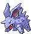
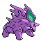
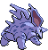

# #033 Nidorino (Poison Pin Pokémon)

| Official Artwork | Shiny Artwork |
|------------------|---------------|
|  |  |

It has a violent disposition and stabs foes with its horn, which oozes poison upon impact.

---

## Media

### Default Sprites

| Front | Shiny | Back | Shiny |
|-------|-------|------|-------|
|  |  |  |  |

### Cries

Latest (Gen VI+):

<audio controls>
<source src='../../assets/cries/nidorino/latest.ogg' type='audio/ogg'>
  Your browser does not support the audio element.
</audio>

Legacy:

<audio controls>
<source src='../../assets/cries/nidorino/legacy.ogg' type='audio/ogg'>
  Your browser does not support the audio element.
</audio>

---

## Pokédex Data

| National № | Type(s) | Height | Weight | Abilities | Local № |
|------------|---------|--------|--------|-----------|---------|
| #33 | {: width="48"} | 0.9 m / 3.0 ft | 19.5 kg / 43.0 lbs | 1. Hustle 2. Rivalry | N/A |

---

## Base Stats
|   | HP | Attack | Defense | Sp. Atk | Sp. Def | Speed |
|---|----|--------|---------|---------|---------|-------|
| **Base** | 61 | 72 | 57 | 55 | 55 | 65 |
| **Min** | 232 | 134 | 107 | 103 | 103 | 121 |
| **Max** | 326 | 267 | 234 | 229 | 229 | 251 |

The ranges shown above are for a level 100 Pokémon. Maximum values are based on a beneficial nature, 252 EVs, 31 IVs; minimum values are based on a hindering nature, 0 EVs, 0 IVs.

---

## Forms & Evolutions

!!! warning "WARNING"

    Information on evolutions may not be 100% accurate; differences between evolution methods across generations are not accounted for.

### Forms

Nidorino has no alternate forms.

### Evolution Line

1. [Nidoran M](nidoran-m.md/)
    1. Level Up: [Nidorino](nidorino.md/)
        1. Use Item: [Nidoking](nidoking.md/)

---

## Training

| EV Yield | Catch Rate | Base Friendship | Base Exp. | Growth Rate | Held Items |
|----------|------------|-----------------|-----------|-------------|------------|
| 2 Atk | 120 | 50 | 128 | Medium Slow | N/A |

---

## Breeding

| Egg Groups | Egg Cycles | Gender | Dimorphic | Color | Shape |
|------------|------------|--------|-----------|-------|-------|
| 1. Monster 2. Ground | 20 | 100.0% Male 0.0% Female | False | Purple | Quadruped |

---

## Moves

!!! warning "WARNING"

    Specific move information may be incorrect. However, the general movepool should be accurate; this includes changes made in Blaze Black and Volt White.

### Level Up Moves

| Lv. | Move | Type | Cat. | Power | Acc. | PP |
| --- | --- | --- | --- | --- | --- | --- |
| 1 | Leer | {: width="48"} | {: width="36"} | — | 100 | 30 |
| 1 | Peck | {: width="48"} | {: width="36"} | 35 | 100 | 35 |
| 7 | Focus Energy | {: width="48"} | {: width="36"} | — | — | 30 |
| 9 | Double Kick | {: width="48"} | {: width="36"} | 30 | 100 | 30 |
| 13 | Poison Sting | {: width="48"} | {: width="36"} | 15 | 100 | 35 |
| 20 | Fury Attack | {: width="48"} | {: width="36"} | 15 | 85 | 20 |
| 23 | Horn Attack | {: width="48"} | {: width="36"} | 65 | 100 | 25 |
| 28 | Helping Hand | {: width="48"} | {: width="36"} | — | — | 20 |
| 31 | Super Fang | {: width="48"} | {: width="36"} | — | 90 | 10 |
| 35 | Toxic Spikes | {: width="48"} | {: width="36"} | — | — | 20 |
| 38 | Flatter | {: width="48"} | {: width="36"} | — | 100 | 15 |
| 43 | Poison Jab | {: width="48"} | {: width="36"} | 80 | 100 | 20 |
| 50 | Captivate | {: width="48"} | {: width="36"} | — | 100 | 20 |
| 58 | Drill Run | {: width="48"} | {: width="36"} | 80 | 95 | 10 |

### TM Moves

| TM | Move | Type | Cat. | Power | Acc. | PP |
| --- | --- | --- | --- | --- | --- | --- |
| HM01 | Cut | {: width="48"} | {: width="36"} | 60 | 100% | 25 |
| HM04 | Strength | {: width="48"} | {: width="36"} | 100 | 100 | 15 |
| TM01 | Hone Claws | {: width="48"} | {: width="36"} | — | — | 15 |
| TM06 | Toxic | {: width="48"} | {: width="36"} | — | 90 | 10 |
| TM09 | Venoshock | {: width="48"} | {: width="36"} | 65 | 100 | 10 |
| TM10 | Hidden Power | {: width="48"} | {: width="36"} | 60 | 100 | 15 |
| TM11 | Sunny Day | {: width="48"} | {: width="36"} | — | — | 5 |
| TM13 | Ice Beam | {: width="48"} | {: width="36"} | 90 | 100 | 10 |
| TM14 | Blizzard | {: width="48"} | {: width="36"} | 110 | 70 | 5 |
| TM17 | Protect | {: width="48"} | {: width="36"} | — | — | 10 |
| TM18 | Rain Dance | {: width="48"} | {: width="36"} | — | — | 5 |
| TM21 | Frustration | {: width="48"} | {: width="36"} | — | 100 | 20 |
| TM24 | Thunderbolt | {: width="48"} | {: width="36"} | 90 | 100 | 15 |
| TM25 | Thunder | {: width="48"} | {: width="36"} | 110 | 70 | 10 |
| TM27 | Return | {: width="48"} | {: width="36"} | — | 100 | 20 |
| TM28 | Dig | {: width="48"} | {: width="36"} | 100 | 100 | 10 |
| TM32 | Double Team | {: width="48"} | {: width="36"} | — | — | 15 |
| TM36 | Sludge Bomb | {: width="48"} | {: width="36"} | 90 | 100 | 10 |
| TM42 | Facade | {: width="48"} | {: width="36"} | 70 | 100 | 20 |
| TM44 | Rest | {: width="48"} | {: width="36"} | — | — | 5 |
| TM45 | Attract | {: width="48"} | {: width="36"} | — | 100 | 15 |
| TM46 | Thief | {: width="48"} | {: width="36"} | 60 | 100 | 25 |
| TM48 | Round | {: width="48"} | {: width="36"} | 60 | 100 | 15 |
| TM49 | Echoed Voice | {: width="48"} | {: width="36"} | 40 | 100 | 15 |
| TM65 | Shadow Claw | {: width="48"} | {: width="36"} | 80 | 100 | 15 |
| TM84 | Poison Jab | {: width="48"} | {: width="36"} | 80 | 100 | 20 |
| TM87 | Swagger | {: width="48"} | {: width="36"} | — | 85 | 15 |
| TM90 | Substitute | {: width="48"} | {: width="36"} | — | — | 10 |
| TM94 | Rock Smash | {: width="48"} | {: width="36"} | 60 | 100 | 15 |

### Egg Moves

Nidorino cannot learn any moves by breeding.
### Tutor Moves

Nidorino cannot learn any moves from tutors.
