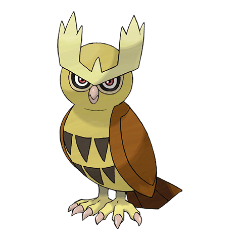

# Noctowl (Owl Pokémon)

| Official Artwork | Shiny Artwork |
| --- | --- |
|  |  |

Its eyes are specially developed to enable it to see clearly even in murky darkness and minimal light.

---

## Media

### Default Sprites

| Front | Back | Front Shiny | Back Shiny |
| --- | --- | --- | --- |
|  |  |  |  |

### Cries

Latest (Gen VI+):

<audio controls>
<source src='../../assets/cries/noctowl/latest.ogg' type='audio/ogg'>
  Your browser does not support the audio element.
</audio>

Legacy:

<audio controls>
<source src='../../assets/cries/noctowl/legacy.ogg' type='audio/ogg'>
  Your browser does not support the audio element.
</audio>

---

## Pokédex Data

| National № | Type(s) | Height | Weight | Abilities | Local № |
|------------|---------|--------|--------|-----------|---------|
| #164 | {: width='48'} {: width='48'} | 1.6 m | 40.8 kg | 1. Insomnia 2. Tinted-Lens | N/A |

---

## Base Stats
|   | HP | Attack | Defense | Sp. Atk | Sp. Def | Speed |
|---|----|--------|---------|---------|---------|-------|
| **Base** | 100 | 40 | 40 | 96 | 116 | 60 |
| **Min** | 310 | 76 | 76 | 177 | 213 | 112 |
| **Max** | 404 | 196 | 196 | 320 | 364 | 240 |

The ranges shown above are for a level 100 Pokémon. Maximum values are based on a beneficial nature, 252 EVs, 31 IVs; minimum values are based on a hindering nature, 0 EVs, 0 IVs.

---

## Forms & Evolutions

!!! warning "WARNING"

    Information on evolutions may not be 100% accurate; differences between evolution methods across generations are not accounted for.

### Forms

Noctowl has no alternate forms.

### Evolution Line

1. [Hoothoot](hoothoot.md/)
    1. Level Up: [Noctowl](noctowl.md/)

---

## Training

| EV Yield | Catch Rate | Base Friendship | Base Exp. | Growth Rate | Held Items |
|----------|------------|-----------------|-----------|-------------|------------|
| 2 Hp | 90 | 50 | 158 | Medium | N/A |

---

## Breeding

| Egg Groups | Egg Cycles | Gender | Dimorphic | Color | Shape |
|------------|------------|--------|-----------|-------|-------|
| 1. Flying | 15 | 50.0% Male 50.0% Female | False | Brown | Wings |

---

## Moves

!!! warning "WARNING"

    Specific move information may be incorrect. However, the general movepool should be accurate; this includes changes made in Blaze Black and Volt White.

### Level Up Moves

| Lv. | Move | Type | Cat. | Power | Acc. | PP |
| --- | --- | --- | --- | --- | --- | --- |
| 1 | Foresight | {: width='48'} | {: width='36'} | — | — | 40 |
| 1 | Growl | {: width='48'} | {: width='36'} | — | 100 | 40 |
| 1 | Heat Wave | {: width='48'} | {: width='36'} | 95 | 90 | 10 |
| 1 | Hypnosis | {: width='48'} | {: width='36'} | — | 60 | 20 |
| 1 | Ominous Wind | {: width='48'} | {: width='36'} | 60 | 100 | 5 |
| 1 | Silver Wind | {: width='48'} | {: width='36'} | 60 | 100 | 5 |
| 1 | Sky Attack | {: width='48'} | {: width='36'} | 140 | 90 | 5 |
| 1 | Tackle | {: width='48'} | {: width='36'} | 40 | 100 | 35 |
| 5 | Hypnosis | {: width='48'} | {: width='36'} | — | 60 | 20 |
| 9 | Peck | {: width='48'} | {: width='36'} | 35 | 100 | 35 |
| 13 | Uproar | {: width='48'} | {: width='36'} | 90 | 100 | 10 |
| 17 | Reflect | {: width='48'} | {: width='36'} | — | — | 20 |
| 22 | Confusion | {: width='48'} | {: width='36'} | 50 | 100 | 25 |
| 27 | Echoed Voice | {: width='48'} | {: width='36'} | 40 | 100 | 15 |
| 32 | Take Down | {: width='48'} | {: width='36'} | 90 | 85 | 20 |
| 37 | Air Slash | {: width='48'} | {: width='36'} | 75 | 95 | 15 |
| 42 | Zen Headbutt | {: width='48'} | {: width='36'} | 80 | 90 | 15 |
| 47 | Synchronoise | {: width='48'} | {: width='36'} | 120 | 100 | 10 |
| 52 | Extrasensory | {: width='48'} | {: width='36'} | 80 | 100 | 20 |
| 57 | Psycho Shift | {: width='48'} | {: width='36'} | — | 100 | 10 |
| 62 | Roost | {: width='48'} | {: width='36'} | — | — | 5 |
| 67 | Dream Eater | {: width='48'} | {: width='36'} | 100 | 100 | 15 |
| 72 | Nasty Plot | {: width='48'} | {: width='36'} | — | — | 20 |

### TM Moves

| TM | Move | Type | Cat. | Power | Acc. | PP |
| --- | --- | --- | --- | --- | --- | --- |
| HM02 | Fly | {: width='48'} | {: width='36'} | 100 | 100% | 15 |
| TM06 | Toxic | {: width='48'} | {: width='36'} | — | 90 | 10 |
| TM10 | Hidden Power | {: width='48'} | {: width='36'} | 60 | 100 | 15 |
| TM11 | Sunny Day | {: width='48'} | {: width='36'} | — | — | 5 |
| TM15 | Hyper Beam | {: width='48'} | {: width='36'} | 150 | 90 | 5 |
| TM17 | Protect | {: width='48'} | {: width='36'} | — | — | 10 |
| TM18 | Rain Dance | {: width='48'} | {: width='36'} | — | — | 5 |
| TM21 | Frustration | {: width='48'} | {: width='36'} | — | 100 | 20 |
| TM27 | Return | {: width='48'} | {: width='36'} | — | 100 | 20 |
| TM29 | Psychic | {: width='48'} | {: width='36'} | 90 | 100 | 10 |
| TM30 | Shadow Ball | {: width='48'} | {: width='36'} | 90 | 100 | 15 |
| TM32 | Double Team | {: width='48'} | {: width='36'} | — | — | 15 |
| TM33 | Reflect | {: width='48'} | {: width='36'} | — | — | 20 |
| TM40 | Aerial Ace | {: width='48'} | {: width='36'} | 60 | — | 20 |
| TM42 | Facade | {: width='48'} | {: width='36'} | 70 | 100 | 20 |
| TM44 | Rest | {: width='48'} | {: width='36'} | — | — | 5 |
| TM45 | Attract | {: width='48'} | {: width='36'} | — | 100 | 15 |
| TM46 | Thief | {: width='48'} | {: width='36'} | 60 | 100 | 25 |
| TM48 | Round | {: width='48'} | {: width='36'} | 60 | 100 | 15 |
| TM49 | Echoed Voice | {: width='48'} | {: width='36'} | 40 | 100 | 15 |
| TM68 | Giga Impact | {: width='48'} | {: width='36'} | 150 | 90 | 5 |
| TM77 | Psych Up | {: width='48'} | {: width='36'} | — | — | 10 |
| TM83 | Work Up | {: width='48'} | {: width='36'} | — | — | 30 |
| TM85 | Dream Eater | {: width='48'} | {: width='36'} | 100 | 100 | 15 |
| TM87 | Swagger | {: width='48'} | {: width='36'} | — | 85 | 15 |
| TM88 | Pluck | {: width='48'} | {: width='36'} | 60 | 100 | 20 |
| TM90 | Substitute | {: width='48'} | {: width='36'} | — | — | 10 |

### Egg Moves

Noctowl cannot learn any moves by breeding.
### Tutor Moves

Noctowl cannot learn any moves from tutors.
