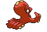
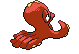
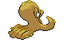

# Octillery (Jet Pokémon)

| Official Artwork | Shiny Artwork |
| --- | --- |
|  |  |

It loves to lurk inside holes in rocks. It sometimes sprays ink on prey by sticking out only its mouth.

---

## Media

### Default Sprites

| Front | Back | Front Shiny | Back Shiny |
| --- | --- | --- | --- |
|  |  |  |  |

### Female Sprites

| Front | Back | Front Shiny | Back Shiny |
| --- | --- | --- | --- |
|  |  |  |  |

### Cries

Latest (Gen VI+):

<audio controls>
<source src='../../assets/cries/octillery/latest.ogg' type='audio/ogg'>
  Your browser does not support the audio element.
</audio>

Legacy:

<audio controls>
<source src='../../assets/cries/octillery/legacy.ogg' type='audio/ogg'>
  Your browser does not support the audio element.
</audio>

---

## Pokédex Data

| National № | Type(s) | Height | Weight | Abilities | Local № |
|------------|---------|--------|--------|-----------|---------|
| #224 | {: width='48'} | 0.9 m | 28.5 kg | 1. Moody 2. Sniper | N/A |

---

## Base Stats
|   | HP | Attack | Defense | Sp. Atk | Sp. Def | Speed |
|---|----|--------|---------|---------|---------|-------|
| **Base** | 75 | 105 | 75 | 105 | 75 | 45 |
| **Min** | 260 | 193 | 139 | 193 | 139 | 85 |
| **Max** | 354 | 339 | 273 | 339 | 273 | 207 |

The ranges shown above are for a level 100 Pokémon. Maximum values are based on a beneficial nature, 252 EVs, 31 IVs; minimum values are based on a hindering nature, 0 EVs, 0 IVs.

---

## Forms & Evolutions

!!! warning "WARNING"

    Information on evolutions may not be 100% accurate; differences between evolution methods across generations are not accounted for.

### Forms

Octillery has no alternate forms.

### Evolution Line

1. [Remoraid](remoraid.md/)
    1. Level Up: [Octillery](octillery.md/)

---

## Training

| EV Yield | Catch Rate | Base Friendship | Base Exp. | Growth Rate | Held Items |
|----------|------------|-----------------|-----------|-------------|------------|
| 1 Attack 1 Special Attack | 75 | 50 | 168 | Medium | N/A |

---

## Breeding

| Egg Groups | Egg Cycles | Gender | Dimorphic | Color | Shape |
|------------|------------|--------|-----------|-------|-------|
| 1. Water1 2. Water2 | 20 | 50.0% Male 50.0% Female | True | Red | Tentacles |

---

## Moves

!!! warning "WARNING"

    Specific move information may be incorrect. However, the general movepool should be accurate; this includes changes made in Blaze Black and Volt White.

### Level Up Moves

| Lv. | Move | Type | Cat. | Power | Acc. | PP |
| --- | --- | --- | --- | --- | --- | --- |
| 1 | Acid Spray | {: width='48'} | {: width='36'} | 40 | 100 | 20 |
| 1 | Aurora Beam | {: width='48'} | {: width='36'} | 75 | 100 | 15 |
| 1 | Icicle Crash | {: width='48'} | {: width='36'} | 85 | 90 | 10 |
| 1 | Gunk Shot | {: width='48'} | {: width='36'} | 120 | 80 | 5 |
| 1 | Psybeam | {: width='48'} | {: width='36'} | 65 | 100 | 20 |
| 1 | Rock Blast | {: width='48'} | {: width='36'} | 25 | 90 | 10 |
| 1 | Seed Bomb | {: width='48'} | {: width='36'} | 80 | 100 | 15 |
| 1 | Water Gun | {: width='48'} | {: width='36'} | 40 | 100 | 25 |
| 6 | Icicle Crash | {: width='48'} | {: width='36'} | 85 | 90 | 10 |
| 10 | Psybeam | {: width='48'} | {: width='36'} | 65 | 100 | 20 |
| 14 | Aurora Beam | {: width='48'} | {: width='36'} | 75 | 100 | 15 |
| 19 | Bubble Beam | {: width='48'} | {: width='36'} | 75 | 100 | 15 |
| 23 | Focus Energy | {: width='48'} | {: width='36'} | — | — | 30 |
| 25 | Octazooka | {: width='48'} | {: width='36'} | 65 | 85 | 10 |
| 29 | Bullet Seed | {: width='48'} | {: width='36'} | 25 | 100 | 30 |
| 36 | Wring Out | {: width='48'} | {: width='36'} | — | 100 | 5 |
| 42 | Signal Beam | {: width='48'} | {: width='36'} | 75 | 100 | 15 |
| 48 | Ice Beam | {: width='48'} | {: width='36'} | 90 | 100 | 10 |
| 55 | Hyper Beam | {: width='48'} | {: width='36'} | 150 | 90 | 5 |
| 61 | Soak | {: width='48'} | {: width='36'} | — | 100 | 20 |

### TM Moves

| TM | Move | Type | Cat. | Power | Acc. | PP |
| --- | --- | --- | --- | --- | --- | --- |
| HM03 | Surf | {: width='48'} | {: width='36'} | 90 | 100 | 15 |
| HM05 | Waterfall | {: width='48'} | {: width='36'} | 85 | 100 | 15 |
| HM06 | Dive | {: width='48'} | {: width='36'} | 80 | 100 | 10 |
| TM06 | Toxic | {: width='48'} | {: width='36'} | — | 90 | 10 |
| TM10 | Hidden Power | {: width='48'} | {: width='36'} | 60 | 100 | 15 |
| TM11 | Sunny Day | {: width='48'} | {: width='36'} | — | — | 5 |
| TM13 | Ice Beam | {: width='48'} | {: width='36'} | 90 | 100 | 10 |
| TM14 | Blizzard | {: width='48'} | {: width='36'} | 110 | 70 | 5 |
| TM15 | Hyper Beam | {: width='48'} | {: width='36'} | 150 | 90 | 5 |
| TM17 | Protect | {: width='48'} | {: width='36'} | — | — | 10 |
| TM18 | Rain Dance | {: width='48'} | {: width='36'} | — | — | 5 |
| TM21 | Frustration | {: width='48'} | {: width='36'} | — | 100 | 20 |
| TM23 | Smack Down | {: width='48'} | {: width='36'} | 50 | 100 | 15 |
| TM27 | Return | {: width='48'} | {: width='36'} | — | 100 | 20 |
| TM29 | Psychic | {: width='48'} | {: width='36'} | 90 | 100 | 10 |
| TM32 | Double Team | {: width='48'} | {: width='36'} | — | — | 15 |
| TM34 | Sludge Wave | {: width='48'} | {: width='36'} | 95 | 100 | 10 |
| TM35 | Flamethrower | {: width='48'} | {: width='36'} | 90 | 100 | 15 |
| TM36 | Sludge Bomb | {: width='48'} | {: width='36'} | 90 | 100 | 10 |
| TM38 | Fire Blast | {: width='48'} | {: width='36'} | 110 | 85 | 5 |
| TM42 | Facade | {: width='48'} | {: width='36'} | 70 | 100 | 20 |
| TM44 | Rest | {: width='48'} | {: width='36'} | — | — | 5 |
| TM45 | Attract | {: width='48'} | {: width='36'} | — | 100 | 15 |
| TM46 | Thief | {: width='48'} | {: width='36'} | 60 | 100 | 25 |
| TM48 | Round | {: width='48'} | {: width='36'} | 60 | 100 | 15 |
| TM53 | Energy Ball | {: width='48'} | {: width='36'} | 90 | 100 | 10 |
| TM55 | Scald | {: width='48'} | {: width='36'} | 80 | 100 | 15 |
| TM57 | Charge Beam | {: width='48'} | {: width='36'} | 50 | 90 | 10 |
| TM59 | Incinerate | {: width='48'} | {: width='36'} | 50 | 100 | 15 |
| TM66 | Payback | {: width='48'} | {: width='36'} | 50 | 100 | 10 |
| TM68 | Giga Impact | {: width='48'} | {: width='36'} | 150 | 90 | 5 |
| TM73 | Thunder Wave | {: width='48'} | {: width='36'} | — | 90 | 20 |
| TM79 | Frost Breath | {: width='48'} | {: width='36'} | 60 | 90 | 10 |
| TM87 | Swagger | {: width='48'} | {: width='36'} | — | 85 | 15 |
| TM90 | Substitute | {: width='48'} | {: width='36'} | — | — | 10 |
| TM91 | Flash Cannon | {: width='48'} | {: width='36'} | 80 | 100 | 10 |

### Egg Moves

Octillery cannot learn any moves by breeding.
### Tutor Moves

Octillery cannot learn any moves from tutors.
