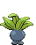

# #043 Oddish (Weed Pokémon)

| Official Artwork | Shiny Artwork |
| --- | --- |
|  |  |

It often plants its root feet in the ground during the day and sows seeds as it walks about at night.

---

## Media

### Sprites

| Front | Back | Front Shiny | Back Shiny |
| --- | --- | --- | --- |
|  |  |  |  |

### Cries

Latest (Gen VI+):

<audio controls>
  <source src='../assets/cries/oddish/latest.ogg' type='audio/ogg'>
  Your browser does not support the audio element.
</audio>

Legacy:

<audio controls>
  <source src='../assets/cries/oddish/legacy.ogg' type='audio/ogg'>
  Your browser does not support the audio element.
</audio>

---

## Pokédex Data

| National № | Type(s) | Height | Weight | Abilities | Local № |
|------------|---------|--------|--------|-----------|---------|
| #43 | {: width='48'} {: width='48'} | 0.5 m | 5.4 kg | 1. Chlorophyll 2. Run-Away | #N/A |

---

## Base Stats
---

## Base Stats
|   | HP | Attack | Defense | Sp. Atk | Sp. Def | Speed |
|---|----|--------|---------|---------|---------|-------|
| **Base** | 45 | 50 | 55 | 75 | 65 | 30 |
| **Min** | 200 | 94 | 103 | 139 | 121 | 58 |
| **Max** | 294 | 218 | 229 | 273 | 251 | 174 |

The ranges shown above are for a level 100 Pokémon. Maximum values are based on a beneficial nature, 252 EVs, 31 IVs; minimum values are based on a hindering nature, 0 EVs, 0 IVs.

---

## Forms & Evolutions

!!! warning "WARNING"

    Some forms may not be available in Blaze Black/Volt White. Also information on evolutions may not be 100% accurate; it is currently quite complex to track generational evolution data.

### Forms

Oddish has no alternate forms.

### Evolution Line

1. [Oddish](oddish.md/)
1. Level Up: [Gloom](gloom.md/)
1. Use Item: [Vileplume](vileplume.md/)2. Use Item: [Bellossom](bellossom.md/)

---

## Training

| EV Yield | Catch Rate | Base Friendship | Base Exp. | Growth Rate | Held Items |
|----------|------------|-----------------|-----------|-------------|------------|
| 1 Special Attack | 255 | 50 | 64 | Medium-Slow |  |

---

## Breeding

| Egg Groups | Egg Cycles | Gender | Dimorphic | Color | Shape |
|------------|------------|--------|-----------|-------|-------|
| 1. Plant | 20 | 50.0% Male 50.0% Female | False | Blue | Legs |

---

## Moves

!!! warning "WARNING"

    Specific move information may be incorrect. However, the general movepool should be accurate (including changes to learnset).

### Level Up Moves

Lv. | Move | Type | Cat. | Power | Acc. | PP
--- | --- | --- | --- | --- | --- | ---
| 1 | Absorb | {: width='48'} | {: width='36'} | 50 | 100 | 25 |
| 1 | Leech Seed | {: width='48'} | {: width='36'} | — | 90 | 10 |
| 5 | Sweet Scent | {: width='48'} | {: width='36'} | — | 100 | 20 |
| 9 | Acid | {: width='48'} | {: width='36'} | 40 | 100 | 30 |
| 11 | Razor Leaf | {: width='48'} | {: width='36'} | 55 | 95 | 25 |
| 13 | Poison Powder | {: width='48'} | {: width='36'} | — | 75 | 35 |
| 15 | Stun Spore | {: width='48'} | {: width='36'} | — | 75 | 30 |
| 17 | Sleep Powder | {: width='48'} | {: width='36'} | — | 75 | 15 |
| 19 | Nature Power | {: width='48'} | {: width='36'} | — | — | 20 |
| 21 | Mega Drain | {: width='48'} | {: width='36'} | 50 | 100 | 15 |
| 23 | Teeter Dance | {: width='48'} | {: width='36'} | — | 100 | 20 |
| 25 | Lucky Chant | {: width='48'} | {: width='36'} | — | — | 30 |
| 29 | Natural Gift | {: width='48'} | {: width='36'} | — | 100 | 15 |
| 33 | Moonlight | {: width='48'} | {: width='36'} | — | — | 5 |
| 37 | Giga Drain | {: width='48'} | {: width='36'} | 75 | 100 | 10 |
| 41 | Petal Dance | {: width='48'} | {: width='36'} | 120 | 100 | 10 |

### TM Moves

TM | Move | Type | Cat. | Power | Acc. | PP
--- | --- | --- | --- | --- | --- | ---
| HM01 | Cut | {: width='48'} | {: width='36'} | 60 | 100 | 20 |
| TM06 | Toxic | {: width='48'} | {: width='36'} | — | 90 | 10 |
| TM09 | Venoshock | {: width='48'} | {: width='36'} | 65 | 100 | 10 |
| TM10 | Hidden Power | {: width='48'} | {: width='36'} | 60 | 100 | 15 |
| TM11 | Sunny Day | {: width='48'} | {: width='36'} | — | — | 5 |
| TM17 | Protect | {: width='48'} | {: width='36'} | — | — | 10 |
| TM21 | Frustration | {: width='48'} | {: width='36'} | — | 100 | 20 |
| TM22 | Solar Beam | {: width='48'} | {: width='36'} | 120 | 100 | 10 |
| TM27 | Return | {: width='48'} | {: width='36'} | — | 100 | 20 |
| TM32 | Double Team | {: width='48'} | {: width='36'} | — | — | 15 |
| TM36 | Sludge Bomb | {: width='48'} | {: width='36'} | 90 | 100 | 10 |
| TM42 | Facade | {: width='48'} | {: width='36'} | 70 | 100 | 20 |
| TM44 | Rest | {: width='48'} | {: width='36'} | — | — | 5 |
| TM45 | Attract | {: width='48'} | {: width='36'} | — | 100 | 15 |
| TM48 | Round | {: width='48'} | {: width='36'} | 60 | 100 | 15 |
| TM53 | Energy Ball | {: width='48'} | {: width='36'} | 90 | 100 | 10 |
| TM70 | Flash | {: width='48'} | {: width='36'} | — | 100 | 20 |
| TM75 | Swords Dance | {: width='48'} | {: width='36'} | — | — | 20 |
| TM86 | Grass Knot | {: width='48'} | {: width='36'} | — | 100 | 20 |
| TM87 | Swagger | {: width='48'} | {: width='36'} | — | 85 | 15 |
| TM90 | Substitute | {: width='48'} | {: width='36'} | — | — | 10 |

### Egg Moves

Move | Type | Cat. | Power | Acc. | PP
--- | --- | --- | --- | --- | ---
| Flail | {: width='48'} | {: width='36'} | — | 100 | 15 |
| Charm | {: width='48'} | {: width='36'} | — | 100 | 20 |
| Synthesis | {: width='48'} | {: width='36'} | — | — | 5 |
| Ingrain | {: width='48'} | {: width='36'} | — | — | 20 |
| Secret Power | {: width='48'} | {: width='36'} | 70 | 100 | 20 |
| Tickle | {: width='48'} | {: width='36'} | — | 100 | 20 |
| After You | {: width='48'} | {: width='36'} | — | — | 15 |

### Tutor Moves

Oddish cannot learn any moves from tutors.
