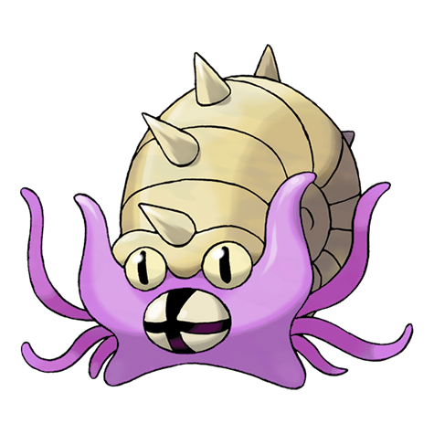
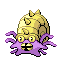
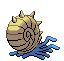
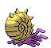

# #139 Omastar (Spiral Pokémon)

| Official Artwork | Shiny Artwork |
|------------------|---------------|
|  |  |

It is thought that this Pokémon became extinct because its spiral shell grew too large.

---

## Media

### Default Sprites

| Front | Shiny | Back | Shiny |
|-------|-------|------|-------|
|  |  |  |  |

### Cries

Latest (Gen VI+):

<audio controls>
<source src='../../assets/cries/omastar/latest.ogg' type='audio/ogg'>
  Your browser does not support the audio element.
</audio>

Legacy:

<audio controls>
<source src='../../assets/cries/omastar/legacy.ogg' type='audio/ogg'>
  Your browser does not support the audio element.
</audio>

---

## Pokédex Data

| National № | Type(s) | Height | Weight | Abilities | Local № |
|------------|---------|--------|--------|-----------|---------|
| #139 | {: width="48"} {: width="48"} | 1.0 m / 3.3 ft | 35.0 kg / 77.2 lbs | 1. Swift Swim 2. Iron Barbs | N/A |

---

## Base Stats
|   | HP | Attack | Defense | Sp. Atk | Sp. Def | Speed |
|---|----|--------|---------|---------|---------|-------|
| **Base** | 70 | 60 | 125 | 115 | 70 | 55 |
| **Min** | 250 | 112 | 229 | 211 | 130 | 103 |
| **Max** | 344 | 240 | 383 | 361 | 262 | 229 |

The ranges shown above are for a level 100 Pokémon. Maximum values are based on a beneficial nature, 252 EVs, 31 IVs; minimum values are based on a hindering nature, 0 EVs, 0 IVs.

---

## Forms & Evolutions

!!! warning "WARNING"

    Information on evolutions may not be 100% accurate; differences between evolution methods across generations are not accounted for.

### Forms

Omastar has no alternate forms.

### Evolution Line

1. [Omanyte](omanyte.md/)
    1. Level Up: [Omastar](omastar.md/)

---

## Training

| EV Yield | Catch Rate | Base Friendship | Base Exp. | Growth Rate | Held Items |
|----------|------------|-----------------|-----------|-------------|------------|
| 2 Def | 45 | 50 | 173 | Medium | N/A |

---

## Breeding

| Egg Groups | Egg Cycles | Gender | Dimorphic | Color | Shape |
|------------|------------|--------|-----------|-------|-------|
| 1. Water1 2. Water3 | 30 | 87.5% Male 12.5% Female | False | Blue | Tentacles |

---

## Moves

!!! warning "WARNING"

    Specific move information may be incorrect. However, the general movepool should be accurate; this includes changes made in Blaze Black and Volt White.

### Level Up Moves

| Lv. | Move | Type | Cat. | Power | Acc. | PP |
| --- | --- | --- | --- | --- | --- | --- |
| 1 | Bite | {: width="48"} | {: width="36"} | 60 | 100 | 25 |
| 1 | Icicle Crash | {: width="48"} | {: width="36"} | 85 | 90 | 10 |
| 1 | Withdraw | {: width="48"} | {: width="36"} | — | — | 40 |
| 7 | Bite | {: width="48"} | {: width="36"} | 60 | 100 | 25 |
| 10 | Water Gun | {: width="48"} | {: width="36"} | 40 | 100 | 25 |
| 16 | Rollout | {: width="48"} | {: width="36"} | 30 | 90 | 20 |
| 19 | Leer | {: width="48"} | {: width="36"} | — | 100 | 30 |
| 25 | Mud Shot | {: width="48"} | {: width="36"} | 55 | 95 | 15 |
| 28 | Scald | {: width="48"} | {: width="36"} | 80 | 100 | 15 |
| 34 | Protect | {: width="48"} | {: width="36"} | — | — | 10 |
| 37 | Ancient Power | {: width="48"} | {: width="36"} | 60 | 100 | 5 |
| 40 | Power Gem | {: width="48"} | {: width="36"} | 90 | 100 | 20 |
| 40 | Spike Cannon | {: width="48"} | {: width="36"} | 25 | 100 | 15 |
| 48 | Tickle | {: width="48"} | {: width="36"} | — | 100 | 20 |
| 56 | Rock Blast | {: width="48"} | {: width="36"} | 25 | 90 | 10 |
| 67 | Shell Smash | {: width="48"} | {: width="36"} | — | — | 15 |
| 75 | Hydro Pump | {: width="48"} | {: width="36"} | 110 | 80 | 5 |
| 83 | Earth Power | {: width="48"} | {: width="36"} | 90 | 100 | 10 |

### TM Moves

| TM | Move | Type | Cat. | Power | Acc. | PP |
| --- | --- | --- | --- | --- | --- | --- |
| HM03 | Surf | {: width="48"} | {: width="36"} | 90 | 100 | 15 |
| HM05 | Waterfall | {: width="48"} | {: width="36"} | 85 | 100 | 15 |
| HM06 | Dive | {: width="48"} | {: width="36"} | 80 | 100 | 10 |
| TM06 | Toxic | {: width="48"} | {: width="36"} | — | 90 | 10 |
| TM07 | Hail | {: width="48"} | {: width="36"} | — | — | 10 |
| TM10 | Hidden Power | {: width="48"} | {: width="36"} | 60 | 100 | 15 |
| TM13 | Ice Beam | {: width="48"} | {: width="36"} | 90 | 100 | 10 |
| TM14 | Blizzard | {: width="48"} | {: width="36"} | 110 | 70 | 5 |
| TM15 | Hyper Beam | {: width="48"} | {: width="36"} | 150 | 90 | 5 |
| TM17 | Protect | {: width="48"} | {: width="36"} | — | — | 10 |
| TM18 | Rain Dance | {: width="48"} | {: width="36"} | — | — | 5 |
| TM21 | Frustration | {: width="48"} | {: width="36"} | — | 100 | 20 |
| TM23 | Smack Down | {: width="48"} | {: width="36"} | 50 | 100 | 15 |
| TM27 | Return | {: width="48"} | {: width="36"} | — | 100 | 20 |
| TM32 | Double Team | {: width="48"} | {: width="36"} | — | — | 15 |
| TM37 | Sandstorm | {: width="48"} | {: width="36"} | — | — | 10 |
| TM39 | Rock Tomb | {: width="48"} | {: width="36"} | 60 | 95 | 15 |
| TM42 | Facade | {: width="48"} | {: width="36"} | 70 | 100 | 20 |
| TM44 | Rest | {: width="48"} | {: width="36"} | — | — | 5 |
| TM45 | Attract | {: width="48"} | {: width="36"} | — | 100 | 15 |
| TM46 | Thief | {: width="48"} | {: width="36"} | 60 | 100 | 25 |
| TM48 | Round | {: width="48"} | {: width="36"} | 60 | 100 | 15 |
| TM55 | Scald | {: width="48"} | {: width="36"} | 80 | 100 | 15 |
| TM68 | Giga Impact | {: width="48"} | {: width="36"} | 150 | 90 | 5 |
| TM69 | Rock Polish | {: width="48"} | {: width="36"} | — | — | 20 |
| TM71 | Stone Edge | {: width="48"} | {: width="36"} | 100 | 80 | 5 |
| TM74 | Gyro Ball | {: width="48"} | {: width="36"} | — | 100 | 5 |
| TM80 | Rock Slide | {: width="48"} | {: width="36"} | 75 | 90 | 10 |
| TM87 | Swagger | {: width="48"} | {: width="36"} | — | 85 | 15 |
| TM90 | Substitute | {: width="48"} | {: width="36"} | — | — | 10 |
| TM94 | Rock Smash | {: width="48"} | {: width="36"} | 60 | 100 | 15 |

### Egg Moves

Omastar cannot learn any moves by breeding.
### Tutor Moves

Omastar cannot learn any moves from tutors.
