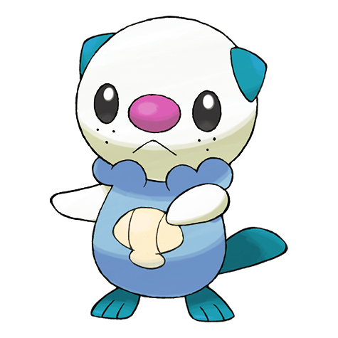

# #501 Oshawott (Sea Otter Pokémon)

| Official Artwork | Shiny Artwork |
| --- | --- |
|  |  |

**Blaze Black:** It fights using the scalchop on its stomach. In response to an attack, it retaliates immediately by slashing.

**Volt White:** The scalchop on its stomach is made from the same elements as claws. It detaches the scalchop for use as a blade.

---

## Media

### Default Sprites

| Front | Back | Front Shiny | Back Shiny |
| --- | --- | --- | --- |
|  |  |  |  |

### Cries

Latest (Gen VI+):

<audio controls>
<source src='../../assets/cries/oshawott/latest.ogg' type='audio/ogg'>
  Your browser does not support the audio element.
</audio>

Legacy:

<audio controls>
<source src='../../assets/cries/oshawott/legacy.ogg' type='audio/ogg'>
  Your browser does not support the audio element.
</audio>

---

## Pokédex Data

| National № | Type(s) | Height | Weight | Abilities | Local № |
|------------|---------|--------|--------|-----------|---------|
| #501 | {: width="48"} | 0.5 m / 1.6 ft | 5.9 kg / 13.0 lbs | Torrent Vital Spirit | #7 |

---

## Base Stats
|   | HP | Attack | Defense | Sp. Atk | Sp. Def | Speed |
|---|----|--------|---------|---------|---------|-------|
| **Base** | 55 | 55 | 45 | 63 | 45 | 45 |
| **Min** | 220 | 103 | 85 | 117 | 85 | 85 |
| **Max** | 314 | 229 | 207 | 247 | 207 | 207 |

The ranges shown above are for a level 100 Pokémon. Maximum values are based on a beneficial nature, 252 EVs, 31 IVs; minimum values are based on a hindering nature, 0 EVs, 0 IVs.

---

## Forms & Evolutions

!!! warning "WARNING"

    Information on evolutions may not be 100% accurate; differences between evolution methods across generations are not accounted for.

### Forms

Oshawott has no alternate forms.

### Evolution Line

1. [Oshawott](oshawott.md/)
    1. Level Up: [Dewott](dewott.md/)
        1. Level Up: [Samurott](samurott.md/)

---

## Training

| EV Yield | Catch Rate | Base Friendship | Base Exp. | Growth Rate | Held Items |
|----------|------------|-----------------|-----------|-------------|------------|
| 1 Sp. Atk | 45 | 70 | 62 | Medium Slow | Mystic Water (50%) |

---

## Breeding

| Egg Groups | Egg Cycles | Gender | Dimorphic | Color | Shape |
|------------|------------|--------|-----------|-------|-------|
| 1. Ground | 20 | 87.5% Male 12.5% Female | False | Blue | Upright |

---

## Moves

!!! warning "WARNING"

    Specific move information may be incorrect. However, the general movepool should be accurate; this includes changes made in Blaze Black and Volt White.

### Level Up Moves

| Lv. | Move | Type | Cat. | Power | Acc. | PP |
| --- | --- | --- | --- | --- | --- | --- |
| 1 | Tackle | {: width="48"} | {: width="36"} | 40 | 100 | 35 |
| 5 | Tail Whip | {: width="48"} | {: width="36"} | — | 100 | 30 |
| 7 | Water Gun | {: width="48"} | {: width="36"} | 40 | 100 | 25 |
| 11 | Water Sport | {: width="48"} | {: width="36"} | — | — | 15 |
| 13 | Focus Energy | {: width="48"} | {: width="36"} | — | — | 30 |
| 17 | Razor Shell | {: width="48"} | {: width="36"} | 75 | 95 | 10 |
| 19 | Fury Cutter | {: width="48"} | {: width="36"} | 40 | 95 | 20 |
| 23 | Water Pulse | {: width="48"} | {: width="36"} | 60 | 100 | 20 |
| 25 | Revenge | {: width="48"} | {: width="36"} | 60 | 100 | 10 |
| 29 | Aqua Jet | {: width="48"} | {: width="36"} | 40 | 100 | 20 |
| 31 | Encore | {: width="48"} | {: width="36"} | — | 100 | 5 |
| 35 | Aqua Tail | {: width="48"} | {: width="36"} | 90 | 90 | 10 |
| 37 | Retaliate | {: width="48"} | {: width="36"} | 70 | 100 | 5 |
| 41 | Swords Dance | {: width="48"} | {: width="36"} | — | — | 20 |
| 43 | Hydro Pump | {: width="48"} | {: width="36"} | 110 | 80 | 5 |

### TM Moves

| TM | Move | Type | Cat. | Power | Acc. | PP |
| --- | --- | --- | --- | --- | --- | --- |
| HM01 | Cut | {: width="48"} | {: width="36"} | 60 | 100% | 25 |
| HM03 | Surf | {: width="48"} | {: width="36"} | 90 | 100 | 15 |
| HM05 | Waterfall | {: width="48"} | {: width="36"} | 85 | 100 | 15 |
| HM06 | Dive | {: width="48"} | {: width="36"} | 80 | 100 | 10 |
| TM06 | Toxic | {: width="48"} | {: width="36"} | — | 90 | 10 |
| TM07 | Hail | {: width="48"} | {: width="36"} | — | — | 10 |
| TM10 | Hidden Power | {: width="48"} | {: width="36"} | 60 | 100 | 15 |
| TM12 | Taunt | {: width="48"} | {: width="36"} | — | 100 | 20 |
| TM13 | Ice Beam | {: width="48"} | {: width="36"} | 90 | 100 | 10 |
| TM14 | Blizzard | {: width="48"} | {: width="36"} | 110 | 70 | 5 |
| TM17 | Protect | {: width="48"} | {: width="36"} | — | — | 10 |
| TM18 | Rain Dance | {: width="48"} | {: width="36"} | — | — | 5 |
| TM21 | Frustration | {: width="48"} | {: width="36"} | — | 100 | 20 |
| TM27 | Return | {: width="48"} | {: width="36"} | — | 100 | 20 |
| TM28 | Dig | {: width="48"} | {: width="36"} | 100 | 100 | 10 |
| TM32 | Double Team | {: width="48"} | {: width="36"} | — | — | 15 |
| TM40 | Aerial Ace | {: width="48"} | {: width="36"} | 60 | — | 20 |
| TM42 | Facade | {: width="48"} | {: width="36"} | 70 | 100 | 20 |
| TM44 | Rest | {: width="48"} | {: width="36"} | — | — | 5 |
| TM45 | Attract | {: width="48"} | {: width="36"} | — | 100 | 15 |
| TM48 | Round | {: width="48"} | {: width="36"} | 60 | 100 | 15 |
| TM54 | False Swipe | {: width="48"} | {: width="36"} | 40 | 100 | 40 |
| TM55 | Scald | {: width="48"} | {: width="36"} | 80 | 100 | 15 |
| TM56 | Fling | {: width="48"} | {: width="36"} | — | 100 | 10 |
| TM67 | Retaliate | {: width="48"} | {: width="36"} | 70 | 100 | 5 |
| TM75 | Swords Dance | {: width="48"} | {: width="36"} | — | — | 20 |
| TM81 | X Scissor | {: width="48"} | {: width="36"} | 80 | 100 | 15 |
| TM86 | Grass Knot | {: width="48"} | {: width="36"} | — | 100 | 20 |
| TM87 | Swagger | {: width="48"} | {: width="36"} | — | 85 | 15 |
| TM90 | Substitute | {: width="48"} | {: width="36"} | — | — | 10 |
| TM94 | Rock Smash | {: width="48"} | {: width="36"} | 60 | 100 | 15 |

### Egg Moves

| Move | Type | Cat. | Power | Acc. | PP |
| --- | --- | --- | --- | --- | --- |
| Screech | {: width="48"} | {: width="36"} | — | 85 | 40 |
| Detect | {: width="48"} | {: width="36"} | — | — | 5 |
| Scald | {: width="48"} | {: width="36"} | 80 | 100 | 15 |
| Assurance | {: width="48"} | {: width="36"} | 60 | 100 | 10 |
| Trump Card | {: width="48"} | {: width="36"} | — | — | 5 |
| Copycat | {: width="48"} | {: width="36"} | — | — | 20 |
| Night Slash | {: width="48"} | {: width="36"} | 70 | 100 | 15 |
| Air Slash | {: width="48"} | {: width="36"} | 75 | 95 | 15 |

### Tutor Moves

| Move | Type | Cat. | Power | Acc. | PP |
| --- | --- | --- | --- | --- | --- |
| Water Pledge | {: width="48"} | {: width="36"} | 80 | 100 | 10 |

