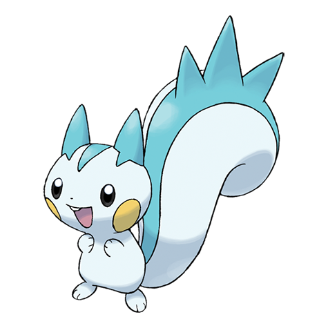
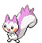
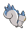
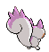
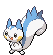
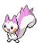

# #417 Pachirisu (EleSquirrel Pokémon)

| Official Artwork | Shiny Artwork |
|------------------|---------------|
|  |  |

A pair may be seen rubbing their cheek pouches together in an effort to share stored electricity.

---

## Media

### Default Sprites

| Front | Shiny | Back | Shiny |
|-------|-------|------|-------|
|  |  |  |  |

### Female Sprites

| Front | Shiny | Back | Shiny |
|-------|-------|------|-------|
|  |  |  |  |

### Cries

Latest (Gen VI+):

<audio controls>
<source src='../../assets/cries/pachirisu/latest.ogg' type='audio/ogg'>
  Your browser does not support the audio element.
</audio>

Legacy:

<audio controls>
<source src='../../assets/cries/pachirisu/legacy.ogg' type='audio/ogg'>
  Your browser does not support the audio element.
</audio>

---

## Pokédex Data

| National № | Type(s) | Height | Weight | Abilities | Local № |
|------------|---------|--------|--------|-----------|---------|
| #417 | {: width="48"} | 0.4 m / 1.3 ft | 3.9 kg / 8.6 lbs | 1. Volt Absorb 2. Pickup | #55 |

---

## Base Stats
|   | HP | Attack | Defense | Sp. Atk | Sp. Def | Speed |
|---|----|--------|---------|---------|---------|-------|
| **Base** | 60 | 45 | 70 | 100 | 90 | 95 |
| **Min** | 230 | 85 | 130 | 184 | 166 | 175 |
| **Max** | 324 | 207 | 262 | 328 | 306 | 317 |

The ranges shown above are for a level 100 Pokémon. Maximum values are based on a beneficial nature, 252 EVs, 31 IVs; minimum values are based on a hindering nature, 0 EVs, 0 IVs.

---

## Forms & Evolutions

!!! warning "WARNING"

    Information on evolutions may not be 100% accurate; differences between evolution methods across generations are not accounted for.

### Forms

Pachirisu has no alternate forms.

### Evolution Line

1. [Pachirisu](pachirisu.md/)

---

## Training

| EV Yield | Catch Rate | Base Friendship | Base Exp. | Growth Rate | Held Items |
|----------|------------|-----------------|-----------|-------------|------------|
| 1 Spd | 200 | 100 | 142 | Medium | N/A |

---

## Breeding

| Egg Groups | Egg Cycles | Gender | Dimorphic | Color | Shape |
|------------|------------|--------|-----------|-------|-------|
| 1. Ground 2. Fairy | 10 | 50.0% Male 50.0% Female | True | White | Quadruped |

---

## Moves

!!! warning "WARNING"

    Specific move information may be incorrect. However, the general movepool should be accurate; this includes changes made in Blaze Black and Volt White.

### Level Up Moves

| Lv. | Move | Type | Cat. | Power | Acc. | PP |
| --- | --- | --- | --- | --- | --- | --- |
| 1 | Bide | {: width="48"} | {: width="36"} | — | — | 10 |
| 1 | Growl | {: width="48"} | {: width="36"} | — | 100 | 40 |
| 5 | Quick Attack | {: width="48"} | {: width="36"} | 40 | 100 | 30 |
| 9 | Charm | {: width="48"} | {: width="36"} | — | 100 | 20 |
| 13 | Spark | {: width="48"} | {: width="36"} | 65 | 100 | 20 |
| 17 | Endure | {: width="48"} | {: width="36"} | — | — | 10 |
| 21 | Swift | {: width="48"} | {: width="36"} | 60 | — | 20 |
| 25 | Electro Ball | {: width="48"} | {: width="36"} | — | 100 | 10 |
| 29 | Sweet Kiss | {: width="48"} | {: width="36"} | — | 75 | 10 |
| 33 | Thunder Wave | {: width="48"} | {: width="36"} | — | 90 | 20 |
| 37 | Super Fang | {: width="48"} | {: width="36"} | — | 90 | 10 |
| 41 | Discharge | {: width="48"} | {: width="36"} | 80 | 100 | 15 |
| 45 | Last Resort | {: width="48"} | {: width="36"} | 140 | 100 | 5 |
| 49 | Hyper Fang | {: width="48"} | {: width="36"} | 80 | 90 | 15 |
| 53 | Fake Tears | {: width="48"} | {: width="36"} | — | 100 | 20 |
| 57 | Uproar | {: width="48"} | {: width="36"} | 90 | 100 | 10 |

### TM Moves

| TM | Move | Type | Cat. | Power | Acc. | PP |
| --- | --- | --- | --- | --- | --- | --- |
| HM01 | Cut | {: width="48"} | {: width="36"} | 60 | 100% | 25 |
| TM06 | Toxic | {: width="48"} | {: width="36"} | — | 90 | 10 |
| TM10 | Hidden Power | {: width="48"} | {: width="36"} | 60 | 100 | 15 |
| TM16 | Light Screen | {: width="48"} | {: width="36"} | — | — | 30 |
| TM17 | Protect | {: width="48"} | {: width="36"} | — | — | 10 |
| TM18 | Rain Dance | {: width="48"} | {: width="36"} | — | — | 5 |
| TM21 | Frustration | {: width="48"} | {: width="36"} | — | 100 | 20 |
| TM24 | Thunderbolt | {: width="48"} | {: width="36"} | 90 | 100 | 15 |
| TM25 | Thunder | {: width="48"} | {: width="36"} | 110 | 70 | 10 |
| TM27 | Return | {: width="48"} | {: width="36"} | — | 100 | 20 |
| TM28 | Dig | {: width="48"} | {: width="36"} | 100 | 100 | 10 |
| TM32 | Double Team | {: width="48"} | {: width="36"} | — | — | 15 |
| TM42 | Facade | {: width="48"} | {: width="36"} | 70 | 100 | 20 |
| TM44 | Rest | {: width="48"} | {: width="36"} | — | — | 5 |
| TM45 | Attract | {: width="48"} | {: width="36"} | — | 100 | 15 |
| TM48 | Round | {: width="48"} | {: width="36"} | 60 | 100 | 15 |
| TM49 | Echoed Voice | {: width="48"} | {: width="36"} | 40 | 100 | 15 |
| TM56 | Fling | {: width="48"} | {: width="36"} | — | 100 | 10 |
| TM57 | Charge Beam | {: width="48"} | {: width="36"} | 50 | 90 | 10 |
| TM70 | Flash | {: width="48"} | {: width="36"} | — | 100 | 20 |
| TM72 | Volt Switch | {: width="48"} | {: width="36"} | 70 | 100 | 20 |
| TM73 | Thunder Wave | {: width="48"} | {: width="36"} | — | 90 | 20 |
| TM86 | Grass Knot | {: width="48"} | {: width="36"} | — | 100 | 20 |
| TM87 | Swagger | {: width="48"} | {: width="36"} | — | 85 | 15 |
| TM89 | U Turn | {: width="48"} | {: width="36"} | 70 | 100 | 20 |
| TM90 | Substitute | {: width="48"} | {: width="36"} | — | — | 10 |

### Egg Moves

| Move | Type | Cat. | Power | Acc. | PP |
| --- | --- | --- | --- | --- | --- |
| Tail Whip | {: width="48"} | {: width="36"} | — | 100 | 30 |
| Bite | {: width="48"} | {: width="36"} | 60 | 100 | 25 |
| Defense Curl | {: width="48"} | {: width="36"} | — | — | 40 |
| Flail | {: width="48"} | {: width="36"} | — | 100 | 15 |
| Rollout | {: width="48"} | {: width="36"} | 30 | 90 | 20 |
| Iron Tail | {: width="48"} | {: width="36"} | 100 | 75 | 15 |
| Flatter | {: width="48"} | {: width="36"} | — | 100 | 15 |
| Follow Me | {: width="48"} | {: width="36"} | — | — | 20 |
| Charge | {: width="48"} | {: width="36"} | — | — | 20 |
| Fake Tears | {: width="48"} | {: width="36"} | — | 100 | 20 |
| Covet | {: width="48"} | {: width="36"} | 60 | 100 | 25 |
| Bestow | {: width="48"} | {: width="36"} | — | — | 15 |

### Tutor Moves

Pachirisu cannot learn any moves from tutors.
