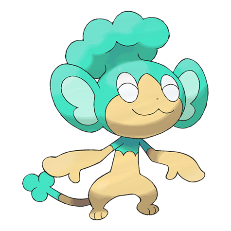

# #515 Panpour (Spray Pokémon)

| Official Artwork | Shiny Artwork |
| --- | --- |
|  |  |

**Blaze Black:** The water stored inside the tuft on its head is full of nutrients. Plants that receive its water grow large.

**Volt White:** It does not thrive in dry environments. It keeps itself damp by shooting water stored in its head tuft from its tail.

---

## Media

### Sprites

| Front | Back | Front Shiny | Back Shiny |
| --- | --- | --- | --- |
|  |  |  |  |

### Cries

Latest (Gen VI+):

<audio controls>
<source src='../../assets/cries/panpour/latest.ogg' type='audio/ogg'>
  Your browser does not support the audio element.
</audio>

Legacy:

<audio controls>
<source src='../../assets/cries/panpour/legacy.ogg' type='audio/ogg'>
  Your browser does not support the audio element.
</audio>

---

## Pokédex Data

| National № | Type(s) | Height | Weight | Abilities | Local № |
|------------|---------|--------|--------|-----------|---------|
| #515 | {: width='48'} | 0.6 m | 13.5 kg | 1. Gluttony 2. Torrent | #21 |

---

## Base Stats
|   | HP | Attack | Defense | Sp. Atk | Sp. Def | Speed |
|---|----|--------|---------|---------|---------|-------|
| **Base** | 50 | 53 | 48 | 53 | 48 | 64 |
| **Min** | 210 | 99 | 90 | 99 | 90 | 119 |
| **Max** | 304 | 225 | 214 | 225 | 214 | 249 |

The ranges shown above are for a level 100 Pokémon. Maximum values are based on a beneficial nature, 252 EVs, 31 IVs; minimum values are based on a hindering nature, 0 EVs, 0 IVs.

---

## Forms & Evolutions

!!! warning "WARNING"

    Information on evolutions may not be 100% accurate; differences between evolution methods across generations are not accounted for.

### Forms

Panpour has no alternate forms.

### Evolution Line

1. [Panpour](panpour.md/)
    1. Use Item: [Simipour](simipour.md/)

### Evolution Changes

---

## Training

| EV Yield | Catch Rate | Base Friendship | Base Exp. | Growth Rate | Held Items |
|----------|------------|-----------------|-----------|-------------|------------|
| 1 Speed | 190 | 70 | 63 | Medium | Oran Berry (50%) Rindo Berry (5%) |

---

## Breeding

| Egg Groups | Egg Cycles | Gender | Dimorphic | Color | Shape |
|------------|------------|--------|-----------|-------|-------|
| 1. Ground | 20 | 87.5% Male 12.5% Female | False | Blue | Upright |

---

## Moves

!!! warning "WARNING"

    Specific move information may be incorrect. However, the general movepool should be accurate; this includes changes made in Blaze Black and Volt White.

### Level Up Moves

| Lv. | Move | Type | Cat. | Power | Acc. | PP |
| --- | --- | --- | --- | --- | --- | --- |
| 1 | Scratch | {: width='48'} | {: width='36'} | 40 | 100 | 35 |
| 6 | Leer | {: width='48'} | {: width='36'} | — | 100 | 30 |
| 8 | Water Gun | {: width='48'} | {: width='36'} | 40 | 100 | 25 |
| 10 | Hone Claws | {: width='48'} | {: width='36'} | — | — | 15 |
| 12 | Acrobatics | {: width='48'} | {: width='36'} | 55 | 100 | 15 |
| 13 | Fury Swipes | {: width='48'} | {: width='36'} | 18 | 80 | 15 |
| 14 | Water Pulse | {: width='48'} | {: width='36'} | 60 | 100 | 20 |
| 16 | Lick | {: width='48'} | {: width='36'} | 30 | 100 | 30 |
| 16 | Water Sport | {: width='48'} | {: width='36'} | — | — | 15 |
| 19 | Bite | {: width='48'} | {: width='36'} | 60 | 100 | 25 |
| 20 | Scald | {: width='48'} | {: width='36'} | 80 | 100 | 15 |
| 24 | Crunch | {: width='48'} | {: width='36'} | 80 | 100 | 15 |
| 25 | Taunt | {: width='48'} | {: width='36'} | — | 100 | 20 |
| 26 | Fling | {: width='48'} | {: width='36'} | — | 100 | 10 |
| 28 | Natural Gift | {: width='48'} | {: width='36'} | — | 100 | 15 |
| 30 | Water Pledge | {: width='48'} | {: width='36'} | 100 | 100 | 10 |
| 32 | Low Kick | {: width='48'} | {: width='36'} | — | 100 | 20 |
| 34 | Brine | {: width='48'} | {: width='36'} | 65 | 100 | 10 |
| 34 | Nasty Plot | {: width='48'} | {: width='36'} | — | — | 20 |
| 36 | Role Play | {: width='48'} | {: width='36'} | — | — | 10 |
| 37 | Recycle | {: width='48'} | {: width='36'} | — | — | 10 |
| 38 | Hydro Pump | {: width='48'} | {: width='36'} | 110 | 80 | 5 |
| 40 | Water Spout | {: width='48'} | {: width='36'} | 150 | 100 | 5 |
| 42 | Hydro Cannon | {: width='48'} | {: width='36'} | 150 | 90 | 5 |
| 46 | Baton Pass | {: width='48'} | {: width='36'} | — | — | 40 |

### TM Moves

| TM | Move | Type | Cat. | Power | Acc. | PP |
| --- | --- | --- | --- | --- | --- | --- |
| HM01 | Cut | {: width='48'} | {: width='36'} | 60 | 100 | 20 |
| HM03 | Surf | {: width='48'} | {: width='36'} | 90 | 100 | 15 |
| HM05 | Waterfall | {: width='48'} | {: width='36'} | 85 | 100 | 15 |
| HM06 | Dive | {: width='48'} | {: width='36'} | 100 | 100 | 10 |
| TM01 | Hone Claws | {: width='48'} | {: width='36'} | — | — | 15 |
| TM06 | Toxic | {: width='48'} | {: width='36'} | — | 90 | 10 |
| TM07 | Hail | {: width='48'} | {: width='36'} | — | — | 10 |
| TM10 | Hidden Power | {: width='48'} | {: width='36'} | 60 | 100 | 15 |
| TM12 | Taunt | {: width='48'} | {: width='36'} | — | 100 | 20 |
| TM13 | Ice Beam | {: width='48'} | {: width='36'} | 90 | 100 | 10 |
| TM14 | Blizzard | {: width='48'} | {: width='36'} | 110 | 70 | 5 |
| TM17 | Protect | {: width='48'} | {: width='36'} | — | — | 10 |
| TM18 | Rain Dance | {: width='48'} | {: width='36'} | — | — | 5 |
| TM21 | Frustration | {: width='48'} | {: width='36'} | — | 100 | 20 |
| TM27 | Return | {: width='48'} | {: width='36'} | — | 100 | 20 |
| TM28 | Dig | {: width='48'} | {: width='36'} | 100 | 100 | 10 |
| TM32 | Double Team | {: width='48'} | {: width='36'} | — | — | 15 |
| TM39 | Rock Tomb | {: width='48'} | {: width='36'} | 60 | 95 | 15 |
| TM41 | Torment | {: width='48'} | {: width='36'} | — | 100 | 15 |
| TM42 | Facade | {: width='48'} | {: width='36'} | 70 | 100 | 20 |
| TM44 | Rest | {: width='48'} | {: width='36'} | — | — | 5 |
| TM45 | Attract | {: width='48'} | {: width='36'} | — | 100 | 15 |
| TM46 | Thief | {: width='48'} | {: width='36'} | 60 | 100 | 25 |
| TM47 | Low Sweep | {: width='48'} | {: width='36'} | 65 | 100 | 20 |
| TM48 | Round | {: width='48'} | {: width='36'} | 60 | 100 | 15 |
| TM55 | Scald | {: width='48'} | {: width='36'} | 80 | 100 | 15 |
| TM56 | Fling | {: width='48'} | {: width='36'} | — | 100 | 10 |
| TM62 | Acrobatics | {: width='48'} | {: width='36'} | 55 | 100 | 15 |
| TM65 | Shadow Claw | {: width='48'} | {: width='36'} | 80 | 100 | 15 |
| TM66 | Payback | {: width='48'} | {: width='36'} | 50 | 100 | 10 |
| TM83 | Work Up | {: width='48'} | {: width='36'} | — | — | 30 |
| TM86 | Grass Knot | {: width='48'} | {: width='36'} | — | 100 | 20 |
| TM87 | Swagger | {: width='48'} | {: width='36'} | — | 85 | 15 |
| TM90 | Substitute | {: width='48'} | {: width='36'} | — | — | 10 |
| TM94 | Rock Smash | {: width='48'} | {: width='36'} | 40 | 100 | 15 |

### Egg Moves

| Move | Type | Cat. | Power | Acc. | PP |
| --- | --- | --- | --- | --- | --- |
| Hydro Pump | {: width='48'} | {: width='36'} | 110 | 80 | 5 |
| Low Kick | {: width='48'} | {: width='36'} | — | 100 | 20 |
| Role Play | {: width='48'} | {: width='36'} | — | — | 10 |
| Mud Sport | {: width='48'} | {: width='36'} | — | — | 15 |
| Astonish | {: width='48'} | {: width='36'} | 30 | 100 | 15 |
| Tickle | {: width='48'} | {: width='36'} | — | 100 | 20 |
| Covet | {: width='48'} | {: width='36'} | 60 | 100 | 25 |
| Aqua Ring | {: width='48'} | {: width='36'} | — | — | 20 |
| Aqua Tail | {: width='48'} | {: width='36'} | 90 | 90 | 10 |
| Nasty Plot | {: width='48'} | {: width='36'} | — | — | 20 |

### Tutor Moves

| Move | Type | Cat. | Power | Acc. | PP |
| --- | --- | --- | --- | --- | --- |
| Hydro Cannon | {: width='48'} | {: width='36'} | 150 | 90 | 5 |

