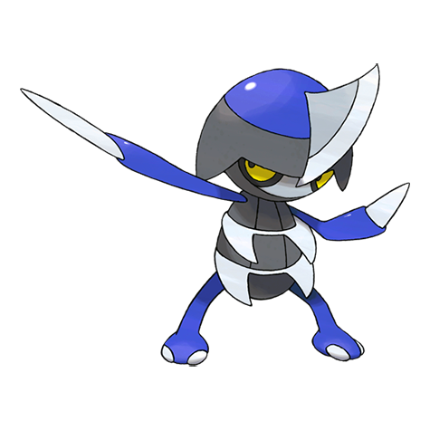
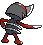
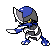
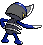

# #624 Pawniard (Sharp Blade Pokémon)

| Official Artwork | Shiny Artwork |
| --- | --- |
|  |  |

**Blaze Black:** Blades comprise this Pokémon’s entire body. If battling dulls the blades, it sharpens them on stones by the river.

**Volt White:** They fight at Bisharp’s command. They cling to their prey and inflict damage by sinking their blades into it.

---

## Media

### Default Sprites

| Front | Back | Front Shiny | Back Shiny |
| --- | --- | --- | --- |
|  |  |  |  |

### Cries

Latest (Gen VI+):

<audio controls>
<source src='../../assets/cries/pawniard/latest.ogg' type='audio/ogg'>
  Your browser does not support the audio element.
</audio>

Legacy:

<audio controls>
<source src='../../assets/cries/pawniard/legacy.ogg' type='audio/ogg'>
  Your browser does not support the audio element.
</audio>

---

## Pokédex Data

| National № | Type(s) | Height | Weight | Abilities | Local № |
|------------|---------|--------|--------|-----------|---------|
| #624 | {: width="48"} {: width="48"} | 0.5 m / 1.6 ft | 10.2 kg / 22.5 lbs | Defiant Pressure | #130 |

---

## Base Stats
|   | HP | Attack | Defense | Sp. Atk | Sp. Def | Speed |
|---|----|--------|---------|---------|---------|-------|
| **Base** | 45 | 85 | 70 | 40 | 40 | 60 |
| **Min** | 200 | 157 | 130 | 76 | 76 | 112 |
| **Max** | 294 | 295 | 262 | 196 | 196 | 240 |

The ranges shown above are for a level 100 Pokémon. Maximum values are based on a beneficial nature, 252 EVs, 31 IVs; minimum values are based on a hindering nature, 0 EVs, 0 IVs.

---

## Forms & Evolutions

!!! warning "WARNING"

    Information on evolutions may not be 100% accurate; differences between evolution methods across generations are not accounted for.

### Forms

Pawniard has no alternate forms.

### Evolution Line

1. [Pawniard](pawniard.md/)
    1. Level Up: [Bisharp](bisharp.md/)

### Evolution Changes

1. Level 37

---

## Training

| EV Yield | Catch Rate | Base Friendship | Base Exp. | Growth Rate | Held Items |
|----------|------------|-----------------|-----------|-------------|------------|
| 1 Attack | 120 | 35 | 68 | Medium | N/A |

---

## Breeding

| Egg Groups | Egg Cycles | Gender | Dimorphic | Color | Shape |
|------------|------------|--------|-----------|-------|-------|
| 1. Humanshape | 20 | 50.0% Male 50.0% Female | False | Red | Humanoid |

---

## Moves

!!! warning "WARNING"

    Specific move information may be incorrect. However, the general movepool should be accurate; this includes changes made in Blaze Black and Volt White.

### Level Up Moves

| Lv. | Move | Type | Cat. | Power | Acc. | PP |
| --- | --- | --- | --- | --- | --- | --- |
| 1 | Scratch | {: width="48"} | {: width="36"} | 40 | 100 | 35 |
| 6 | Leer | {: width="48"} | {: width="36"} | — | 100 | 30 |
| 9 | Fury Cutter | {: width="48"} | {: width="36"} | 40 | 95 | 20 |
| 14 | Torment | {: width="48"} | {: width="36"} | — | 100 | 15 |
| 17 | Feint Attack | {: width="48"} | {: width="36"} | 60 | — | 20 |
| 22 | Scary Face | {: width="48"} | {: width="36"} | — | 100 | 10 |
| 25 | Metal Claw | {: width="48"} | {: width="36"} | 50 | 95 | 35 |
| 30 | Slash | {: width="48"} | {: width="36"} | 70 | 100 | 20 |
| 33 | Assurance | {: width="48"} | {: width="36"} | 60 | 100 | 10 |
| 38 | Metal Sound | {: width="48"} | {: width="36"} | — | 85 | 40 |
| 41 | Embargo | {: width="48"} | {: width="36"} | — | 100 | 15 |
| 43 | Psycho Cut | {: width="48"} | {: width="36"} | 70 | 100 | 20 |
| 46 | Iron Defense | {: width="48"} | {: width="36"} | — | — | 15 |
| 49 | Night Slash | {: width="48"} | {: width="36"} | 70 | 100 | 15 |
| 52 | Sucker Punch | {: width="48"} | {: width="36"} | 70 | 100 | 5 |
| 54 | Iron Head | {: width="48"} | {: width="36"} | 80 | 100 | 15 |
| 57 | Swords Dance | {: width="48"} | {: width="36"} | — | — | 20 |
| 62 | Guillotine | {: width="48"} | {: width="36"} | — | 30 | 5 |

### TM Moves

| TM | Move | Type | Cat. | Power | Acc. | PP |
| --- | --- | --- | --- | --- | --- | --- |
| HM01 | Cut | {: width="48"} | {: width="36"} | 60 | 100% | 25 |
| TM01 | Hone Claws | {: width="48"} | {: width="36"} | — | — | 15 |
| TM06 | Toxic | {: width="48"} | {: width="36"} | — | 90 | 10 |
| TM10 | Hidden Power | {: width="48"} | {: width="36"} | 60 | 100 | 15 |
| TM12 | Taunt | {: width="48"} | {: width="36"} | — | 100 | 20 |
| TM17 | Protect | {: width="48"} | {: width="36"} | — | — | 10 |
| TM18 | Rain Dance | {: width="48"} | {: width="36"} | — | — | 5 |
| TM21 | Frustration | {: width="48"} | {: width="36"} | — | 100 | 20 |
| TM27 | Return | {: width="48"} | {: width="36"} | — | 100 | 20 |
| TM28 | Dig | {: width="48"} | {: width="36"} | 100 | 100 | 10 |
| TM31 | Brick Break | {: width="48"} | {: width="36"} | 75 | 100 | 15 |
| TM32 | Double Team | {: width="48"} | {: width="36"} | — | — | 15 |
| TM37 | Sandstorm | {: width="48"} | {: width="36"} | — | — | 10 |
| TM39 | Rock Tomb | {: width="48"} | {: width="36"} | 60 | 95 | 15 |
| TM40 | Aerial Ace | {: width="48"} | {: width="36"} | 60 | — | 20 |
| TM41 | Torment | {: width="48"} | {: width="36"} | — | 100 | 15 |
| TM42 | Facade | {: width="48"} | {: width="36"} | 70 | 100 | 20 |
| TM44 | Rest | {: width="48"} | {: width="36"} | — | — | 5 |
| TM45 | Attract | {: width="48"} | {: width="36"} | — | 100 | 15 |
| TM46 | Thief | {: width="48"} | {: width="36"} | 60 | 100 | 25 |
| TM47 | Low Sweep | {: width="48"} | {: width="36"} | 65 | 100 | 20 |
| TM48 | Round | {: width="48"} | {: width="36"} | 60 | 100 | 15 |
| TM54 | False Swipe | {: width="48"} | {: width="36"} | 40 | 100 | 40 |
| TM56 | Fling | {: width="48"} | {: width="36"} | — | 100 | 10 |
| TM63 | Embargo | {: width="48"} | {: width="36"} | — | 100 | 15 |
| TM65 | Shadow Claw | {: width="48"} | {: width="36"} | 80 | 100 | 15 |
| TM66 | Payback | {: width="48"} | {: width="36"} | 50 | 100 | 10 |
| TM67 | Retaliate | {: width="48"} | {: width="36"} | 70 | 100 | 5 |
| TM69 | Rock Polish | {: width="48"} | {: width="36"} | — | — | 20 |
| TM73 | Thunder Wave | {: width="48"} | {: width="36"} | — | 90 | 20 |
| TM75 | Swords Dance | {: width="48"} | {: width="36"} | — | — | 20 |
| TM81 | X Scissor | {: width="48"} | {: width="36"} | 80 | 100 | 15 |
| TM84 | Poison Jab | {: width="48"} | {: width="36"} | 80 | 100 | 20 |
| TM86 | Grass Knot | {: width="48"} | {: width="36"} | — | 100 | 20 |
| TM87 | Swagger | {: width="48"} | {: width="36"} | — | 85 | 15 |
| TM90 | Substitute | {: width="48"} | {: width="36"} | — | — | 10 |
| TM94 | Rock Smash | {: width="48"} | {: width="36"} | 60 | 100 | 15 |
| TM95 | Snarl | {: width="48"} | {: width="36"} | 60 | 95 | 15 |

### Egg Moves

| Move | Type | Cat. | Power | Acc. | PP |
| --- | --- | --- | --- | --- | --- |
| Headbutt | {: width="48"} | {: width="36"} | 70 | 100 | 15 |
| Mean Look | {: width="48"} | {: width="36"} | — | — | 5 |
| Pursuit | {: width="48"} | {: width="36"} | 40 | 100 | 20 |
| Revenge | {: width="48"} | {: width="36"} | 60 | 100 | 10 |
| Sucker Punch | {: width="48"} | {: width="36"} | 70 | 100 | 5 |
| Psycho Cut | {: width="48"} | {: width="36"} | 70 | 100 | 20 |
| Stealth Rock | {: width="48"} | {: width="36"} | — | — | 20 |

### Tutor Moves

Pawniard cannot learn any moves from tutors.
