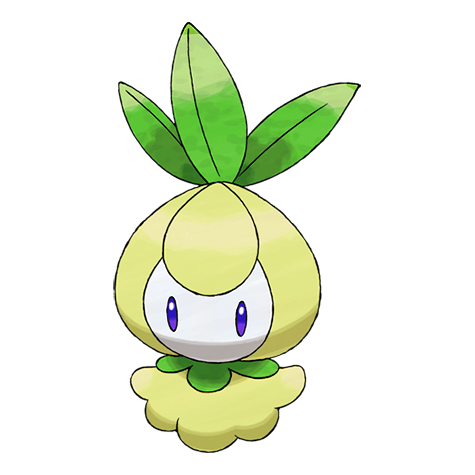
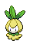
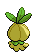

# #548 Petilil (Bulb Pokémon)

| Official Artwork | Shiny Artwork |
| --- | --- |
|  |  |

**Blaze Black:** The leaves on its head are very bitter. Eating one of these leaves is known to refresh a tired body.

**Volt White:** Since they prefer moist, nutrient-rich soil, the areas where Petilil live are known to be good for growing plants.

---

## Media

### Default Sprites

| Front | Back | Front Shiny | Back Shiny |
| --- | --- | --- | --- |
|  |  |  |  |

### Cries

Latest (Gen VI+):

<audio controls>
<source src='../../assets/cries/petilil/latest.ogg' type='audio/ogg'>
  Your browser does not support the audio element.
</audio>

Legacy:

<audio controls>
<source src='../../assets/cries/petilil/legacy.ogg' type='audio/ogg'>
  Your browser does not support the audio element.
</audio>

---

## Pokédex Data

| National № | Type(s) | Height | Weight | Abilities | Local № |
|------------|---------|--------|--------|-----------|---------|
| #548 | {: width="48"} | 0.5 m / 1.6 ft | 6.6 kg / 14.6 lbs |  | 1. Chlorophyll 2. Leaf Guard | #54 |

---

## Base Stats
|   | HP | Attack | Defense | Sp. Atk | Sp. Def | Speed |
|---|----|--------|---------|---------|---------|-------|
| **Base** | 45 | 35 | 50 | 70 | 50 | 30 |
| **Min** | 200 | 67 | 94 | 130 | 94 | 58 |
| **Max** | 294 | 185 | 218 | 262 | 218 | 174 |

The ranges shown above are for a level 100 Pokémon. Maximum values are based on a beneficial nature, 252 EVs, 31 IVs; minimum values are based on a hindering nature, 0 EVs, 0 IVs.

---

## Forms & Evolutions

!!! warning "WARNING"

    Information on evolutions may not be 100% accurate; differences between evolution methods across generations are not accounted for.

### Forms

Petilil has no alternate forms.

### Evolution Line

1. [Petilil](petilil.md/)
    1. Use Item: [Lilligant](lilligant.md/)

---

## Training

| EV Yield | Catch Rate | Base Friendship | Base Exp. | Growth Rate | Held Items |
|----------|------------|-----------------|-----------|-------------|------------|
| 1 Sp. Atk | 190 | 50 | 56 | Mediu |

---

## Breeding

| Egg Groups | Egg Cycles | Gender | Dimorphic | Color | Shape |
|------------|------------|--------|-----------|-------|-------|
| 1. Plant | 20 | 0.0% Male 100.0% Female | False | Green | Blob |

---

## Moves

!!! warning "WARNING"

    Specific move information may be incorrect. However, the general movepool should be accurate; this includes changes made in Blaze Black and Volt White.

### Level Up Moves

| Lv. | Move | Type | Cat. | Power | Acc. | PP |
| --- | --- | --- | --- | --- | --- | --- |
| 1 | Absorb | {: width="48"} | {: width="36"} | 50 | 100 | 25 |
| 4 | Growth | {: width="48"} | {: width="36"} | — | — | 20 |
| 8 | Leech Seed | {: width="48"} | {: width="36"} | — | 90 | 10 |
| 10 | Sleep Powder | {: width="48"} | {: width="36"} | — | 75 | 15 |
| 13 | Mega Drain | {: width="48"} | {: width="36"} | 50 | 100 | 15 |
| 15 | Extrasensory | {: width="48"} | {: width="36"} | 80 | 100 | 20 |
| 17 | Synthesis | {: width="48"} | {: width="36"} | — | — | 5 |
| 19 | Magical Leaf | {: width="48"} | {: width="36"} | 60 | — | 20 |
| 22 | Stun Spore | {: width="48"} | {: width="36"} | — | 75 | 30 |
| 26 | Giga Drain | {: width="48"} | {: width="36"} | 75 | 100 | 10 |
| 28 | Aromatherapy | {: width="48"} | {: width="36"} | — | — | 5 |
| 31 | Helping Hand | {: width="48"} | {: width="36"} | — | — | 20 |
| 35 | Energy Ball | {: width="48"} | {: width="36"} | 90 | 100 | 10 |
| 37 | Entrainment | {: width="48"} | {: width="36"} | — | 100 | 15 |
| 40 | Sunny Day | {: width="48"} | {: width="36"} | — | — | 5 |
| 44 | After You | {: width="48"} | {: width="36"} | — | — | 15 |
| 46 | Leaf Storm | {: width="48"} | {: width="36"} | 130 | 90 | 5 |

### TM Moves

| TM | Move | Type | Cat. | Power | Acc. | PP |
| --- | --- | --- | --- | --- | --- | --- |
| HM01 | Cut | {: width="48"} | {: width="36"} | 60 | 100% | 25 |
| TM06 | Toxic | {: width="48"} | {: width="36"} | — | 90 | 10 |
| TM10 | Hidden Power | {: width="48"} | {: width="36"} | 60 | 100 | 15 |
| TM11 | Sunny Day | {: width="48"} | {: width="36"} | — | — | 5 |
| TM17 | Protect | {: width="48"} | {: width="36"} | — | — | 10 |
| TM20 | Safeguard | {: width="48"} | {: width="36"} | — | — | 25 |
| TM21 | Frustration | {: width="48"} | {: width="36"} | — | 100 | 20 |
| TM22 | Solar Beam | {: width="48"} | {: width="36"} | 120 | 100 | 10 |
| TM27 | Return | {: width="48"} | {: width="36"} | — | 100 | 20 |
| TM29 | Psychic | {: width="48"} | {: width="36"} | 90 | 100 | 10 |
| TM30 | Shadow Ball | {: width="48"} | {: width="36"} | 90 | 100 | 15 |
| TM32 | Double Team | {: width="48"} | {: width="36"} | — | — | 15 |
| TM42 | Facade | {: width="48"} | {: width="36"} | 70 | 100 | 20 |
| TM44 | Rest | {: width="48"} | {: width="36"} | — | — | 5 |
| TM45 | Attract | {: width="48"} | {: width="36"} | — | 100 | 15 |
| TM48 | Round | {: width="48"} | {: width="36"} | 60 | 100 | 15 |
| TM53 | Energy Ball | {: width="48"} | {: width="36"} | 90 | 100 | 10 |
| TM70 | Flash | {: width="48"} | {: width="36"} | — | 100 | 20 |
| TM85 | Dream Eater | {: width="48"} | {: width="36"} | 100 | 100 | 15 |
| TM86 | Grass Knot | {: width="48"} | {: width="36"} | — | 100 | 20 |
| TM87 | Swagger | {: width="48"} | {: width="36"} | — | 85 | 15 |
| TM90 | Substitute | {: width="48"} | {: width="36"} | — | — | 10 |

### Egg Moves

| Move | Type | Cat. | Power | Acc. | PP |
| --- | --- | --- | --- | --- | --- |
| Bide | {: width="48"} | {: width="36"} | — | — | 10 |
| Endure | {: width="48"} | {: width="36"} | — | — | 10 |
| Charm | {: width="48"} | {: width="36"} | — | 100 | 20 |
| Sweet Scent | {: width="48"} | {: width="36"} | — | 100 | 20 |
| Ingrain | {: width="48"} | {: width="36"} | — | — | 20 |
| Grass Whistle | {: width="48"} | {: width="36"} | — | 55 | 15 |
| Healing Wish | {: width="48"} | {: width="36"} | — | — | 10 |
| Natural Gift | {: width="48"} | {: width="36"} | — | 100 | 15 |
| Worry Seed | {: width="48"} | {: width="36"} | — | 100 | 10 |

### Tutor Moves

Petilil cannot learn any moves from tutors.
