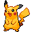
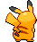
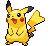
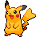

# #025 Pikachu (Mouse Pokémon)

| Official Artwork | Shiny Artwork |
| --- | --- |
|  |  |

It occasionally uses an electric shock to recharge a fellow Pikachu that is in a weakened state.

---

## Media

### Sprites

| Front | Back | Front Shiny | Back Shiny |
| --- | --- | --- | --- |
|  |  |  |  |

### Female Sprites

| Front | Back | Front Shiny | Back Shiny |
| --- | --- | --- | --- |
|  |  |  |  |

### Cries

Latest (Gen VI+):

<audio controls>
  <source src='../assets/cries/pikachu/latest.ogg' type='audio/ogg'>
  Your browser does not support the audio element.
</audio>

Legacy:

<audio controls>
  <source src='../assets/cries/pikachu/legacy.ogg' type='audio/ogg'>
  Your browser does not support the audio element.
</audio>

---

## Pokédex Data

| National № | Type(s) | Height | Weight | Abilities | Local № |
|------------|---------|--------|--------|-----------|---------|
| #25 | {: width='48'} | 0.4 m | 6.0 kg | 1. Static 2. Lightningrod | #N/A |

---

## Base Stats
---

## Base Stats
|   | HP | Attack | Defense | Sp. Atk | Sp. Def | Speed |
|---|----|--------|---------|---------|---------|-------|
| **Base** | 35 | 80 | 40 | 85 | 50 | 110 |
| **Min** | 180 | 148 | 76 | 157 | 94 | 202 |
| **Max** | 274 | 284 | 196 | 295 | 218 | 350 |

The ranges shown above are for a level 100 Pokémon. Maximum values are based on a beneficial nature, 252 EVs, 31 IVs; minimum values are based on a hindering nature, 0 EVs, 0 IVs.

---

## Forms & Evolutions

!!! warning "WARNING"

    Some forms may not be available in Blaze Black/Volt White. Also information on evolutions may not be 100% accurate; it is currently quite complex to track generational evolution data.

### Forms

1. [Pikachu](pikachu.md/)
2. [Pikachu-Rock-Star](pikachu-rock-star.md/)
3. [Pikachu-Belle](pikachu-belle.md/)
4. [Pikachu-Pop-Star](pikachu-pop-star.md/)
5. [Pikachu-Phd](pikachu-phd.md/)
6. [Pikachu-Libre](pikachu-libre.md/)
7. [Pikachu-Cosplay](pikachu-cosplay.md/)
8. [Pikachu-Original-Cap](pikachu-original-cap.md/)
9. [Pikachu-Hoenn-Cap](pikachu-hoenn-cap.md/)
10. [Pikachu-Sinnoh-Cap](pikachu-sinnoh-cap.md/)
11. [Pikachu-Unova-Cap](pikachu-unova-cap.md/)
12. [Pikachu-Kalos-Cap](pikachu-kalos-cap.md/)
13. [Pikachu-Alola-Cap](pikachu-alola-cap.md/)
14. [Pikachu-Partner-Cap](pikachu-partner-cap.md/)
15. [Pikachu-Starter](pikachu-starter.md/)
16. [Pikachu-World-Cap](pikachu-world-cap.md/)
17. [Pikachu-Gmax](pikachu-gmax.md/)

### Evolution Line

1. [Pichu](pichu.md/)
1. Level Up: [Pikachu](pikachu.md/)
1. Use Item: [Raichu](raichu.md/)

---

## Training

| EV Yield | Catch Rate | Base Friendship | Base Exp. | Growth Rate | Held Items |
|----------|------------|-----------------|-----------|-------------|------------|
| 2 Speed | 190 | 50 | 112 | Medium | Oran Berry (50%) Light Ball (1%) |

---

## Breeding

| Egg Groups | Egg Cycles | Gender | Dimorphic | Color | Shape |
|------------|------------|--------|-----------|-------|-------|
| 1. Ground 2. Fairy | 10 | 50.0% Male 50.0% Female | True | Yellow | Quadruped |

---

## Moves

!!! warning "WARNING"

    Specific move information may be incorrect. However, the general movepool should be accurate (including changes to learnset).

### Level Up Moves

Lv. | Move | Type | Cat. | Power | Acc. | PP
--- | --- | --- | --- | --- | --- | ---
| 1 | Growl | {: width='48'} | {: width='36'} | — | 100 | 40 |
| 1 | Thunder Shock | {: width='48'} | {: width='36'} | 40 | 100 | 30 |
| 5 | Tail Whip | {: width='48'} | {: width='36'} | — | 100 | 30 |
| 10 | Thunder Wave | {: width='48'} | {: width='36'} | — | 90 | 20 |
| 13 | Quick Attack | {: width='48'} | {: width='36'} | 40 | 100 | 30 |
| 18 | Electro Ball | {: width='48'} | {: width='36'} | — | 100 | 10 |
| 21 | Double Team | {: width='48'} | {: width='36'} | — | — | 15 |
| 26 | Slam | {: width='48'} | {: width='36'} | 80 | 75 | 20 |
| 29 | Thunderbolt | {: width='48'} | {: width='36'} | 90 | 100 | 15 |
| 32 | Charge | {: width='48'} | {: width='36'} | — | — | 20 |
| 34 | Feint | {: width='48'} | {: width='36'} | 30 | 100 | 10 |
| 37 | Agility | {: width='48'} | {: width='36'} | — | — | 30 |
| 42 | Discharge | {: width='48'} | {: width='36'} | 80 | 100 | 15 |
| 45 | Light Screen | {: width='48'} | {: width='36'} | — | — | 30 |
| 50 | Thunder | {: width='48'} | {: width='36'} | 110 | 70 | 10 |
| 54 | Volt Tackle | {: width='48'} | {: width='36'} | 120 | 100 | 15 |

### TM Moves

TM | Move | Type | Cat. | Power | Acc. | PP
--- | --- | --- | --- | --- | --- | ---
| HM03 | Surf | {: width='48'} | {: width='36'} | 90 | 100 | 15 |
| HM03 | Surf | {: width='48'} | {: width='36'} | 90 | 100 | 15 |
| HM03 | Surf | {: width='48'} | {: width='36'} | 90 | 100 | 15 |
| HM03 | Surf | {: width='48'} | {: width='36'} | 90 | 100 | 15 |
| HM03 | Surf | {: width='48'} | {: width='36'} | 90 | 100 | 15 |
| HM03 | Surf | {: width='48'} | {: width='36'} | 90 | 100 | 15 |
| HM03 | Surf | {: width='48'} | {: width='36'} | 90 | 100 | 15 |
| HM03 | Surf | {: width='48'} | {: width='36'} | 90 | 100 | 15 |
| HM03 | Surf | {: width='48'} | {: width='36'} | 90 | 100 | 15 |
| HM03 | Surf | {: width='48'} | {: width='36'} | 90 | 100 | 15 |
| HM03 | Surf | {: width='48'} | {: width='36'} | 90 | 100 | 15 |
| HM04 | Strength | {: width='48'} | {: width='36'} | 85 | 100 | 15 |
| TM06 | Toxic | {: width='48'} | {: width='36'} | — | 90 | 10 |
| TM10 | Hidden Power | {: width='48'} | {: width='36'} | 60 | 100 | 15 |
| TM16 | Light Screen | {: width='48'} | {: width='36'} | — | — | 30 |
| TM17 | Protect | {: width='48'} | {: width='36'} | — | — | 10 |
| TM18 | Rain Dance | {: width='48'} | {: width='36'} | — | — | 5 |
| TM21 | Frustration | {: width='48'} | {: width='36'} | — | 100 | 20 |
| TM24 | Thunderbolt | {: width='48'} | {: width='36'} | 90 | 100 | 15 |
| TM25 | Thunder | {: width='48'} | {: width='36'} | 110 | 70 | 10 |
| TM27 | Return | {: width='48'} | {: width='36'} | — | 100 | 20 |
| TM28 | Dig | {: width='48'} | {: width='36'} | 100 | 100 | 10 |
| TM31 | Brick Break | {: width='48'} | {: width='36'} | 75 | 100 | 15 |
| TM32 | Double Team | {: width='48'} | {: width='36'} | — | — | 15 |
| TM42 | Facade | {: width='48'} | {: width='36'} | 70 | 100 | 20 |
| TM44 | Rest | {: width='48'} | {: width='36'} | — | — | 5 |
| TM45 | Attract | {: width='48'} | {: width='36'} | — | 100 | 15 |
| TM48 | Round | {: width='48'} | {: width='36'} | 60 | 100 | 15 |
| TM49 | Echoed Voice | {: width='48'} | {: width='36'} | 40 | 100 | 15 |
| TM56 | Fling | {: width='48'} | {: width='36'} | — | 100 | 10 |
| TM57 | Charge Beam | {: width='48'} | {: width='36'} | 50 | 90 | 10 |
| TM70 | Flash | {: width='48'} | {: width='36'} | — | 100 | 20 |
| TM72 | Volt Switch | {: width='48'} | {: width='36'} | 70 | 100 | 20 |
| TM73 | Thunder Wave | {: width='48'} | {: width='36'} | — | 90 | 20 |
| TM86 | Grass Knot | {: width='48'} | {: width='36'} | — | 100 | 20 |
| TM87 | Swagger | {: width='48'} | {: width='36'} | — | 85 | 15 |
| TM90 | Substitute | {: width='48'} | {: width='36'} | — | — | 10 |
| TM93 | Wild Charge | {: width='48'} | {: width='36'} | 90 | 100 | 15 |
| TM94 | Rock Smash | {: width='48'} | {: width='36'} | 40 | 100 | 15 |

### Egg Moves

Pikachu cannot learn any moves by breeding.
### Tutor Moves

Pikachu cannot learn any moves from tutors.
