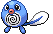

# #060 Poliwag (Tadpole Pokémon)

| Official Artwork | Shiny Artwork |
|------------------|---------------|
|  |  |

Its skin is so thin, its internal organs are visible. It has trouble walking on its newly grown feet.

---

## Media

### Default Sprites

| Front | Shiny | Back | Shiny |
|-------|-------|------|-------|
|  |  |  |  |

### Cries

Latest (Gen VI+):

<audio controls>
<source src='../../assets/cries/poliwag/latest.ogg' type='audio/ogg'>
  Your browser does not support the audio element.
</audio>

Legacy:

<audio controls>
<source src='../../assets/cries/poliwag/legacy.ogg' type='audio/ogg'>
  Your browser does not support the audio element.
</audio>

---

## Pokédex Data

| National № | Type(s) | Height | Weight | Abilities | Local № |
|------------|---------|--------|--------|-----------|---------|
| #60 | {: width="48"} | 0.6 m / 2.0 ft | 12.4 kg / 27.3 lbs | 1. Water Absorb 2. Swift Swim | N/A |

---

## Base Stats
|   | HP | Attack | Defense | Sp. Atk | Sp. Def | Speed |
|---|----|--------|---------|---------|---------|-------|
| **Base** | 40 | 50 | 40 | 40 | 40 | 90 |
| **Min** | 190 | 94 | 76 | 76 | 76 | 166 |
| **Max** | 284 | 218 | 196 | 196 | 196 | 306 |

The ranges shown above are for a level 100 Pokémon. Maximum values are based on a beneficial nature, 252 EVs, 31 IVs; minimum values are based on a hindering nature, 0 EVs, 0 IVs.

---

## Forms & Evolutions

!!! warning "WARNING"

    Information on evolutions may not be 100% accurate; differences between evolution methods across generations are not accounted for.

### Forms

Poliwag has no alternate forms.

### Evolution Line

1. [Poliwag](poliwag.md/)
    1. Level Up: [Poliwhirl](poliwhirl.md/)
        1. Use Item: [Poliwrath](poliwrath.md/)

        2. Trade: [Politoed](politoed.md/)

---

## Training

| EV Yield | Catch Rate | Base Friendship | Base Exp. | Growth Rate | Held Items |
|----------|------------|-----------------|-----------|-------------|------------|
| 1 Spd | 255 | 50 | 60 | Medium Slow | N/A |

---

## Breeding

| Egg Groups | Egg Cycles | Gender | Dimorphic | Color | Shape |
|------------|------------|--------|-----------|-------|-------|
| 1. Water1 | 20 | 50.0% Male 50.0% Female | False | Blue | Legs |

---

## Moves

!!! warning "WARNING"

    Specific move information may be incorrect. However, the general movepool should be accurate; this includes changes made in Blaze Black and Volt White.

### Level Up Moves

| Lv. | Move | Type | Cat. | Power | Acc. | PP |
| --- | --- | --- | --- | --- | --- | --- |
| 1 | Growth | {: width="48"} | {: width="36"} | — | — | 20 |
| 1 | Lovely Kiss | {: width="48"} | {: width="36"} | — | 75 | 10 |
| 1 | Sweet Kiss | {: width="48"} | {: width="36"} | — | 75 | 10 |
| 1 | Water Sport | {: width="48"} | {: width="36"} | — | — | 15 |
| 5 | Bubble | {: width="48"} | {: width="36"} | 40 | 100 | 30 |
| 8 | Hypnosis | {: width="48"} | {: width="36"} | — | 60 | 20 |
| 11 | Water Gun | {: width="48"} | {: width="36"} | 40 | 100 | 25 |
| 13 | Mud Shot | {: width="48"} | {: width="36"} | 55 | 95 | 15 |
| 15 | Double Slap | {: width="48"} | {: width="36"} | 15 | 85 | 10 |
| 18 | Rain Dance | {: width="48"} | {: width="36"} | — | — | 5 |
| 21 | Body Slam | {: width="48"} | {: width="36"} | 85 | 100 | 15 |
| 25 | Bubble Beam | {: width="48"} | {: width="36"} | 75 | 100 | 15 |
| 31 | Belly Drum | {: width="48"} | {: width="36"} | — | — | 10 |
| 35 | Wake Up Slap | {: width="48"} | {: width="36"} | 70 | 100 | 10 |
| 38 | Hydro Pump | {: width="48"} | {: width="36"} | 110 | 80 | 5 |
| 41 | Mud Bomb | {: width="48"} | {: width="36"} | 65 | 85 | 10 |

### TM Moves

| TM | Move | Type | Cat. | Power | Acc. | PP |
| --- | --- | --- | --- | --- | --- | --- |
| HM03 | Surf | {: width="48"} | {: width="36"} | 90 | 100 | 15 |
| HM05 | Waterfall | {: width="48"} | {: width="36"} | 85 | 100 | 15 |
| HM06 | Dive | {: width="48"} | {: width="36"} | 80 | 100 | 10 |
| TM06 | Toxic | {: width="48"} | {: width="36"} | — | 90 | 10 |
| TM07 | Hail | {: width="48"} | {: width="36"} | — | — | 10 |
| TM10 | Hidden Power | {: width="48"} | {: width="36"} | 60 | 100 | 15 |
| TM13 | Ice Beam | {: width="48"} | {: width="36"} | 90 | 100 | 10 |
| TM14 | Blizzard | {: width="48"} | {: width="36"} | 110 | 70 | 5 |
| TM17 | Protect | {: width="48"} | {: width="36"} | — | — | 10 |
| TM18 | Rain Dance | {: width="48"} | {: width="36"} | — | — | 5 |
| TM21 | Frustration | {: width="48"} | {: width="36"} | — | 100 | 20 |
| TM27 | Return | {: width="48"} | {: width="36"} | — | 100 | 20 |
| TM28 | Dig | {: width="48"} | {: width="36"} | 100 | 100 | 10 |
| TM29 | Psychic | {: width="48"} | {: width="36"} | 90 | 100 | 10 |
| TM32 | Double Team | {: width="48"} | {: width="36"} | — | — | 15 |
| TM42 | Facade | {: width="48"} | {: width="36"} | 70 | 100 | 20 |
| TM44 | Rest | {: width="48"} | {: width="36"} | — | — | 5 |
| TM45 | Attract | {: width="48"} | {: width="36"} | — | 100 | 15 |
| TM46 | Thief | {: width="48"} | {: width="36"} | 60 | 100 | 25 |
| TM48 | Round | {: width="48"} | {: width="36"} | 60 | 100 | 15 |
| TM55 | Scald | {: width="48"} | {: width="36"} | 80 | 100 | 15 |
| TM87 | Swagger | {: width="48"} | {: width="36"} | — | 85 | 15 |
| TM90 | Substitute | {: width="48"} | {: width="36"} | — | — | 10 |

### Egg Moves

| Move | Type | Cat. | Power | Acc. | PP |
| --- | --- | --- | --- | --- | --- |
| Mist | {: width="48"} | {: width="36"} | — | — | 30 |
| Bubble Beam | {: width="48"} | {: width="36"} | 75 | 100 | 15 |
| Haze | {: width="48"} | {: width="36"} | — | — | 30 |
| Splash | {: width="48"} | {: width="36"} | — | — | 40 |
| Mind Reader | {: width="48"} | {: width="36"} | — | — | 5 |
| Endure | {: width="48"} | {: width="36"} | — | — | 10 |
| Encore | {: width="48"} | {: width="36"} | — | 100 | 5 |
| Endeavor | {: width="48"} | {: width="36"} | — | 100 | 5 |
| Refresh | {: width="48"} | {: width="36"} | — | — | 20 |
| Ice Ball | {: width="48"} | {: width="36"} | 30 | 90 | 20 |
| Mud Shot | {: width="48"} | {: width="36"} | 55 | 95 | 15 |
| Water Sport | {: width="48"} | {: width="36"} | — | — | 15 |
| Water Pulse | {: width="48"} | {: width="36"} | 60 | 100 | 20 |

### Tutor Moves

Poliwag cannot learn any moves from tutors.
