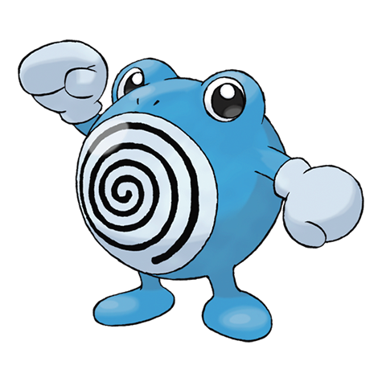

# #061 Poliwhirl (Tadpole Pokémon)

| Official Artwork | Shiny Artwork |
| --- | --- |
|  |  |

The spiral pattern on its belly subtly undulates. Staring at it gradually causes drowsiness.

---

## Media

### Sprites

| Front | Back | Front Shiny | Back Shiny |
| --- | --- | --- | --- |
|  |  |  |  |

### Cries

Latest (Gen VI+):
<p><audio controls>
  <source src='../assets/cries/poliwhirl/latest.ogg' type='audio/ogg'>
  Your browser does not support the audio element.
</audio></p>

Legacy:
<p><audio controls>
  <source src='../assets/cries/poliwhirl/legacy.ogg' type='audio/ogg'>
  Your browser does not support the audio element.
</audio></p>

---

## Pokédex Data

| National № | Type(s) | Height | Weight | Abilities | Local № |
|------------|---------|--------|--------|-----------|---------|
| #61 | {: width='48'} | 1.0 m | 20.0 kg | 1. Water-Absorb<br>2. Swift-Swim | #N/A |

---

## Base Stats
---

## Base Stats
|   | HP | Attack | Defense | Sp. Atk | Sp. Def | Speed |
|---|----|--------|---------|---------|---------|-------|
| **Base** | 65 | 65 | 65 | 50 | 50 | 90 |
| **Min** | 240 | 121 | 121 | 94 | 94 | 166 |
| **Max** | 334 | 251 | 251 | 218 | 218 | 306 |

The ranges shown above are for a level 100 Pokémon. Maximum values are based on a beneficial nature, 252 EVs, 31 IVs; minimum values are based on a hindering nature, 0 EVs, 0 IVs.

---

## Forms & Evolutions

!!! warning "WARNING"

    Some forms may not be available in Blaze Black/Volt White. Also information on evolutions may not be 100% accurate; it is currently quite complex to track generational evolution data.

### Forms

Poliwhirl has no alternate forms.

### Evolution Line

1. [Poliwag](poliwag.md/)
1. Level Up: [Poliwhirl](poliwhirl.md/)
1. Use Item: [Poliwrath](poliwrath.md/)2. Trade: [Politoed](politoed.md/)

```
Level Up at Night with King's Rock equipped.
```

---

## Training

| EV Yield | Catch Rate | Base Friendship | Base Exp. | Growth Rate | Held Items |
|----------|------------|-----------------|-----------|-------------|------------|
| 2 Speed | 120 | 50 | 135 | Medium-Slow | Kings Rock (5%) |

---

## Breeding

| Egg Groups | Egg Cycles | Gender | Dimorphic | Color | Shape |
|------------|------------|--------|-----------|-------|-------|
| 1. Water1 | 20 | 50.0% Male<br>50.0% Female | False | Blue | Humanoid |

---

## Moves

!!! warning "WARNING"

    Specific move information may be incorrect. However, the general movepool should be accurate (including changes to learnset).

### Level Up Moves

Lv. | Move | Type | Cat. | Power | Acc. | PP
--- | --- | --- | --- | --- | --- | ---
| 1 | Bubble | {: width='48'} | {: width='36'} | 40 | 100 | 30 |
| 1 | Hypnosis | {: width='48'} | {: width='36'} | — | 60 | 20 |
| 1 | Water Sport | {: width='48'} | {: width='36'} | — | — | 15 |
| 5 | Bubble | {: width='48'} | {: width='36'} | 40 | 100 | 30 |
| 8 | Hypnosis | {: width='48'} | {: width='36'} | — | 60 | 20 |
| 11 | Water Gun | {: width='48'} | {: width='36'} | 40 | 100 | 25 |
| 13 | Mud Shot | {: width='48'} | {: width='36'} | 55 | 95 | 15 |
| 15 | Double Slap | {: width='48'} | {: width='36'} | 15 | 85 | 10 |
| 18 | Rain Dance | {: width='48'} | {: width='36'} | — | — | 5 |
| 21 | Body Slam | {: width='48'} | {: width='36'} | 85 | 100 | 15 |
| 25 | Metronome | {: width='48'} | {: width='36'} | — | — | 10 |
| 27 | Bubble Beam | {: width='48'} | {: width='36'} | 65 | 100 | 20 |
| 37 | Belly Drum | {: width='48'} | {: width='36'} | — | — | 10 |
| 43 | Wake Up Slap | {: width='48'} | {: width='36'} | 70 | 100 | 10 |
| 48 | Hydro Pump | {: width='48'} | {: width='36'} | 110 | 80 | 5 |
| 53 | Mud Bomb | {: width='48'} | {: width='36'} | 65 | 85 | 10 |

### TM Moves

TM | Move | Type | Cat. | Power | Acc. | PP
--- | --- | --- | --- | --- | --- | ---
| HM03 | Surf | {: width='48'} | {: width='36'} | 90 | 100 | 15 |
| HM04 | Strength | {: width='48'} | {: width='36'} | 85 | 100 | 15 |
| HM05 | Waterfall | {: width='48'} | {: width='36'} | 85 | 100 | 15 |
| HM06 | Dive | {: width='48'} | {: width='36'} | 100 | 100 | 10 |
| TM06 | Toxic | {: width='48'} | {: width='36'} | — | 90 | 10 |
| TM07 | Hail | {: width='48'} | {: width='36'} | — | — | 10 |
| TM10 | Hidden Power | {: width='48'} | {: width='36'} | 60 | 100 | 15 |
| TM13 | Ice Beam | {: width='48'} | {: width='36'} | 90 | 100 | 10 |
| TM14 | Blizzard | {: width='48'} | {: width='36'} | 110 | 70 | 5 |
| TM17 | Protect | {: width='48'} | {: width='36'} | — | — | 10 |
| TM18 | Rain Dance | {: width='48'} | {: width='36'} | — | — | 5 |
| TM21 | Frustration | {: width='48'} | {: width='36'} | — | 100 | 20 |
| TM26 | Earthquake | {: width='48'} | {: width='36'} | 100 | 100 | 10 |
| TM27 | Return | {: width='48'} | {: width='36'} | — | 100 | 20 |
| TM28 | Dig | {: width='48'} | {: width='36'} | 100 | 100 | 10 |
| TM29 | Psychic | {: width='48'} | {: width='36'} | 90 | 100 | 10 |
| TM31 | Brick Break | {: width='48'} | {: width='36'} | 75 | 100 | 15 |
| TM32 | Double Team | {: width='48'} | {: width='36'} | — | — | 15 |
| TM42 | Facade | {: width='48'} | {: width='36'} | 70 | 100 | 20 |
| TM44 | Rest | {: width='48'} | {: width='36'} | — | — | 5 |
| TM45 | Attract | {: width='48'} | {: width='36'} | — | 100 | 15 |
| TM46 | Thief | {: width='48'} | {: width='36'} | 60 | 100 | 25 |
| TM48 | Round | {: width='48'} | {: width='36'} | 60 | 100 | 15 |
| TM55 | Scald | {: width='48'} | {: width='36'} | 80 | 100 | 15 |
| TM56 | Fling | {: width='48'} | {: width='36'} | — | 100 | 10 |
| TM78 | Bulldoze | {: width='48'} | {: width='36'} | 80 | 100 | 20 |
| TM87 | Swagger | {: width='48'} | {: width='36'} | — | 85 | 15 |
| TM90 | Substitute | {: width='48'} | {: width='36'} | — | — | 10 |
| TM94 | Rock Smash | {: width='48'} | {: width='36'} | 40 | 100 | 15 |

### Egg Moves

Poliwhirl cannot learn any moves by breeding.
### Tutor Moves

Poliwhirl cannot learn any moves from tutors.
