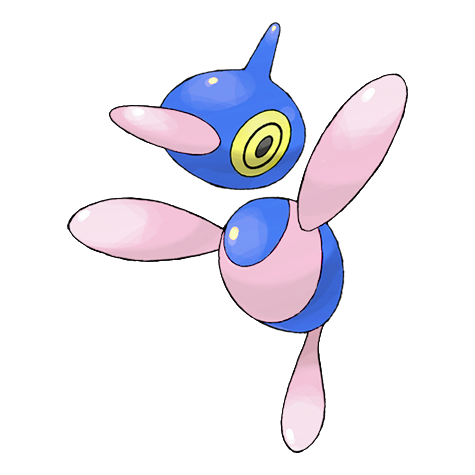

# #474 Porygon Z (Virtual Pokémon)

| Official Artwork | Shiny Artwork |
|------------------|---------------|
|  |  |

Its programming was modified to enable work in alien dimensions. It did not work as planned.

---

## Media

### Default Sprites

| Front | Shiny | Back | Shiny |
|-------|-------|------|-------|
|  |  |  |  |

### Cries

Latest (Gen VI+):

<audio controls>
<source src='../../assets/cries/porygon-z/latest.ogg' type='audio/ogg'>
  Your browser does not support the audio element.
</audio>

Legacy:

<audio controls>
<source src='../../assets/cries/porygon-z/legacy.ogg' type='audio/ogg'>
  Your browser does not support the audio element.
</audio>

---

## Pokédex Data

| National № | Type(s) | Height | Weight | Abilities | Local № |
|------------|---------|--------|--------|-----------|---------|
| #474 | {: width="48"} | 0.9 m / 3.0 ft | 34.0 kg / 75.0 lbs | 1. Adaptability 2. Download | N/A |

---

## Base Stats
|   | HP | Attack | Defense | Sp. Atk | Sp. Def | Speed |
|---|----|--------|---------|---------|---------|-------|
| **Base** | 85 | 80 | 70 | 135 | 75 | 90 |
| **Min** | 280 | 148 | 130 | 247 | 139 | 166 |
| **Max** | 374 | 284 | 262 | 405 | 273 | 306 |

The ranges shown above are for a level 100 Pokémon. Maximum values are based on a beneficial nature, 252 EVs, 31 IVs; minimum values are based on a hindering nature, 0 EVs, 0 IVs.

---

## Forms & Evolutions

!!! warning "WARNING"

    Information on evolutions may not be 100% accurate; differences between evolution methods across generations are not accounted for.

### Forms

Porygon Z has no alternate forms.

### Evolution Line

1. [Porygon](porygon.md/)
    1. Trade: [Porygon2](porygon2.md/)
        1. Trade: [Porygon Z](porygon-z.md/)

---

## Training

| EV Yield | Catch Rate | Base Friendship | Base Exp. | Growth Rate | Held Items |
|----------|------------|-----------------|-----------|-------------|------------|
| 3 Sp. Atk | 30 | 50 | 268 | Medium | N/A |

---

## Breeding

| Egg Groups | Egg Cycles | Gender | Dimorphic | Color | Shape |
|------------|------------|--------|-----------|-------|-------|
| 1. Mineral | 20 | Genderless | False | Red | Arms |

---

## Moves

!!! warning "WARNING"

    Specific move information may be incorrect. However, the general movepool should be accurate; this includes changes made in Blaze Black and Volt White.

### Level Up Moves

| Lv. | Move | Type | Cat. | Power | Acc. | PP |
| --- | --- | --- | --- | --- | --- | --- |
| 1 | Barrier | {: width="48"} | {: width="36"} | — | — | 20 |
| 1 | Conversion | {: width="48"} | {: width="36"} | — | — | 30 |
| 1 | Conversion 2 | {: width="48"} | {: width="36"} | — | — | 30 |
| 1 | Dark Pulse | {: width="48"} | {: width="36"} | 90 | 100 | 15 |
| 1 | Nasty Plot | {: width="48"} | {: width="36"} | — | — | 20 |
| 1 | Pain Split | {: width="48"} | {: width="36"} | — | — | 20 |
| 1 | Tackle | {: width="48"} | {: width="36"} | 40 | 100 | 35 |
| 1 | Transform | {: width="48"} | {: width="36"} | — | — | 10 |
| 1 | Trick Room | {: width="48"} | {: width="36"} | — | — | 5 |
| 7 | Psybeam | {: width="48"} | {: width="36"} | 65 | 100 | 20 |
| 12 | Agility | {: width="48"} | {: width="36"} | — | — | 30 |
| 18 | Recover | {: width="48"} | {: width="36"} | — | — | 5 |
| 23 | Magnet Rise | {: width="48"} | {: width="36"} | — | — | 10 |
| 29 | Signal Beam | {: width="48"} | {: width="36"} | 75 | 100 | 15 |
| 34 | Embargo | {: width="48"} | {: width="36"} | — | 100 | 15 |
| 40 | Discharge | {: width="48"} | {: width="36"} | 80 | 100 | 15 |
| 45 | Lock On | {: width="48"} | {: width="36"} | — | — | 5 |
| 51 | Tri Attack | {: width="48"} | {: width="36"} | 80 | 100 | 10 |
| 56 | Magic Coat | {: width="48"} | {: width="36"} | — | — | 15 |
| 62 | Zap Cannon | {: width="48"} | {: width="36"} | 120 | 50 | 5 |
| 67 | Hyper Beam | {: width="48"} | {: width="36"} | 150 | 90 | 5 |
| 72 | Gravity | {: width="48"} | {: width="36"} | — | — | 5 |

### TM Moves

| TM | Move | Type | Cat. | Power | Acc. | PP |
| --- | --- | --- | --- | --- | --- | --- |
| TM03 | Psyshock | {: width="48"} | {: width="36"} | 80 | 100 | 10 |
| TM06 | Toxic | {: width="48"} | {: width="36"} | — | 90 | 10 |
| TM10 | Hidden Power | {: width="48"} | {: width="36"} | 60 | 100 | 15 |
| TM11 | Sunny Day | {: width="48"} | {: width="36"} | — | — | 5 |
| TM13 | Ice Beam | {: width="48"} | {: width="36"} | 90 | 100 | 10 |
| TM14 | Blizzard | {: width="48"} | {: width="36"} | 110 | 70 | 5 |
| TM15 | Hyper Beam | {: width="48"} | {: width="36"} | 150 | 90 | 5 |
| TM17 | Protect | {: width="48"} | {: width="36"} | — | — | 10 |
| TM18 | Rain Dance | {: width="48"} | {: width="36"} | — | — | 5 |
| TM21 | Frustration | {: width="48"} | {: width="36"} | — | 100 | 20 |
| TM22 | Solar Beam | {: width="48"} | {: width="36"} | 120 | 100 | 10 |
| TM24 | Thunderbolt | {: width="48"} | {: width="36"} | 90 | 100 | 15 |
| TM25 | Thunder | {: width="48"} | {: width="36"} | 110 | 70 | 10 |
| TM27 | Return | {: width="48"} | {: width="36"} | — | 100 | 20 |
| TM29 | Psychic | {: width="48"} | {: width="36"} | 90 | 100 | 10 |
| TM30 | Shadow Ball | {: width="48"} | {: width="36"} | 90 | 100 | 15 |
| TM32 | Double Team | {: width="48"} | {: width="36"} | — | — | 15 |
| TM40 | Aerial Ace | {: width="48"} | {: width="36"} | 60 | — | 20 |
| TM42 | Facade | {: width="48"} | {: width="36"} | 70 | 100 | 20 |
| TM44 | Rest | {: width="48"} | {: width="36"} | — | — | 5 |
| TM46 | Thief | {: width="48"} | {: width="36"} | 60 | 100 | 25 |
| TM48 | Round | {: width="48"} | {: width="36"} | 60 | 100 | 15 |
| TM57 | Charge Beam | {: width="48"} | {: width="36"} | 50 | 90 | 10 |
| TM63 | Embargo | {: width="48"} | {: width="36"} | — | 100 | 15 |
| TM68 | Giga Impact | {: width="48"} | {: width="36"} | 150 | 90 | 5 |
| TM70 | Flash | {: width="48"} | {: width="36"} | — | 100 | 20 |
| TM73 | Thunder Wave | {: width="48"} | {: width="36"} | — | 90 | 20 |
| TM77 | Psych Up | {: width="48"} | {: width="36"} | — | — | 10 |
| TM85 | Dream Eater | {: width="48"} | {: width="36"} | 100 | 100 | 15 |
| TM87 | Swagger | {: width="48"} | {: width="36"} | — | 85 | 15 |
| TM90 | Substitute | {: width="48"} | {: width="36"} | — | — | 10 |
| TM92 | Trick Room | {: width="48"} | {: width="36"} | — | — | 5 |

### Egg Moves

Porygon Z cannot learn any moves by breeding.
### Tutor Moves

Porygon Z cannot learn any moves from tutors.
