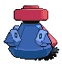
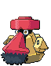
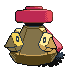

# #476 Probopass (Compass Pokémon)

| Official Artwork | Shiny Artwork |
| --- | --- |
|  |  |

It freely controls three small units called Mini-Noses using magnetic force.

---

## Media

### Sprites

| Front | Back | Front Shiny | Back Shiny |
| --- | --- | --- | --- |
|  |  |  |  |

### Cries

Latest (Gen VI+):

<audio controls>
<source src='../../assets/cries/probopass/latest.ogg' type='audio/ogg'>
  Your browser does not support the audio element.
</audio>

Legacy:

<audio controls>
<source src='../../assets/cries/probopass/legacy.ogg' type='audio/ogg'>
  Your browser does not support the audio element.
</audio>

---

## Pokédex Data

| National № | Type(s) | Height | Weight | Abilities | Local № |
|------------|---------|--------|--------|-----------|---------|
| #476 | {: width='48'} {: width='48'} | 1.4 m | 340.0 kg | 1. Sturdy 2. Magnet-Pull | N/A |

---

## Base Stats
|   | HP | Attack | Defense | Sp. Atk | Sp. Def | Speed |
|---|----|--------|---------|---------|---------|-------|
| **Base** | 60 | 55 | 145 | 75 | 150 | 40 |
| **Min** | 230 | 103 | 265 | 139 | 274 | 76 |
| **Max** | 324 | 229 | 427 | 273 | 438 | 196 |

The ranges shown above are for a level 100 Pokémon. Maximum values are based on a beneficial nature, 252 EVs, 31 IVs; minimum values are based on a hindering nature, 0 EVs, 0 IVs.

---

## Forms & Evolutions

!!! warning "WARNING"

    Information on evolutions may not be 100% accurate; differences between evolution methods across generations are not accounted for.

### Forms

Probopass has no alternate forms.

### Evolution Line

1. [Nosepass](nosepass.md/)
    1. Level Up: [Probopass](probopass.md/)

### Evolution Changes

---

## Training

| EV Yield | Catch Rate | Base Friendship | Base Exp. | Growth Rate | Held Items |
|----------|------------|-----------------|-----------|-------------|------------|
| 1 Defense 2 Special Defense | 60 | 70 | 184 | Medium | Hard Stone (5%) |

---

## Breeding

| Egg Groups | Egg Cycles | Gender | Dimorphic | Color | Shape |
|------------|------------|--------|-----------|-------|-------|
| 1. Mineral | 20 | 50.0% Male 50.0% Female | False | Gray | Heads |

---

## Moves

!!! warning "WARNING"

    Specific move information may be incorrect. However, the general movepool should be accurate; this includes changes made in Blaze Black and Volt White.

### Level Up Moves

| Lv. | Move | Type | Cat. | Power | Acc. | PP |
| --- | --- | --- | --- | --- | --- | --- |
| 1 | Block | {: width='48'} | {: width='36'} | — | — | 5 |
| 1 | Gravity | {: width='48'} | {: width='36'} | — | — | 5 |
| 1 | Iron Defense | {: width='48'} | {: width='36'} | — | — | 15 |
| 1 | Magnet Bomb | {: width='48'} | {: width='36'} | 70 | — | 20 |
| 1 | Magnet Rise | {: width='48'} | {: width='36'} | — | — | 10 |
| 1 | Tackle | {: width='48'} | {: width='36'} | 40 | 100 | 35 |
| 7 | Iron Defense | {: width='48'} | {: width='36'} | — | — | 15 |
| 13 | Magnet Bomb | {: width='48'} | {: width='36'} | 70 | — | 20 |
| 19 | Block | {: width='48'} | {: width='36'} | — | — | 5 |
| 22 | Shock Wave | {: width='48'} | {: width='36'} | 70 | — | 20 |
| 25 | Thunder Wave | {: width='48'} | {: width='36'} | — | 90 | 20 |
| 28 | Ancient Power | {: width='48'} | {: width='36'} | 60 | 100 | 5 |
| 31 | Rock Slide | {: width='48'} | {: width='36'} | 80 | 95 | 10 |
| 43 | Rest | {: width='48'} | {: width='36'} | — | — | 5 |
| 49 | Power Gem | {: width='48'} | {: width='36'} | 90 | 100 | 20 |
| 55 | Discharge | {: width='48'} | {: width='36'} | 80 | 100 | 15 |
| 61 | Stone Edge | {: width='48'} | {: width='36'} | 100 | 80 | 5 |
| 67 | Zap Cannon | {: width='48'} | {: width='36'} | 120 | 50 | 5 |
| 73 | Lock On | {: width='48'} | {: width='36'} | — | — | 5 |
| 79 | Earth Power | {: width='48'} | {: width='36'} | 90 | 100 | 10 |
| 79 | Sandstorm | {: width='48'} | {: width='36'} | — | — | 10 |
| 85 | Head Smash | {: width='48'} | {: width='36'} | 150 | 80 | 5 |

### TM Moves

| TM | Move | Type | Cat. | Power | Acc. | PP |
| --- | --- | --- | --- | --- | --- | --- |
| HM04 | Strength | {: width='48'} | {: width='36'} | 85 | 100 | 15 |
| TM06 | Toxic | {: width='48'} | {: width='36'} | — | 90 | 10 |
| TM10 | Hidden Power | {: width='48'} | {: width='36'} | 60 | 100 | 15 |
| TM11 | Sunny Day | {: width='48'} | {: width='36'} | — | — | 5 |
| TM12 | Taunt | {: width='48'} | {: width='36'} | — | 100 | 20 |
| TM15 | Hyper Beam | {: width='48'} | {: width='36'} | 150 | 90 | 5 |
| TM17 | Protect | {: width='48'} | {: width='36'} | — | — | 10 |
| TM21 | Frustration | {: width='48'} | {: width='36'} | — | 100 | 20 |
| TM23 | Smack Down | {: width='48'} | {: width='36'} | 50 | 100 | 15 |
| TM24 | Thunderbolt | {: width='48'} | {: width='36'} | 90 | 100 | 15 |
| TM25 | Thunder | {: width='48'} | {: width='36'} | 110 | 70 | 10 |
| TM26 | Earthquake | {: width='48'} | {: width='36'} | 100 | 100 | 10 |
| TM27 | Return | {: width='48'} | {: width='36'} | — | 100 | 20 |
| TM32 | Double Team | {: width='48'} | {: width='36'} | — | — | 15 |
| TM37 | Sandstorm | {: width='48'} | {: width='36'} | — | — | 10 |
| TM39 | Rock Tomb | {: width='48'} | {: width='36'} | 60 | 95 | 15 |
| TM41 | Torment | {: width='48'} | {: width='36'} | — | 100 | 15 |
| TM42 | Facade | {: width='48'} | {: width='36'} | 70 | 100 | 20 |
| TM44 | Rest | {: width='48'} | {: width='36'} | — | — | 5 |
| TM45 | Attract | {: width='48'} | {: width='36'} | — | 100 | 15 |
| TM48 | Round | {: width='48'} | {: width='36'} | 60 | 100 | 15 |
| TM64 | Explosion | {: width='48'} | {: width='36'} | 250 | 100 | 5 |
| TM68 | Giga Impact | {: width='48'} | {: width='36'} | 150 | 90 | 5 |
| TM69 | Rock Polish | {: width='48'} | {: width='36'} | — | — | 20 |
| TM71 | Stone Edge | {: width='48'} | {: width='36'} | 100 | 80 | 5 |
| TM72 | Volt Switch | {: width='48'} | {: width='36'} | 70 | 100 | 20 |
| TM73 | Thunder Wave | {: width='48'} | {: width='36'} | — | 90 | 20 |
| TM78 | Bulldoze | {: width='48'} | {: width='36'} | 80 | 100 | 20 |
| TM80 | Rock Slide | {: width='48'} | {: width='36'} | 80 | 95 | 10 |
| TM87 | Swagger | {: width='48'} | {: width='36'} | — | 85 | 15 |
| TM90 | Substitute | {: width='48'} | {: width='36'} | — | — | 10 |
| TM91 | Flash Cannon | {: width='48'} | {: width='36'} | 80 | 100 | 10 |
| TM94 | Rock Smash | {: width='48'} | {: width='36'} | 40 | 100 | 15 |

### Egg Moves

Probopass cannot learn any moves by breeding.
### Tutor Moves

Probopass cannot learn any moves from tutors.
