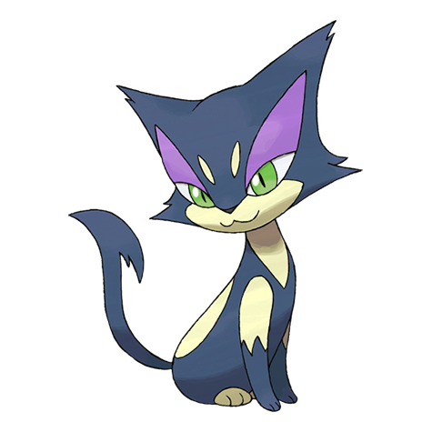
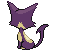
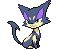
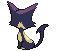

# #509 Purrloin (Devious Pokémon)

| Official Artwork | Shiny Artwork |
| --- | --- |
|  |  |

**Blaze Black:** They steal from people for fun, but their victims can’t help but forgive them. Their deceptively cute act is perfect.

**Volt White:** Its cute act is a ruse. When victims let down their guard, they find their items taken. It attacks with sharp claws.

---

## Media

### Default Sprites

| Front | Back | Front Shiny | Back Shiny |
| --- | --- | --- | --- |
|  |  |  |  |

### Cries

Latest (Gen VI+):

<audio controls>
<source src='../../assets/cries/purrloin/latest.ogg' type='audio/ogg'>
  Your browser does not support the audio element.
</audio>

Legacy:

<audio controls>
<source src='../../assets/cries/purrloin/legacy.ogg' type='audio/ogg'>
  Your browser does not support the audio element.
</audio>

---

## Pokédex Data

| National № | Type(s) | Height | Weight | Abilities | Local № |
|------------|---------|--------|--------|-----------|---------|
| #509 | {: width="48"} | 0.4 m / 1.3 ft | 10.1 kg / 22.3 lbs | Limber Prankster | #15 |

---

## Base Stats
|   | HP | Attack | Defense | Sp. Atk | Sp. Def | Speed |
|---|----|--------|---------|---------|---------|-------|
| **Base** | 41 | 50 | 37 | 50 | 37 | 66 |
| **Min** | 192 | 94 | 71 | 94 | 71 | 123 |
| **Max** | 286 | 218 | 190 | 218 | 190 | 254 |

The ranges shown above are for a level 100 Pokémon. Maximum values are based on a beneficial nature, 252 EVs, 31 IVs; minimum values are based on a hindering nature, 0 EVs, 0 IVs.

---

## Forms & Evolutions

!!! warning "WARNING"

    Information on evolutions may not be 100% accurate; differences between evolution methods across generations are not accounted for.

### Forms

Purrloin has no alternate forms.

### Evolution Line

1. [Purrloin](purrloin.md/)
    1. Level Up: [Liepard](liepard.md/)

---

## Training

| EV Yield | Catch Rate | Base Friendship | Base Exp. | Growth Rate | Held Items |
|----------|------------|-----------------|-----------|-------------|------------|
| 1 Spd | 255 | 50 | 56 | Medium | N/A |

---

## Breeding

| Egg Groups | Egg Cycles | Gender | Dimorphic | Color | Shape |
|------------|------------|--------|-----------|-------|-------|
| 1. Ground | 20 | 50.0% Male 50.0% Female | False | Purple | Quadruped |

---

## Moves

!!! warning "WARNING"

    Specific move information may be incorrect. However, the general movepool should be accurate; this includes changes made in Blaze Black and Volt White.

### Level Up Moves

| Lv. | Move | Type | Cat. | Power | Acc. | PP |
| --- | --- | --- | --- | --- | --- | --- |
| 1 | Scratch | {: width="48"} | {: width="36"} | 40 | 100 | 35 |
| 3 | Growl | {: width="48"} | {: width="36"} | — | 100 | 40 |
| 6 | Assist | {: width="48"} | {: width="36"} | — | — | 20 |
| 8 | Feint Attack | {: width="48"} | {: width="36"} | 60 | — | 20 |
| 10 | Sand Attack | {: width="48"} | {: width="36"} | — | 100 | 15 |
| 12 | Fury Swipes | {: width="48"} | {: width="36"} | 18 | 80 | 15 |
| 15 | Pursuit | {: width="48"} | {: width="36"} | 40 | 100 | 20 |
| 17 | Night Slash | {: width="48"} | {: width="36"} | 70 | 100 | 15 |
| 19 | Torment | {: width="48"} | {: width="36"} | — | 100 | 15 |
| 21 | Fake Out | {: width="48"} | {: width="36"} | 40 | 100 | 10 |
| 24 | Hone Claws | {: width="48"} | {: width="36"} | — | — | 15 |
| 28 | Assurance | {: width="48"} | {: width="36"} | 60 | 100 | 10 |
| 30 | Slash | {: width="48"} | {: width="36"} | 70 | 100 | 20 |
| 33 | Captivate | {: width="48"} | {: width="36"} | — | 100 | 20 |
| 37 | Foul Play | {: width="48"} | {: width="36"} | 95 | 100 | 15 |
| 39 | Snatch | {: width="48"} | {: width="36"} | — | — | 10 |
| 42 | Nasty Plot | {: width="48"} | {: width="36"} | — | — | 20 |
| 46 | Sucker Punch | {: width="48"} | {: width="36"} | 70 | 100 | 5 |
| 50 | Dark Pulse | {: width="48"} | {: width="36"} | 90 | 100 | 15 |

### TM Moves

| TM | Move | Type | Cat. | Power | Acc. | PP |
| --- | --- | --- | --- | --- | --- | --- |
| HM01 | Cut | {: width="48"} | {: width="36"} | 60 | 100% | 25 |
| TM01 | Hone Claws | {: width="48"} | {: width="36"} | — | — | 15 |
| TM06 | Toxic | {: width="48"} | {: width="36"} | — | 90 | 10 |
| TM10 | Hidden Power | {: width="48"} | {: width="36"} | 60 | 100 | 15 |
| TM11 | Sunny Day | {: width="48"} | {: width="36"} | — | — | 5 |
| TM12 | Taunt | {: width="48"} | {: width="36"} | — | 100 | 20 |
| TM17 | Protect | {: width="48"} | {: width="36"} | — | — | 10 |
| TM18 | Rain Dance | {: width="48"} | {: width="36"} | — | — | 5 |
| TM21 | Frustration | {: width="48"} | {: width="36"} | — | 100 | 20 |
| TM27 | Return | {: width="48"} | {: width="36"} | — | 100 | 20 |
| TM30 | Shadow Ball | {: width="48"} | {: width="36"} | 90 | 100 | 15 |
| TM32 | Double Team | {: width="48"} | {: width="36"} | — | — | 15 |
| TM40 | Aerial Ace | {: width="48"} | {: width="36"} | 60 | — | 20 |
| TM41 | Torment | {: width="48"} | {: width="36"} | — | 100 | 15 |
| TM42 | Facade | {: width="48"} | {: width="36"} | 70 | 100 | 20 |
| TM44 | Rest | {: width="48"} | {: width="36"} | — | — | 5 |
| TM45 | Attract | {: width="48"} | {: width="36"} | — | 100 | 15 |
| TM46 | Thief | {: width="48"} | {: width="36"} | 60 | 100 | 25 |
| TM48 | Round | {: width="48"} | {: width="36"} | 60 | 100 | 15 |
| TM49 | Echoed Voice | {: width="48"} | {: width="36"} | 40 | 100 | 15 |
| TM63 | Embargo | {: width="48"} | {: width="36"} | — | 100 | 15 |
| TM65 | Shadow Claw | {: width="48"} | {: width="36"} | 80 | 100 | 15 |
| TM66 | Payback | {: width="48"} | {: width="36"} | 50 | 100 | 10 |
| TM73 | Thunder Wave | {: width="48"} | {: width="36"} | — | 90 | 20 |
| TM77 | Psych Up | {: width="48"} | {: width="36"} | — | — | 10 |
| TM85 | Dream Eater | {: width="48"} | {: width="36"} | 100 | 100 | 15 |
| TM86 | Grass Knot | {: width="48"} | {: width="36"} | — | 100 | 20 |
| TM87 | Swagger | {: width="48"} | {: width="36"} | — | 85 | 15 |
| TM90 | Substitute | {: width="48"} | {: width="36"} | — | — | 10 |
| TM95 | Snarl | {: width="48"} | {: width="36"} | 60 | 95 | 15 |

### Egg Moves

| Move | Type | Cat. | Power | Acc. | PP |
| --- | --- | --- | --- | --- | --- |
| Pay Day | {: width="48"} | {: width="36"} | 40 | 100 | 20 |
| Feint Attack | {: width="48"} | {: width="36"} | 60 | — | 20 |
| Charm | {: width="48"} | {: width="36"} | — | 100 | 20 |
| Encore | {: width="48"} | {: width="36"} | — | 100 | 5 |
| Yawn | {: width="48"} | {: width="36"} | — | — | 10 |
| Fake Tears | {: width="48"} | {: width="36"} | — | 100 | 20 |
| Covet | {: width="48"} | {: width="36"} | 60 | 100 | 25 |
| Foul Play | {: width="48"} | {: width="36"} | 95 | 100 | 15 |

### Tutor Moves

Purrloin cannot learn any moves from tutors.
