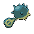
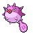

# #211 Qwilfish (Balloon Pokémon)

| Official Artwork | Shiny Artwork |
| --- | --- |
|  |  |

It shoots the poison spines on its body in all directions. Its round form makes it a poor swimmer.

---

## Media

### Sprites

| Front | Back | Front Shiny | Back Shiny |
| --- | --- | --- | --- |
|  |  |  |  |

### Cries

Latest (Gen VI+):

<audio controls>
<source src='../../assets/cries/qwilfish/latest.ogg' type='audio/ogg'>
  Your browser does not support the audio element.
</audio>

Legacy:

<audio controls>
<source src='../../assets/cries/qwilfish/legacy.ogg' type='audio/ogg'>
  Your browser does not support the audio element.
</audio>

---

## Pokédex Data

| National № | Type(s) | Height | Weight | Abilities | Local № |
|------------|---------|--------|--------|-----------|---------|
| #211 | {: width='48'} {: width='48'} | 0.5 m | 3.9 kg | 1. Poison-Touch 2. Intimidate | N/A |

---

## Base Stats
|   | HP | Attack | Defense | Sp. Atk | Sp. Def | Speed |
|---|----|--------|---------|---------|---------|-------|
| **Base** | 65 | 95 | 85 | 95 | 55 | 85 |
| **Min** | 240 | 175 | 157 | 175 | 103 | 157 |
| **Max** | 334 | 317 | 295 | 317 | 229 | 295 |

The ranges shown above are for a level 100 Pokémon. Maximum values are based on a beneficial nature, 252 EVs, 31 IVs; minimum values are based on a hindering nature, 0 EVs, 0 IVs.

---

## Forms & Evolutions

!!! warning "WARNING"

    Information on evolutions may not be 100% accurate; differences between evolution methods across generations are not accounted for.

### Forms

Qwilfish has no alternate forms.

### Evolution Line

1. [Qwilfish](qwilfish.md/)

---

## Training

| EV Yield | Catch Rate | Base Friendship | Base Exp. | Growth Rate | Held Items |
|----------|------------|-----------------|-----------|-------------|------------|
| 1 Attack | 45 | 50 | 88 | Medium | Poison Barb (5%) |

---

## Breeding

| Egg Groups | Egg Cycles | Gender | Dimorphic | Color | Shape |
|------------|------------|--------|-----------|-------|-------|
| 1. Water2 | 20 | 50.0% Male 50.0% Female | False | Gray | Fish |

---

## Moves

!!! warning "WARNING"

    Specific move information may be incorrect. However, the general movepool should be accurate; this includes changes made in Blaze Black and Volt White.

### Level Up Moves

| Lv. | Move | Type | Cat. | Power | Acc. | PP |
| --- | --- | --- | --- | --- | --- | --- |
| 1 | Double Edge | {: width='48'} | {: width='36'} | 120 | 100 | 15 |
| 1 | Poison Sting | {: width='48'} | {: width='36'} | 15 | 100 | 35 |
| 1 | Spikes | {: width='48'} | {: width='36'} | — | — | 20 |
| 1 | Tackle | {: width='48'} | {: width='36'} | 40 | 100 | 35 |
| 9 | Harden | {: width='48'} | {: width='36'} | — | — | 30 |
| 9 | Minimize | {: width='48'} | {: width='36'} | — | — | 10 |
| 13 | Water Gun | {: width='48'} | {: width='36'} | 40 | 100 | 25 |
| 17 | Rollout | {: width='48'} | {: width='36'} | 30 | 90 | 20 |
| 21 | Toxic Spikes | {: width='48'} | {: width='36'} | — | — | 20 |
| 25 | Spit Up | {: width='48'} | {: width='36'} | — | 100 | 10 |
| 25 | Stockpile | {: width='48'} | {: width='36'} | — | — | 20 |
| 29 | Revenge | {: width='48'} | {: width='36'} | 60 | 100 | 10 |
| 33 | Brine | {: width='48'} | {: width='36'} | 65 | 100 | 10 |
| 37 | Pin Missile | {: width='48'} | {: width='36'} | 25 | 95 | 20 |
| 41 | Take Down | {: width='48'} | {: width='36'} | 90 | 85 | 20 |
| 45 | Aqua Tail | {: width='48'} | {: width='36'} | 90 | 90 | 10 |
| 49 | Poison Jab | {: width='48'} | {: width='36'} | 80 | 100 | 20 |
| 53 | Destiny Bond | {: width='48'} | {: width='36'} | — | — | 5 |
| 57 | Hydro Pump | {: width='48'} | {: width='36'} | 110 | 80 | 5 |
| 61 | Pain Split | {: width='48'} | {: width='36'} | — | — | 20 |

### TM Moves

| TM | Move | Type | Cat. | Power | Acc. | PP |
| --- | --- | --- | --- | --- | --- | --- |
| HM03 | Surf | {: width='48'} | {: width='36'} | 90 | 100 | 15 |
| HM05 | Waterfall | {: width='48'} | {: width='36'} | 85 | 100 | 15 |
| HM06 | Dive | {: width='48'} | {: width='36'} | 100 | 100 | 10 |
| TM06 | Toxic | {: width='48'} | {: width='36'} | — | 90 | 10 |
| TM07 | Hail | {: width='48'} | {: width='36'} | — | — | 10 |
| TM09 | Venoshock | {: width='48'} | {: width='36'} | 65 | 100 | 10 |
| TM10 | Hidden Power | {: width='48'} | {: width='36'} | 60 | 100 | 15 |
| TM12 | Taunt | {: width='48'} | {: width='36'} | — | 100 | 20 |
| TM13 | Ice Beam | {: width='48'} | {: width='36'} | 90 | 100 | 10 |
| TM14 | Blizzard | {: width='48'} | {: width='36'} | 110 | 70 | 5 |
| TM17 | Protect | {: width='48'} | {: width='36'} | — | — | 10 |
| TM18 | Rain Dance | {: width='48'} | {: width='36'} | — | — | 5 |
| TM21 | Frustration | {: width='48'} | {: width='36'} | — | 100 | 20 |
| TM27 | Return | {: width='48'} | {: width='36'} | — | 100 | 20 |
| TM30 | Shadow Ball | {: width='48'} | {: width='36'} | 90 | 100 | 15 |
| TM32 | Double Team | {: width='48'} | {: width='36'} | — | — | 15 |
| TM34 | Sludge Wave | {: width='48'} | {: width='36'} | 95 | 100 | 10 |
| TM36 | Sludge Bomb | {: width='48'} | {: width='36'} | 90 | 100 | 10 |
| TM42 | Facade | {: width='48'} | {: width='36'} | 70 | 100 | 20 |
| TM44 | Rest | {: width='48'} | {: width='36'} | — | — | 5 |
| TM45 | Attract | {: width='48'} | {: width='36'} | — | 100 | 15 |
| TM48 | Round | {: width='48'} | {: width='36'} | 60 | 100 | 15 |
| TM55 | Scald | {: width='48'} | {: width='36'} | 80 | 100 | 15 |
| TM64 | Explosion | {: width='48'} | {: width='36'} | 250 | 100 | 5 |
| TM66 | Payback | {: width='48'} | {: width='36'} | 50 | 100 | 10 |
| TM73 | Thunder Wave | {: width='48'} | {: width='36'} | — | 90 | 20 |
| TM74 | Gyro Ball | {: width='48'} | {: width='36'} | — | 100 | 5 |
| TM84 | Poison Jab | {: width='48'} | {: width='36'} | 80 | 100 | 20 |
| TM87 | Swagger | {: width='48'} | {: width='36'} | — | 85 | 15 |
| TM90 | Substitute | {: width='48'} | {: width='36'} | — | — | 10 |

### Egg Moves

| Move | Type | Cat. | Power | Acc. | PP |
| --- | --- | --- | --- | --- | --- |
| Supersonic | {: width='48'} | {: width='36'} | — | 55 | 20 |
| Bubble Beam | {: width='48'} | {: width='36'} | 65 | 100 | 20 |
| Haze | {: width='48'} | {: width='36'} | — | — | 30 |
| Flail | {: width='48'} | {: width='36'} | — | 100 | 15 |
| Astonish | {: width='48'} | {: width='36'} | 30 | 100 | 15 |
| Signal Beam | {: width='48'} | {: width='36'} | 75 | 100 | 15 |
| Water Pulse | {: width='48'} | {: width='36'} | 60 | 100 | 20 |
| Brine | {: width='48'} | {: width='36'} | 65 | 100 | 10 |
| Aqua Jet | {: width='48'} | {: width='36'} | 40 | 100 | 20 |
| Acid Spray | {: width='48'} | {: width='36'} | 40 | 100 | 20 |

### Tutor Moves

Qwilfish cannot learn any moves from tutors.
