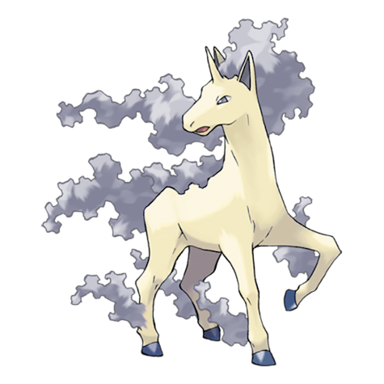
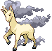
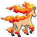
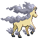

# #078 Rapidash (Fire Horse Pokémon)

| Official Artwork | Shiny Artwork |
|------------------|---------------|
|  |  |

When at an all-out gallop, its blazing mane sparkles, enhancing its beautiful appearance.

---

## Media

### Default Sprites

| Front | Shiny | Back | Shiny |
|-------|-------|------|-------|
|  |  |  |  |

### Cries

Latest (Gen VI+):

<audio controls>
<source src='../../assets/cries/rapidash/latest.ogg' type='audio/ogg'>
  Your browser does not support the audio element.
</audio>

Legacy:

<audio controls>
<source src='../../assets/cries/rapidash/legacy.ogg' type='audio/ogg'>
  Your browser does not support the audio element.
</audio>

---

## Pokédex Data

| National № | Type(s) | Height | Weight | Abilities | Local № |
|------------|---------|--------|--------|-----------|---------|
| #78 | {: width="48"} | 1.7 m / 5.6 ft | 95.0 kg / 209.4 lbs | 1. Flame Body 2. Flash Fire | #91 |

---

## Base Stats
|   | HP | Attack | Defense | Sp. Atk | Sp. Def | Speed |
|---|----|--------|---------|---------|---------|-------|
| **Base** | 65 | 100 | 70 | 80 | 80 | 105 |
| **Min** | 240 | 184 | 130 | 148 | 148 | 193 |
| **Max** | 334 | 328 | 262 | 284 | 284 | 339 |

The ranges shown above are for a level 100 Pokémon. Maximum values are based on a beneficial nature, 252 EVs, 31 IVs; minimum values are based on a hindering nature, 0 EVs, 0 IVs.

---

## Forms & Evolutions

!!! warning "WARNING"

    Information on evolutions may not be 100% accurate; differences between evolution methods across generations are not accounted for.

### Forms

Rapidash has no alternate forms.

### Evolution Line

1. [Ponyta](ponyta.md/)
    1. Level Up: [Rapidash](rapidash.md/)

---

## Training

| EV Yield | Catch Rate | Base Friendship | Base Exp. | Growth Rate | Held Items |
|----------|------------|-----------------|-----------|-------------|------------|
| 2 Spd | 60 | 50 | 175 | Medium | Shuca Berry (5%) |

---

## Breeding

| Egg Groups | Egg Cycles | Gender | Dimorphic | Color | Shape |
|------------|------------|--------|-----------|-------|-------|
| 1. Ground | 20 | 50.0% Male 50.0% Female | False | Yellow | Quadruped |

---

## Moves

!!! warning "WARNING"

    Specific move information may be incorrect. However, the general movepool should be accurate; this includes changes made in Blaze Black and Volt White.

### Level Up Moves

| Lv. | Move | Type | Cat. | Power | Acc. | PP |
| --- | --- | --- | --- | --- | --- | --- |
| 1 | Baton Pass | {: width="48"} | {: width="36"} | — | — | 40 |
| 1 | Ember | {: width="48"} | {: width="36"} | 40 | 100 | 25 |
| 1 | Growl | {: width="48"} | {: width="36"} | — | 100 | 40 |
| 1 | Megahorn | {: width="48"} | {: width="36"} | 120 | 85 | 10 |
| 1 | Morning Sun | {: width="48"} | {: width="36"} | — | — | 5 |
| 1 | Poison Jab | {: width="48"} | {: width="36"} | 80 | 100 | 20 |
| 1 | Quick Attack | {: width="48"} | {: width="36"} | 40 | 100 | 30 |
| 1 | Tail Whip | {: width="48"} | {: width="36"} | — | 100 | 30 |
| 4 | Tail Whip | {: width="48"} | {: width="36"} | — | 100 | 30 |
| 9 | Ember | {: width="48"} | {: width="36"} | 40 | 100 | 25 |
| 13 | Flame Wheel | {: width="48"} | {: width="36"} | 75 | 100 | 15 |
| 17 | Stomp | {: width="48"} | {: width="36"} | 65 | 100 | 20 |
| 21 | Flame Charge | {: width="48"} | {: width="36"} | 50 | 100 | 20 |
| 23 | Double Kick | {: width="48"} | {: width="36"} | 30 | 100 | 30 |
| 25 | Fire Spin | {: width="48"} | {: width="36"} | 35 | 85 | 15 |
| 27 | Low Kick | {: width="48"} | {: width="36"} | — | 100 | 20 |
| 29 | Take Down | {: width="48"} | {: width="36"} | 90 | 85 | 20 |
| 33 | Inferno | {: width="48"} | {: width="36"} | 100 | 50 | 5 |
| 35 | Hypnosis | {: width="48"} | {: width="36"} | — | 60 | 20 |
| 37 | Agility | {: width="48"} | {: width="36"} | — | — | 30 |
| 40 | Fury Attack | {: width="48"} | {: width="36"} | 15 | 85 | 20 |
| 41 | Fire Blast | {: width="48"} | {: width="36"} | 110 | 85 | 5 |
| 45 | Bounce | {: width="48"} | {: width="36"} | 85 | 85 | 5 |
| 49 | Flare Blitz | {: width="48"} | {: width="36"} | 120 | 100 | 15 |
| 53 | Drill Run | {: width="48"} | {: width="36"} | 80 | 95 | 10 |

### TM Moves

| TM | Move | Type | Cat. | Power | Acc. | PP |
| --- | --- | --- | --- | --- | --- | --- |
| HM04 | Strength | {: width="48"} | {: width="36"} | 100 | 100 | 15 |
| TM06 | Toxic | {: width="48"} | {: width="36"} | — | 90 | 10 |
| TM10 | Hidden Power | {: width="48"} | {: width="36"} | 60 | 100 | 15 |
| TM11 | Sunny Day | {: width="48"} | {: width="36"} | — | — | 5 |
| TM15 | Hyper Beam | {: width="48"} | {: width="36"} | 150 | 90 | 5 |
| TM17 | Protect | {: width="48"} | {: width="36"} | — | — | 10 |
| TM21 | Frustration | {: width="48"} | {: width="36"} | — | 100 | 20 |
| TM22 | Solar Beam | {: width="48"} | {: width="36"} | 120 | 100 | 10 |
| TM27 | Return | {: width="48"} | {: width="36"} | — | 100 | 20 |
| TM32 | Double Team | {: width="48"} | {: width="36"} | — | — | 15 |
| TM35 | Flamethrower | {: width="48"} | {: width="36"} | 90 | 100 | 15 |
| TM38 | Fire Blast | {: width="48"} | {: width="36"} | 110 | 85 | 5 |
| TM42 | Facade | {: width="48"} | {: width="36"} | 70 | 100 | 20 |
| TM43 | Flame Charge | {: width="48"} | {: width="36"} | 50 | 100 | 20 |
| TM44 | Rest | {: width="48"} | {: width="36"} | — | — | 5 |
| TM45 | Attract | {: width="48"} | {: width="36"} | — | 100 | 15 |
| TM48 | Round | {: width="48"} | {: width="36"} | 60 | 100 | 15 |
| TM49 | Echoed Voice | {: width="48"} | {: width="36"} | 40 | 100 | 15 |
| TM50 | Overheat | {: width="48"} | {: width="36"} | 130 | 90 | 5 |
| TM59 | Incinerate | {: width="48"} | {: width="36"} | 50 | 100 | 15 |
| TM61 | Will O Wisp | {: width="48"} | {: width="36"} | — | 85 | 15 |
| TM68 | Giga Impact | {: width="48"} | {: width="36"} | 150 | 90 | 5 |
| TM84 | Poison Jab | {: width="48"} | {: width="36"} | 80 | 100 | 20 |
| TM87 | Swagger | {: width="48"} | {: width="36"} | — | 85 | 15 |
| TM90 | Substitute | {: width="48"} | {: width="36"} | — | — | 10 |
| TM93 | Wild Charge | {: width="48"} | {: width="36"} | 90 | 100 | 15 |

### Egg Moves

Rapidash cannot learn any moves by breeding.
### Tutor Moves

Rapidash cannot learn any moves from tutors.
