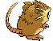

# #020 Raticate (Mouse Pokémon)

| Official Artwork | Shiny Artwork |
|------------------|---------------|
|  |  |

It whittles its constantly growing fangs by gnawing on hard things. It can chew apart cinder walls.

---

## Media

### Default Sprites

| Front | Shiny | Back | Shiny |
|-------|-------|------|-------|
|  |  |  |  |

### Female Sprites

| Front | Shiny | Back | Shiny |
|-------|-------|------|-------|
|  |  |  |  |

### Cries

Latest (Gen VI+):

<audio controls>
<source src='../../assets/cries/raticate/latest.ogg' type='audio/ogg'>
  Your browser does not support the audio element.
</audio>

Legacy:

<audio controls>
<source src='../../assets/cries/raticate/legacy.ogg' type='audio/ogg'>
  Your browser does not support the audio element.
</audio>

---

## Pokédex Data

| National № | Type(s) | Height | Weight | Abilities | Local № |
|------------|---------|--------|--------|-----------|---------|
| #20 | {: width="48"} | 0.7 m / 2.3 ft | 18.5 kg / 40.8 lbs | 1. Hustle 2. Guts | N/A |

---

## Base Stats
|   | HP | Attack | Defense | Sp. Atk | Sp. Def | Speed |
|---|----|--------|---------|---------|---------|-------|
| **Base** | 60 | 87 | 60 | 50 | 70 | 109 |
| **Min** | 230 | 161 | 112 | 94 | 130 | 200 |
| **Max** | 324 | 300 | 240 | 218 | 262 | 348 |

The ranges shown above are for a level 100 Pokémon. Maximum values are based on a beneficial nature, 252 EVs, 31 IVs; minimum values are based on a hindering nature, 0 EVs, 0 IVs.

---

## Forms & Evolutions

!!! warning "WARNING"

    Information on evolutions may not be 100% accurate; differences between evolution methods across generations are not accounted for.

### Forms

Raticate has no alternate forms.

### Evolution Line

1. [Rattata](rattata.md/)
    1. Level Up: [Raticate](raticate.md/)

---

## Training

| EV Yield | Catch Rate | Base Friendship | Base Exp. | Growth Rate | Held Items |
|----------|------------|-----------------|-----------|-------------|------------|
| 2 Spd | 127 | 70 | 145 | Medium | Chilan Berry (50%) |

---

## Breeding

| Egg Groups | Egg Cycles | Gender | Dimorphic | Color | Shape |
|------------|------------|--------|-----------|-------|-------|
| 1. Ground | 15 | 50.0% Male 50.0% Female | True | Brown | Quadruped |

---

## Moves

!!! warning "WARNING"

    Specific move information may be incorrect. However, the general movepool should be accurate; this includes changes made in Blaze Black and Volt White.

### Level Up Moves

| Lv. | Move | Type | Cat. | Power | Acc. | PP |
| --- | --- | --- | --- | --- | --- | --- |
| 1 | Bite | {: width="48"} | {: width="36"} | 60 | 100 | 25 |
| 1 | Focus Energy | {: width="48"} | {: width="36"} | — | — | 30 |
| 1 | Quick Attack | {: width="48"} | {: width="36"} | 40 | 100 | 30 |
| 1 | Tackle | {: width="48"} | {: width="36"} | 40 | 100 | 35 |
| 1 | Tail Whip | {: width="48"} | {: width="36"} | — | 100 | 30 |
| 4 | Quick Attack | {: width="48"} | {: width="36"} | 40 | 100 | 30 |
| 7 | Focus Energy | {: width="48"} | {: width="36"} | — | — | 30 |
| 10 | Flame Wheel | {: width="48"} | {: width="36"} | 75 | 100 | 15 |
| 13 | Pursuit | {: width="48"} | {: width="36"} | 40 | 100 | 20 |
| 16 | Hyper Fang | {: width="48"} | {: width="36"} | 80 | 90 | 15 |
| 19 | Sucker Punch | {: width="48"} | {: width="36"} | 70 | 100 | 5 |
| 20 | Fire Fang | {: width="48"} | {: width="36"} | 75 | 95 | 15 |
| 20 | Ice Fang | {: width="48"} | {: width="36"} | 75 | 95 | 15 |
| 20 | Scary Face | {: width="48"} | {: width="36"} | — | 100 | 10 |
| 20 | Swords Dance | {: width="48"} | {: width="36"} | — | — | 20 |
| 20 | Thunder Fang | {: width="48"} | {: width="36"} | 75 | 95 | 15 |
| 24 | Crunch | {: width="48"} | {: width="36"} | 80 | 100 | 15 |
| 29 | Assurance | {: width="48"} | {: width="36"} | 60 | 100 | 10 |
| 34 | Super Fang | {: width="48"} | {: width="36"} | — | 90 | 10 |
| 39 | Double Edge | {: width="48"} | {: width="36"} | 120 | 100 | 15 |
| 44 | Reversal | {: width="48"} | {: width="36"} | — | 100 | 15 |
| 49 | Endeavor | {: width="48"} | {: width="36"} | — | 100 | 5 |
| 54 | Me First | {: width="48"} | {: width="36"} | — | — | 20 |
| 59 | Final Gambit | {: width="48"} | {: width="36"} | — | 100 | 5 |

### TM Moves

| TM | Move | Type | Cat. | Power | Acc. | PP |
| --- | --- | --- | --- | --- | --- | --- |
| HM01 | Cut | {: width="48"} | {: width="36"} | 60 | 100% | 25 |
| HM04 | Strength | {: width="48"} | {: width="36"} | 100 | 100 | 15 |
| TM01 | Hone Claws | {: width="48"} | {: width="36"} | — | — | 15 |
| TM05 | Roar | {: width="48"} | {: width="36"} | — | — | 20 |
| TM06 | Toxic | {: width="48"} | {: width="36"} | — | 90 | 10 |
| TM10 | Hidden Power | {: width="48"} | {: width="36"} | 60 | 100 | 15 |
| TM11 | Sunny Day | {: width="48"} | {: width="36"} | — | — | 5 |
| TM12 | Taunt | {: width="48"} | {: width="36"} | — | 100 | 20 |
| TM13 | Ice Beam | {: width="48"} | {: width="36"} | 90 | 100 | 10 |
| TM14 | Blizzard | {: width="48"} | {: width="36"} | 110 | 70 | 5 |
| TM15 | Hyper Beam | {: width="48"} | {: width="36"} | 150 | 90 | 5 |
| TM17 | Protect | {: width="48"} | {: width="36"} | — | — | 10 |
| TM18 | Rain Dance | {: width="48"} | {: width="36"} | — | — | 5 |
| TM21 | Frustration | {: width="48"} | {: width="36"} | — | 100 | 20 |
| TM24 | Thunderbolt | {: width="48"} | {: width="36"} | 90 | 100 | 15 |
| TM25 | Thunder | {: width="48"} | {: width="36"} | 110 | 70 | 10 |
| TM27 | Return | {: width="48"} | {: width="36"} | — | 100 | 20 |
| TM28 | Dig | {: width="48"} | {: width="36"} | 100 | 100 | 10 |
| TM30 | Shadow Ball | {: width="48"} | {: width="36"} | 90 | 100 | 15 |
| TM32 | Double Team | {: width="48"} | {: width="36"} | — | — | 15 |
| TM42 | Facade | {: width="48"} | {: width="36"} | 70 | 100 | 20 |
| TM44 | Rest | {: width="48"} | {: width="36"} | — | — | 5 |
| TM45 | Attract | {: width="48"} | {: width="36"} | — | 100 | 15 |
| TM46 | Thief | {: width="48"} | {: width="36"} | 60 | 100 | 25 |
| TM48 | Round | {: width="48"} | {: width="36"} | 60 | 100 | 15 |
| TM57 | Charge Beam | {: width="48"} | {: width="36"} | 50 | 90 | 10 |
| TM67 | Retaliate | {: width="48"} | {: width="36"} | 70 | 100 | 5 |
| TM68 | Giga Impact | {: width="48"} | {: width="36"} | 150 | 90 | 5 |
| TM73 | Thunder Wave | {: width="48"} | {: width="36"} | — | 90 | 20 |
| TM75 | Swords Dance | {: width="48"} | {: width="36"} | — | — | 20 |
| TM83 | Work Up | {: width="48"} | {: width="36"} | — | — | 30 |
| TM86 | Grass Knot | {: width="48"} | {: width="36"} | — | 100 | 20 |
| TM87 | Swagger | {: width="48"} | {: width="36"} | — | 85 | 15 |
| TM88 | Pluck | {: width="48"} | {: width="36"} | 60 | 100 | 20 |
| TM89 | U Turn | {: width="48"} | {: width="36"} | 70 | 100 | 20 |
| TM90 | Substitute | {: width="48"} | {: width="36"} | — | — | 10 |
| TM93 | Wild Charge | {: width="48"} | {: width="36"} | 90 | 100 | 15 |
| TM94 | Rock Smash | {: width="48"} | {: width="36"} | 60 | 100 | 15 |

### Egg Moves

Raticate cannot learn any moves by breeding.
### Tutor Moves

Raticate cannot learn any moves from tutors.
