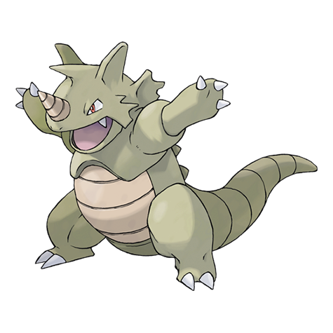
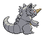
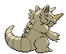
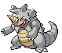
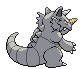
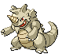
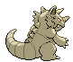

# #112 Rhydon (Drill Pokémon)

| Official Artwork | Shiny Artwork |
| --- | --- |
|  |  |

Standing on its hind legs freed its forelegs and made it smarter. It is very forgetful, however.

---

## Media

### Sprites

| Front | Back | Front Shiny | Back Shiny |
| --- | --- | --- | --- |
|  |  |  |  |

### Female Sprites

| Front | Back | Front Shiny | Back Shiny |
| --- | --- | --- | --- |
|  |  |  |  |

### Cries

Latest (Gen VI+):
<p><audio controls>
  <source src='../assets/cries/112/latest.ogg' type='audio/ogg'>
  Your browser does not support the audio element.
</audio></p>

Legacy:
<p><audio controls>
  <source src='../assets/cries/112/legacy.ogg' type='audio/ogg'>
  Your browser does not support the audio element.
</audio></p>

---

## Pokédex Data

| National № | Type(s) | Height | Weight | Abilities | Local № |
|------------|---------|--------|--------|-----------|---------|
| #112 | {: width='48'} {: width='48'} | 1.9 m | 120.0 kg | 1. Reckless<br>2. Rock-Head | #N/A |

---

## Base Stats
---

## Base Stats
|   | HP | Attack | Defense | Sp. Atk | Sp. Def | Speed |
|---|----|--------|---------|---------|---------|-------|
| **Base** | 105 | 130 | 120 | 45 | 45 | 40 |
| **Min** | 320 | 238 | 220 | 85 | 85 | 76 |
| **Max** | 414 | 394 | 372 | 207 | 207 | 196 |

The ranges shown above are for a level 100 Pokémon. Maximum values are based on a beneficial nature, 252 EVs, 31 IVs; minimum values are based on a hindering nature, 0 EVs, 0 IVs.

---

## Forms & Evolutions

!!! warning "WARNING"

    Some forms may not be available in Blaze Black/Volt White. Also information on evolutions may not be 100% accurate; it is currently quite complex to track generational evolution data.

### Forms

Rhydon has no alternate forms.

### Evolution Line

1. [Rhyhorn](rhyhorn.md/)
1. Level Up: [Rhydon](rhydon.md/)
1. Trade: [Rhyperior](rhyperior.md/)

```
Use the Protector.
```

---

## Training

| EV Yield | Catch Rate | Base Friendship | Base Exp. | Growth Rate | Held Items |
|----------|------------|-----------------|-----------|-------------|------------|
| 2 Attack | 60 | 50 | 170 | Slow | N/A |

---

## Breeding

| Egg Groups | Egg Cycles | Gender | Dimorphic | Color | Shape |
|------------|------------|--------|-----------|-------|-------|
| 1. Monster<br>2. Ground | 20 | 50.0% Male<br>50.0% Female | True | Gray | Upright |

---

## Moves

!!! warning "WARNING"

    Specific move information may be incorrect. However, the general movepool should be accurate (including changes to learnset).

### Level Up Moves

Lv. | Move | Type | Cat. | Power | Acc. | PP
--- | --- | --- | --- | --- | --- | ---
| 1 | Fury Attack | {: width='48'} | {: width='36'} | 15 | 85 | 20 |
| 1 | Horn Attack | {: width='48'} | {: width='36'} | 65 | 100 | 25 |
| 1 | Stomp | {: width='48'} | {: width='36'} | 65 | 100 | 20 |
| 1 | Superpower | {: width='48'} | {: width='36'} | 120 | 100 | 5 |
| 1 | Tail Whip | {: width='48'} | {: width='36'} | — | 100 | 30 |
| 9 | Stomp | {: width='48'} | {: width='36'} | 65 | 100 | 20 |
| 12 | Fury Attack | {: width='48'} | {: width='36'} | 15 | 85 | 20 |
| 19 | Scary Face | {: width='48'} | {: width='36'} | — | 100 | 10 |
| 23 | Rock Blast | {: width='48'} | {: width='36'} | 25 | 90 | 10 |
| 27 | Crunch | {: width='48'} | {: width='36'} | 80 | 100 | 15 |
| 30 | Bulldoze | {: width='48'} | {: width='36'} | 80 | 100 | 20 |
| 34 | Chip Away | {: width='48'} | {: width='36'} | 70 | 100 | 20 |
| 41 | Take Down | {: width='48'} | {: width='36'} | 90 | 85 | 20 |
| 42 | Hammer Arm | {: width='48'} | {: width='36'} | 100 | 90 | 10 |
| 47 | Drill Run | {: width='48'} | {: width='36'} | 80 | 95 | 10 |
| 52 | Dragon Rush | {: width='48'} | {: width='36'} | 100 | 75 | 10 |
| 56 | Stone Edge | {: width='48'} | {: width='36'} | 100 | 80 | 5 |
| 62 | Earthquake | {: width='48'} | {: width='36'} | 100 | 100 | 10 |
| 71 | Horn Drill | {: width='48'} | {: width='36'} | — | 30 | 5 |
| 77 | Megahorn | {: width='48'} | {: width='36'} | 120 | 85 | 10 |
| 85 | Double Edge | {: width='48'} | {: width='36'} | 120 | 100 | 15 |

### TM Moves

TM | Move | Type | Cat. | Power | Acc. | PP
--- | --- | --- | --- | --- | --- | ---
| HM01 | Cut | {: width='48'} | {: width='36'} | 60 | 100 | 20 |
| HM03 | Surf | {: width='48'} | {: width='36'} | 90 | 100 | 15 |
| HM04 | Strength | {: width='48'} | {: width='36'} | 85 | 100 | 15 |
| TM05 | Roar | {: width='48'} | {: width='36'} | — | — | 20 |
| TM06 | Toxic | {: width='48'} | {: width='36'} | — | 90 | 10 |
| TM10 | Hidden Power | {: width='48'} | {: width='36'} | 60 | 100 | 15 |
| TM11 | Sunny Day | {: width='48'} | {: width='36'} | — | — | 5 |
| TM13 | Ice Beam | {: width='48'} | {: width='36'} | 90 | 100 | 10 |
| TM14 | Blizzard | {: width='48'} | {: width='36'} | 110 | 70 | 5 |
| TM15 | Hyper Beam | {: width='48'} | {: width='36'} | 150 | 90 | 5 |
| TM17 | Protect | {: width='48'} | {: width='36'} | — | — | 10 |
| TM18 | Rain Dance | {: width='48'} | {: width='36'} | — | — | 5 |
| TM21 | Frustration | {: width='48'} | {: width='36'} | — | 100 | 20 |
| TM23 | Smack Down | {: width='48'} | {: width='36'} | 50 | 100 | 15 |
| TM24 | Thunderbolt | {: width='48'} | {: width='36'} | 90 | 100 | 15 |
| TM25 | Thunder | {: width='48'} | {: width='36'} | 110 | 70 | 10 |
| TM26 | Earthquake | {: width='48'} | {: width='36'} | 100 | 100 | 10 |
| TM27 | Return | {: width='48'} | {: width='36'} | — | 100 | 20 |
| TM28 | Dig | {: width='48'} | {: width='36'} | 100 | 100 | 10 |
| TM31 | Brick Break | {: width='48'} | {: width='36'} | 75 | 100 | 15 |
| TM32 | Double Team | {: width='48'} | {: width='36'} | — | — | 15 |
| TM35 | Flamethrower | {: width='48'} | {: width='36'} | 90 | 100 | 15 |
| TM37 | Sandstorm | {: width='48'} | {: width='36'} | — | — | 10 |
| TM38 | Fire Blast | {: width='48'} | {: width='36'} | 110 | 85 | 5 |
| TM39 | Rock Tomb | {: width='48'} | {: width='36'} | 60 | 95 | 15 |
| TM42 | Facade | {: width='48'} | {: width='36'} | 70 | 100 | 20 |
| TM44 | Rest | {: width='48'} | {: width='36'} | — | — | 5 |
| TM45 | Attract | {: width='48'} | {: width='36'} | — | 100 | 15 |
| TM46 | Thief | {: width='48'} | {: width='36'} | 60 | 100 | 25 |
| TM48 | Round | {: width='48'} | {: width='36'} | 60 | 100 | 15 |
| TM52 | Focus Blast | {: width='48'} | {: width='36'} | 120 | 70 | 5 |
| TM56 | Fling | {: width='48'} | {: width='36'} | — | 100 | 10 |
| TM59 | Incinerate | {: width='48'} | {: width='36'} | 50 | 100 | 15 |
| TM65 | Shadow Claw | {: width='48'} | {: width='36'} | 80 | 100 | 15 |
| TM66 | Payback | {: width='48'} | {: width='36'} | 50 | 100 | 10 |
| TM68 | Giga Impact | {: width='48'} | {: width='36'} | 150 | 90 | 5 |
| TM69 | Rock Polish | {: width='48'} | {: width='36'} | — | — | 20 |
| TM71 | Stone Edge | {: width='48'} | {: width='36'} | 100 | 80 | 5 |
| TM75 | Swords Dance | {: width='48'} | {: width='36'} | — | — | 20 |
| TM78 | Bulldoze | {: width='48'} | {: width='36'} | 80 | 100 | 20 |
| TM80 | Rock Slide | {: width='48'} | {: width='36'} | 80 | 95 | 10 |
| TM82 | Dragon Tail | {: width='48'} | {: width='36'} | 60 | 90 | 10 |
| TM84 | Poison Jab | {: width='48'} | {: width='36'} | 80 | 100 | 20 |
| TM87 | Swagger | {: width='48'} | {: width='36'} | — | 85 | 15 |
| TM90 | Substitute | {: width='48'} | {: width='36'} | — | — | 10 |
| TM94 | Rock Smash | {: width='48'} | {: width='36'} | 40 | 100 | 15 |

### Egg Moves

Rhydon cannot learn any moves by breeding.
### Tutor Moves

Rhydon cannot learn any moves from tutors.
